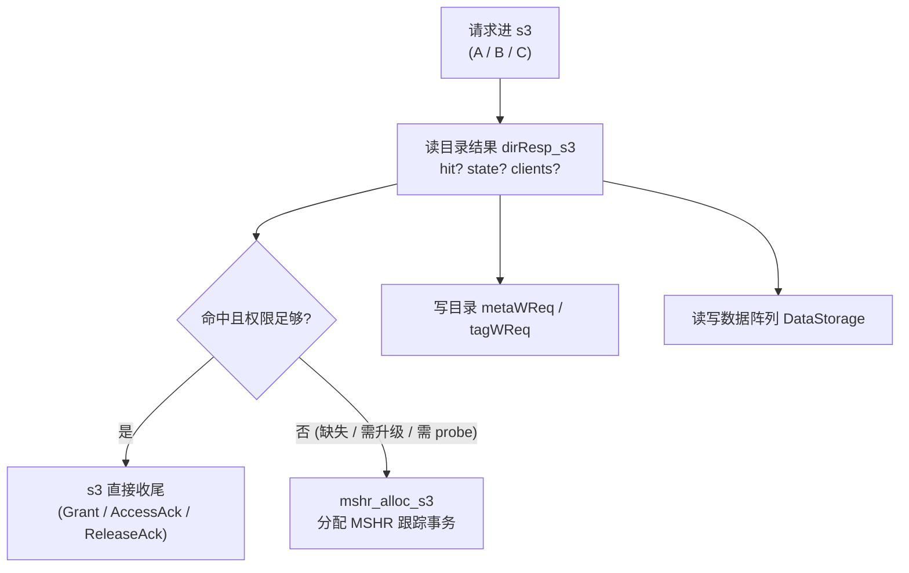
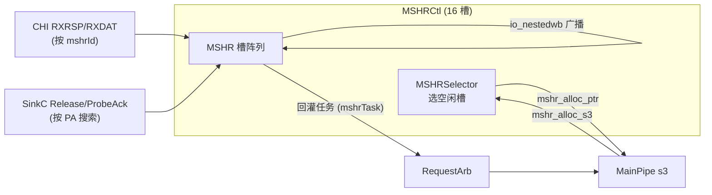
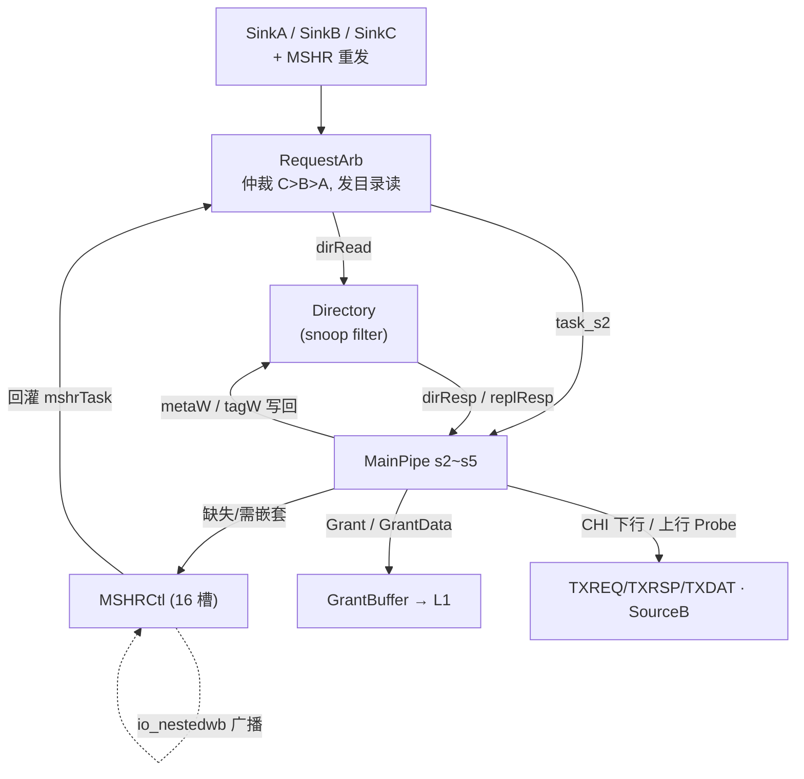

# 一致性与目录原理

> 本文是 L2 共享缓存子系统 arch 背景层的第 2 篇，讲「目录与一致性为什么这么设计、各模块如何协同」，帮助你在读逐模块设计文档前先建立整体认知。总览见 [`0-L2_OVERVIEW.md`](0-L2_OVERVIEW.md)。逐模块的端口/实现细节以对应模块文档与 [RTL](../../../rtl/l2/) 为准，本文不重复。

---

## 1. 为什么 L2 需要目录

L2 是 L1 集群与 CHI 家节点(home node)之间的**共享缓存兼一致性代理**。它同时扮演两个角色：

- **对上(TileLink)**：给多个 L1 client 提供 Acquire/Release/Probe 的一致性握手，是 L1 的**上级(inclusive-ish snoop filter)**；
- **对下(CHI)**：作为 CHI 的 request node(RN)，向家节点发 ReadShared/ReadUnique/WriteBack 等，并接收 Snoop。

要在两侧之间正确翻译一致性动作，L2 必须**随时知道每条 cache line 现在是什么状态、被哪些 L1 持有**。这份「谁持有、什么权限、是否脏」的元数据就是**目录(Directory)**。目录是整个一致性机器的真相来源(source of truth)：主流水的每一次判定、每一次向上 Probe 或向下发 CHI 请求，都是先读目录、再据此决策。

因此本子系统的骨架可以概括为一句话：**目录记状态 → 主流水读目录做决策 → 缺失/需嵌套时交给 MSHR 跟踪 → 决策结果写回目录**。下面按这条主线展开。

---

## 2. 目录结构：一份状态，两种目录形态

L2 子系统里出现两种目录实现，服务不同层级，理解它们的分工是理解全局的关键。

### 2.1 L2 slice 自己的目录 `Directory`（snoop filter）

每个 L2 bank([slice](../Slice.md))内例化一个 [`Directory`](../../../rtl/l2/slice_blackbox_stubs.sv)，它是**本 bank 的 snoop filter**：8 路组相联、512 set、31 bit tag。每路 meta 字段(以本配置单态化后为准)：

| 字段 | 位宽 | 含义 |
|------|------|------|
| `state` | 2 | 本级一致性态(见 §3) |
| `dirty` | 1 | 本级数据是否脏(相对下游) |
| `clients` | 1 | 该 line 是否被上层 L1 client 持有(本配置 clientBits=1) |
| `alias` | 2 | L1 的 alias 位(供 Acquire 重命中判定) |
| `prefetch` / `prefetchSrc` | 1 / 3 | 是否预取带入、预取来源 |
| `accessed` | 1 | 是否被真实访问过(区分纯预取) |
| `tagErr` / `dataErr` | 1 / 1 | tag/data SRAM 的 ECC 错误标记(见 §7) |

`Directory` 对外的核心接口是「读(`io_read`)→ 响应(`io_resp`)」与「写(`io_metaWReq` / `io_tagWReq`)」，另有一路**替换结果 `io_replResp`**(带 `retry`，见 §6)。读响应里除了 `hit`/`way`/`meta`，还携带 `replacerInfo`(channel/opcode/reqSource/refill.prefetch)——这是替换算法用来更新命中路"热度"的提示。

### 2.2 LLC 的双子目录 `SubDirectory`（openLLC）

在 LLC(openLLC 家节点，slice_4)一侧，目录被拆成两个 [`SubDirectory`](../SubDirectory.md) 实例，形成经典的**「包含式 self 目录 + 非包含 snoop filter」双子目录**结构：

| 子目录 | 记录什么 | 路数 / set / tag | meta | replace 策略 |
|--------|----------|------------------|------|--------------|
| **clientDir**(snoop filter) | 各 L1/L2 client 的持有状态 | 10 / 1024 / 30 | `{valid}` | **random(LFSR)** |
| **selfDir** | 本级(LLC)是否有数据 + 脏 | 16 / 4096 / 28 | `{valid, dirty}` | **PLRU** |

两者共享同一套三级流水骨架(读 SRAM → 锁存 → 算 hit/way)，差别只在 meta 字段、路数/位宽与替换策略。

> **为什么两个子目录用不同的替换策略？** clientDir 跟踪的是"上游谁还持有"，条目由上游生命周期驱动、命中模式接近随机，用低成本的 **LFSR random** 足够；selfDir 才是真正缓存数据的地方，局部性强，值得用 **PLRU** 二叉树(selfDir 用 15 节点树)精确追 LRU。这就是"不同职责→不同代价/精度权衡"的一致性设计取舍。

---

## 3. 一致性状态：MESI 风格与 CHI 的翻译

### 3.1 L2 内部状态(2 bit)

L2 目录 `state` 用 4 态编码(TileLink TL-C 语义)：

| 编码 | 态 | 含义 |
|------|----|------|
| 0 | INVALID | 无效 |
| 1 | BRANCH | 只读共享(≈ Shared) |
| 2 | TRUNK | 上层某 client 独占，本级不是最新 |
| 3 | TIP | 本级独占/可写(≈ Modified/Exclusive) |

两个便捷谓词贯穿主流水判定：`isT = state[1]`(TRUNK 或 TIP，即"有写权限归属")，`isValid = state > 0`。是否需要独占权由 `needT(op, param)` 综合请求 opcode 与 param 得出(如 Acquire 且 param≠NtoB → 需要 T)。

### 3.2 与 CHI 的桥接

对下 CHI 侧另有一套响应态编码：`CHI_I=0 / SC=1 / UC=2 / SD=3`(Invalid / SharedClean / UniqueClean / SharedDirty；其中 UniqueDirty 与 UC 同编码 2)，外加叠加位 `PD=4`(**PassDirty**，脏所有权移交，非独立缓存态)。主流水在处理 snoop 时，把内部 MESI 态**翻译**成 CHI 响应态：`resp = setPD(state, passDirty)`——当命中 T 态且脏时置 PassDirty，把脏数据的所有权顺带交出。CHI 的 opcode/态定义与通道适配见 [`CHIChannels.md`](../CHIChannels.md)；错误响应编码 `NDERR=2'h2 / DERR=2'h3`。

---

## 4. MainPipe：一致性决策流水

一切一致性动作都在 [`MainPipe`](../MainPipe.md) 里拍板。它是一条四级流水(s2~s5)，其中 **s3 是决策核心**：拿到本拍的目录读结果 `dirResp_s3`，判命中、判一致性、然后**派发**。请求按 one-hot 通道分三类：

- `channel[0]` = **fromA**：上层 L1 的 Acquire / Get / Hint / CBO；
- `channel[1]` = **fromB**：CHI 下来的 Snoop(经 RXSNP);
- `channel[2]` = **fromC**：上层的 Release / ProbeAck。

s3 对三类请求的处理，本质是"目录状态 + 请求类型 → 一致性动作"的组合判定：

判定要点(见 MainPipe 文档细节)：

- **A 通道(命中/分配)**：`need_acquire`(命中 BRANCH 但需 T / 缺失 / CMO)、`need_probe`(命中且上层持有，需先降级 L1)、`cache_alias`(命中但 alias 不同)——任一为真就 `mshr_alloc_s3` 分配 MSHR；否则 s3 直接 `sink_resp` 回 Grant/AccessAck。
- **B 通道(probe/snoop)**：按 CHI opcode 分类，算 `need_pprobe`(是否需先向上 probe 降级 L1)与 `need_dct`(是否直传 forward)，并按 snoop 类型顺序覆盖出 `respCacheState`/`fwdCacheState`。
- **C 通道(release)**：上层交回数据/权限，更新目录、必要时把数据写进 DataStorage 或 releaseBuffer。
- **grant**：命中且无需外部动作时，s3~s5 组织 Grant/GrantData 交给 [`GrantBuffer`](../GrantBuffer.md) 发往 L1。

主流水的**请求入口**由 [`RequestArb`](../RequestArb.md) 仲裁：它把 A/B/C/MSHR-重发四路合流，优先级 **C > B > A**、且 MSHR 重发任务优先于通道首次请求，同拍发起目录读——所以 s3 拿到的目录结果，正是 RequestArb 在上一级为这条被选中请求发出的读。

---

## 5. MSHR 与嵌套(nested)请求

命中且能就地完成的请求，s3 一拍就收尾了；**不能就地完成的**(缺失、需向下取数、需先 probe/降级、CMO)才交给 **MSHR** 跟踪。[`MSHRCtl`](../../uncore/MSHRCtl.md)(在 uncore)把 **16 个 MSHR 槽**组织成资源池：

- **分配**：`MSHRSelector` 从空闲槽取最低位 one-hot，把 `mshr_alloc_ptr` 反馈给 MainPipe；s3 拉高 alloc 时选中槽锁存事务。
- **容量背压**：占用逼近上限时阻塞入口——`blockA` 在 ≥15 时拉起(**为 SinkB 预留最后 1 槽**)、`blockB` 在 ≥16 时拉起。留一槽给 snoop/probe，是为了避免普通 Acquire 占满 MSHR 后 snoop 进不来而**死锁**。
- **响应路由**：CHI 的 RXRSP/RXDAT 按 `mshrId` 命中槽；SinkC 的 ProbeAck/Release **无 mshrId，用 PA(set+tag)搜索**命中槽。
- **仲裁出口**：各槽的 CHI 下行(TXREQ/TXRSP)、上行 Probe(SourceB)、回灌 MainPipe 的任务，各经一把 FastArbiter 汇聚。

### 嵌套(nested)请求

一个 MSHR 正在处理某地址的事务时，**同一 set/tag 上又来了一个 snoop 或 release**——这就是嵌套。系统不让后来者干等，而是通过 `io_nestedwb` 把嵌套动作**广播到所有槽**，让相关槽在自己的 meta 上就地修正。

这带来一个关键机制：MainPipe 在处理 **B/C 通道**时，若目录结果可能已被在途 MSHR 改写，就用 `nestable_*`——**以 MSHR 上报的 meta 替代目录读结果**来做判定，保证一致性不被"目录还没写回"的时间窗破坏。**A 通道禁用该机制**(A 是新事务，应看目录真值)。这正是"目录是真相、但在途事务的 meta 更新"这一时序难题的解法。

---

## 6. 替换(replacement)与写目录

### 6.1 替换路的选择

当请求缺失且需要在本级落地一条 line 时，得挑一路victim。目录的选路逻辑(组合)是：

1. 若组内有空路(invalid)，优先占空路；
2. 否则按替换策略选 victim——L2 `Directory` 用 **DRRIP**(依 `replacerInfo` 里的 channel/opcode/prefetch 更新 RRPV，区别对待真实访问与预取)；openLLC selfDir 用 **PLRU**、clientDir 用 **random(LFSR)**(见 §2.2)。

替换结果经 `io_replResp` 回给 MSHR，其中 `retry` 位很重要：**当选中的 victim 正被别的在途事务占用**(冲突)时置 `retry`，让 MSHR 稍后重发替换读，避免踩踏在途 line。

### 6.2 写目录 `metaW` / `tagW`

决策做完后要把新状态落回目录。MainPipe 组织写请求，遵守固定优先级：

- **`metaWReq` 优先级 `a > b > c > mshr > cmo`**：同拍多路想写 meta 时按此裁决(cmo 写全 0 = invalid)。
- **`tagWReq` 仅在 MSHR refill 且非 retry 时写**：只有真正把新 line 装进某路时才改 tag。
- **复位期**：512 拍逐 set 用 `resetIdx` 把 meta 清零(`wayOH` 全 1)，之后 `resetFinish` 才开始服务。

---

## 7. 错误处理：tagErr / dataErr

目录 meta 里的 `tagErr` / `dataErr` 与 `Directory.io_resp_bits_error`，把 SRAM 的 ECC 结果一路带进一致性决策：

- **tag SRAM** 出错 → `tagErr`；**data SRAM** 出错 → `dataErr`。
- MainPipe 在 s5 汇总出 `l2Error`(目录 error | DataStorage error | dataCheck 错)，连同出错地址 `{tag,set,off}` 上报。
- CHI 侧数据错误进一步编码为响应 `NDERR=2'h2` / `DERR=2'h3`(见 [`CHIChannels.md`](../CHIChannels.md))。

也就是说，ECC 错误不是被静默吞掉，而是**作为 meta 的一部分随 line 流动**，让上下游都能感知并按协议上报。

---

## 8. 模块协同总图

把前面各节串起来，一次典型请求在目录/一致性维度上的走向：

一句话收束：**RequestArb 选请求并读目录 → Directory 给状态 → MainPipe 据状态决策(命中收尾 / 缺失分配 MSHR / probe / release / grant) → 结果写回 Directory；MSHR 负责跨拍事务与嵌套时的 meta 修正**。这就是 L2 一致性机器的完整闭环。

---

## 延伸阅读

- 逐模块实现：[`MainPipe.md`](../MainPipe.md) · [`SubDirectory.md`](../SubDirectory.md) · [`RequestArb.md`](../RequestArb.md) · [`GrantBuffer.md`](../GrantBuffer.md) · [`MSHRCtl.md`](../../uncore/MSHRCtl.md) · [`Slice.md`](../Slice.md)
- CHI 通道与错误编码：[`CHIChannels.md`](../CHIChannels.md)
- 本 arch 姊妹背景文档：[`0-L2_OVERVIEW.md`](0-L2_OVERVIEW.md)
- RTL：[`Directory 端口`](../../../rtl/l2/slice_blackbox_stubs.sv) · [`slice_pkg.sv`](../../../rtl/l2/slice_pkg.sv)
