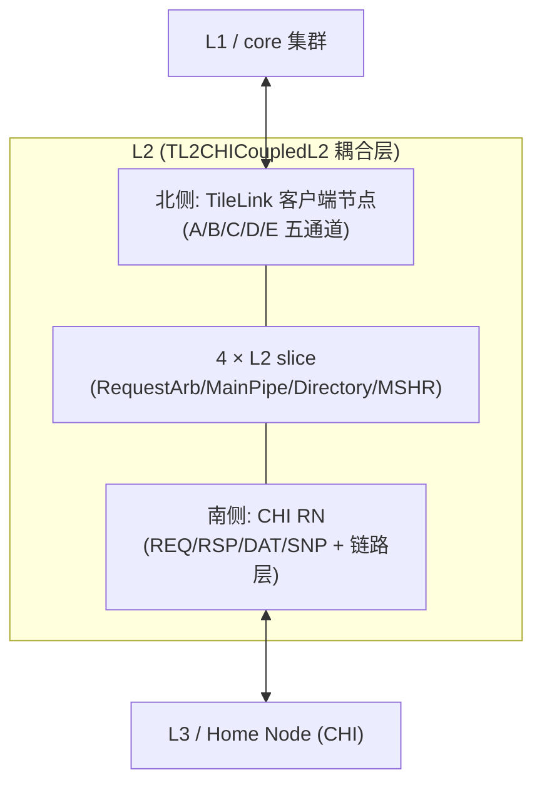
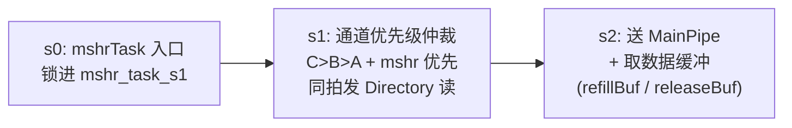
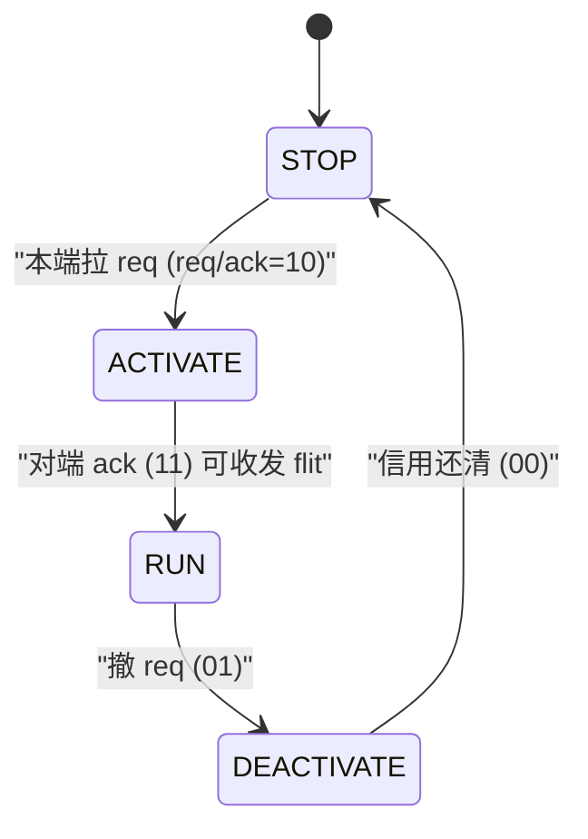
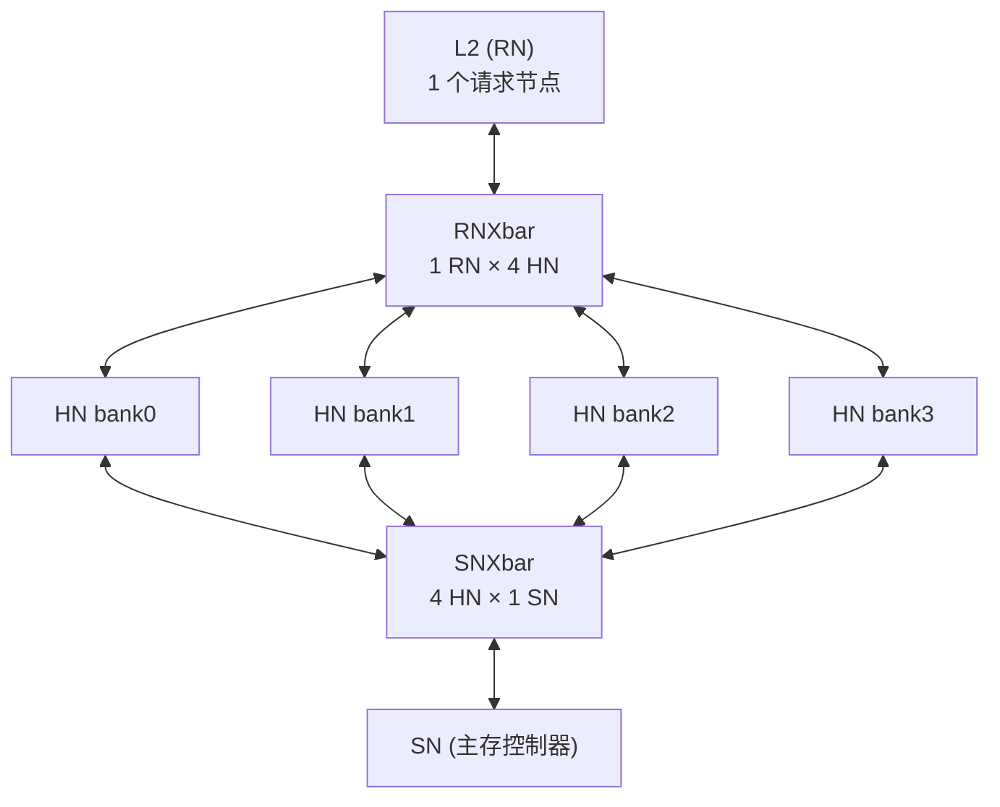

# CHI 通道与互联原理

> 本文是香山 V2R2 昆明湖 L2 子系统的**背景/原理**篇之一,聚焦「L2 如何以 CHI 协议接入片上一致性网络」——先讲为什么要做 TileLink→CHI 转换、CHI 五通道与 L-Credit 流控的设计动机,再讲请求仲裁、链路激活、以及与 uncore 交叉开关的衔接如何协同。**不重复逐模块端口/实现细节**,那些请看各模块设计文档。想先看 L2 整体结构,请读 [`0-L2_OVERVIEW.md`](0-L2_OVERVIEW.md)。

---

## 1. 为什么 L2 要「说两种语言」

香山的**上层**(L1 / core 集群)用 **TileLink**(TL-C 一致性变体)与 L2 通信:五通道 A/B/C/D/E,以 Acquire/Grant/Release/Probe/GrantAck 表达一致性事务。

香山的**下层**(L3/home node、直至主存)则接入 **CHI**(AMBA Coherent Hub Interface)网络:L2 在此扮演 **RN(Request Node)**,向 HN(Home Node,即 L3/LLC)发请求、收响应与嗅探。

于是 L2 必须**同时说两种语言**:北侧 TileLink、南侧 CHI。这条「桥」的意义不只是换个信号名——两套协议的**一致性模型、流控机制、事务编号方式**都不同,转换层要把 TL 事务映射成语义等价的 CHI 事务,并在两套反压机制之间做适配。这就是 `TL2CHICoupledL2` 耦合层存在的根本原因。



---

## 2. TL→CHI 转换:耦合层的角色

`TL2CHICoupledL2`(设计文档 [`../TL2CHICoupledL2.md`](../TL2CHICoupledL2.md))是 L2 cache 的**主体装配层**,把 4 个 L2 slice(真正的 cache 流水 + 目录 + 数据 + MSHR + snoop filter)与一圈外围拼成整体:

- **北侧(TileLink,接 L1)**:`auto_in_0..3` 四个 client 节点(A/B/C/D/E),外加 `auto_mmioBridge_*` 处理 uncacheable 的 MMIO 请求。
- **南侧(CHI,接 L3)**:`io_chi_*` 五通道(REQ/RSP/DAT/SNP + 链路层),经 `LinkMonitor` 接出。

关键认知:**耦合层本身不重写任何 slice/仲裁器/链路器的内部逻辑**,它做的是子模块例化、互联,加一组顶层 glue(hint/D 仲裁、grant 计数、l2Miss 汇聚、CHI rx 按 bank 路由、P-Credit 记账)。真正的 TL⇄CHI 事务语义转换,发生在每个 slice 内部的 **tl2chi 通道适配叶子**(见下节 §3)与 slice 主流水里。

一个直观的例子是 CHI 接收路由:南侧 HN 回来的 rx 五通道 flit 要**按 bank 分发**给正确的 slice——RSP/DAT 按 `txnID[10:9]` 选 bank,SNP 按 `addr[4:3]` 选 bank。这体现了 CHI 用**事务 ID** 而非地址回送应答的特点(详见 §6)。

---

## 3. CHI 五通道与 L-Credit 信用流控

### 3.1 五条通道各司其职

CHI 把一次事务拆到多条**独立流控**的物理通道上。以 L2(RN)视角,方向命名为 TX(RN→HN,上行)/ RX(HN→RN,下行):

| 通道 | 方向(RN 视角) | 承载 |
|------|-------------|------|
| **REQ** | TX | 请求(Read/Write/CMO/…),含 addr/size/memAttr 等 |
| **RSP** | TX / RX | 响应(Comp/DBIDResp/RetryAck/PCrdGrant…) |
| **DAT** | TX / RX | 数据(读回填 / 写数据),256 位/beat + BE + dataCheck |
| **SNP** | RX | HN 下发的嗅探(Snoop) |

L2 侧的通道适配叶子(纯组合或带队列,设计文档见 [`../CHIChannels.md`](../CHIChannels.md))负责内部 Bundle 与 CHI flit 的双向翻译,例如:

- **RXRSP/RXDAT**:CHI 响应/`CompData` → 内部 RespBundle(`mshrId = txnID[7:0]`,回填写 refillBuffer,逐字节奇偶 dataCheck)。
- **TXREQ/TXRSP**:内部两路请求/响应汇聚 → 16 深队列 → CHI;出队时把 `sliceId` 插回 `addr[7:6]`。
- **TXDAT**:头队列 + 两条数据队列 → 单条目 2-beat 输出缓冲(一行 512 位分两拍,`dataID` first=`2'b00`、last=`2'b10`)。

### 3.2 为什么用 L-Credit 而不是简单的 ready/valid

片上一致性网络里,发送方到接收方可能跨越多级流水、甚至跨时钟。若沿用「本拍看到 ready 才发」的组合握手,长互联上的 ready 会成为时序关键路径。CHI 改用 **L-Credit(Link Credit)预授信**:

- 接收方每发一个 `lcrdv` 脉冲 = 授予发送方 **1 个信用**;发送方**只要手里有信用就可拉 `flitv` 发一个 flit**(`flitpend` 提前一拍预告),无需等待组合 ready。
- 这样反压被「时间解耦」——发送侧看的是自己攒的信用计数,而非对端的实时 ready,便于在长链路上打拍。

信用流控的**本体**在通道适配子模块里:上行方向 `Decoupled2LCredit`(把内部 Decoupled 打成信用 flit)、下行方向 `LCredit2Decoupled`(把信用 flit 解回 Decoupled)。后者有阻塞与非阻塞两类:阻塞型带小队列(如 `lcreditNum=4`,SNP/REQ/DAT),非阻塞型直接解包(如 RSP `lcreditNum=15`,信用池 5 位)。

---

## 4. RequestArb:slice 主流水的请求仲裁(三级流水)

进了某个 slice,四类请求要合流进 MainPipe 并启动 Directory 读——这是 `RequestArb` 的职责(设计文档 [`../RequestArb.md`](../RequestArb.md))。它是一条**三级、无子模块**的流水:

| 来源 | 通道 | 含义 |
|------|------|------|
| `sinkA` | A(channel[0]) | 上层 L1 的 Acquire/Get/Hint |
| `sinkB` | B(channel[1]) | 下层来的 Probe/Snoop |
| `sinkC` | C(channel[2]) | 上层的 Release/ProbeAck |
| `mshrTask` | — | MSHR 重发(refill/写回/响应)任务 |

### 4.1 优先级:C > B > A,且 mshr 任务最高

仲裁核心一句话:

```
task_s1 = mshr_task_s1.valid ? mshr_task_s1 : (selC ? C : selB ? B : A)
```

即 **MSHR 重发任务优先于任何通道**,通道之间 **C > B > A**。这个顺序不是随意的:

- **C 最高**:Release/ProbeAck 是「让出权限」的动作,尽快消化才能腾出资源、避免死锁。
- **B 次之**:Probe/Snoop 关乎全局一致性推进,压过普通取数请求。
- **A 最低**:新的 Acquire/Get 可以等。
- **mshr 任务凌驾三者**:在飞事务的收尾(回填、写回、响应)必须优先落地,否则占着 MSHR 表项形成反压。

### 4.2 三级流水在做什么



- **s0**:`mshrTask` 入口,受 GrantBuffer/TXDAT/TXRSP/TXREQ 的 `blockMSHRReqEntrance`、正在 stall 的 replRead、以及在途 `mshr_task_s1` 未消化(mcp2 stall)联合反压;`s0_fire` 时整包锁进 `mshr_task_s1`。
- **s1**:按上面的优先级选出 `task_s1`;通道入口还需 `resetFinish`(复位期用 9 位 `resetIdx` 从 `511` 倒数 512 拍门控入口)与 `dirRead.ready`;**同拍**发 Directory 读(tag/set/replacerInfo)。若是 refill 任务且 opcode∈{Grant,GrantData,AccessAckData,HintAck},`replRead` 会占用 dir 读口,未就绪时 `mshr_replRead_stall` 挂起。
- **s2**:`task_s1` 打一拍成 `task_s2` 送 MainPipe;`ds_mcp2_stall` 禁止连续两拍访问 DataStorage(A-Hint 不访 DS 故豁免);按任务类型译码读 refillBuffer / releaseBuffer。

### 4.3 反压来自哪里:与 GrantBuffer 的协同

RequestArb 的入口反压很大程度来自下游 [`../GrantBuffer.md`](../GrantBuffer.md)——它是向 L1 发 Grant(D)/收 GrantAck(E)的出口。GrantBuffer 统计流水级占用与各 FIFO 计数,逼近容量时回压 RequestArb 的 A/B/C/MSHR 入口(例如 `blockA`/`blockC`/`blockMSHR`/`blockB`)。此外它维护 `inflightGrant[16]` 记录已发未确认的 Grant 地址,供 SourceB 阻塞同址 Probe,防止 Probe 抢跑未确认的 Grant。这条「出口容量 → 入口仲裁」的回环,是 slice 内部保持事务守恒、不溢出的关键。

---

## 5. LinkMonitor:CHI 链路激活握手

再往南到物理链路边界,`LinkMonitor`(设计文档 [`../../uncore/LinkMonitor.md`](../../uncore/LinkMonitor.md))是 CHI 链路层的**最薄管理层**。它把上层的 Decoupled 接口与下层 CHI 的 flit + L-Credit 协议互转(互转本体由 6 个 `Decoupled2LCredit`/`LCredit2Decoupled` 子模块黑盒完成),自身只负责**链路激活握手、L-Credit 回收时序、系统一致性握手、以及给上行 flit 注入本节点 ID**。

### 5.1 LINKACTIVE 四态机

链路收发前要先「激活」。链路态由对端的两根握手线 `{linkactivereq, linkactiveack}` 直接译码成四态:



| {req, ack} | 链路态 | 含义 |
|-----------|--------|------|
| `00` | STOP | 链路停止 |
| `10` | ACTIVATE | 已请求激活,待对端确认 |
| `11` | RUN | 可正常收发 flit |
| `01` | DEACTIVATE | 已撤请求,待对端撤确认 |

(单态化常量:STOP=0、ACTIVATE=1、RUN=2、DEACTIVATE=3。)

### 5.2 去激活前必须还清信用

一个容易忽视但至关重要的时序点:**去激活不能立刻撤 ack**。对端撤下 `rx.linkactivereq` 后,本端的 `rx.linkactiveack` 要**等三个 RX 子模块把欠的 L-Credit 全部回收**(`reclaim` 全 1)才允许撤——否则会丢信用、破坏后续流控。这正是链路层「优雅关闭」的保证。本端策略上 TX 链路 `linkactivereq` 与系统一致性 `syscoreq` 恒拉高(总想保持链路可用)。

---

## 6. 与 uncore 的衔接:RN Xbar 与 SN Xbar

L2(RN)接出的 CHI 通道,在 uncore 侧经交叉开关连到多个 HN bank 与主存(SN)。这两级 Xbar 展现了 CHI 互联的两个典型模式。



### 6.1 RNXbar(1 RN × 4 HN,设计文档 [`../../uncore/RNXbar.md`](../../uncore/RNXbar.md))

把 1 个上游 RN 连到 4 个下游 HN bank:

- **上行(RN→HN,1→4 拆分)**:TXREQ 按 `addr[7:6]` 选目标 bank,TXRSP/TXDAT 按 `txnID[10:9]` 选 bank。
- **下行(HN→RN,4→1 仲裁)**:RXRSP/RXDAT 用 4 输入仲裁器,输入按 `srcID==0`(目标 RN 编号)门控。
- **RXSNP 自带一个真状态机**:每个 HN bank 有一个 1 深 snoop 槽,`io_snp_mask_set` 决定 snoop 命运——`1` 表示真需投递给 RN(占槽直到 RN 取走),`0` 表示可直接过滤丢弃(一拍内释放槽)。这是 CHI 嗅探在互联层的「接收-过滤」协议点。

### 6.2 SNXbar(4 HN × 1 SN,设计文档 [`../../uncore/SNXbar.md`](../../uncore/SNXbar.md))

把 4 个 HN 对 1 个 SN(主存)的访问汇聚/分发,是最简单的一类 Xbar:

- **上行(主→从)**:TXREQ/TXDAT 各经一个仲裁器轮转,胜者路由到唯一从口。
- **下行(从→主)**:RXRSP/RXDAT 按 `txnID[10:9]` 解复用回对应 HN。

### 6.3 一个反复出现的原理:路由靠 txnID 不靠地址

无论 RNXbar 的下行还是 SNXbar 的整体解复用,**应答回程都靠事务 ID(`txnID`)高位而非地址**。原因是:同一物理地址可能被多个节点访问,只有事务 ID 能唯一区分应答归属。CHI 在下发请求时把源节点编号塞进 `txnID` 高位(如 `[10:9]`),回程 flit 据此还原归属。这与 TileLink 用 `AddressSet` 译码的思路根本不同,是理解整套 CHI 互联寻址的一把钥匙。

---

## 7. 全景:一次 L2 miss 如何走完两套协议

把上面的模块串起来,一次 L1 取数命中 L2 miss 的典型路径:

1. L1 发 **TL Acquire** → 北侧 client 节点 → slice 的 `sinkA`。
2. `RequestArb`(s0→s1→s2)仲裁进 MainPipe,同拍读 Directory,判定 miss,分配 MSHR。
3. MSHR 经 tl2chi 的 **TXREQ** 叶子组 CHI Read 请求 → `LinkMonitor` 以 L-Credit flit 发出 → **RNXbar** 按 `addr[7:6]` 送到目标 **HN bank**。
4. HN miss 则经 **SNXbar** 向 **SN(主存)** 取数;数据经 CHI **RXDAT**(`CompData`)回程,按 `txnID` 一路解复用回原 slice,写入 refillBuffer。
5. MSHR 重发任务(优先级最高)经 `RequestArb` 回到 MainPipe 完成回填,`GrantBuffer` 组 **TL Grant/GrantData** 经 D 通道发回 L1;L1 回 **TL GrantAck**(E),清 `inflightGrant`,事务闭环。

这条链路里,**TileLink↔CHI 的语义转换、L-Credit 流控、三级仲裁、链路激活、Xbar 路由**各就各位——正是本文各节所述模块的协同。

---

## 相关文档

- 本子系统:[`../TL2CHICoupledL2.md`](../TL2CHICoupledL2.md) · [`../CHIChannels.md`](../CHIChannels.md) · [`../RequestArb.md`](../RequestArb.md) · [`../GrantBuffer.md`](../GrantBuffer.md) · [`../Slice.md`](../Slice.md) · [`../MainPipe.md`](../MainPipe.md)
- 姊妹背景篇:[`0-L2_OVERVIEW.md`](0-L2_OVERVIEW.md)
- uncore 衔接:[`../../uncore/LinkMonitor.md`](../../uncore/LinkMonitor.md) · [`../../uncore/RNXbar.md`](../../uncore/RNXbar.md) · [`../../uncore/SNXbar.md`](../../uncore/SNXbar.md)
- RTL:[`../../../rtl/l2/TL2CHICoupledL2.sv`](../../../rtl/l2/TL2CHICoupledL2.sv) · [`../../../rtl/l2/Slice.sv`](../../../rtl/l2/Slice.sv)
