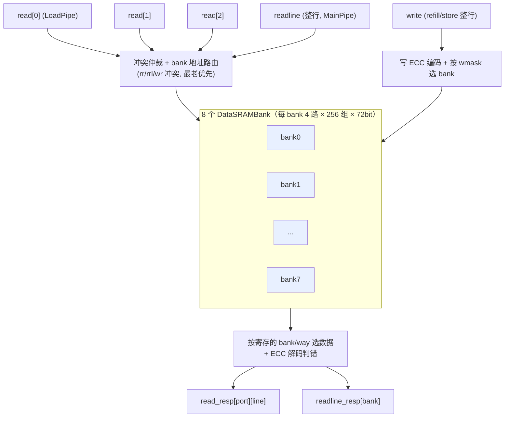

# BankedDataArray —— DCache 分体数据阵列

## 1. 架构定位

`BankedDataArray` 是香山 V2R2 L1 DCache 的**数据存储体**，与 `DuplicatedTagArray`（标签）
配对：tag 阵列判命中给出命中 way，数据阵列按 way/地址读出真正的 cacheline 数据。

灵感来自 Sohi & Franklin 的高带宽多体存储（ASPLOS'91）。一条 64B cacheline 横向切成
**8 个 bank**（每 bank 8B = 64bit），4 路组相联、256 组。把数据按 bank 分体的根本目的是
**提升读带宽**：多条 load 流水若访问不同 bank，可同拍并行读，互不阻塞。



## 2. 三类访问口

| 口 | 来源 | 行为 |
|---|---|---|
| `read[0..2]` | 3 条 LoadPipe | 按字读：给地址，读出其所在 bank 的数据。128 位 load 跨 2 个相邻 bank（`is128Req` + `bank_addr(1)`）。每口产出 2 行（`read_resp[i][0..1]`）。 |
| `readline` | MainPipe | 整行读：一次读出整条 cacheline 全 8 bank。 |
| `write` + `write_dup[0..7]` | refill / store | 整行写（8 bank × 64bit）+ 8 份控制副本（分散写使能扇出），按 `wmask` 选 bank、`way_en` 选路。 |

## 3. 冲突仲裁（同拍多口争用 bank 体）

- **rr_bank_conflict**：两条 load 命中 bankMask 有交集、同 div、但 **set 不同**（同 set 可共享读，
  不算冲突）。冲突时按 `lqIdx`（环形队列指针 LqPtr）选**最老**的一条放行，其余本拍被压
  （`rr_oldest`）。LqPtr 比较含 flag 翻转位：`a 比 b 年轻 ⟺ a.flag ^ b.flag ^ (a.value > b.value)`
  （`lq_younger` 纯函数；两两归约取老者，对应 Scala `selcetOldestPort` 的 `ParallelOperation`）。
- **rrl_bank_conflict**：load 与 readline 撞同 div → readline 抢占，load 让路（本配置 div 恒等，
  故只要同拍 readline valid 即冲突）。
- **wr / wrl_bank_conflict**：上一拍的写与本拍读/readline 撞同 bank → 单口 SRAM 不能同址读写，
  置对应 `ready=0`。`wr` 用上拍寄存的 `wmask` 命中本读 bank 判定（div 恒等故省略 set 比较）。

输出 `bank_conflict_slow[i] = RegNext(wr|rrl) | RegNext(rr_oldest)`；
`disable_ld_fast_wakeup[i] = wr | rrl_intend | (∃x<i: rr_conflict[x][i])`。

## 4. 读时序（SRAM 同步读，1 拍延迟）

```
s0 (读发起拍): 组合算各 bank read_enable + set 地址 → 驱动 bank SRAM 读口;
              同时寄存 div/bank/way 选择子 (r_* 寄存器)。
s1:           bank SRAM 吐出 4 路 × 72bit; 按寄存的 bank/way 从 bank_result 选出 → read_resp。
s2 (再延 1 拍): ECC 延迟解码出的 error_delayed → read_error_delayed。
```

关键细节（与 golden 对齐）：

- **bank 地址路由**：bank 0..3 用 `addr_dup` 派生的 set（`DuplicatedQueryBankSeq={0,1,2,3}`，
  物理上用复制的地址线减负载），bank 4..7 用主 `addr` 派生的 set。set 选择是按 load 口序的
  PriorityMux；readline 有效时所有 bank 强制用 `line_set`。
- **read_enable 用主地址匹配**，但 bank 0..3 的 **读地址用 dup 地址匹配**（两个条件独立）。
- `read_error_delayed` 的冲突门控用 **`RegNext(bank_conflict_slow)`**（晚一拍），与 golden 一致。

## 5. ECC（SECDED(72,64)，单纠错双检错）

每 bank SRAM 字宽 72 = 64 数据 + 8 校验。

- **编码**（写入时，`data_ecc_encode`）：`ecc[6:0]` = 7 个奇偶位（data 在固定生成掩码上 XOR 归约），
  `ecc[7]` = 整体奇偶位 `^{ecc[6:0], data}`。掩码与 rocket-chip SECDEDCode / golden 一致。
- **解码错误标志**（读出时延迟一拍，`data_ecc_error`）：`error = 整体奇偶为 1`（奇数翻转，单错可纠）
  `| (整体奇偶为 0 且 syndrome 非零)`（偶数翻转，双错不可纠）。syndrome 7 位由 H 矩阵行掩码对
  存储的 72bit `{ecc,data}` 做 XOR 得到。
- **pseudo_error**（人为注错通道）：把读出 `raw_data` 异或一个 mask 制造可控错误，用于演练
  ECC 检错流程；`mbist_ack` 时不注错（MBIST 读原值）。

## 6. readline_resp 流控

`readline_resp` 是带保持的两级结构（对齐 Scala / golden）：

- 组合 `wire = (can_go|mbist_ack) ? 本拍新读行 : 保持寄存器`；
- 保持寄存器在 `(stall|mbist_ack) & (can_go|mbist_ack)` 时捕获新行；
- 输出 `r8 = RegEnable(wire, can_resp|mbist_ack)`，即 `io_readline_resp`。

`readline_error` 用 2 拍后的 way 取 `error_delayed`；`readline_error_delayed` 对输出级
`{ecc, raw}` 现场解码。

## 7. 层次结构与黑盒

```
BankedDataArray
 ├─ xs_BankedDataArray_core   ← 本工程可读核（冲突仲裁/地址路由/ECC/读写时序）
 ├─ DataSRAMBank ×8 (golden 黑盒, bank0=DataSRAMBank, b1=_1, b2/3=_2, b4-7=_4)
 │    └─ 4 路 SRAMTemplate_* → 厂商宏 dcsh_dat → array_8 (256×72 单口)
 └─ MbistPipeDCacheData (golden 黑盒, DFT/MBIST)
```

可读核暴露每 bank 的读/写端口（`sram_r_*` / `sram_w_*`，8 bank × 4 way）以及来自 MbistPipe 的
`mbist_ack/r_way/r_div`；wrapper 例化黑盒并按 golden 拓扑互联
（32 条 childBd bore 链：bank b 用 `[4b..4b+3]`；32 组 `sigFromSrams_bore` 旁带同理映射）。

## 8. 接口要点（firtool 裁剪后的输出集）

read_resp / readline_resp 只引出 `raw_data`（ecc 端口被裁，但 ecc 内部参与 error 计算）；
另有 `read/readline ready`、`read_error_delayed`、`readline_error(_delayed)`、
`bank_conflict_slow`、`disable_ld_fast_wakeup`、`pseudo_error_ready`。

## 9. 验证结果

- **结构闸门**：`typedef struct`=1（`read_result_t`）、`function automatic`=6（ECC 编码/解码、
  bank/set 地址切分、`oh_to_way`、`lq_younger`）、`genvar/for`=31（多 bank/多 way/多口并行）、
  展平名/生成痕迹=0；核+pkg 共 585 行 vs golden 4137 行（**7.1×**）。
  本模块为数据通路 + 算术（无离散状态机），故自然无 enum（结构由 struct + 6 函数 + 大量 genvar 承载）。
- **UT**（`verif/ut/BankedDataArray/`，golden vs `_xs` 双例化，共用 golden DataSRAMBank/SRAM/Mbist 黑盒）：
  seed 1/7/42 各 **checks=199950 errors=0**（WARMUP=50；`!$isunknown(golden)` 跳 don't-care）。
  逐拍比对全部 read_resp/readline_resp/ready/error/conflict/disable/pseudo_ready 输出。
- **修到的真 bug**：
  1. **最老端口选择**用错比较——首版用朴素 `{flag,value}` 大小比较，应为 LqPtr 环形比较
     `flag^flag^(value>value)`，否则冲突仲裁选错端口、bank 读地址全塌成默认口、SRAM 内容发散、
     读出大面积 X。
  2. **wr 冲突**误加了 `set` 比较——SET_DIV=1 时 div 恒等，golden 只比 bank（wmask 命中），不比 set。
  3. **`read_error_delayed` 冲突门控**应用 `RegNext(bank_conflict_slow)` 而非现值。
  4. **wrapper 非压缩数组维度方向**——核声明 `[LOAD_PIPES]`（升序 `[0:2]`），生成器初版用降序
     `[2:0]`，跨模块连线按位序反接导致 3 个读端口数据互换（port0↔port2），读地址错乱。
- **FM**：末次 verify 结论 **Verification FAILED**——**9063 passing / 20 failing / 8009
  unverified**。已报告的 **20 个 failing 全在 `ecc_data_delayed`（bank0/way0 的 ECC 延迟寄存器）**，
  经全程 UT 层次探针证伪：`tb.g_u.ecc_data_delayed` vs `tb.i_u.u_core.ecc_dly[0][0]` 在 199950 拍
  内（golden 非 X 时）**mismatch=0**。该寄存器仅喂 `error_delayed` 输出，而 `read_error_delayed`
  在 UT 三种子逐拍 0 错。failing 源于签名分析在该寄存器“未读使能前的 X-init 自由变量”区域不可判
  （与 Sbuffer/LoadUnit/IBuffer 等大模块的 FM 流水寄存器假阳性同类）。注意 **20 是 Formality
  默认 `verification_failing_point_limit=20` 的截断上限**——verify 攒满 20 个失配即提前中止，
  8009 个 unverified 点未验。故 FM 为**部分验证**，按方法学以充分 UT（多种子逐拍 0 错）作权威背书。
