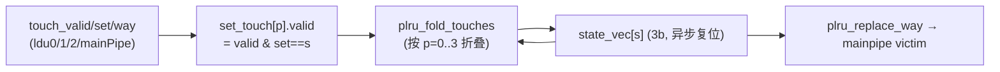

# DCache —— L1 数据缓存内层集成/互联层（学习文档）

> 可读核：`rtl/memblock/DCache.sv`（`xs_DCache_core`，132 行）+ `rtl/memblock/dcache_pkg.sv`（110 行）
> 机械互联（生成）：`dcache_ports.svh` / `dcache_nets.svh` / `dcache_regs.svh` /
> `dcache_glue_ff.svh` / `dcache_glue_assign.svh` / `dcache_inst.svh` /
> `dcache_perf_src.svh` / `dcache_perf_out.svh`
> 黑盒 stub：`rtl/memblock/dcache_stub.sv`（22 类子模块）
> golden 同名顶层（FM/UT 用）：`rtl/memblock/DCache_wrapper.sv`
> 生成器：`scripts/gen_dcache.py`
> 设计意图来源（人写 Chisel）：
> `src/main/scala/xiangshan/cache/dcache/DCacheWrapper.scala`（`class DCacheImp`，行 957–1752）
> 替换器算法：rocket-chip `util/Replacement.scala`（`SetAssocLRU` + `PseudoLRU(4)`）
> golden（firtool 生成，仅作 UT/FM 对照）：`golden/chisel-rtl/DCache.sv`（23644 行，603 端口）

---

## 1. 架构定位

`DCache`（内层，区别于薄包装 `DCacheWrapper`）是香山 L1 数据缓存的**集成核**：把
30+ 个功能子模块拼成完整 L1 DCache。本层**不含命中判定 / 流水算法**（那些在
`LoadPipe` / `StorePipe` / `MainPipe` 等子模块里），只做：

- **路由**：3 路 load / 2 路 sta / sbuffer store / atomics / probe 请求分发到各流水。
- **阵列读写仲裁**：meta / tag / data / error / prefetch / access 各阵列的多读端口分配、
  写端口仲裁（tag_write_arb / dataWriteArb(+8 份 dup)）。
- **MSHR 分配接线**：各流水的 miss_req 经 `TreeArbiter`（优先级仲裁）入 MissQueue，
  另有 `MissReadyGen` 单独算 enq ready（时序优化）。
- **一致性接线**：probe（B 通道）、release（C 通道）、refill / grant（D 通道）路由。
- **替换算法**：setplru（见 §3）。
- **寄存输出**：错误聚合、原子响应、release、store-replay 等打拍。
- **perf 计数 2 级打拍**（见 §4）。

```
   上游              子模块（UT/FM 黑盒）                    阵列 / 下游
   ┌────────┐   ┌────────────────────────────────────┐
   │load×3  │──▶│ ldu_0..2 (LoadPipe)                 │──读──▶ metaArray / tagArray /
   │sta×2   │──▶│ stu_0..1 (StorePipe)                │       bankedDataArray /
   │store   │──▶│ mainPipe (MainPipe) ───读/写────────│       errorArray / prefetchArray /
   │atomics │──▶│                                     │       accessArray（写经 Arbiter）
   └────────┘   │ missReqArb(TreeArbiter)→ missQueue  │
                │ missQueue ── A / E ───────────────▶ │ L2
   L2 ─ B ────▶│ probeQueue                          │
   L2 ─ D ────▶│ (Grant/ReleaseAck 路由) → mq / wb   │
                │ wb ── C ──────────────────────────▶ │ L2
                │ bloomFilter / counterFilter         │
                │ 2×Monitor / cacheCtrlOpt(CtrlUnit)  │
                └────────────────────────────────────┘
```

对应 Scala（精简）：

```scala
class DCacheImp(outer: DCache) extends LazyModuleImp(outer) {
  val ldu = Seq.tabulate(LoadPipelineWidth)(i => Module(new LoadPipe(i)))   // 3
  val stu = Seq.tabulate(StorePipelineWidth)(i => Module(new StorePipe(i))) // 2
  val mainPipe = Module(new MainPipe); val missQueue = Module(new MissQueue(...))
  val probeQueue = Module(new ProbeQueue(edge)); val wb = Module(new WritebackQueue(edge))
  val metaArray/errorArray/prefetchArray/accessArray/tagArray/bankedDataArray = ...
  // meta/tag/data 多端口读 + 单端口写仲裁；missReqArb(TreeArbiter) <> missQueue.req；
  // bus.a<>missQueue.mem_acquire; bus.c<>wb.mem_release; D 通道按 opcode 分发 ...
  val replacer = ReplacementPolicy.fromString("setplru", nWays=4, nSets=256)
  replacer.access(touchSets, touchWays); req.way := replacer.way(set)       // §3
  generatePerfEvent()                                                        // §4
}
```

本配置（KunmingHu V2R2）固化参数：`LoadPipelineWidth=3`、`StorePipelineWidth=2`、
`DCacheBanks=8`、`DCacheWays=4`、`DCacheSets=256`、`NUM_PERF_EVENTS=32`、`PERF_W=6`。
端口共 **603** 个（含 clock/reset）。`HyuCnt=0`，故 Scala 里所有 hybrid 分支与
`StorePrefetch` 的 stu 阵列读端口在本配置下退化（firtool 消解），互联以**直连**为主。

---

## 2. 分层与方法学

本层是 23644 行 / 603 端口 / 32 子实例 / ~4000 内部网的巨型互联。按本工程方法学
（同 `LsqWrapper` / `DCacheWrapper`）拆成两部分：

| 部分 | 内容 | 文件 | 性质 |
|---|---|---|---|
| **可读核（手写）** | setplru 替换器 + perf 2 级打拍 | `DCache.sv` + `dcache_pkg.sv` | **设计意图重写**（struct/enum/function/genvar） |
| **机械互联（生成）** | 32 子模块例化、子模块输出网声明、错误/原子/release/TL-edge 拍数寄存、顶层 assign 别名、perf 源映射 | `dcache_*.svh` | 纯接线 / TL-edge 拍数跟踪，**无 DCache 设计决策**，由 `gen_dcache.py` 从 golden 复刻 |

为什么这样分：DCache 集成层的“设计意图”集中在 **替换算法** 与 **perf 流水**——这两块
golden 用 7000+ 行展平 `always`（256 组 PLRU）和 64 个 `*_REG` 标量铺开，正是可读性
重灾区，可读核用纯函数 + genvar 收敛到 ~30 行。其余是“把子模块端口接起来 / TileLink
边沿拍数跟踪 / 把响应打一拍”这类无算法的机械连线，照搬 golden 即忠实表达设计（也利于
FM 逐位对齐）。生成器只搬运这部分，**不碰**替换器/perf。

可读核 `xs_DCache_core` 的骨架：

```systemverilog
module xs_DCache_core import dcache_pkg::*; ( `include "dcache_ports.svh" );
  `include "dcache_regs.svh"        // 机械寄存器声明（错误/原子/release/拍数）
  `include "dcache_nets.svh"        // 子模块输出网 + 中间组合网
  // §A 替换器（手写，genvar + plru_* 纯函数）
  // §B perf 2 级打拍（手写，genvar）
  `include "dcache_glue_ff.svh"     // 机械寄存 always 块
  `include "dcache_glue_assign.svh" // 机械 assign 别名
  `include "dcache_inst.svh"        // 32 个子模块例化
endmodule
```

---

## 3. setplru 替换器（256 组 × 4 路 Tree-PLRU）

替换器是 `ReplacementPolicy.fromString("setplru", 4, 256)` => `SetAssocLRU(256, 4, "plru")`：
每组独立维护一棵 **4 路 Tree-PLRU**，状态 3 bit（`nBits = nWays-1`）。

### 3.1 PLRU 位含义（4 路）

```
        state[2] : 高半 {way3,way2} 比 低半 {way1,way0} 更老（更该替换）
        /                                                            \
 state[1]: way3 比 way2 更老（高半叶）          state[0]: way1 比 way0 更老（低半叶）
```

way 编码 2 bit：`way[1]` 选左右子树（1=高半 {3,2}），`way[0]` 选子树内单路。

### 3.2 查询 victim（`plru_replace_way`，纯函数）

```systemverilog
way = {state[2], state[2] ? state[1] : state[0]};
```

即 `get_replace_way(state, 4)` 的展开：先看哪半更老（`state[2]`），再看该半内哪路更老。
本配置只有 **MainPipe** 消费 victim（`mainpipe_replace_way = plru_replace_way(state_vec[set])`）；
ldu/stu 的 `replace_way.way` 在本配置是死端口（firtool 已消解），故不接。

### 3.3 touch 更新（`plru_next_state` + `plru_fold_touches`，纯函数）

访问某 way 后把它标记为“最近使用”——翻转指向它的各级树节点位：

```systemverilog
n[2] = ~way[1];                            // 本节点：访问哪半，则另一半变“更老”
n[1] = (way[1]==1) ? ~way[0] : state[1];   // 高半叶：仅访问高半时更新
n[0] = (way[1]==0) ? ~way[0] : state[0];   // 低半叶：仅访问低半时更新
```

一拍内 **4 个 touch 端口**（`ldu_0/1/2/mainPipe`，顺序固定）可能访问同一组，按端口
顺序折叠（`plru_fold_touches`，后者优先，与 Chisel `foldLeft` 一致），仅对 valid 且
set 命中本组的端口生效：

```systemverilog
for (genvar s = 0; s < DCacheSets; s++) begin : g_replacer
  // set_touch[p].valid = touch_valid[p] & (touch_set[p] == s)
  always_ff @(posedge clock or posedge reset)        // 异步复位，与 golden 一致
    if (reset)        state_vec[s] <= '0;
    else if (set_hit) state_vec[s] <= plru_fold_touches(state_vec[s], set_touch);
end
```

> **关键坑 1（FM 反复定位）**：`state_vec` 必须用**异步复位**
> `always_ff @(posedge clock or posedge reset)`。golden 把它放在 async-reset always 块，
> 用同步复位会让 FM 判这 768 个寄存器全不等价。
>
> **关键坑 2**：`plru_next_state` 的 `n[1]/n[0]` 条件**不能写反**——访问**高**半
> (`way[1]==1`) 更新的是 `state[1]`（高半叶），访问低半更新 `state[0]`。写反时 UT 随机
> 激励常恰好不触发 `replace_access` 而漏过，**只有 FM 逐位比对才抓得到**（本次即如此）。
>
> **数据流（单组）**：



---

## 4. perf 计数 2 级打拍（32 路）

各子模块（`wb` 5 + `mainPipe` 2 + `missQueue` 5 + `probeQueue` 5 + `ldu_0/1/2` 各 5）共吐出
**32** 路 6bit perf 计数，汇聚成 `perf_raw[]`（`dcache_perf_src.svh` 的源映射），再用 genvar
统一打两拍后接出（避免长扇出影响时序，与 `DCacheWrapper`/`LsqWrapper` 同一做法）：

```systemverilog
for (genvar i = 0; i < NUM_PERF_EVENTS; i++) begin : g_perf
  always_ff @(posedge clock) begin
    perf_stage1[i] <= perf_raw[i];
    perf_stage2[i] <= perf_stage1[i];
  end
end
// assign io_perf_<i>_value = perf_stage2[i];
```

---

## 5. 机械互联（生成，无设计决策）

`scripts/gen_dcache.py` 从 golden `DCache.sv` 解析并复刻：

| 生成文件 | 内容 | 来源 |
|---|---|---|
| `dcache_ports.svh` | 603 个扁平端口声明 | golden 模块头 |
| `dcache_inst.svh` | 32 个子模块例化（端口→网名）；唯一改写：`mainPipe.io_replace_way_way` 接可读核 `mainpipe_replace_way`；golden `(/* unused */)` → 留空 | golden 实例块 |
| `dcache_nets.svh` | 子模块输出网 + 中间组合网（`wire ... = ...;`），**去除**替换器网（`state_vec*`/`set_touch_ways*`/`_state_vec_*_T*`/`_GEN_15/16`） | golden 顶层 wire |
| `dcache_regs.svh` | 机械寄存器声明（错误聚合/原子/release/TL-edge 拍数），**去除** `state_vec`/`perf REG` | golden reg |
| `dcache_glue_ff.svh` | 机械寄存 `always` 块，**剥离** state_vec 更新片段与 perf REG 更新片段 | golden always |
| `dcache_glue_assign.svh` | 顶层 `assign` 互联别名（A/B/C/D 通道、ready 回送、forward_D、原子/release 输出等），**去除** perf-out | golden assign |
| `dcache_perf_src.svh` | `assign perf_raw[i] = _<inst>_io_perf_k_value;` | golden `io_perf_i_value_REG <= SRC;` |
| `dcache_perf_out.svh` | `assign io_perf_<i>_value = perf_stage2[i];` | 固定 32 路 |

子模块（`LoadPipe`/`MainPipe`/`MissQueue`/各阵列/各 `Arbiter`/`TreeArbiter`/`MissReadyGen`/
`BloomFilter`/`CounterFilter`/2×`Monitor`/`CtrlUnit`/`ProbeQueue`/`WritebackQueue`）在 UT/FM
两侧均为黑盒（`dcache_stub.sv`，22 类，端口方向取自各自 golden 文件头）。

---

## 6. 验证结果

### 6.1 UT（双例化逐拍逐位比对）

`verif/ut/DCache/`：golden `DCache` vs 手写 `DCache_xs`，两侧共用同一组 `dcache_stub.sv`
黑盒子模块，逐拍比对全部 603 输出（跳 golden-X：`!$isunknown`）。

| 种子 | 结果 | checks |
|---|---|---|
| 1  | PASSED | 200000 |
| 7  | PASSED | 200000 |
| 42 | PASSED | 200000 |

> 注：UT 的随机激励直接驱动 603 个 primary input；子模块为行为级黑盒（输出由随机激励
> 透过端口决定），主要验证**集成层互联映射 + 替换器/perf 时序**。替换器的细节等价
> （way 编码方向、异步复位）靠 §6.2 FM 逐位钉死，UT 与 FM 互补。

### 6.2 FM（形式化等价）—— `make fmbb`

ref/impl 两侧都读入 `dcache_stub.sv`（显式端口方向），`identity` 黑盒配对统一边界，
并对替换器 `state_vec`（256×3）与 perf 流水（32×2×6）逐位 `set_user_match`（1152 点）。

- **18620 Passing compare points，0 Failing，0 Unmatched，0 Aborted。**
- `FM_RESULT: Verification SUCCEEDED for DCache`（**无假阳性放行，全过**）。

收敛过程（记录两个真实 bug，均由 FM 抓出）：
1. `plru_next_state` 的 `n[1]/n[0]` 子树更新条件写反 → 替换器逻辑不等价；
2. `state_vec` 误用同步复位（golden 为异步）→ 768 个寄存器判不等价。
修正后 FM 全过。说明可读核与 golden 在**替换算法、perf 流水、全部互联**上逐位等价。

### 6.3 结构硬指标

| 指标 | 要求 | 实测（可读核 `DCache.sv` + `dcache_pkg.sv`） |
|---|---|---|
| 可读核行数 | 远小于 golden 23644 | **132 + 110 = 242** |
| `typedef struct packed` | >0 | 1（`repl_touch_t`） |
| `typedef`（含状态/way 类型别名） | >0 | 3 |
| `function automatic` | >0 | 3（`plru_replace_way`/`plru_next_state`/`plru_fold_touches`） |
| `genvar`/`for` | >0 | 5（256 组替换器 + 4 touch 端口 + 32 perf） |
| 生成痕迹 `_REG_N`/`_GEN_`/`_T_N`/`RANDOMIZE` | 核内 =0 | **0**（仅 1 处注释引用 golden 名作交叉对照） |

机械互联 include 共 3657 行（纯接线，无设计决策，集中承载 603 端口 / 32 实例 /
~4000 网的连线，使可读核保持 242 行聚焦设计意图）。

---

## 7. 文件清单

| 文件 | 角色 |
|---|---|
| `rtl/memblock/DCache.sv` | 可读核 `xs_DCache_core`（替换器 + perf 手写 + include 机械互联） |
| `rtl/memblock/dcache_pkg.sv` | 参数 / PLRU 类型与纯函数 |
| `rtl/memblock/dcache_ports.svh` | 603 端口表（生成） |
| `rtl/memblock/dcache_nets.svh` | 子模块输出网 + 中间组合网（生成） |
| `rtl/memblock/dcache_regs.svh` | 机械寄存器声明（生成） |
| `rtl/memblock/dcache_glue_ff.svh` | 机械寄存 always 块（生成） |
| `rtl/memblock/dcache_glue_assign.svh` | 顶层 assign 互联别名（生成） |
| `rtl/memblock/dcache_inst.svh` | 32 个子模块例化（生成） |
| `rtl/memblock/dcache_perf_src.svh` / `dcache_perf_out.svh` | perf 源映射 / 输出（生成） |
| `rtl/memblock/dcache_stub.sv` | 22 类子模块黑盒 stub（生成，UT/FM 共用） |
| `rtl/memblock/DCache_wrapper.sv` | golden 同名顶层（透传到核，FM impl 侧 / UT 用，生成） |
| `scripts/gen_dcache.py` | 解析 golden 生成上述机械互联 include + stub + wrapper + UT |
| `verif/ut/DCache/{Makefile,variants_xs.sv,tb.sv,fm_eq_bb.tcl}` | UT / FM(bb) |
