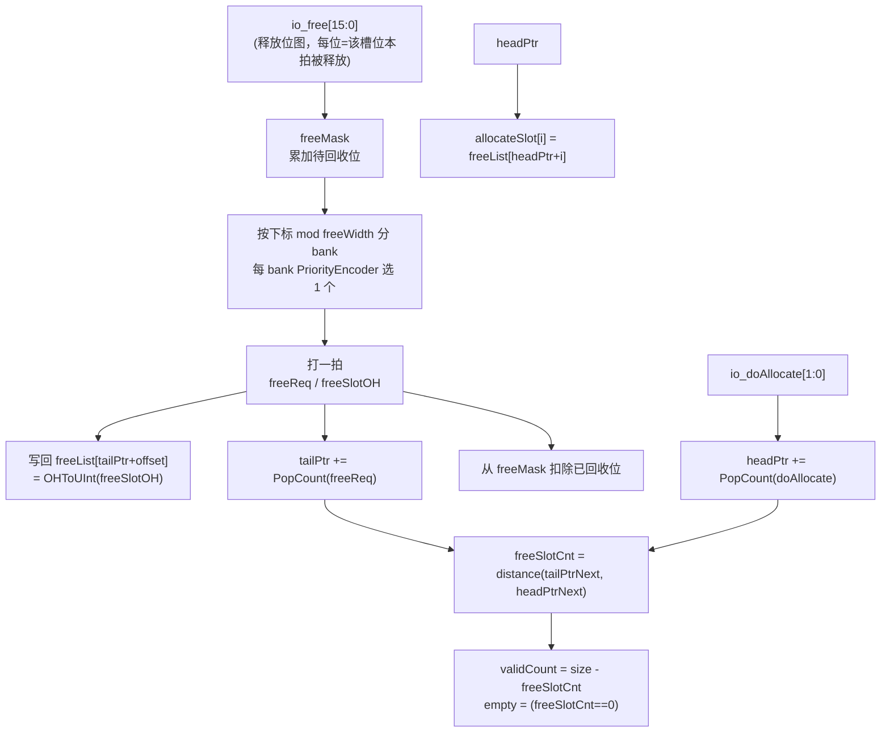
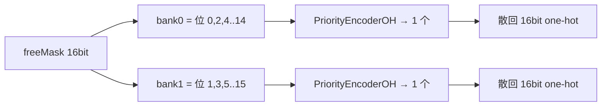

# FreeList —— 访存队列「空闲槽位表」(条目槽位分配/回收)

> 可读核：`rtl/memblock/FreeList.sv`（`xs_FreeList_core`）+ `rtl/memblock/freelist_pkg.sv`
> 包装层：`rtl/memblock/FreeList_wrapper.sv`（golden 同名 `FreeList`，扁平端口 → 核）
> 设计源：`src/main/scala/xiangshan/mem/lsqueue/FreeList.scala`
> golden：`golden/chisel-rtl/FreeList.sv`（465 行 / 9 端口；本例化 size=16, allocWidth=2, freeWidth=2）

## 1. 它在访存里的位置

这是 **MemBlock（访存）** 里给 Load/Store 队列（如 `LoadQueueRAW`、`LoadQueueUncache`）分配
**条目槽位号(slot index)** 的空闲表——管理的是"队列里第几个条目"这种索引，**不是物理寄存器**。
访存指令入队时向本表要一个空闲槽位作为它在队列中的位置；条目处理完/被清除时把槽位释放回池。

> 注意：它与重命名的 `StdFreeList`/`MEFreeList` 同名但**不同模块**——后者分配物理寄存器、带
> 重定向回滚；本表分配队列槽位、释放接口是**位图**并带 bank 优先编码 + 打拍。

## 2. 数据通路总览

`freeList[16]` 是循环队列；`headPtr` 出队端（分配）、`tailPtr` 入队端（回收）。`SIZE=16` 是 2 的幂，
指针 `{flag,value}` 直接拼接相加自然回绕（无需手动判界，比重命名 158 项的版本简单）。

## 3. 为什么释放要"位图 + bank 优先编码 + 打拍"？

释放来源分散：同一拍可能有多个不同条目被清除（`io_free` 是 16 位位图）。但每拍最多只能往
`freeList` 写 `freeWidth=2` 个槽位号。于是：

1. `freeMask` 先把本拍 `io_free` **累加**进来（来不及回收的留到后续拍）。
2. 把 16 位 `freeMask` 按"下标 mod 2"分成 **2 个 bank**（偶数位 bank0、奇数位 bank1），
   每个 bank 用 **PriorityEncoder** 挑一个待回收槽位 → `freeSlotOH`。两个 bank 并行，
   一拍最多回收 2 个。
3. `freeReq`/`freeSlotOH` **打一拍**（GatedRegNext）后，把选中的槽位号 `OHToUInt(freeSlotOH)`
   写回 `freeList[tailPtr+offset]`，并推进 `tailPtr`，同时把这两位从 `freeMask` 扣除。

## 4. 分配与计数

- 分配：`allocateSlot[i] = freeList[headPtr + i]`（本例化 `enablePreAlloc=false`，组合直读）。
  `headPtr` 按 `PopCount(doAllocate)` 前移。**本 golden 例化没有 `canAllocate` 输出**——它被
  firtool 裁剪了，因为该实例的使用者（LoadQueueRAW）改用 `validCount` 自行判流控。
- 计数：`freeSlotCnt = distance(tailPtrNext, headPtrNext)`（用**下一拍**指针）；
  `validCount = size - freeSlotCnt`（已占用条目数）；`empty = (freeSlotCnt == 0)`。

## 5. 接口表（核 `xs_FreeList_core`）

| 信号 | 方向 | 含义 |
|------|------|------|
| io_allocateSlot[2] | out | 两个分配口给出的空闲槽位号(4bit) |
| io_doAllocate[2] | in | 各分配口本拍是否确实取走 |
| io_free[16] | in | 释放位图(每位=该槽位被释放) |
| io_validCount | out | 已占用条目数(5bit) |
| io_empty | out | 空闲池是否为空 |

## 6. 验证结果

- **UT**（golden 双例化逐拍比对，含内部 `headPtr/tailPtr/freeMask/freeSlotCnt` 层次探针）：
  seed 1 / 7 / 42 各 **200000 拍，checks=200000，errors=0**。
  - 激励是**协议合法**的：分配用 DUT 的 `validCount` 留余量做流控（避免队列溢出），
    释放只针对"当前已分配未释放"的槽位（不重复释放、不释放未占用槽位）。这是该表的使用契约；
    若构造溢出/重复释放等非法状态，距离公式会进入 >size 的未定义区，不在设计契约内。
- **FM**：`make fm` → **Verification SUCCEEDED**（0 unmatched，全部 compare points 等价）。

## 7. 重写关键坑（诚实记录）

1. **空闲计数的位宽语义**：`freeSlotCnt` 距离公式分两支——
   - flag 相同：必须在 **IDX_W(4) 位内**相减（借位自然回绕，最高位恒 0），再零扩展为 5 位；
     若先零扩展成 5 位再减，借位会错误地把 bit4 置 1。这是 FM 唯一一处失配点（队列接近满/
     溢出边界时 bit4 不同），改为 4 位相减后通过。
   - flag 不同：`SIZE + tail.value - head.value`。
2. **数组越界 X**：回收写回用**显式地址译码**（对每个条目做常量比较），而非 `freeList[变量下标]`
   变量写，避免 FM 对越界下标产生 X 传播。
3. **异步复位**：golden 主寄存器异步复位（`posedge clk or posedge reset`），本核对齐。
4. **裁剪端口**：golden 顶层只有 9 个端口（`canAllocate`/`allocateReq` 被裁），按 golden 端口
   重写，不要凭 Scala 的完整 IO 多加端口。
