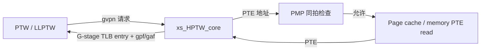
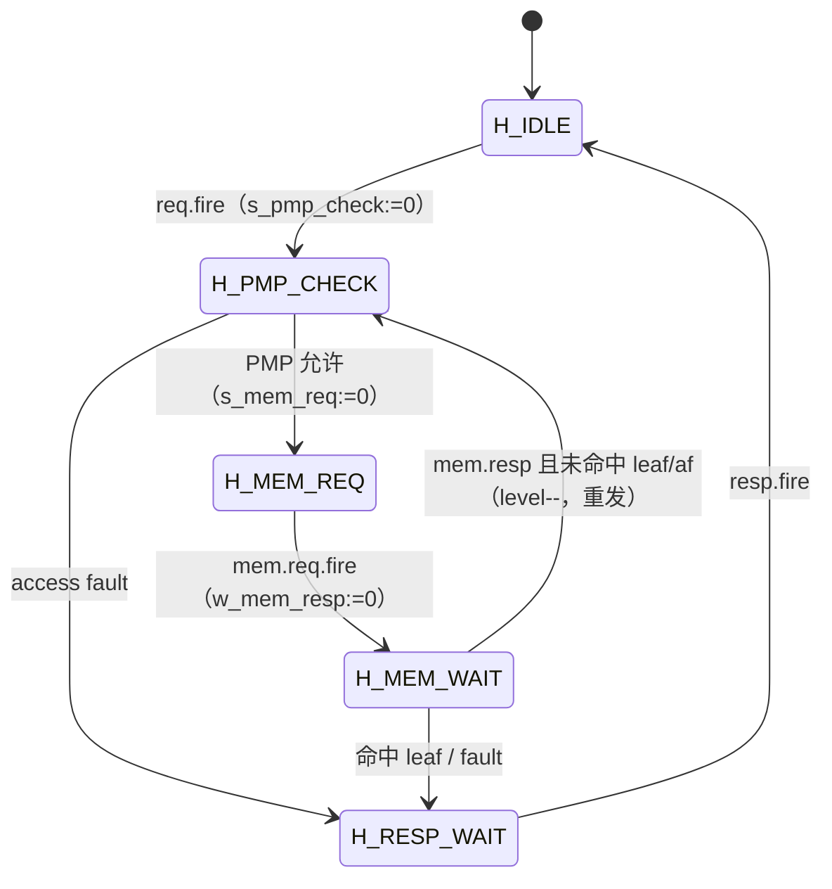

# HPTW —— Hypervisor Page Table Walker（G-stage 页表遍历器）

> 已落地：可读核 `rtl/memblock/HPTW.sv`、类型包 `rtl/memblock/hptw_pkg.sv`、
> golden 同名 wrapper `rtl/memblock/HPTW_wrapper.sv`、生成脚本 `scripts/gen_hptw.py`、
> UT `verif/ut/HPTW/`。三种子 UT 全过，FM `make fm` SUCCEEDED（纯叶子模块，签名分析干净）。

## 架构定位

HPTW 是 RISC-V H 扩展下专用的 **G-stage（second-stage）页表遍历器**。在两阶段
地址翻译中，VS-stage 走表得到的是 guest 物理地址 GPA，还需要再经 G-stage 用
`hgatp` 作为根把 GPA 翻译成 host 物理地址 HPA。PTW / LLPTW 在需要做 G-stage
翻译时，把一个 gvpn 请求发给 HPTW，HPTW 走完整条 G-stage 后返回 `HptwResp`。

与 PTW 的关键区别：

| 维度 | PTW（S/VS-stage 上层 walker） | HPTW（G-stage walker） |
|---|---|---|
| 走表范围 | 只走上层，最后一级交 LLPTW | 自己走完所有级，直到 level 0 |
| 根地址 | `MakeAddr(satp.ppn, vpnn)` | `MakeGPAddr(hgatp.ppn, gvpnn)`（x4，11-bit 索引） |
| fault | pf / af / guestFault | gpf / gaf |
| 权限 | leaf 检查见 isPf | G-stage 是 LOAD 型，叶子必须 U=1、A=1（isGpf） |

## 状态机

代码保留 Scala 的 `s_* / w_*` 位级握手协议（`s` 表示请求已发送/无需发送，`w`
表示响应已回/无需等待，复位为 1），`hptw_state_e` 仅作高层投影方便读波形。

## 地址生成

`hptw_pkg.sv` + 核内 `gen_ppn` / `p_pte` / `pg_base`：

- **根级**（`af_level` 处于最高：Sv48=3 / Sv39=2）用 `pg_base =
  hgatp.ppn<<12 + gvpnn_root<<3`，其中 `gvpnn_root` 是 x4 的 11-bit 索引
  （Sv48: `gpaddr[49:39]`，Sv39: `gpaddr[40:30]`）。
- **后续级**用 `p_pte = {ppn[35:0], getVpnn(vpn,level), 3'b0}`，9-bit 索引。
- `gen_ppn` 按 `af_level` + 命中级（l1/l2/l3Hit）选择本级页基址：命中级用
  `req_ppn`，否则用上一级 PTE 读出的 `pte.ppn`。

## PTE 解析（isGpf 与 isPf 的差异）

`pte_is_gpf()` 实现 `PteBundle.isGpf`，**不能照抄 isPf**。G-stage 为支持 VS-stage
是 LOAD 型访问，与 S-stage 的核心差异：

- 叶子项必须 `perm.u == 1`，否则 `gpf`（S-stage 无此限制）。
- 叶子项必须 `perm.a == 1`，否则 `gpf`（A 位检查；D 位检查留给 L1TLB）。
- NAPOT 检查 `n && ppn[3:0]!=8` **不带** `level!=0` 条件（isPf 带）。

fault 优先级（resp 装配）：`accessFault > pageFault > ppn_af`；`gaf` 置位时清空
entry payload（n/pbmt/ppn/perm 全 0）。

## 已定位的坑

- **`mem_addr` 高位丢失**：`gen_ppn` 必须返回 36-bit PPN，再拼 `{ppn, vpnn, 3'b0}`
  得 48-bit 地址。早期版本把 ppn 当 48-bit 后再切片，导致 `mem_req_addr` 高
  nibble 恒为 0（如 g=`d431…` vs i=`431…`）。
- **isGpf vs isPf**：见上节。早期照抄 isPf 导致 `resp_gpf` 在 U/A 位场景下系统性
  偏差（g=1 i=0）。
- **`accessFault` 的 RegEnable 语义**：`finish` 拍若没被 `resp.fire`/`req.fire` 清，
  需保持 PMP 结果；按 Scala 的三目分支精确复刻，否则 FSM 在 access fault 摇摆时
  提前下降 level。

## 结构闸门（`HPTW.sv + hptw_pkg.sv`）

| 项 | 实测 |
|---|---:|
| `typedef struct packed` | 5 |
| `typedef enum` | 1（hptw_state_e 高层投影）|
| `function automatic` | 9 |
| `genvar/for` | 0（串行 FSM，无多路/多 bank 阵列，故无 generate）|
| 生成痕迹 grep | 0 |
| 核+pkg 行数 | 468（golden 334；golden 是 firtool 展平的单文件叶子，本核含丰富注释与纯函数拆分）|

> 说明：HPTW 没有多 way/bank/entry 阵列，也没有逐项展开的标量寄存器，故 genvar/for
> 自然为 0。这是“无该结构”而非“平铺转写”——核内寄存器全部是单实例 FSM 状态。

## 验证状态

UT（`verif/ut/HPTW/`，`+define+SYNTHESIS` 关随机化，逐拍比对全部 51 端口）：

| seed | checks | errors | 状态 |
|---:|---:|---:|---|
| 1 | 200000 | 0 | PASSED |
| 7 | 200000 | 0 | PASSED |
| 42 | 200000 | 0 | PASSED |

FM：`make fm` → `FM_RESULT: Verification SUCCEEDED for HPTW`（纯叶子，签名分析干净）。
