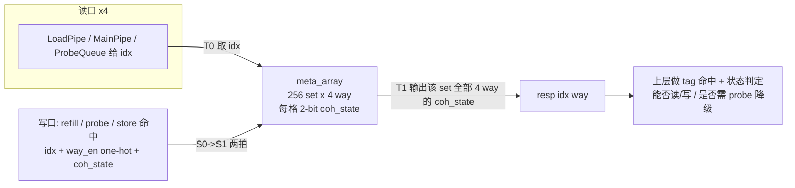
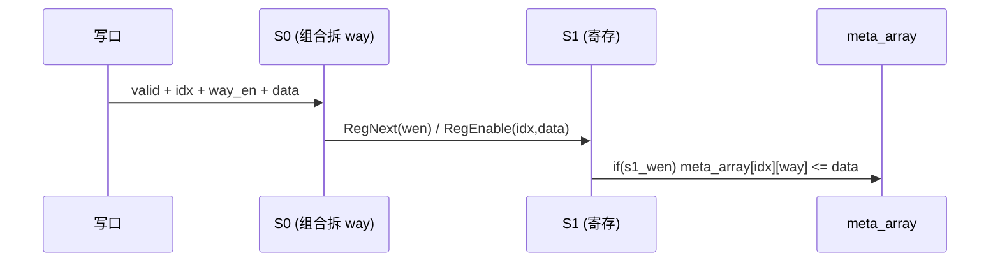
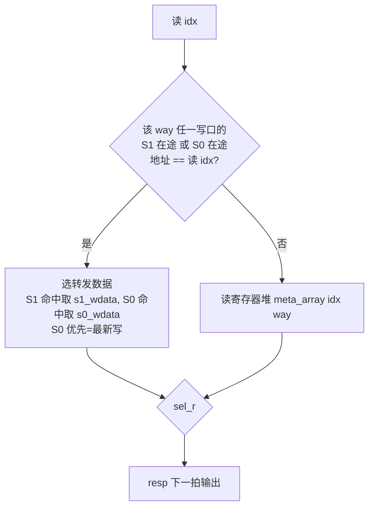

# L1CohMetaArray —— L1 DCache 一致性状态元数据阵列

> 可读重写：`rtl/memblock/L1CohMetaArray.sv`（核 `xs_L1CohMetaArray_core`）+ `rtl/memblock/l1metaarray_pkg.sv`（条目类型 / 状态枚举）
> golden：`golden/chisel-rtl/L1CohMetaArray.sv`（4 读口 / 1 写口，7638 行）
> Scala 设计意图：`XiangShan/src/main/scala/xiangshan/cache/dcache/meta/AsynchronousMetaArray.scala`（`class L1CohMetaArray`、`class Meta`、`class MetaReadReq`、`class CohMetaWriteReq`）

## 1. 在 DCache 中的角色

香山 L1 DCache 是组相联（本配置 `nSets=256` × `nWays=4`）。每条 cacheline 除了 tag、data 外，还要记录它当前的 **TileLink 一致性状态**（`ClientMetadata`，2 bit）——这条线现在是无副本(Nothing)、只读共享(Branch)、独占未脏(Trunk) 还是独占已脏(Dirty)。这正是 `L1CohMetaArray` 存的东西。

- 本阵列**只按 idx 索引，返回该 set 全部 4 way 的一致性状态**；它**不做 tag 命中**。命中选 way、据状态决定读写许可由上层（DCache 命中比较逻辑）完成。
- 用**寄存器堆**实现而非 SRAM，所以叫「异步」(Asynchronous) 阵列。

## 2. 元数据组织与端口

| 维度 | 取值 | 含义 |
|------|------|------|
| `N_SETS` | 256 | 组数，`IDX_BITS=8` |
| `N_WAYS` | 4 | 路数（每 set 4 way） |
| `COH_BITS` | 2 | `ClientMetadata.state` 宽 |
| 读口 | 4 | 每口给 `idx`，下一拍返回 4 way 的 coh_state |
| 写口 | 1 | `way_en`(one-hot 4 位) + `idx` + `coh_state` |

一致性状态编码（`coh_state_e`，逻辑上当 2-bit 透传）：

| 值 | 名称 | 含义 |
|----|------|------|
| 0 | `COH_NOTHING` | 无副本 |
| 1 | `COH_BRANCH`  | 只读共享 |
| 2 | `COH_TRUNK`   | 独占（可写未脏） |
| 3 | `COH_DIRTY`   | 独占且已脏 |

## 3. 读写时序：写 2 拍流水 + 读旁路

写有 **2 拍延迟**：S0 接收请求并按 `way_en` 拆到各 way；S1（打一拍）才真正把数据落进寄存器堆 `meta_array`。

因为写要 2 拍才落盘，若一条读请求的 `idx` 恰好命中**正在 S0 或 S1 在途的写**，直接读寄存器堆会拿到旧值。故对每个 `(读口, way)` 做**在途写转发(bypass)**：

实现要点（见核内 `g_rport`/`g_way` generate）：
- `rd_bypass_sel` / `rd_bypass_data` 组合计算：扫描该 way 全部写口，**先看 S1 在途、再看 S0 在途，后命中者覆盖**（复刻 Chisel `when` 链，S0 最新故优先）。
- 选择位 `sel_r` 用 `read.valid` 使能锁存；转发数据 `bypass_data_r` 用 `rd_bypass_sel` 使能锁存。
- **非旁路路径锁存的是「数据」**：S0 读出 `meta_array[idx][way]` 后打一拍存入 `array_data_r`（对应 Chisel `bypassRead=true` 分支：`RegEnable(meta_array(idx)(way), read.valid)`）。
- 输出：`resp = sel_r ? bypass_data_r : array_data_r`。

> 这正是 `L1CohMetaArray` 与 `L1FlagMetaArray` 的唯一时序差异：Coh 锁存「读出的数据」，Flag 锁存「idx」再于下一拍组合读。两者功能等价（`meta_array` 在 S1 才更新），但寄存语义不同，重写时逐字保持以与 golden 等价。

## 4. way 选择与写优先级

- 写请求带 **one-hot `way_en`**，对每个 way 独立判定 `s0_way_wen = valid & way_en[way]`。
- 单写口配置下不存在写冲突；多写口时（见 `L1FlagMetaArray_1`）**高索引写口优先**（核内 `for wp` 升序、非阻塞赋值最后命中者胜，复刻 Chisel 后写覆盖语义）。

## 5. 复位语义（关系到 FM 等价）

`meta_array` 用**异步复位**清 0（`always_ff @(posedge clock or posedge reset)`），与 golden 的 async-reset DFF 一致——这关系到 DFF 复位引脚的连接，FM 据此比对，必须保持。其余在途写寄存器与读侧寄存器**无复位**（上电为 X，与 golden 相同；UT 用 `$isunknown(golden)` 跳过暖机阶段的 don't-care）。

## 6. 结构硬指标（可读核实测）

| 指标 | L1CohMetaArray |
|------|----------------|
| 行数（核） | 154（golden 7638，约 1/50） |
| `typedef struct packed` | 1（`meta_coh_t`，在 pkg） |
| `typedef enum` | 1（`coh_state_e`） |
| `function automatic` | 1（`bypass_hit`） |
| `genvar` / `for` | 2 / 12（读口×way、写口×way 全部并行展开） |
| 生成痕迹 `_GEN_/_T_/_REG_n/RANDOMIZE/双数字展平名` | 0 |

## 7. 验证结果

- **UT**（golden `u_g_` vs 可读 `u_i_` 双例化，逐拍比对全部 16 个 `resp` 输出，`idx` 收窄到 0..15 提升读写同址/旁路命中率）：

  | 种子 | checks | errors |
  |------|--------|--------|
  | 1 | 250000 | 0 |
  | 7 | 250000 | 0 |
  | 42 | 250000 | 0 |

- **FM**：`FM_RESULT: Verification SUCCEEDED for L1CohMetaArray`（2124 按名 + 80 按签名匹配，0 unmatched，0 failing）。

## 8. 关键坑

1. **async vs sync reset**：首版把 `meta_array` 写成同步复位，FM 报 20 个存储 DFF failing（复位引脚连接不同）。改成异步复位后 FM 通过。golden 的存储阵列是 async-reset，在途/读侧寄存器是无复位 sync——必须分两个 always 块如实复刻。
2. **Coh 与 Flag 的非旁路路径寄存语义不同**（数据 vs idx），不可混用。
