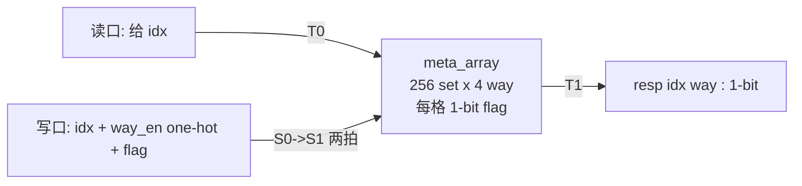
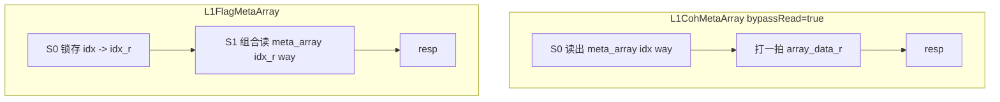
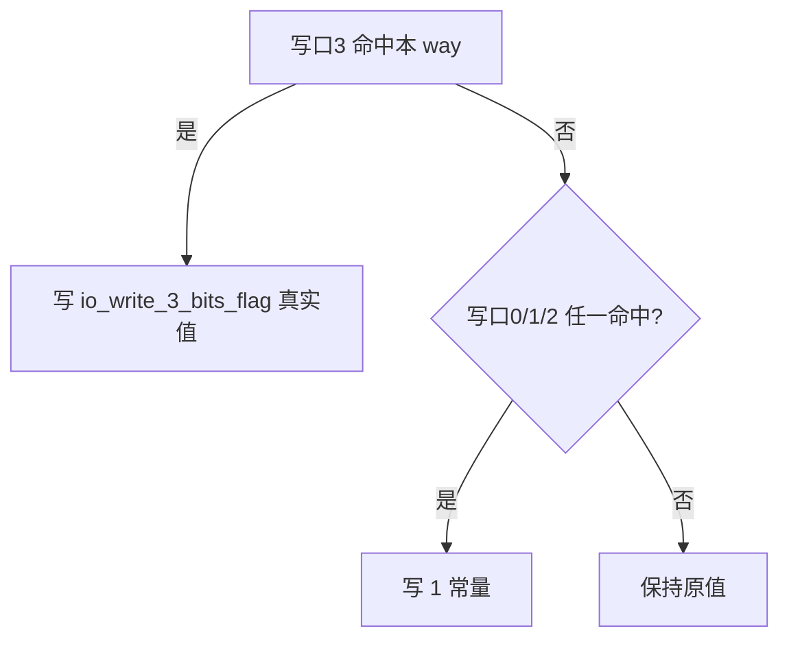

# L1FlagMetaArray —— L1 DCache 标志位元数据阵列

> 可读重写：`rtl/memblock/L1FlagMetaArray.sv`（核 `xs_L1FlagMetaArray_core`）+ `rtl/memblock/l1metaarray_pkg.sv`
> golden：`golden/chisel-rtl/L1FlagMetaArray.sv`（4 读口 / 1 写口，7606 行）、`L1FlagMetaArray_1.sv`（5 读口 / 4 写口）
> Scala 设计意图：`XiangShan/src/main/scala/xiangshan/cache/dcache/meta/AsynchronousMetaArray.scala`（`class L1FlagMetaArray`、`class FlagMetaWriteReq`）

## 1. 在 DCache 中的角色

与 `L1CohMetaArray` **完全同构**，区别只在每条 cacheline 存的不是 2-bit 一致性状态，而是 **1-bit 布尔标志**（香山用它记录如 error / prefetch-valid 等 per-line 属性）。按 `idx` 读出某 set 全部 `nWays` 个 way 的 flag，写口按 `way_en` 更新某 way 的 flag。

同样用**寄存器堆**实现（「异步」阵列），不是 SRAM。

## 2. 端口与两个变体

可读核参数化覆盖两个 golden 变体：

| 变体 | 读口 | 写口 | resp |
|------|------|------|------|
| `L1FlagMetaArray`   | 4 | 1 | 1-bit |
| `L1FlagMetaArray_1` | 5 | 4 | 1-bit |

参数：`N_SETS=256`(`IDX_BITS=8`)、`N_WAYS=4`。

## 3. 读写时序：写 2 拍流水 + 读旁路

与 Coh 一致：写 S0 拆 way → S1 落盘（2 拍延迟）；读侧对每个 `(读口, way)` 做在途写转发，避免读到尚未落盘的旧值。旁路选择/数据计算、写优先级（高索引写口胜）都与 Coh 相同，详见 `L1CohMetaArray.md` 第 3、4 节。

**唯一时序差异（与 Coh）**——非旁路路径：

- Coh 锁存**读出的数据**（`RegEnable(meta_array(idx)(way))`）。
- Flag 锁存 **idx**（`meta_array(RegEnable(idx))(way)`），下一拍用锁存后的 idx 组合读寄存器堆。

因 `meta_array` 在 S1 才更新，两种写法读出的都是更新后的值，功能等价，但寄存的对象不同（数据 vs 地址），重写时逐字保持。

## 4. L1FlagMetaArray_1 的写数据 tie-off（重要）

golden 的 `L1FlagMetaArray_1` 端口里**只暴露了写口 3 的 flag 数据端口**（`io_write_3_bits_flag`），写口 0/1/2 没有 flag 端口。这是父模块例化时的**常量传播**结果：实际例化中写口 0/1/2 恒写 `flag=1`，firtool 把它们的写数据常量折叠了（meta_array 更新对这些口表现为「命中即置 1」的或逻辑）。

处理方式：
- **可读核**仍按设计语义建模——「每个写口有独立的 `flag` 数据」，不把 instantiation 常量写进核。
- **wrapper**（机械适配层）如实复刻这个 tie-off：写口 `0/1/2` 的 `wdata = 1'b1`，写口 `3` 的 `wdata = io_write_3_bits_flag`。这样 wrapper+核 与 golden 等价（FM/UT 双双验证）。

> 单写口变体（`L1FlagMetaArray` / `L1CohMetaArray`）的唯一写口直接带真实数据，无此 tie-off。

## 5. 复位语义

同 Coh：`meta_array` 异步复位清 0（与 golden async-reset DFF 一致，FM 据此比对）；在途写寄存器与读侧寄存器无复位（上电 X，UT 用 `$isunknown(golden)` 跳过暖机）。

## 6. 结构硬指标（可读核实测）

| 指标 | L1FlagMetaArray |
|------|-----------------|
| 行数（核） | 142（golden 7606，约 1/53） |
| `typedef struct packed` | 1（`meta_coh_t`，在 pkg，与 Coh 共享） |
| `typedef enum` | 1（`coh_state_e`，在 pkg） |
| `function automatic` | 1（`bypass_hit`） |
| `genvar` / `for` | 1 / 12 |
| 生成痕迹 | 0 |

## 7. 验证结果

- **UT**（双例化逐拍比对全部 resp，`idx` 收窄 0..15 提升旁路命中率）：

  | 变体 | 种子 | checks | errors |
  |------|------|--------|--------|
  | L1FlagMetaArray   | 1 / 7 / 42 | 250000 / 250000 / 250000 | 0 / 0 / 0 |
  | L1FlagMetaArray_1 | 1 / 7 / 42 | 250000 / 250000 / 250000 | 0 / 0 / 0 |

- **FM**：`FM_RESULT: Verification SUCCEEDED for L1FlagMetaArray` 与 `... for L1FlagMetaArray_1`（均 0 unmatched / 0 failing）。

## 8. 关键坑

1. **写口数据 tie-off**（见第 4 节）：golden 只暴露最后写口的数据端口，是父模块常量传播。若 wrapper 把所有写口都接成写口 3 的 flag，会与 golden 的「写口 0/1/2 恒 1」语义不符（UT/FM 都会失败）。
2. **async reset**：`meta_array` 必须异步复位，否则 FM 报存储 DFF failing（同 Coh）。
3. **非旁路路径锁存 idx 而非数据**，与 Coh 相反，不可照抄 Coh。
