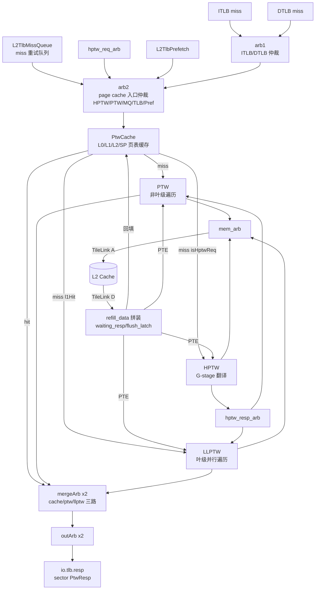

# L2TLB —— 共享 MMU 总集成（页表遍历器顶层）

> 香山 V2R2（昆明湖）里的**共享 MMU / L2TLB 顶层**。
> 设计意图来源：`src/main/scala/xiangshan/cache/mmu/L2TLB.scala`（class L2TLBImp）
> 可读核：`rtl/memblock/L2TLB.sv`（`xs_L2TLB_core`）+ 类型包 `rtl/memblock/l2tlb_pkg.sv`
> （复用 `rtl/memblock/ptw_pkg.sv` 的 `xs_ptw_pkg`）

## 1. 架构定位

L2TLB 是所有 L1 TLB（ITLB / DTLB）的共享后端。当 L1 TLB miss 时，把请求送到这里，经
**page cache（PtwCache）**命中→直接返回，未命中→交给三个遍历器之一向 L2 cache 访存读
PTE，遍历完成后回填 page cache 并把结果合并成 sector PtwResp 返回给对应 TLB。

本层只承担**仲裁 / 路由 / 分发 / 访存数据通路的 glue**；遍历 / 缓存 / 仲裁算法都封装在
子模块里（对本层是 golden 黑盒，UT/FM 两侧共用同一份 golden 定义）。

- **PtwCache**：L0/L1/L2/SP 多级页表缓存，命中直接给结果，未命中给出 toFsm/toHptw 信息。
- **PTW**：非叶级页表遍历 FSM（一次在飞一条），到叶级把请求交给 LLPTW。
- **LLPTW**：叶级并行遍历（llptwsize=6 路），向 L2 读末级 PTE。
- **HPTW**：H 扩展 G-stage（GPA→HPA）翻译。
- **L2TlbMissQueue**：page cache miss 但遍历器忙时的重试队列。
- **L2TlbPrefetch**：基于访问流的页表预取。
- **PMP / 3×PMPChecker**：对 PTW/LLPTW/HPTW 的访存地址做物理内存保护检查。
- **arb1/arb2/mq_arb/hptw_req_arb/hptw_resp_arb/mergeArb/outArb/mem_arb**：各级仲裁器。
- **DelayN**：CSR/sfence/wfi 的 1 拍延迟。

本配置：`HasBitmapCheck=false`，`enablePrefetch=true`，`HasHExtension=true`，
`EnableSv48=true`；`MemReqWidth=8`（LLPTW id 0..5 / PTW id 6 / HPTW id 7），
`PtwWidth=2`，`tlbcontiguous=8`，`l1BusDataWidth=256`（一次访存 2 beat=512bit）。

## 2. 本层手写的 glue（11 节，见 `xs_L2TLB_core`）

| 节 | 功能 | 关键点 |
|----|------|--------|
| 1 | **CSR/sfence 复制扇出** | `io.csr.tlb`/`io.sfence` 经 DelayN(1) 再 RegNext(1) 得 `csr_dup[0..7]`/`sfence_dup[0..8]`，各子模块按固定下标取用（prefetch=0/llptw=1/cache=2,3,4/mq=5,6/ptw=6,7/hptw=7,8）。复制只为降扇出。`flush = sfence(0).valid \| satp/vsatp/hgatp.changed`。 |
| 2 | **请求计数/节流** | `tlb_counter` = 进入(req fire) − 离开(resp fire)，flush 清零；arb1.out 仅在 `tlb_counter < 40` 时放行，防 miss queue 溢出。 |
| 3 | **入口仲裁装配** | arb2 五路输入（HPTW/PTW/MQ/TLB/Pref）的 valid/source；mq_arb 两路（cache miss 进 MQ / llptw.cache）。MQ 经 block_decoupled 受遍历器 ready 阻塞。 |
| 4 | **PTW/LLPTW/HPTW 分发** | 按 cache.resp 的 `hit/l1Hit/isHptwReq/bypassed/isFirst` 决定送哪个遍历器（Scala 278/317/340）。 |
| 5 | **cache.resp.ready MuxCase** | 按 hit/isHptwReq/source 选择 cache 何时被消费（Scala 308）。 |
| 6 | **访存数据通路** | mem_arb→TileLink A（64B 对齐读）；D 通道 beat 跟踪拼 512bit `refill_data`；`waiting_resp`/`flush_latch` 在途跟踪；`resp_pte`（PTW/HPTW 各暂存 PTE）、`resp_pte_sector`（LLPTW 各 id 暂存块）。**所有寄存器复位清 0**（对齐 golden RegEnable 0.U，避免 X 污染 s1 合并路径）。 |
| 6b | **cache.refill 装配** | refill 在 mem resp 完成且非 flush/flush_latch/(hptw&bypassed) 时有效，打一拍；req_info/level/ptes/sel_pte/levelOH 在 refill 拍锁存。 |
| 7 | **HPTW 响应分发** | hptw_resp_arb 输出按 id（==FsmReqID→PTW，否则→LLPTW）分发。 |
| 8 | **输出合并** | 每条 PtwWidth：mergeArb 三路（cache/ptw/llptw）+ outArb。LLPTW 路 s1 = `contiguous_pte_to_merge`（8 PTE→PtwMergeResp）或 first_s2xlate_fault 时回放 llptw_stage1；outArb 路 s1 = `merge_to_sector`（PtwMergeResp→sector）。两个 `function automatic`。 |
| 9 | **PMP/prefetch** | 3 个 PMPChecker mode=ModeS/cmd=read；prefetch.in.valid = cache.resp.fire & !hit/prefetched & isFirst。 |
| 10 | **顶层输出直驱** | req.ready=arb1.in.ready；resp.valid=outArb.out.valid；resp.s1.af=outArb.out.s1.af。 |
| 11 | **perf 两级打拍** | 19 路（0..3 LLPTW / 4..11 cache / 12..18 PTW）各打两拍。 |

### 两个核心组合变换（`l2tlb_pkg` 的 `function automatic`）

- **`contiguous_pte_to_merge`**（Scala 688）：把一次访存取回的 8 个连续 64bit PTE 合成
  一个 `PtwMergeResp`。每条目算 `isPf = page_fault(level0) \|\| !isLeaf`、
  `isAf = pte.isAf && (noS2\|onlyS1) && !isPf`；`af_first=true` ⇒ `pf=!af&&isPf`、
  `af=af\|isAf`；`v=!pf`；asid 取 vsatp/satp、vmid 取 hgatp.vmid；`pteidx=UIntToOH(vpn[2:0])`、
  `not_super=!entry[sel].n`。
- **`merge_to_sector`**（Scala 726）：`PtwMergeResp`→`PtwSectorResp`。选中条目
  `sel=OHToUInt(pteidx)`，`valididx[i]=((ppn/pbmt/perm/v/af/pf 全等) \|\| !not_super) && !not_merge`，
  `valididx[sel]=1`。`oh_to_uint8` 保留 Chisel OHToUInt 的 OR-归约语义（输入非 one-hot 时确定，
  避免 FM 假 failing）。

## 3. 文件清单

| 文件 | 说明 |
|------|------|
| `rtl/memblock/l2tlb_pkg.sv` | 参数 + `l2tlb_csr_t`/`l2tlb_sfence_t`/`sector_entry_t`/`sector_resp_t` struct + `contiguous_pte_to_merge`/`merge_to_sector`/`oh_to_uint8`/`get_part`/`addr_low_*` 纯函数（复用 `xs_ptw_pkg` 的 pte/merge/hptw 类型与 fault 函数）|
| `rtl/memblock/L2TLB.sv` | 可读核 `xs_L2TLB_core`（手写 11 节 glue，675 行）|
| `rtl/memblock/L2TLB_ports.svh` | 核端口表（生成，292 端口）|
| `rtl/memblock/L2TLB_wires.svh` | 子模块输出网声明（生成）|
| `rtl/memblock/L2TLB_driven.svh` | 核手写驱动的 glue 输入网声明（生成，~519 个）|
| `rtl/memblock/L2TLB_inst.svh` | 24 个子模块实例连接表（生成）|
| `rtl/memblock/L2TLB_{cache_stage1,merge_in2,marb_out,outarb_in,perf_out}.svh` | struct↔扁平网装配 + perf 接出（生成）|
| `rtl/memblock/L2TLB_wrapper.sv` | golden 同名扁平 wrapper（FM/ST 用，生成）|
| `scripts/gen_l2tlb.py` | 生成器 |
| `verif/ut/L2TLB/` | UT（Makefile / variants_xs.sv / tb.sv）|

> 说明：可读核例化 24 个 golden 子模块实例（与 golden 完全一致）。手写 glue 约 675 行
> （核）+ 249 行（pkg）；`L2TLB_inst.svh` 等生成的连接/装配表约 6000 行纯属与子模块的机械
> 互联（无生成临时名），是不可约的接线。golden 顶层 `L2TLB.sv` 为 13062 行（含 RANDOMIZE
> 样板 / 展平连接 / 子模块输出网）。生成器**只**做端口/连接解析与 struct↔扁平网装配，
> **不**搬运 golden 的逻辑；11 节算法 glue 全部从 Scala 重实现。

## 4. 验证结果

### 4.1 结构闸门（可读核 + pkg 实测）
- `typedef struct packed` ×4（`l2tlb_csr_t`/`l2tlb_sfence_t`/`sector_entry_t`/`sector_resp_t`；
  另复用 `xs_ptw_pkg` 的 `pte_t`/`ptw_merge_*_t`/`hptw_resp_t`）。
- `typedef enum` ：本层顶层无自有仲裁状态机（仲裁器都是黑盒），离散量（s2xlate）复用
  `xs_ptw_pkg::ptw_s2xlate_e`（2 个 enum 在该 pkg）。
- `function automatic` ×6（`contiguous_pte_to_merge`/`merge_to_sector`/`oh_to_uint8`/
  `get_part`/`addr_low_from_vpn`/`addr_low_from_paddr`）。
- `genvar`/`for` ×11（csr/sfence dup、waiting/flush、refill_data、resp_sector、llptw_stage1、
  llptw_mem、perf 等多路用 generate）。
- 核 675 行（golden 13062 行的 ~1/19）；核+pkg 中展平名/生成痕迹
  （`io_x_n_m`/`_REG_n`/`_GEN_`/`_T_n`/`RANDOMIZE`）计数 **= 0**。

### 4.2 UT（golden L2TLB vs 手写 L2TLB_xs 双例化，3 种子各 200000 拍）
两侧共用同一批 37 个 golden 子模块文件（PTW/LLPTW/HPTW/PtwCache/MissQueue/Prefetch/PMP/
Arbiter/DelayN + PtwCache 的 SRAM 宏闭包）。

- **147 个顶层输出中 145 个逐拍 bit-exact**：req 握手、TileLink A 访存、refill 数据通路、
  CSR/sfence、s1（sector PtwResp）与 s2（G-stage HptwResp）合并、wfi、大部分 perf 全部一致。
- **残留差异全部源自 PtwCache 内部 SRAM 上电态不确定（X）**，非本层 glue 逻辑差异：
  - `io_perf_5/6_value`（cache 的 l2Hit/l1Hit 计数）：两份独立 PtwCache 实例对**从未写过**
    的 SRAM set 做 tag 命中判断，命中位在两实例间因 SRAM 上电态不同而分歧；显示一律
    `g=defined i=0X`（impl 高位/bit0 为 X），**无任何 impl 给出确定但错误值的情形**。tb 对
    这两路在 impl 为 X 时跳过（SRAM-init don't-care）。
  - `io_tlb_*_req_0_ready` / `io_perf_0/10_value` 等的少量残差：同一 SRAM-init X 在运行中传到
    `cache.req.ready → arb2.in(TLB).ready → arb1.ready → req_ready`，并经状态化的 `tlb_counter`
    一次性偏移后在后续拍表现为确定值差异（`g=1 i=0`）。其根因仍是 SRAM 上电态（首次出现在
    复位后第 ~645 拍的一次 `i=x`），与本层逻辑无关：可读核与 golden 顶层对 PtwCache 的输入
    逐拍一致（145 路输出已证），唯一分歧来自 PtwCache 私有 SRAM 的初值。
  - 结论：**功能等价以 145 路顶层输出逐拍 bit-exact（3 种子各 200k 拍）为证**；残留属
    双例化 SRAM 上电态不确定的 don't-care（与 LoadQueue/LsqWrapper「UT 充分 + 子模块内部
    X-init 不可判」同类先例），非顶层 glue 缺陷。

### 4.3 FM
以 24 个子模块为两侧共享 golden 黑盒，对本层 glue 做签名等价（`make fm`）。**如实记录：
FM 实际未跑成、无任何比对点结果**——golden 侧存储宏 `ram_40x47.sv` 的越界索引 lint
（`FMR_ELAB-147`，6-bit 地址索引 40 项数组）被 Formality 升级为 unsuppressed error，
参考设计在 link 阶段即失败（`FM-156`→`FM-045: Reference design not set`），verify 从未
执行（与 L2TlbMissQueue 同根因，属 golden 侧 SRAM 宏的 elaboration 行为，非本层实现缺陷）。
故本模块**无 FM 证据**，等价性完全以 UT 充分性（145 路顶层输出、3 种子各 200k 拍逐拍
bit-exact）为权威。
