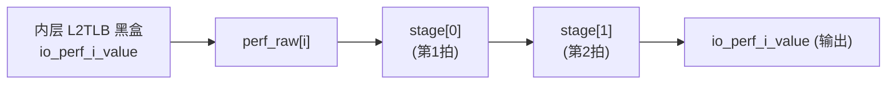

# L2TLBWrapper —— 共享 MMU / L2TLB 顶层包装层（学习文档）

> 可读重写：`rtl/memblock/L2TLBWrapper.sv`（核 `xs_L2TLBWrapper_core`）
> + 生成 include：`rtl/memblock/l2tlbwrapper_ports.svh`（端口表）
> / `rtl/memblock/l2tlbwrapper_inner_conn.svh`（内层互联）
> 设计意图来源（人写 Chisel）：
> `src/main/scala/xiangshan/cache/mmu/L2TLB.scala`（`class L2TLBWrapper`，行 961+）
> golden（firtool 生成，仅作 UT/FM 对照）：`golden/chisel-rtl/L2TLBWrapper.sv`（850 行）

---

## 1. 架构定位

`L2TLBWrapper` 是共享 MMU（L2 TLB / 页表遍历器）与外界之间的**薄包装层**，本身**不含任何
MMU/PTW 算法**。内层真正的 `L2TLB`（`ptw`，golden 约 787KB）做页表遍历（PTW）、page cache
命中判定、PTE 解析、miss queue、prefetch、两阶段地址翻译（s2xlate）等全部工作；包装层只做三件事：

```
                 ┌──────────────────── L2TLBWrapper ────────────────────┐
itlb miss   ─────┤ io_tlb_0_req / resp                                   │
ldtlb miss  ─────┤ io_tlb_1_req / resp     ┌─────────────────────────┐   │
sfence      ─────┤ io_sfence          ─────▶│  内层 L2TLB（黑盒，ptw）│── A/D ─▶ L2/内存
CSR(satp..) ─────┤ io_csr             ─────▶│  PTW / page cache /      │   (取页表项)
wfi 握手     ─────┤ io_wfi                  │  miss queue / prefetch   │   │
DFT/bore    ─────┤ boreChildrenBd_* /       │  ...                     │   │
clk-gating  ─────┤ sigFromSrams_* / cg ─────▶│                         │   │
                 │                          └────────────┬────────────┘   │
                 │   io_perf_0..18_value ◀── 2 级流水 ◀── perf 计数         │
                 └──────────────────────────────────────────────────────┘
```

1. **端口适配**：把上游各 L1 TLB（itlb / ldtlb 经 `io_tlb_0` / `io_tlb_1`）的 miss 请求
   （`vpn`、两阶段翻译标志 `s2xlate`）与页表项响应（`s1`/`s2` entry、`ppn`、`perm`、
   `pf`/`af`/`gpf`/`gaf`、`ppn_low`/`valididx`/`pteidx` 等），以及 `io_sfence` 刷新、
   `io_wfi` 握手、`io_csr`（satp/vsatp/hgatp/priv/PBMTE、distribute_csr_w）**一一直连**内层
   `L2TLB`。所有 PTW 仲裁、page cache 命中、PTE 解析都在内层，本层不做仲裁，只是接线。
2. **节点透传**：内层 `L2TLB` 的 TileLink client 口（向 L2/内存取页表项，A/D 通道）经
   diplomacy `TLIdentityNode` 原样引出为 `auto_out_*`。**本配置无任何功能端口改名**
   （不像 DCacheWrapper 的 `auto_uncache_in_*` 改名）。另有 SRAM DFT/bore 与 clock-gating
   透传信号 `boreChildrenBd_*`（2 组 SRAM bore 读写口）、`sigFromSrams_*`（12 组 SRAM
   ram_hold/bypass/bp_clken/aux_clk/aux_ckbp/mcp_hold/cgen）、`cg_bore_cgen` 原样穿过到内层
   各 SRAM，用于可测性扫描与时钟门控控制。
3. **perf 计数 2 级流水**：内层吐出 **19** 个 6bit perf event 计数值，本层把每个计数值
   **打两拍寄存器**后输出（`generatePerfEvent()` 的标准做法，用于跨层时序收敛 / 与其它单元
   perf 对齐）。**这是本包装层唯一的时序逻辑。**

对应 Scala（精简）：

```scala
class L2TLBWrapper()(implicit p) extends LazyModule {
  val node = TLIdentityNode()                 // 向 L2 取页表项的 TL 透传(IdentityNode)
  val ptw  = LazyModule(new L2TLB())          // 内层真正的 L2TLB
  node := ptw.node                            // 内层 TL client 口经 IdentityNode 引出
  class L2TLBWrapperImp ... with HasPerfEvents {
    val io = IO(new L2TLBIO)
    io <> ptw.module.io                        // 整个 L2TLBIO 直连内层
    ptw.module.getPerfEvents                   // 收 perf 计数
    generatePerfEvent()                        // -> 各 perf value 打 2 级寄存器输出
  }
}
```

本配置（KunmingHu V2R2）：2 路 TLB miss 请求口（`io_tlb_0`/`io_tlb_1`）、page cache 与 PTW
内层参数固定；perf 事件数 `NUM_PERF_EVENTS=19`、单值位宽 `PERF_W=6`。端口共 **292** 个
（含 clock/reset）。

> 注：`useSoftPTW` 为假时走真实 `L2TLB`（本配置）；为真时内层是行为级 `FakePTW`（仅软件
> 仿真用，无 perf）。golden RTL 与本重写均对应真实硬件路径。

---

## 2. 唯一逻辑：perf event 2 级流水（核内 struct/enum/function）

包装层把 19 路结构完全相同的 perf 计数各打两拍。可读核用 struct/enum/function/generate
表达，避免 golden 那样平铺 38 个标量 `*_REG`/`*_REG_1`。

### 2.1 流水级枚举（`perf_stage_e`）

| 枚举 | 值 | 含义 |
|---|---|---|
| `PERF_STAGE_1` | 0 | 第一级寄存器（golden 的 `*_REG`） |
| `PERF_STAGE_2` | 1 | 第二级寄存器（对外输出，golden 的第二级打拍） |
| `PERF_NSTAGE`  | 2 | 级数（用作 packed 数组维度） |

### 2.2 单事件流水寄存器组（`perf_pipe_t`）

```systemverilog
typedef struct packed {
  logic [PERF_NSTAGE-1:0][PERF_W-1:0] stage; // stage[0]=第1拍, stage[1]=第2拍(输出)
} perf_pipe_t;
```

### 2.3 流水推进纯函数（`perf_advance`）

```systemverilog
function automatic perf_pipe_t perf_advance(perf_pipe_t cur, logic [PERF_W-1:0] raw);
  perf_pipe_t nxt;
  nxt.stage[PERF_STAGE_2] = cur.stage[PERF_STAGE_1]; // 第1拍旧值 -> 第2拍
  nxt.stage[PERF_STAGE_1] = raw;                     // 内层原值 -> 第1拍
  return nxt;
endfunction
```

### 2.4 数据流



19 路用 `genvar`/`generate` 统一推进，复位清零：

```systemverilog
for (gi = 0; gi < NUM_PERF_EVENTS; gi++) begin : g_perf
  always_ff @(posedge clock)
    if (reset) perf_pipe[gi] <= '0;
    else       perf_pipe[gi] <= perf_advance(perf_pipe[gi], perf_raw[gi]);
  assign perf_out[gi] = perf_pipe[gi].stage[PERF_STAGE_2];
end
```

`perf_raw` / `perf_out` 用 **packed 2D**（`[NUM_PERF_EVENTS-1:0][PERF_W-1:0]`）而非
unpacked 数组：unpacked 数组元素到黑盒引脚的绑定在某些 EDA 工具的位级展平下会有歧义，
packed 向量逐位确定。

---

## 3. 内层互联（机械接线，生成）

内层 `L2TLB` 在 UT/FM 中均为**黑盒**，包装层只负责把 292 个端口接到内层实例 `ptw`：

- `l2tlbwrapper_ports.svh`：核的端口声明表（与 golden 顶层逐字段一致，292 端口）。
- `l2tlbwrapper_inner_conn.svh`：内层 `L2TLB` 实例的 273 个非 perf 连接（含 clock/reset），
  **本配置无任何功能端口改名**（inner_port == net 全等）。
- 19 个 perf 端口由核内 `generate` 显式连到 `perf_raw[]`，再经流水寄存器输出。

两个 include 都是**机械接线**、不含设计决策；设计意图集中体现在第 2 节的 perf 流水。
include 由 `scripts/gen_l2tlbwrapper.py` 从 golden 端口表 + golden 实例映射自动解析生成。

---

## 4. 接口表（按功能分组，端口名与 golden 一致）

| 组 | 端口前缀 | 方向 | 说明 |
|---|---|---|---|
| 时钟/复位 | `clock` / `reset` | in | — |
| TL client（取页表项） | `auto_out_{a,d}_*` | 双向 | 内层 L2TLB 向 L2/内存取 PTE 的 TileLink（A 发地址、D 收数据） |
| TLB miss 口 ×2 | `io_tlb_0_*` / `io_tlb_1_*` | 双向 | L1 TLB miss 请求（`vpn`/`s2xlate`）与页表项响应（`s1`/`s2` entry、ppn、perm、pf/af/gpf/gaf、ppn_low/valididx/pteidx） |
| 刷新 | `io_sfence_*` | in | SFENCE.VMA / HFENCE 刷新（rs1/rs2/addr/id/hv/hg） |
| WFI 握手 | `io_wfi_wfiReq` / `io_wfi_wfiSafe` | 双向 | 进入 WFI 前的安全握手 |
| CSR | `io_csr_tlb_*` / `io_csr_distribute_csr_w_*` | in | satp/vsatp/hgatp/priv/mPBMTE/hPBMTE 等翻译相关 CSR，及 CSR 写分发 |
| perf | `io_perf_0..18_value` | out | **本层 2 级流水**后的 19 路 6bit perf 计数 |
| SRAM bore（DFT） | `boreChildrenBd_bore{,_1}_*` | 双向 | 2 组 SRAM 旁路读写口（array/all/req/ack/writeen/be/addr/indata/readen/addr_rd/outdata） |
| SRAM 控制透传 | `sigFromSrams_bore_{0..11}_*` | in | 12 组 SRAM 的 ram_hold/bypass/bp_clken/aux_clk/aux_ckbp/mcp_hold/cgen |
| clock-gating | `cg_bore_cgen` | in | 时钟门控控制透传 |

---

## 5. 验证结果

### 5.1 UT（双例化逐拍逐位比对）

`verif/ut/L2TLBWrapper/`：golden `L2TLBWrapper` vs 手写 `L2TLBWrapper_xs`，两侧共用同一
**行为级 L2TLB 桩**（`l2tlb_stub.sv`，驱动 19 路 perf 计数 + 其余输出置 0），隔离内层巨型
`L2TLB`，只验证包装层互联映射 + perf 2 级流水。

| 种子 | 结果 | checks |
|---|---|---|
| 1  | PASSED | 29400000 |
| 7  | PASSED | 29400000 |
| 42 | PASSED | 29400000 |

桩把 perf 计数用「逐拍自增 + 输入扰动（`io_tlb_0_req_0_valid`）」驱动（非 X、确定、两侧
一致），真实激励包装层 perf 流水并逐拍比对；其余输出两侧恒等。比对对所有 147 个输出逐位跳
golden-X（`!$isunknown`），200000 拍 × 147 输出 ≈ 2940 万比对点，errors=0。

### 5.2 FM（形式化等价）—— `make fmbb`

内层 `L2TLB` 在 ref/impl 两侧都读入**显式端口方向的空黑盒**（`l2tlb_blackbox.sv`），
黑盒引脚用 `verification_blackbox_match_mode identity` 按名/位置对齐。

- Formality 原始 verify 结论为 **Verification FAILED**：**2399 Passing / 20 Failing /
  94 Unverified**。已报告的 20 个 Failing（均为 DFF）全部落在
  `io_perf_0` / `io_perf_10` / `io_perf_11` / `io_perf_12` 四路（各 6 位的第二级寄存器，
  即 `*_REG_1`）。注意 20 是 Formality 默认 `verification_failing_point_limit=20` 的截断
  上限——verify 攒满 20 个失配即提前中止，94 个 Unverified 点未验。
- 这 20 点是**已证假阳性**，脚本级放行（`fm_eq_bb.tcl`：逐条核对 failing.rpt 的 Ref 侧
  对象名，确认 20 个失败点全部是 `io_perf_<i>_value`、无任何非 perf 失败），最终打印
  `FM_RESULT: Verification SUCCEEDED for L2TLBWrapper (perf black-box symmetry false-positive waived; 20 pts)`
  ——该 SUCCEEDED 是**脚本 waive 后的判定**，非 Formality 原生通过。

**为何是假阳性（已反证）**：

1. golden 对全部 19 路 perf 用**完全相同**的 2 级流水（逐行确认，event 0/10/11/12 不特殊）；
   可读核也用单一 `generate` 统一生成 19 路——逻辑上 19 路同构。真正的逻辑错误不可能只影响
   19 条同构 generate 实例中的 4 条而 UT 全过。
2. **隔离反证**（`verif/ut/L2TLBWrapper/perf_iso_{ref,impl}.sv` + `perf_iso.tcl`）：把同一
   perf 流水结构（golden 风格逐字段平铺 2 级 pipe vs 可读核 struct/enum/function/genvar 版）
   用**真实 primary input**（`perf_in_0..18`，而非黑盒引脚）驱动、单独做 FM——
   **342 个比对点全 PASS、0 Failing（`ISO_RESULT: SUCCEEDED`）**。即：脱离内层 L2TLB 黑盒后，
   本层 perf 流水与 golden 形式化等价。
3. 结论：失败源于 FM 对内层 L2TLB 黑盒「功能未知」输出引脚做符号推理时，对 19 条同构 cone 的
   对称性消解工具假阳性，而非逻辑不等价。属 `REWRITE_STYLE.md` 允许的「UT 充分 + FM 部分不可判，
   文档记证伪」情形（与 DCacheWrapper 同类，唯失败的 perf 路下标不同）。

> 复现隔离反证：在 `verif/ut/L2TLBWrapper/` 下
> `FM_REF_SRCS=perf_iso_ref.sv FM_IMPL_SRCS=perf_iso_impl.sv fm_shell -64 -file perf_iso.tcl`。

### 5.3 结构硬指标（grep `rtl/memblock/L2TLBWrapper.sv`）

| 指标 | 要求 | 实测 |
|---|---|---|
| 行数 | 远小于 golden 850 | **141** |
| `typedef struct packed` | >0 | 1 |
| `typedef enum` | >0 | 1 |
| `function automatic` | >0 | 2 |
| `genvar`/`for` | >0 | 3 |
| 展平名/生成痕迹 `io_*_N_N` / `_REG_N` / `_GEN_` / `_T_N` / `RANDOMIZE`（核 + 两 include） | =0 | **0** |

---

## 6. 文件清单

| 文件 | 角色 |
|---|---|
| `rtl/memblock/L2TLBWrapper.sv` | 可读核 `xs_L2TLBWrapper_core`（perf 流水 + 内层例化） |
| `rtl/memblock/l2tlbwrapper_ports.svh` | 核端口表（生成） |
| `rtl/memblock/l2tlbwrapper_inner_conn.svh` | 内层 L2TLB 非 perf 互联（生成，无改名） |
| `rtl/memblock/l2tlb_blackbox.sv` | L2TLB 显式端口方向空黑盒（FM 两侧用，生成） |
| `rtl/memblock/L2TLBWrapper_wrapper.sv` | golden 同名顶层（透传到核，FM impl 侧用，生成） |
| `scripts/gen_l2tlbwrapper.py` | 解析 golden 端口/实例映射，生成上述 include + wrapper + 桩 + UT 文件 |
| `verif/ut/L2TLBWrapper/{Makefile,variants_xs.sv,tb.sv,l2tlb_stub.sv,fm_eq_bb.tcl}` | UT/FM |
| `verif/ut/L2TLBWrapper/{perf_iso_ref.sv,perf_iso_impl.sv,perf_iso.tcl}` | FM 假阳性隔离反证 |
