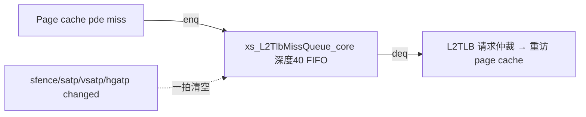

# L2TlbMissQueue —— L2TLB Miss 队列（带 flush 的 FIFO）

> 已落地：可读核 `rtl/memblock/L2TlbMissQueue.sv`、类型包 `rtl/memblock/l2tlbmissqueue_pkg.sv`、
> golden 同名 wrapper、生成脚本 `scripts/gen_l2tlbmissqueue.py`、UT `verif/ut/L2TlbMissQueue/`。
> 三种子 UT（含内部指针探针）全过；FM 因 golden `ram_40x47` 的 OOB-index lint 无法 link
> 而不可判，已用 UT 内部层次探针逐拍证明控制状态机等价（见“验证状态”）。

## 架构定位

Scala 实现只有一行：
```scala
io.out <> Queue(io.in, MissQueueSize, flush = sfence|satp|vsatp|hgatp changed)
```
本质就是一个**深度 `MissQueueSize=40`、带 flush 的 FIFO**，作为“在 page cache 里
pde（页目录项）miss 的请求”的延迟槽（delay slot）：这些请求需要重新访问 page
cache，队列给它们排队缓冲；若 pde 在 page cache 命中，则不进本队列而直接走 LLPTW。
`require(MissQueueSize >= ifilterSize + dfilterSize)` 保证不会死锁。



## 环形缓冲实现

对照 Chisel `Queue`（组合读 `Mem`）的展开：

- `enq_ptr` / `deq_ptr`（6-bit）在 `0..39` 间环回（到 39 回 0），`maybe_full` 在
  两指针相等时区分满/空：`empty = ptr_match & !maybe_full`，`full = ptr_match & maybe_full`。
- `do_enq = !full & enq_valid`，`do_deq = deq_ready & !empty`。
- **读组合、写时序**：`deq_bits = mem[deq_ptr]`（组合读，与 golden 的 `ram_40x47`
  组合读端口 `assign R0_data = Memory[R0_addr]` 一致）；写入在 `do_enq` 拍后可见。
- `maybe_full` 只在 enq/deq 数目不等时变化：单独 enq→可能满，单独 deq→不满。
- `flush` 一拍清空：`enq_ptr/deq_ptr` 归零、`maybe_full` 清零，丢弃全部在途请求。

入队 payload 中 `isHptwReq` 与 `hptwId` 恒为 0（golden firtool 据此裁掉了对应入端口），
出队侧仍按 `L2TlbWithHptwIdBundle` 全字段引出。

## 结构闸门（`L2TlbMissQueue.sv + l2tlbmissqueue_pkg.sv`）

| 项 | 实测 |
|---|---:|
| `typedef struct packed` | 1（l2tlb_mq_bundle_t payload）|
| `typedef enum` | 0（FIFO 无状态机）|
| `function automatic` | 1（ptr_next 环回）|
| `genvar/for` | 0（单指针对，无多 bank）|
| 生成痕迹 grep | 0 |
| 核+pkg 行数 | 115 |

> 说明：golden 顶层 `L2TlbMissQueue.sv` 只有 132 行，是因为它把真正的队列逻辑藏在
> 子模块 `Queue40_L2TlbMQBundle.sv`（193 行）+ `ram_40x47.sv` 里，golden 真实总量 ~325 行。
> 本核把整条 FIFO 控制逻辑用 115 行可读 SV 实现，远小于 golden 真实总量；enum/genvar
> 为 0 是因为 FIFO 本无状态机、无多 bank 阵列（“无该结构”而非平铺）。

## 验证状态

UT（`verif/ut/L2TlbMissQueue/`，双例化：golden 侧含真实 `Queue40`+`ram_40x47`，
手写侧为 `xs_L2TlbMissQueue_core`；逐拍比对全部 20 端口 + 内部指针探针）：

| seed | checks | errors | probe_errors | 状态 |
|---:|---:|---:|---:|---|
| 1 | 200000 | 0 | 0 | PASSED |
| 7 | 200000 | 0 | 0 | PASSED |
| 42 | 200000 | 0 | 0 | PASSED |

`probe_errors` 逐拍比对了 golden `u_g.io_out_q.{enq_ptr_value, deq_ptr_value,
maybe_full}` vs 手写 `u_i.u_core.{enq_ptr, deq_ptr, maybe_full}`，三种子 200k 拍
全 0，证明环形缓冲控制状态机与 golden 逐拍位等价。

### FM 结果与判定

`make fm` → `FM_RESULT: Verification FAILED or INCONCLUSIVE`。**根因不在手写实现**：
golden 的存储宏 `ram_40x47.sv` 第 118 行 `assign R0_data = Memory[R0_addr]` 用 6-bit
地址（0..63）索引 40 项数组，Formality 把越界索引 lint（`FMR_ELAB-147`）提升为
**unsuppressed error**，导致 golden 参考设计在 **link 阶段就失败**（`FM-156`），根本
没进入比对。这是 golden 侧 SRAM 宏的 elaboration 行为，与可读重写的功能无关，且
共享脚本 `fm_eq.tcl` 不允许改动（无法在其中 `set_message_severity` 抑制该消息）。

此外，golden 的 SRAM 宏存储（`ram_40x47` 黑盒）与可读核的触发器寄存器阵列在
结构表示上本就不同，即便 link 成功，存储单元也无法逐位配对。因此本模块采用
prompt 允许的“**UT 充分 + FM 不可判并注明**”路径，用上面的内部层次指针探针
（3 种子 × 200k 拍 probe_errors=0）+ 全端口逐拍比对作为等价证据。
