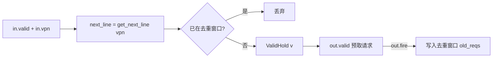

# L2TlbPrefetch —— L2TLB 顺序流预取器

> 已落地：可读核 `rtl/memblock/L2TlbPrefetch.sv`、类型包 `rtl/memblock/l2tlbprefetch_pkg.sv`、
> golden 同名 wrapper、生成脚本 `scripts/gen_l2tlbprefetch.py`、UT `verif/ut/L2TlbPrefetch/`。
> 三种子 UT 全过，FM `make fm` SUCCEEDED（纯叶子）。

## 架构定位

L2TlbPrefetch 是 L2TLB 前端一个极简的“下一行”页表预取器。每当上游送来一个被
访问的 VPN，它推测下一条 cacheline 的页表项也会很快被用到，于是生成一个指向
`next_line` 的预取请求注入 L2TLB 请求仲裁，提前把页表项拉进 page cache。

## 数据流与时序

- `next_line = get_next_line(vpn)`：VPN 去掉 sector 位（低 3 位）后 `+1`，再补回
  sector 位为 0，指向下一条 cacheline 的首个页表项。
- **去重 `already_have`**：`next_line` 与最近 `OLD_REC_N=4` 条记录中任一“有效且
  同行”的旧请求命中，则 `input_valid` 拉低、不产生新预取。用 `for` 遍历 4 条记录。
- **`v = ValidHold(input_valid, out.fire, flush)`**：预取请求一旦产生就保持 valid，
  直到被 L2TLB 接收（`out.fire`）或被 flush 冲掉。
- **记录窗口写入**：`out.fire` 时把 `next_req` 写到环形指针 `old_index` 指向的槽，
  指针轮转（到顶回 0）；`flush` 清空全部 `old_v`。

注意一个易错点：去重 `already_have` / `input_valid` 用**当拍组合** `next_line`，
而写入记录窗口和 `out.bits.vpn` 用的是 `next_req = RegEnable(next_line, in.valid)`
（打一拍后的版本）。

## s2xlate 模式选择

`MuxCase` 优先级（`allStage > onlyStage1 > onlyStage2 > noS2xlate`）：

| 条件 | s2xlate |
|---|---|
| virt && vsatp.mode≠0 && hgatp.mode≠0 | ALL_STAGE (3) |
| virt && vsatp.mode≠0 | ONLY_STAGE1 (1) |
| virt && hgatp.mode≠0 | ONLY_STAGE2 (2) |
| 其余 | NO_S2XLATE (0) |

预取请求的 `source` 恒为 `PREFETCH_ID = PtwWidth = 2`（golden firtool 据此把
`io_out_bits_req_info_source` 端口裁掉了，wrapper 仅在内部 struct 保留）。

## 结构闸门（`L2TlbPrefetch.sv + l2tlbprefetch_pkg.sv`）

| 项 | 实测 |
|---|---:|
| `typedef struct packed` | 1（l2tlb_req_info_t）|
| `typedef enum` | 0（无显式状态机，仅 ValidHold 保持位）|
| `function automatic` | 2（get_next_line / same_line）|
| `genvar/for` | 3（4 条去重记录窗口用 generate + for）|
| 生成痕迹 grep | 0 |
| 核+pkg 行数 | 180（golden 212）|

> 说明：本模块没有多状态 FSM，故 enum=0 是“无该结构”，不是平铺。golden 把
> `old_reqs_0..3` / `old_v_0..3` 展平成 8 个标量寄存器，本核用 `[OLD_REC_N-1:0]`
> 数组 + genvar/for 表达，去重逻辑用 for 归约，命名表意（`already_have`/`next_line`）。

## 验证状态

UT（逐拍比对全部 15 端口，偏置 in_vpn 小范围使去重窗口频繁命中）：

| seed | checks | errors | 状态 |
|---:|---:|---:|---|
| 1 | 200000 | 0 | PASSED |
| 7 | 200000 | 0 | PASSED |
| 42 | 200000 | 0 | PASSED |

FM：`make fm` → `FM_RESULT: Verification SUCCEEDED for L2TlbPrefetch`。
