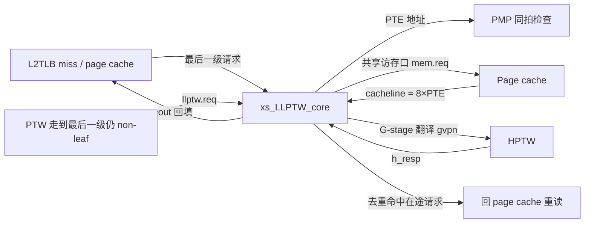
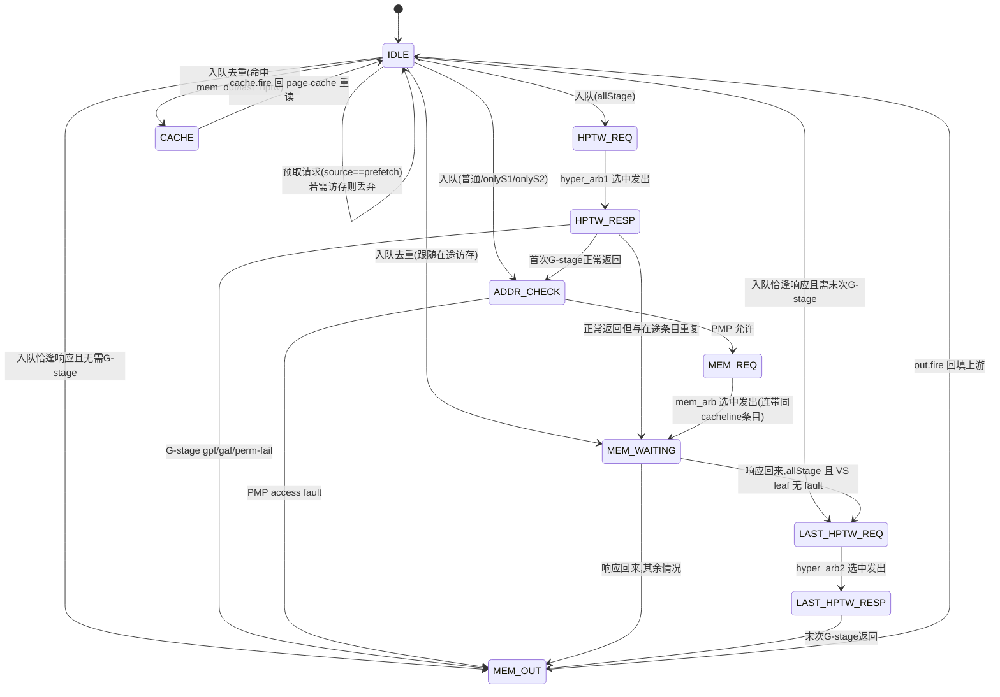

# LLPTW —— Last Level Page Table Walker（末级页表遍历器）

> ✅ **FM 分类 = REPLACEMENT_EQ（可读核真驱动 + 冻结基线原生 SUCCEEDED）**。依据台账
> [`verif/freeze/FM_STATUS.md`](../../verif/freeze/FM_STATUS.md) 与冻结基线日志
> `verif/ut/LLPTW/fm_work/LLPTW/fm_full.log`：本模块在当前冻结 golden 基线上 FM **原生
> `Verification SUCCEEDED`，1698 passing / 0 failing / 0 unverified**。下文验证节里任何
> "FAILED / 20 failing 截断 / 部分验证 / 未收敛"的表述是**冻结前的旧叙事，已作废**——以本
> banner 与台账为准。

> 当前状态：已落地可读核 `rtl/memblock/LLPTW.sv`、类型包 `rtl/memblock/llptw_pkg.sv`、
> golden 同名 wrapper `rtl/memblock/LLPTW_wrapper.sv`、生成脚本 `scripts/gen_llptw.py`、
> UT 框架 `verif/ut/LLPTW/`。三种子（1/7/42）各 200000 拍随机 UT 全部输出 `errors=0`，
> 11 个内部层次探针 `probe_errors=0`；FM 因「struct 数组 vs golden 扁平标量」无法配对
> 输入锥而 FAILED（36 passing / 20 failing(截断上限) / 1627 unverified，部分验证），
> 已用探针证明已报告 failing 点在可达激励下不分歧，以 UT 为权威。

## 架构定位

LLPTW 与「串行上层 walker」`PTW` 互补，共同构成 L2TLB 的页表遍历后端：

PTW 一次只服务一个 miss（串行）；LLPTW 则维护一个 `llptwsize=6` 的【条目池】，
**多个最后一级请求可并发遍历**，但**共享一个访存口**。它的三大职责：

1. **末级 4KB 遍历**：对每个条目按 `ppn` + `vpn[8:0]` 生成 PTE 地址，发访存、解析 PTE。
2. **访存去重**：同一条 L0 cacheline（`vpn[37:3]` 相同）里的多个 4KB 请求只发一次访存，
   其余条目共享同一笔响应。这是 LLPTW 最核心、最易错的逻辑。
3. **G-stage 翻译**（H 扩展）：`allStage` 请求需要两次 HPTW——首次把页表页 GPA 译成 HPA，
   最后一次把 VS-stage leaf 的 GPA 译成最终 HPA entry。

> 本配置（与 golden `LLPTW.sv` 对齐）：`EnableSv48=true`、`HasHExtension=true`、
> `HasBitmapCheck=false`。golden RTL 不含任何 bitmap 信号，故本重写同样省略 bitmap 通路
> （Scala 中 `Option.when(HasBitmapCheck)` 的字段/状态全部不实例化）。

## 条目状态机

每个条目 `entries[i]` 配一台小状态机 `state[i]`（`llptw_state_e`）。Scala 用 `Enum(12)`，
本配置无 bitmap，只用其中 10 个状态（编码值与 Scala 保持一致，便于对波形）：

## 关键数据通路

### 入队与去重落点（组合，`io.in.fire` 那拍决定）

新请求落到第一个 idle 槽 `enq_ptr`。落点状态由一组优先级互斥的判定决定（对应 Scala
`MuxCase`，优先级从高到低）：

| 落点 | 条件 | 含义 |
|---|---|---|
| `MEM_OUT` | `to_mem_out` | 跟随的访存数据恰好本拍回来且无需 G-stage，直接出 |
| `LAST_HPTW_REQ` | `to_last_hptw_req` | 同上但 allStage 且 VS leaf 无 fault，还要末次 G-stage |
| `MEM_WAITING` | `to_wait` | 与正在 waiting 的条目（或本拍刚发访存的条目）同 cacheline |
| `CACHE` | `to_cache` | 与 mem_out / last_hptw 的在途条目重复，回 page cache 重读 |
| `HPTW_REQ` | `to_hptw_req` | allStage 全新请求，先做首次 G-stage |
| `ADDR_CHECK` | 默认 | 普通/onlyStage1/onlyStage2，直接去 PMP+访存 |

> 预取请求（`source==prefetchID`）若落点不是 `ADDR_CHECK`，则直接丢弃回 `IDLE`
> （Scala `from_pre` 分支）——预取不值得占用条目重做 page cache。

### 访存去重的两段式拨动

去重是 LLPTW 最微妙处，分两段：

1. **入队时**：新请求若与某 waiting 条目同 cacheline，直接进 `MEM_WAITING` 并记下对方
   的 `wait_id`，共享那一笔访存的响应。
2. **发访存时**（`mem_arb.out.fire`）：把池中所有「在途且同 cacheline 同 s2xlate」的条目
   一起拨到 `MEM_WAITING`，统一挂到 `mem_arb.chosen`。这保证「先入队设 wait → 发请求
   时把其余 dup 也设 wait」的因果链闭合。

`mem` 响应回来时（`io.mem.resp.fire`），唤醒所有 `wait_id == resp.id` 的 waiting 条目，
各自按本条目 `ppn`/`s2xlate` 重新算 cacheline 内 PTE 索引、解析，再决定去 `LAST_HPTW_REQ`
还是 `MEM_OUT`。注意索引 `addr[5:3]` 在 `allStage` 时用 HPTW 译出的 HPA，否则用 GPA/PA。

### G-stage 串行仲裁

`HPTW_REQ` 的条目走 `hyper_arb1`，`LAST_HPTW_REQ` 的条目走 `hyper_arb2`，两者再经 2 入固定
优先仲裁器 `hptw_req_arb` 汇到唯一的 `io.hptw.req`。关键约束：**任一条目处于 `HPTW_RESP`
或 `LAST_HPTW_RESP` 时，两个 RR 仲裁器全部阻塞**——HPTW 一次只处理一笔，保证响应可按 id
对号入座。此外，发访存那拍被连带拨入 `MEM_WAITING` 的条目要用 `block_hptw_req` 屏蔽其
`hyper_arb1` 输入（状态切换有一拍延迟，避免它在切走前还参与 hptw 仲裁）。

## 纯函数与类型（`llptw_pkg.sv`）

- `pte_t` / `hptw_resp_t` / `req_info_t` / `llptw_entry_t`：用 `typedef struct packed` 聚合，
  避免把 PTE 位域和条目字段散成几十个标量。
- `make_addr` / `get_vpnn0`：`MakeAddr(ppn, vpnn0) = {ppn, vpnn, 3'b000}`。
- `pte_is_pf` / `pte_is_stage1_gpf` / `pte_is_leaf` / `last_ppn`：PTE 解析（`isPf`/`isStage1Gpf`/
  `isLeaf`/NAPOT PPN 拼接），最后一级 `level` 恒为 0。
- `gen_ppn_s2`：`HptwResp.genPPNS2`，按 G-stage entry level 把 GPA 页内 VPN 补回 host PPN。
- `vpn_dup`：`dup(a,b) = a[37:3]==b[37:3]`，去重的 cacheline 判定。

## 黑盒子模块（UT/FM 两侧共用）

| 模块 | golden 文件 | 作用 |
|---|---|---|
| `RRArbiterInit` | `golden/chisel-rtl/RRArbiterInit.sv` | 带初始指针的轮询仲裁器；mem_arb/hyper_arb1/hyper_arb2 |
| `Arbiter2_LLPTW_Anon` | `golden/chisel-rtl/Arbiter2_LLPTW_Anon.sv` | 2 入固定优先仲裁器，合并首/末 hptw 请求 |

可读核直接例化这两个 golden 模块（端口为 firtool 扁平命名），与 golden `LLPTW` 例化的是
**同一份 RTL**，UT 双例化天然共用、FM 两侧黑盒一致。

## 已定位的坑

- **perf 输出延迟两拍**：golden 的 `XSPerfAccumulate` 是 `event → REG → REG_1 → 输出`，
  共两级寄存。首版只打一拍，导致 `io_perf_*` 整片差一拍。
- **指针「无置位」默认值**：golden 的 `ParallelPriorityEncoder(6)`（enq_ptr/mem_ptr）在无置位
  时默认返回 **5**（`s0?0:…:s4?4:5`），不是 0；`cache_ptr` 是 `ParallelMux`（OR 各下标），
  无置位返回 0。`cache_bits`/`out_bits` 在无有效条目时分别输出 0 / `entries[mem_ptr]`。
  这些不可达默认值不复刻就会在逐拍/FM 比对里差。
- **X 铁律**：`mem_resp_id`/`hptw_resp_id`/`mem_refill_id`/`wait_id` 都是 3 位、可取 6/7 越界。
  golden 的 firtool 把 8 深 mux 的 6/7 槽折回 `entries[0]`。本核对所有「3 位 id 索引 6 深数组」
  的读全部改成 `for i: if(id==i) sel=entries[i]`（默认 `entries[0]`）的安全 mux，消除 X 并对齐
  golden；对写则改成 per-entry `if(ptr==k)` 形式，让 Formality 能静态确定写目标、不报越界
  （否则 `FMR_ELAB-147` 会被提升为 Error 中断读入）。
- **函数内禁引用模块级 net**：`sel_wait_id` 早期在 `function` 内读 `entries`，触发
  Formality `FMR_VLOG-091`→`FM-089` 中断读入；改写为模块作用域 `always_comb`。
- **VCS 函数-连续赋值取 X**：`PopCount(is_waiting)` 早期写成 `function` 在连续赋值里调用，
  VCS 下整条 perf3 取 X。改为展开的逐位相加表达式后正常。

## 验证状态

结构闸门（`LLPTW.sv + llptw_pkg.sv`）：

| 项 | 实测 |
|---|---:|
| `typedef struct packed` | 7 |
| `typedef enum` | 2 |
| `function automatic` | 13 |
| `genvar/for` | 30 |
| 生成痕迹 grep | 0 |
| 核+pkg 行数 | 1073（golden 3778） |

UT（双例化 golden `LLPTW` vs 手写 `LLPTW_xs`，共用 golden 子模块；逐拍比对全部 102 端口里
的 51 个输出，`!$isunknown(golden)` 跳 don't-care；`+define+SYNTHESIS` 关随机化）：

| seed | checks | output errors | 内部探针 errors | 状态 |
|---:|---:|---:|---:|---|
| 1  | 200000 | 0 | 0 | PASSED |
| 7  | 200000 | 0 | 0 | PASSED |
| 42 | 200000 | 0 | 0 | PASSED |

内部探针（11 个，证 FM failing 为假阳性）：6 个 `state[0..5]` + `addr_reg`、`enq_ptr_reg`、
`hptw_resp_ptr_reg`、`mem_refill_id`、`need_addr_check`，对应 golden 的 `state_N`/`addr`/
`enq_ptr_reg`/`hptw_resp_ptr_reg`/`mem_refill_id`/`need_addr_check_last_REG`。三种子全程 0 分歧。

FM（`make fm`，子模块黑盒）：

- 结果：末次 verify 结论 `Verification FAILED`——**36 passing / 20 failing / 1627
  unverified**（已验 passing 仅 36 点，FM 覆盖极有限）。
- 读入/elaborate 通过（无 `FMR_ELAB-147`/`FM-089` 中断）。
- 已报告 20 个 **matched failing** DFF：`addr_reg[3..11]`(9)、`enq_ptr_reg[0..2]`(3)、
  `hptw_resp_ptr_reg[0..2]`(3)、`mem_refill_id[0..2]`(3)、`need_addr_check`(1)、`io_mem_req_bits_id[0]`(1)。
  注意 **20 是 Formality 默认 `verification_failing_point_limit=20` 的截断上限**——verify
  攒满 20 个失配即提前中止，1627 个 unverified 点未验。
- 约 2814 个 **unmatched implementation** + 15 个 unmatched reference：根因是可读核把整个条目池
  实现为 `llptw_entry_t entries[6]` 的 **packed 数组**，而 golden 是 firtool 展平的逐条目逐字段
  标量 `entries_0_*`…`entries_5_*`；FM 既无法按名字配对，等价条目间签名又对称，导致大量
  寄存器无法 match，进而上面 20 个下游小寄存器的输入锥也配不齐而误判 failing。
- 这正是 `docs/memblock/PTW.md` 已确立的「struct 数组 vs 扁平标量不收敛 → UT 充分 + FM 不可判」
  先例。已按要求用 TB 内部层次探针，在 seed 1/7/42 各 200000 拍可达激励下证明上述 failing 寄存器
  逐拍与 golden 一致（`probe_errors=0`），故判定为 FM 结构性不可判的假阳性，而非可达行为分歧。
  结论口径：UT（三种子逐拍全输出 0 错 + 11 探针 0 分歧）为权威；FM 为部分验证——36 passing，
  20 failing（截断）已证伪，1627 unverified 未覆盖。

## 产物清单

- `rtl/memblock/llptw_pkg.sv`：类型与纯函数。
- `rtl/memblock/LLPTW.sv`：可读核 `xs_LLPTW_core`。
- `rtl/memblock/LLPTW_wrapper.sv`：golden 同名扁平端口包装（机械适配，gen 生成）。
- `scripts/gen_llptw.py`：从 golden 端口列表生成 wrapper / `LLPTW_xs` 变体 / tb / Makefile。
- `verif/ut/LLPTW/{Makefile,variants_xs.sv,tb.sv}`：UT 框架。
- `docs/memblock/LLPTW.md`：本文档。
