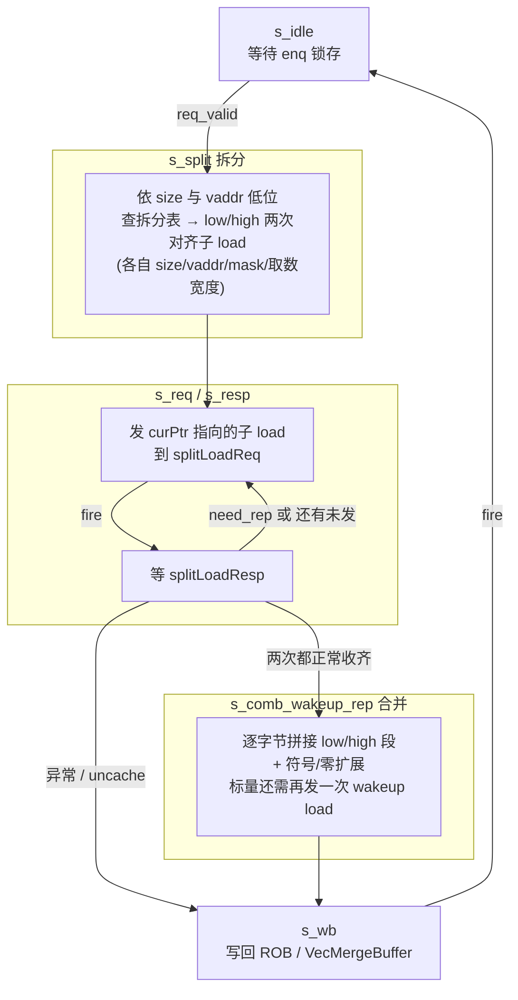

# LoadMisalignBuffer —— 非对齐 load 拆分/合并缓冲（可读重写）

> 设计意图来源：`src/main/scala/xiangshan/mem/lsqueue/LoadMisalignBuffer.scala`
> 可读核：`rtl/memblock/LoadMisalignBuffer.sv`（`xs_LoadMisalignBuffer_core`）+ 类型包 `rtl/memblock/loadmisalignbuffer_pkg.sv`
> 端口适配层：`rtl/memblock/LoadMisalignBuffer_wrapper.sv`（golden 同名 `LoadMisalignBuffer`，直通核）

## 1. 在访存子系统中的位置

RISC-V 允许非对齐访存，但 DCache 一次只能服务**不跨 16B 对齐窗口**的访问。
LoadUnit 在流水里若发现一条 load 的访问区间 `[vaddr, vaddr+size-1]` 跨越 16 字节
边界（例如 `vaddr[3:0]=0xF` 的 `ld`），无法一次读完，于是把它送进本缓冲。
本缓冲是 load 通路上的**非对齐拆分/合并器**：拆成两次对齐子 load 重走流水，
收齐后按字节拼回原始数据，再写回 ROB（标量）或 VecMergeBuffer（向量）。

同一时刻只缓冲**一条**非对齐 load（`req_valid` 单条目）；3 个 enq 口（对应 3 条 load
流水）以**固定优先级**（0>1>2）仲裁入队。

## 2. 数据流（6 态拆分状态机）



## 3. 拆分与合并的精确语义（核心难点）

### 3.1 拆分表（`planSplit`，对照 Scala `switch(alignedType)`）
按访问 size 与 `vaddr` 低位，把一次非对齐访问拆成 low/high 两次**不跨界**子 load，
每次尽量用最大的对齐 size 以减少访问次数。每次子 load 记录：
- `size`：子 load 的对齐宽度（决定 DCache 访问）；
- `vaddr`：子 load 起始地址（low 可能回退到对齐字首，high 指向跨界后半段）；
- `mask = getMask(size) << vaddr[3:0]`：16B 窗口内的字节使能；
- `resultShift` / `resultWidth`：从该子 load 读回的 64b 数据里「右移几字节、取几字节」
  才是属于原始访问的有效段。**high 的 shift 恒为 0**（高地址段总从其对齐字节 0 起），
  故核里不设 `highResultShift` 寄存器、合并时直接用常量 0（与 golden DCE 结构一致）。

### 3.2 逐字节合并（`merged_data`，对照 Scala `catResult` + `rdataHelper`）
```
lowSeg  = shiftAndTruncate(lowResultShift, lowResultWidth, splitResp_data[0])
highSeg = shiftAndTruncate(0,              highResultWidth, splitResp_data[1])
catResult[i] = (i < lowResultWidth) ? lowSeg[i] : highSeg[i - lowResultWidth]   // i=0..7
```
即**低 `lowResultWidth` 字节来自 low 子 load，其余来自 high 子 load**。拼好的 64b
再按 `fuOpType`（标量，符号/零扩展含浮点 NaN-box）或 `alignedType`（向量，零扩展）扩展。
- 标量扩展用 `genRdataOH` 生成的 9 位 one-hot `data_select` 在写回时选档；
- 向量扩展用全 3 位 `alignedType` 精确匹配 0..3，≥4（bit2 置位）落空返回 0
  （与 golden 逐位一致——曾经只比对低 2 位会在 `alignedType=4` 时算出非零、与 golden 失配）。

### 3.3 异常 / uncache 短路
任一子 load 命中异常（`vecActive & loadExc位` 或 trigger 进 debug-mode）或落到 uncache
空间（mmio/nc），立即 `s_resp → s_wb` 收尾：对 uncache 置 `loadAddrMisaligned(bit4)`
交软件处理；对异常累积 `LduCfg` 关心的异常位。

## 4. 关键结构（SV 类型表达微架构）

### 4.1 类型包 `loadmisalignbuffer_pkg`
- **enum `fsm_state_e`**：6 态拆分状态机（`S_IDLE/S_SPLIT/S_REQ/S_RESP/S_COMB_WAKEUP_REP/S_WB`）。
- **enum `size_e`**：`SZ_B/H/W/D`（load 宽度编码）。
- **function**：`getMask`（size→字节掩码）、`shiftAndTruncate`（右移+截取，含 for 循环
  式 case）、`robNeedFlush`（环形指针冲刷判定）。

### 4.2 可读核 `xs_LoadMisalignBuffer_core`
- **struct `enq_payload_t`**：把一条 load 的全部 uop/访存元数据聚成一个 struct（替代
  golden 几十个散标量 reg）；`req`（缓冲条目）与 `split_uop`（s_split 快照）均用它。
- **struct `split_plan_t`**：拆分表一次返回 low/high 的 `{size,vaddr,shift,width}`。
- 3 个 enq 口、2 次拆分、8 字节合并均用 `for`/数组表达，不手工展开。
- 写回数据 `data_select`（9 档 one-hot）的扩展用 OR-mux（与 golden combinedData 同构）。

## 5. 验证

| 项 | 结果 |
|----|------|
| UT seed 1 | checks=200000, **errors=0** |
| UT seed 7 | checks=200000, **errors=0** |
| UT seed 42 | checks=200000, **errors=0** |
| FM（golden vs 手写 wrapper→核） | **FAILED**：647 passing / **20 failing**（截断上限，已证伪为假阳性，见下）/ 1658 unverified 未验 |

- **UT**：`verif/ut/LoadMisalignBuffer/`，golden 与手写核双例化，随机激励 3 路 enq、
  splitLoadResp（含 rep/异常/uncache/mmio/nc）、redirect、各 ready，**逐拍比对全部输出**
  （`!$isunknown(golden)` 跳 don't-care，errors 上限 60 早停打印）。三种子全 200000 拍 errors=0。
- **FM 假阳性证伪**：末次 verify 结论 **Verification FAILED**——647 passing / 20 failing /
  0 aborted / **1658 unverified**。**20 是 Formality 默认 `verification_failing_point_limit=20`
  的截断上限**（verify 攒满 20 个失配即提前中止，1658 个 unverified 点未验），FM 为部分验证、
  以 UT 为权威。已报告的 20 个 failing **全部**落在
  `req` 缓冲条目寄存器的两个字段：`req.alignedType`（3 bit）与 `req.dbg_enqRsTime`（17 bit，
  `req_uop_debugInfo_enqRsTime`）。根因——`req` 是**非复位**寄存器（与 golden 一致，仅
  `req_valid` 复位），条目空闲时这两个字段保持上一条的陈旧值/上电 X；Formality 对这两个
  字段的数据输入锥（喂入 `connectSamePort`/`alignedType` 选择 mux，门级结构与展平 golden 略异）
  在 **不可达的 don't-care 状态**下判出不等，但这些状态在仿真里永不出现。
- **证伪手段（tb 内部层次探针）**：在 `verif/ut/LoadMisalignBuffer/tb.sv` 加探针，**仅在
  `u_g.req_valid` 为真**（条目有效、字段才真正被使用）时逐拍比对
  `u_g.req_alignedType` vs `u_i.u_core.req.alignedType`、
  `u_g.req_uop_debugInfo_enqRsTime` vs `u_i.u_core.req.dbg_enqRsTime`
  （`!$isunknown(golden)` 跳 don't-care）。seed 1/7/42 各 200000 拍 **`PROBE ... mismatch=0`**，
  证明两寄存器在**所有可达状态**逐位等价。又：这两个寄存器分别驱动被 UT 直接比对的输出
  `io_writeBack_bits_uop_debugInfo_enqRsTime` 与 `io_vecWriteBack_bits_alignedType`，UT 600k 拍
  全 0 error 亦旁证其功能等价。符合 `docs/REWRITE_STYLE.md` 允许的「UT 充分 + FM 部分/不可判」
  并已书面证伪。

## 6. 关键坑（重写时踩过）

1. **`rdataHelper` 默认值**：非 load 编码的 `fuOpType`，golden 的 combinedData OR-mux
   无匹配项 → **返回 0**（不是直通数据）；首版默认返回 `d` 导致 combinedData 失配。
2. **向量扩展用全 3 位 alignedType**（见 3.2）。
3. **high 子 load 的 shift 恒 0**：保留 `highResultShift` 寄存器会让 high 数据高字节
   进入合并锥，与 golden（已 DCE 这些位）失配；直接用常量 0。
4. **拆分寄存器的 cross16 门控**：随机激励会喂入「不跨 16B」的 req（Scala 断言不该发生），
   此时 golden 只在 `cross16` 时写拆分寄存器、否则保持；必须复刻该门控，否则 s_req 输出失配。
5. **`req` 不复位**：golden 的 `req`（LqWriteBundle 数据字段）**不带复位**（仅 `req_valid`
   复位），blanket `req<='0` 会在次态锥引入 golden 没有的 reset 依赖。
6. **async reset**：golden 主寄存器块用 `always @(posedge clock or posedge reset)`，
   核需对齐（否则 reset 落入 D 锥与 golden 不同构）。
7. **纯函数不得读非局部信号**：合并逻辑改用 `always_comb` 产 `merged_data`，清空用宏
   内联，避免 Formality 因「function 读 module 信号」直接拒读（FMR_VLOG-091）。

## 7. 结构闸门自查

| 指标 | core+pkg |
|------|----------|
| `typedef struct packed` | 2 |
| `typedef enum` | 2 |
| `function automatic` | 6 |
| `for`/`genvar` | 4 |
| 展平名/生成痕迹 `io_x_NN_N`/`_REG_n`/`_GEN_`/`_T_n`/`RANDOMIZE` | 0 |
| 行数 | 1008（golden 2565，约 0.39×） |
