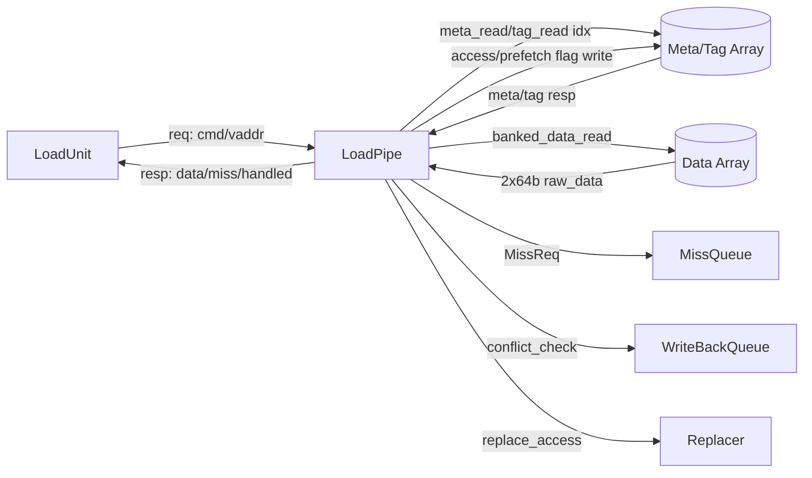
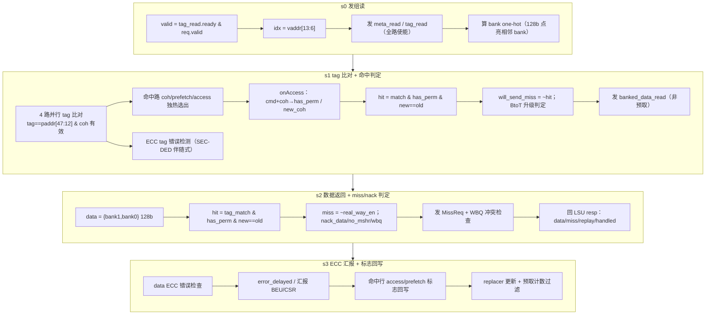

# LoadPipe —— DCache load 访问流水（可读重写）

> 设计意图来源：`src/main/scala/xiangshan/cache/dcache/loadpipe/LoadPipe.scala`
> 可读核：`rtl/memblock/LoadPipe.sv`（`xs_LoadPipe_core`）+ 类型包 `rtl/memblock/loadpipe_pkg.sv`
> 端口适配层：`rtl/memblock/LoadPipe_wrapper.sv`（golden 同名 `LoadPipe`，直通核）

## 1. 在访存子系统中的位置

LoadPipe 是 **DCache 内部的 load 访问流水线**（DCache 例化两条：`stu_0/ldu` 对应 LoadUnit）。
它接收 LSU（LoadUnit）发来的访存请求，**只读地探测 DCache**：读 tag/meta/data array，
做 tag 比对与一致性权限判定，命中则把数据回给 LSU，缺失则向 **MissQueue** 发缺失请求
（`MissReq`）并向 **WBQ**（写回队列）发冲突检查。它不搬运/写入 cache 数据，是与
`StorePipe`（store 探测流水）对称的只读流水。

## 2. 数据流（四级流水 s0~s3）

## 3. 本顶层配置的关键裁剪（golden 已固化，须对齐）

golden RTL 经 firtool 在本顶层参数下裁剪，可读核据此对齐（**这是按设计意图重写时
必须尊重的配置事实，不是抄 golden 命名**）：

1. **WPU 关闭（`dwpuParam.enWPU = false`）**：无 way-predict-unit，`s2_wpu_pred_fail`
   恒 0。因此 `s1_pred_way_en == s1_real_way_en`，`banked_data_read.way_en` 直接用真实
   命中独热；`io.dwpu.*` / `io_lsu_s2_wpu_pred_fail` / `debug_s2_pred_way_num` 等端口被裁。
2. **`io.nack` 恒 0**：s0 不会被 nack，故无 `s1_nack` / `s2_nack_hit`，`io_lsu_req_ready`
   退化为 `io_tag_read_ready`。
3. **meta_read 恒 ready**：源码有 `assert(RegNext(io.meta_read.ready))`，本配置 meta array
   永远可读，故 ready 链里只剩 `tag_read.ready`。
4. **流水永不阻塞**：`s1_ready = s2_ready = 1`（源码末 `assert(RegNext(s1_ready && s2_ready))`），
   各级只靠 `valid` 与 `s1_kill/s2_kill` 推进，无背压。

## 4. 关键结构（用 SV 类型表达微架构）

### 4.1 一致性权限模型 `onAccess`（`loadpipe_pkg`）

香山 DCache 沿用 TileLink 的 `ClientMetadata`，每行有 2 位 coh 状态：

| 状态 | 编码 | 含义 |
|------|------|------|
| `COH_NOTHING` | 0 | 无副本（缺失） |
| `COH_BRANCH`  | 1 | 共享只读（S） |
| `COH_TRUNK`   | 2 | 独占可写（E） |
| `COH_DIRTY`   | 3 | 独占已改（M） |

命中判定的核心是 `onAccess(cmd)`：根据本次访问命令与当前 coh，得出
`(has_permission, new_hit_coh)`。可读核把它分解为三个纯函数（等价 golden 的 `_r_T`/`_GEN_17`）：

- `cmd_is_write` / `cmd_is_read_or_write`：把 5 位 cmd 归约成两位「写 / 读或写」。
- `grow_index = {is_write, is_read_or_write, coh}`：拼成 4 位查表索引。
- `grow_new_coh(idx)`：查 16 项 growPermissions 表，得访问后目标 coh。
- `has_permission(idx)`：当前状态是否已满足本次访问（无需向 L2 申请）。

**命中条件**：`hit = tag_match && has_permission && (new_coh == old_coh)`。
当 `new_coh==Trunk` 而 `~has_permission` 且 tag 命中时，是一次 **BtoT（Branch→Trunk）升级**，
需占位 + 向 MissQueue 发升级请求（`io_miss_req_bits_isBtoT`）。

### 4.2 流水级寄存器 struct

- `meta_t` / `extra_meta_t`：把 golden 展平的 `io_meta_resp_i_coh_state` /
  `io_extra_meta_resp_i_{error,prefetch,access}` 聚成单路条目，4 路用 `[N_WAYS-1:0]` 数组 +
  `genvar` 并行比对。
- `s1_req_t` / `s2_req_t`：各级流水寄存的请求上下文（cmd/vaddr/instrtype/load128 等）。

### 4.3 关键纯函数

- `ecc_tag_error`：tag 的 SEC-DED 伴随式校验（6 位 syndrome 异或归约）。
- `oh_to_way`：way 独热 → 2 位 way 号（OHToUInt）。

## 5. 地址切片（与 golden 一致）

| 量 | 来源 | 物理含义 |
|----|------|----------|
| set 索引 `idx` | `vaddr[13:6]` | 256 组 |
| 物理 `tag` | `paddr[47:12]` | 36 位 |
| `bank` 选择 | `vaddr[5:3]` | 8 bank |
| 行基址 | `{paddr[47:6], 6'h0}` | 64B 对齐 |

## 6. 接口要点

- **请求**：`io_lsu_req_*`（cmd/vaddr/instrtype/lqIdx/isFirstIssue/load128）。
- **数组读**：`io_meta_read_* / io_tag_read_* / io_banked_data_read_*`，
  resp 为 `io_meta_resp_i_* / io_tag_resp_i / io_banked_data_resp_i_raw_data`。
- **响应**：`io_lsu_resp_*`（data / miss / handled / mshr_id / meta_prefetch /
  error_delayed / data_delayed）、`io_lsu_s2_bank_conflict / io_lsu_s2_mq_nack`。
- **缺失/冲突**：`io_miss_req_*`（含 isBtoT/occupy_way/cancel）、`io_wbq_conflict_check_*`、
  `io_miss_resp_*`、`io_wbq_block_miss_req`、`io_occupy_set/io_occupy_fail`。
- **错误/预取/计数**：`io_error_*`、`io_prefetch_info_*`、`io_bloom_filter_query_*`、
  `io_counter_filter_*`、`io_access_flag_write_* / io_prefetch_flag_write_*`、
  `io_replace_access_*`、`io_perf_*`。

## 7. 验证结果

- **结构闸门**：`typedef struct packed` ×4、`typedef enum` ×1（`coh_e`）、
  `function automatic` ×7、`genvar`/`for` ×7；生成痕迹 grep（`io_x_n_n`/`_REG_n`/`_GEN_`/
  `_T_n`/`RANDOMIZE`）= **0**；核主体 461 行 vs golden 779 行。
- **UT**（`verif/ut/LoadPipe/`，golden `LoadPipe` vs `LoadPipe_xs` 双例化逐拍比对全部
  72 个输出，跳过 golden 为 X 的不可达态）：seed 1 / 7 / 42 各 **200000 checks，errors=0**。
  激励要点：tag_resp/paddr 的 tag 区压窄到 ~2 位随机以提高 4 路命中概率（覆盖
  hit/coh/BtoT 分支）；cmd 覆盖 load/PFR/PFW 与写类；偶发 kill / bank 冲突 / mshr 满。
- **FM**（`make fm`）：**SUCCEEDED**。1225 个比较点全部等价（745 by name + 480 by
  signature）。

## 8. 重写过程中的关键坑

1. **growPermissions 表（`_GEN_17`）索引顺序**：firtool 的 `{...}` 拼接里第一项是 MSB
   （索引 15），首版按从前到后误当索引 0..15，导致 `grow_new_coh` 错位（读命中被判 miss）。
   正确表见 §4.1，逐项对齐 golden 后 UT 立即归零。
2. **多路同 tag 时取 OR 而非优先选**：UT 随机激励会让多路 `tag_match` 同时为 1
   （golden 用 `assert PopCount<=1` 但 SYNTHESIS 下关断），命中 coh 选择须与 golden 一样
   **独热 OR**（`s1_hit_coh |= meta[w].coh`），用优先选会与 golden 不一致。
3. **`s3_valid` 无复位**：golden 把 `s3_valid` 放在无复位的 `always @(posedge clock)`，
   首版给它加了 `posedge reset` 复位导致 FM 在 `s3_valid_reg` 一个比较点失败。去掉复位
   后 FM 全过——这是寄存器集对齐的细节（s3 不参与流水启停，无需复位）。
