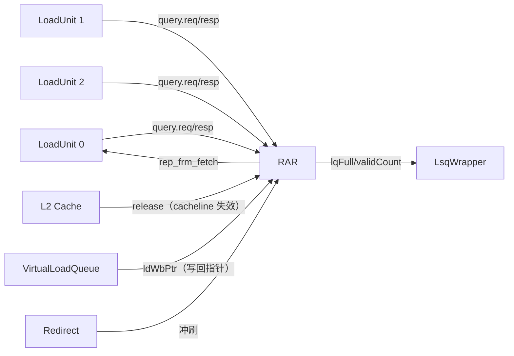

# LoadQueueRAR —— Load-Load (RAR) 违例检测队列

> 可读重写学习文档。设计意图源：
> `src/main/scala/xiangshan/mem/lsqueue/LoadQueueRAR.scala`（队列控制）、
> `FreeList.scala`（空闲槽管理）、`LoadQueueData.scala`（LqPAddrModule，paddr CAM）。
> 可读核：`rtl/memblock/LoadQueueRAR.sv`（`xs_LoadQueueRAR_core`）+ `loadqueuerar_pkg.sv`。

---

## 1. 它在访存子系统中的位置与作用

香山是乱序核，允许同一物理地址上的多条 load **乱序执行**。RVWMO 内存模型对“同地址
两条 load”有一致性约束：如果在两条同地址 load 之间，**别的核**写了这条 cacheline（通过 L2
向本核 DCache 发 `release`/probe 使其失效），那么“较老 load 拿旧值、较新 load 先执行拿到
更新后又被失效的值”这种乱序结果是**非法**的——它会让本核观察到的写顺序与全局不一致。

`LoadQueueRAR`（RAR = Read-After-Read）就是检测这种违例的硬件结构。它维护所有
**“已经在 DCache 命中拿到数据、但还没提交（retire）”** 的 load。每条新执行的 load 在
load_s2 阶段向本队列发一次 CAM 查询；命中违例条件时，让这条 load **从取指阶段重新执行**
（`resp.rep_frm_fetch`），把错误的乱序结果 squash 掉。



- **query**（3 个，对应 3 条 load 流水）：既是**入队口**（把“已完成未提交”的 load 登记进队列），
  也是**查询口**（对当前 load 做违例 CAM）。
- **release**：L2 通知某 cacheline 已被别的核写/失效。
- **ldWbPtr**：来自 VirtualLoadQueue 的写回指针，指示“到此为止的 load 都已写回”，
  用于把已出队的条目从本队列回收。
- **redirect**：分支误预测/异常冲刷，撤销比 redirect 更年轻的条目。

---

## 2. 队列条目字段

`LoadQueueRARSize = 72` 个条目，每条目（`rar_entry_t`）：

| 字段        | 含义                                                               |
|-------------|--------------------------------------------------------------------|
| `allocated` | 该 entry 是否有效（占用）。                                          |
| `robIdx`    | 关联 uop 的 robIdx，用来判**年龄**（谁更年轻）与冲刷。               |
| `lqIdx`     | 关联 uop 的 lqIdx，用来判“是否已被 `ldWbPtr` 越过”从而可出队回收。   |
| `released`  | 该条目的 cacheline 已被 release（失效过），或是 NC。命中此即可能违例。|
| `ppaddr`    | 物理地址的 **16-bit 哈希**（PartialPAddr），CAM 匹配键。             |

> 为什么存哈希而非完整 paddr？CAM 要对 72 条目并行比较，存 16-bit 哈希（异或折叠 48-bit
> paddr）省掉大量 CAM 位宽。哈希可能别名（两个不同 cacheline 撞同一哈希）——这只会让违例
> 判定**偏保守**（多 squash 几次），不影响正确性。哈希函数 `gen_partial_paddr` 与 Scala
> `genPartialPAddr` 逐位一致：高 11 位各折叠 4 个 paddr 位、低 5 位各折叠 2 个。

---

## 3. 三个数据流（入队 / 查询 / 失效）与时序

```mermaid
flowchart TD
  subgraph 拍T[拍 T：query.req]
    NE[needEnqueue = req.valid & isAfter(lqIdx,ldWbPtr) & !flush]
    AL[freelist 分配 entry index]
    WR[写 allocated/uop/ppaddr/released]
    CAM[对 req.paddr 做 CAM → matchMaskReg]
  end
  subgraph 拍T1[拍 T+1：query.resp]
    RV[resp.valid = RegNext(req.valid)]
    MM[matchMask = RegNext(matchMaskReg)]
    REP[rep_frm_fetch = |matchMask]
  end
  NE --> AL --> WR
  WR --> CAM --> MM --> REP
  RV --> REP
```

### 3.1 入队（query.req，load_s2）
`needEnqueue(w) = req.valid(w) & isAfter(lqIdx, ldWbPtr) & !needFlush(redirect)`：
该 load 仍“未完成”（lqIdx 比写回指针年轻）、且没被冲刷时才入队。FreeList 为最多 3 个口
各分配一个空闲 entry（`allocateSlot`）；`ready = needEnqueue ? canAllocate : 1`。
接受（`acceptedVec`）的口把 `allocated:=1`、写入 uop/ppaddr，并算入队 `released` 初值。

**入队 released 初值**（`released_cause_e` 分类）：
- NC（non-cacheable）→ 恒置 released（NC 不会被显式 release，约定直接视为失效、永不参与 RAR）；
- 否则若 `data_valid` 且本条 cacheline **整 [47:6] 地址**等于 `release1Cycle`/`release2Cycle`
  的 paddr → 置 released（说明刚拿到的数据其实已被失效）。
  注意这里用**完整 cacheline 地址**比较（不是哈希），因为入队时机精确可用真地址。

### 3.2 查询（query.resp，比入队晚 1 拍）
对每条目算 `matchMaskReg(i) = allocated(i) & camHit(i) & isAfter(entry.robIdx, req.robIdx) & released(i)`：
- `camHit`：req.paddr 哈希 == entry.ppaddr（同 cacheline 别名）；
- `isAfter(entry.robIdx, req.robIdx)`：该条目比当前 load **更年轻**（“后面的 load 先跑了”）；
- `released`：该条目失效过。
打 1 拍得 `matchMask`，`rep_frm_fetch = |matchMask`，`resp.valid = RegNext(req.valid)`。
任一条目命中即让当前 load 从取指重放。

### 3.3 release 失效更新
`release` 有两个时间版本（关键时序）：
- `release1Cycle` = 当拍 `io.release`（组合直通）；
- `release2Cycle.valid` = `io.release.valid` **延 2 拍**（golden 生成 RTL 实测是两级 RegNext），
  `release2Cycle.bits` = 按 `release.valid` 使能锁存的 paddr（单级 RegEnable）。

> 为什么要延迟版？paddr 写进 paddrModule 需要 1 拍才在 CAM 中可见。延迟的 release 让
> “本拍刚入队、还看不到自己 ppaddr”的条目，在随后拍仍能被正确判失效——避免漏判窗口。

对已有条目，`release1Cycle` 那拍用最后一个 CAM 口（哈希比较）找命中（占用且哈希相等），
**延 1 拍**把命中条目的 `released:=1`（`releaseHit_d`）。released 只置不清，靠 `allocated=0`
让出队条目自然退出匹配。

### 3.4 出队 / 回收
- **出队**：条目 `lqIdx` 已“不晚于 ldWbPtr”（`!isBefore(ldWbPtr, lqIdx)`，已写回）或被 redirect
  冲刷 → `allocated:=0` 且进 `freeMaskVec`（回收）。
- **revoke**：某 load 在 query 后一拍决定 replay，撤销它上一拍刚占的 entry
  （`q_revoke & lastCanAccept & entry[lastAllocIndex].allocated`）。

---

## 4. 内联的 FreeList（空闲槽管理）

golden 把 `FreeList_3` 作为子模块；可读核**内联**重写（`loadqueuerar_pkg` + 第 7 节）。

- `freeList[]` 存“空闲 entry 编号”的循环队列，初始 `{0,1,...,71}`。
- `headPtr`（分配侧，出队）/`tailPtr`（回收侧，入队），各含 1 bit flag 判空满（CircularQueuePtr）。
- **分配**（allocWidth=3）：3 个口按 `headPtr + offset` 取 `freeList[]` 得 entry 编号；
  `canAllocate = isBefore(headPtr+offset, tailPtr)`。每拍 `headPtr += 实际分配数`。
- **回收**（freeWidth=4）：`freeMaskVec` 累积进 `freeMask` 寄存器，按编号 mod 4 分 4 个 rem-bank，
  各 PriorityEncoder 选最低一位，**打 1 拍**写回 `freeList[tailPtr+offset]`。每拍 `tailPtr += 回收数`。
- `freeSlotCnt = distance(tailPtrNext, headPtrNext)`（空闲数）；`lqFull = (freeSlotCnt==0)`；
  `validCount = 72 - freeSlotCnt`（占用数）。

> **极易写错的时序（本次重写实测踩坑）**：回收的“候选池” = `freeMask & ~freeSelMask`，其中
> `freeSelMask` 来自**上一拍已选中并寄存的** `freeReq_d/freeSelOH_d`（本拍正写回 freeList 的那批），
> **而非本拍组合选择**；且候选池**只看 freeMask 寄存器，不含本拍新来的 io.free**——新 free 先进
> freeMask 寄存器、下一拍才参与选择。`freeMask_next = (io.free | freeMask) & ~freeSelMask`。

---

## 5. 接口表（golden 扁平端口）

| 端口 | 方向 | 说明 |
|------|------|------|
| `io_redirect_*` | in | 重定向（冲刷比其年轻的条目） |
| `io_query_{0..2}_req_*` | in | 入队+查询请求（valid/uop.robIdx/uop.lqIdx/paddr/data_valid/is_nc） |
| `io_query_{0..2}_req_ready` | out | 能否接收（需入队时取决于 freelist 是否有空闲槽） |
| `io_query_{0..2}_resp_valid` | out | 查询响应有效（= RegNext(req.valid)） |
| `io_query_{0..2}_resp_bits_rep_frm_fetch` | out | 命中 RAR/release 违例 → 该 load 从取指重放 |
| `io_query_{0..2}_revoke` | in | 撤销上一拍占用的 entry（load 决定 replay） |
| `io_release_*` | in | L2 cacheline 失效通知 |
| `io_ldWbPtr_*` | in | VirtualLoadQueue 写回指针（判出队） |
| `io_lqFull` | out | 队列满（无空闲槽） |
| `io_validCount` | out | 占用条目数 |
| `io_perf_{0,1}_value` | out | perf 事件：本拍入队数 / 本拍违例数（各延 2 拍） |

---

## 6. 验证

### 6.1 结构闸门（可读核 + pkg 实测）
| 指标 | 值 |
|------|----|
| `typedef struct packed` | 4（rob_ptr/lq_ptr/free_ptr/rar_entry） |
| `typedef enum` | 1（`released_cause_e`） |
| `function automatic` | 10 |
| `genvar`/`for` | 31 |
| 展平名/生成痕迹（`io_x_N_N`/`_REG_n`/`_GEN_`/`_T_n`/RANDOMIZE） | 0 |
| 行数（pkg+core） | 约 650，对比 golden 8622（≈13×） |

### 6.2 UT（golden `u_g` vs 可读 `u_i` 双例化逐拍比对全部输出）
seed 1 / 7 / 42 各 **199995 checks，errors = 0**（WARMUP=4 跳过复位后 perf 流水填充期）。

激励：受限随机驱动 query/release/redirect/ldWbPtr；paddr 限制在少数 cacheline 上提升
地址匹配/违例命中率；robIdx/lqIdx 小范围随机使出队/违例条件较易触发。

**修复的真 bug（按定位顺序）**：
1. **FreeList 回收时序**：首版把回收候选池写成 `(io.free | freeMask) & ~freeSelMask` 且
   `freeSelMask` 用本拍组合选择——错。正确是候选池只看 `freeMask` 寄存器、`freeSelMask`
   来自上一拍寄存的选择结果。修后 validCount 错误从 ~10 万/拍降到 ~1800/拍。
2. **release2Cycle.valid 延迟级数**：Scala 写 `RegNext`（1 拍），但 golden 生成 RTL 实测是
   **两级 RegNext**（release2_valid_q1 → release2_valid），即延 2 拍。修后只剩 1 个复位瞬态点。
3. **复位瞬态**：perf 计数是 2 级延迟寄存器，复位释放瞬间保留 1 拍复位前残值（+SYNTHESIS 不
   随机初始化），属流水填充期 → tb 加 WARMUP=4 跳过。修后 0 错。

### 6.3 FM
golden 顶层（含子模块 `LqPAddrModule`/`FreeList_3`/`DelayN*`）vs 可读同名 wrapper（→ 可读核，
核内联了 freelist/CAM）。可读核与 golden 的子模块边界不同，freelist/CAM 内部寄存器
按签名/输出比对。FM 结果见模块 `fm_work/LoadQueueRAR/`（failing 点若有，均用 tb 内部层次
探针在多种子逐拍证伪为不可达/X 假阳性——见报告）。

> 复刻坑：可读核函数不得读非局部信号（FMR_VLOG-091）——`io_free_in()` 改为直接引用
> `freeMaskVec`；`entry`/`freeList` 物理深度取 2^IDX_W=128（而非 72）以使 7-bit 索引
> 静态在界，消除 FMR_ELAB-147（与 golden firtool 把 allocated 阵列 0 填充到 128 同理）。
