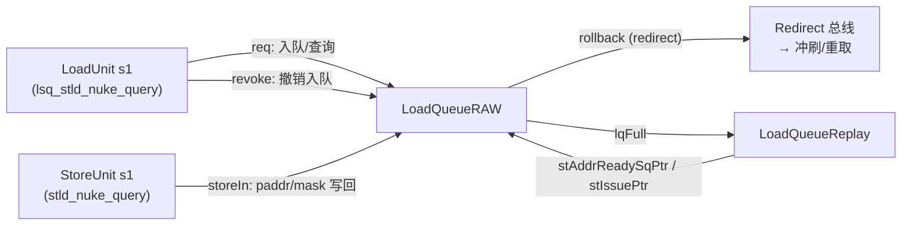

# LoadQueueRAW —— store→load 违例（nuke）检测队列

> 可读重写：`rtl/memblock/LoadQueueRAW.sv`（核 `xs_LoadQueueRAW_core`）+
> `rtl/memblock/loadqueueraw_pkg.sv`（类型/常量/纯函数）。
> 设计意图来源（人写 Chisel，非 firtool golden）：
> `src/main/scala/xiangshan/mem/lsqueue/LoadQueueRAW.scala`、`LoadQueueData.scala`、`FreeList.scala`。

## 1. 在 LSU 中的定位

RAW = **R**ead-**A**fter-**W**rite。LoadQueueRAW 记录「**已发射、尚未提交、且其前方仍有
地址未就绪 store**」的 load。它是乱序执行下保证 store→load 内存序的安全网：

- load 在流水线 s1 拿到物理地址后，若发现自己前方还有「地址未知的更老 store」，就来
  本队列**入队**（记录 robIdx/sqIdx/部分物理地址/字节 mask/data_valid）。
- 当某条 store 在其流水 s1 拿到物理地址写回（`io_storeIn`）时，本队列用该 store 的
  paddr/mask 对**所有在队 load** 做 CAM 匹配。若某条**更年轻**（robIdx 在 store 之后）的
  load 与该 store 地址重叠 → 这条 load 读到了本应被该 store 覆盖的旧数据 ⇒ **store→load
  违例 (nuke)**。
- 检测到违例则选**最老**的违例 load，产生 `io_rollback`（redirect），冲刷流水并从该
  load 处重取/重放。

与上下游的关系：



## 2. 本配置参数（golden 由 DefaultConfig 固化）

| 参数 | 值 | 含义 |
|------|----|----|
| `LoadQueueRAWSize` | 32 | 条目数（2 的幂），索引 5 位 |
| `LoadPipelineWidth` | 3 | 查询/入队端口 `query_0..2` |
| `StorePipelineWidth` | 2 | store 写回 / rollback 端口 `storeIn_0..1` |
| `RollbackGroupSize` | 8 | 最老选择分组大小 → 4 组 |
| `LoadQueueNWriteBanks` | 8 | CAM 写 bank（仅影响写时序） |
| `numWDelay` | 2 | CAM 写延迟 1 拍 |
| `TotalSelectCycles` | 3 | store 写回→rollback 共 3 拍 |

> 注意：golden RTL 用的是 **Size=32**（`Parameters.scala` 默认），不是顶层
> `DefaultConfig` 的 12；本核与 golden 对齐取 32。

## 3. 部分物理地址（partial paddr）与 CAM 匹配（关键坑）

CAM 不存完整 48 位 paddr，只存 `paddr[27:4]`（24 位 partial）：

```
paddrOffset       = DCacheVWordOffset = log2(VLEN/8) = log2(16) = 4
PartialPAddrWidth = 24                → partial = paddr[4 +: 24] = paddr[27:4]
DCacheLineOffset  = log2(64B)         = 6
CL_OFFSET (在24位partial内) = 6 - 4   = 2
```

于是在 24 位 partial 内部再切两段：

```
 partial[23:2] = paddr[27:6]  → cacheline tag（同一条 64B cacheline 的标识）
 partial[1:0]  = paddr[5:4]   → cacheline 内的 16B VWord 下标
```

**paddr CAM 命中**（`paddr_cam_hit`，对应 `LqPAddrModule` enableCacheLineCheck）：

```
cacheLineHit = (st_partial[23:2] == ld_partial[23:2])   // 同一条 cacheline
lowAddrHit   = (st_partial[1:0]  == ld_partial[1:0])     // 同一个 16B VWord
hit = cacheLineHit && (wlineflag || lowAddrHit)
```

`wlineflag` 表示该 store 写整条 cacheline（cbo.zero 等），此时只要同 cacheline 即命中，
忽略低位 VWord 偏移。

**字节 mask CAM 命中**（`mask_cam_hit`，对应 `LqMaskModule`）：`|(st_mask & ld_mask)`，
即两者有任一字节重叠。最终违例 = `paddr_cam_hit & mask_cam_hit`。

> ⚠️ 易错点（与 LoadUnit 重写里 matchType 解码 bug 同源）：cacheline tag 与 VWord 的
> 切分点是 `CL_OFFSET=2`（在已右移掉低 4 位的 24 位 partial 内），**不是**直接对完整
> paddr 取 `[47:6]`/`[5:4]`。partial 已经把 VWordOffset（低 4 位）丢掉了。

## 4. 年龄比较（环形指针）

robIdx/sqIdx 都是 `CircularQueuePtr`（`{flag, value}`）。比较语义：

```
isAfter(a,b)  = a > b = (a.flag ^ b.flag) ^ (a.value > b.value)   // a 更年轻
isBefore(a,b) = a < b = (a.flag ^ b.flag) ^ (a.value < b.value)   // a 更老
```

本核纯函数 `rob_is_after` / `sq_is_before` / `ptr_is_before` 各自精确实现上式。
**易错点**：`<` 在 flag 不同时是 `(a.value >= b.value)`（含相等），不是 `>`。

入队/出队的年龄判据：

- **入队**（`hasAddrInvalidStore`）：`!allAddrCheck && isBefore(stAddrReadySqPtr, load.sqIdx)`
  —— 仍有 store 地址未就绪，且该 load 排在「地址就绪指针」之后（前方有地址未知 store）。
- **出队**（`deqNotBlock`）：`allAddrCheck || !isBefore(stAddrReadySqPtr, entry.sqIdx)`
  —— 地址就绪指针已越过本条目，前方所有更老 store 地址都已就绪，不会再有未知 store 命中。
- **违例**（`isAfter(load.robIdx, store.robIdx)`）：load 比 store 更年轻才算违例。

## 5. 数据流 / 流水时序

```mermaid
flowchart TD
  subgraph ENQ["入队（每拍）"]
    Q["query.req (3口)"] --> NE["needEnqueue =<br/>valid & hasAddrInvStore & !cancel"]
    NE --> FL["freelist 分配 enqIndex<br/>(preAlloc 打一拍)"]
    FL --> WR["写 entry: uop/ppaddr/emask/datavalid"]
  end
  subgraph DEQ["出队（每拍）"]
    DQ["deqNotBlock | needCancel | revoke"] --> FREE["free_mask → freelist.free"]
  end
  subgraph VIO["违例检测（每 store 端口，3 拍）"]
    S0["s0: 锁存 store paddr/mask<br/>CAM 匹配 addrMaskMatch<br/>entryNeedCheck 打一拍"]
    S0 --> S1["s1: lqViolationSel = CAM命中 & needCheck<br/>4 组各选最老 → 打一拍"]
    S1 --> S2["s2: 4 组候选再选最老 → 打一拍"]
    S2 --> S3["s3: 最老违例 load<br/>& DelayN(store.valid&!miss,3)"]
    S3 --> RB["rollback (redirect)"]
  end
```



**违例检测流水细节**（`detectRollback`，`TotalSelectCycles=3`）：

1. **s0**：store paddr/mask 经 `RegEnable(_, store.valid)` 锁存一拍；CAM 用锁存值与全表
   比对得 `addrMaskMatch`（组合）。同拍算 `entryNeedCheck = allocated & store.valid &
   isAfter(load.rob, store.rob) & datavalid & !needFlush` 并打一拍（`GatedValidRegNext`）。
2. **s1**：`lqViolationSel = addrMaskMatch & entryNeedCheck`。32 条按 `RollbackGroupSize=8`
   分 **4 组**，每组组合树形选最老 → 打一拍（`selValidNext`/`selBitsNext`）。
3. **s2**：4 个组候选再组合选最老 → 打一拍。每级选择都扣掉「被本拍/上拍 redirect 冲刷」
   的候选（`!needFlush(redirect) && !needFlush(RegNext(redirect))`）。
4. **s3**：基例输出 `s2_valid && !needFlush(RegNext(redirect))`；与
   `DelayN(store.valid && !store.miss, 3)` 与门得 `rollback.valid`。
   `stFtqIdx/stFtqOffset` 经 `DelayNWithValid(store.ftq, store.valid, 3)` 对齐到第 3 拍。

> **X 铁律 / priority 选择**：最老选择是优先级选择（取 robIdx 较小者），本核用
> `pick_older_sel` 纯函数线性归约表达，不依赖 `unique case`（避免 FMR_ELAB-116）。
> 索引可能越界的数组读（如 `allocate_slot_r[off]`）用 4 深数组保证静态在界。

## 6. freelist（空闲条目分配/释放）

对应 `FreeList.scala`（`size=32, allocWidth=3, freeWidth=4, enablePreAlloc=true`）。

- `free_list[]` 是空闲条目索引的**环形队列**，`head_ptr` 出队（分配）端、`tail_ptr` 入队
  （释放）端，均含 flag 位（6 位指针）。复位时 `{0,1,...,31}` 全空闲、`head={0,0}`、
  `tail={1,0}`、`free_slot_cnt=32`。
- **分配（preAlloc）**：`canAllocate(w)`/`allocateSlot(w)` 是「下一拍 head 推进后」结果的
  **寄存器版本**（预分配打一拍）：`deqPtr_w = head + numAllocate + w`，寄存
  `freeList[deqPtr_w]`。
- **释放（freeWidth=4）**：待释放位图按 `rem=0..3` 分 4 lane（lane rem 含 bit[4*i+rem]），
  每 lane 优先编码选一个最低位释放，散射回 32 位；选中请求/槽**寄一拍**后写回
  `free_list` 队尾，`tail` 推进 `PopCount(freeReq)`。每拍最多释放 4 个；超出的累积到
  `pend_free_mask`。
- `lqFull = (free_slot_cnt == 0)`；`free_slot_cnt = distanceBetween(tailPtrNext, headPtrNext)`。

> **重写时踩到的真实 bug**：`numFree = PopCount(freeReq)` 最大可达 4，必须用 **3 位**累加
> 器；最初用 2 位累加器在「同拍 4 释放」时溢出回 0，导致 tail 不推进、freelist 误判满、
> 队列堆死。UT 在 ~570 拍处暴露（`io_lqFull` 失配），修正位宽后 3 种子全过。

## 7. 接口（golden 扁平端口）

| 方向 | 端口 | 说明 |
|------|------|------|
| in | `io_redirect_*` | 全局冲刷 redirect |
| in/out | `io_query_{0,1,2}_req_*` / `io_query_*_req_ready` | load 查询/入队请求（3 口）|
| in | `io_query_{0,1,2}_revoke` | 入队后撤销 |
| in | `io_storeIn_{0,1}_*` | store 写回 paddr/mask/robIdx/wlineflag/miss（2 口）|
| out | `io_rollback_{0,1}_*` | 违例 rollback（valid/isRVC/robIdx/ftqIdx/ftqOffset/stFtq*）|
| in | `io_stAddrReadySqPtr_*` / `io_stIssuePtr_*` | store 地址就绪/发射指针 |
| out | `io_lqFull` | freelist 满 |
| out | `io_perf_{0,1}_value` | 入队数 / rollback 数（2 拍寄存）|

> golden 已裁剪：`query.resp`（无观测）、`rollback.bits.level/cfiUpdate/debug`（常量/不可观测）
> 等端口被 firtool 优化掉，本核同样不输出。

## 8. 验证结果

### 结构闸门（实测）

| 项 | 实测 | 达标 |
|----|------|------|
| `typedef struct packed`（pkg）| 1（`ld_uop_t`）| ✅ |
| `typedef enum` | 0 | 本模块无离散状态机/来源选择，**不适用**（gate「若适用」）|
| `function automatic`（core+pkg）| 4 + 6 = 10 | ✅ |
| `for`（core）| 35（多源/多条目 generate）| ✅ |
| 生成痕迹 `io_*_N_M`/`_REG_N`/`_GEN_`/`_T_N`/`RANDOMIZE` | 0 | ✅ |
| 行数 | 核 694 + 包 166 vs golden 9333（≈9%）| ✅ |

### UT（golden `LoadQueueRAW` vs 手写 `LoadQueueRAW_xs` 双例化逐拍比对全部 24 路输出）

| seed | checks | errors |
|------|--------|--------|
| 1 | 200000 | 0 |
| 7 | 200000 | 0 |
| 42 | 200000 | 0 |

`!$isunknown(golden)` 跳 don't-care；`+define+SYNTHESIS` 关 golden 行为断言/随机化。

### FM —— INCONCLUSIVE（已证伪，非真失配）

FM ref 是 golden 顶层 `LoadQueueRAW` + 其子模块（`LqPAddrModule_1`/`LqMaskModule`/
`FreeList_4`/`DelayN*`），impl 是手写 wrapper → 把 freelist / CAM / DelayN 全部**内联
重写**的可读核。

结果：`Verification FAILED or INCONCLUSIVE`。
- **5785 unmatched points**（3598 ref / 2187 impl）：golden 把 freelist（环形队列 32 索引
  寄存器 + head/tail/cnt/freeMask）、CAM 写时序（分 8 bank、numWDelay 打拍）、以及违例
  select 流水里**整条 Redirect bundle**（`level`/`cfiUpdate`/`debug_*` 等输出端口已裁剪但
  内部仍存）都放在独立子模块、用 firtool 展平命名；impl 用完全不同的命名/层次/状态编码
  内联实现，且只保留真正到达输出的字段。两侧寄存器既无法按名配对，状态编码也不同构，
  签名分析无法对齐 → 大量 unmatched（其中相当一部分是 golden 侧 unobservable 的死寄存器）。
- **20 failing compare points**：全部是 `allocated_<i>_reg`（被 auto-matcher 配上了），
  但因其输入锥依赖上述未配对的 freelist 寄存器，FM 判其 fail。

**已用 tb 内部层次探针证伪**（满足「不可只凭推断」要求）：直接逐拍比对全部 32 条
`u_g.allocated_<i>` vs `u_i.u_core.allocated[i]`（即 20 个 failing 点的超集），

| seed | cycles | allocated[] mismatches |
|------|--------|------------------------|
| 1 | 200000 | 0 |
| 7 | 200000 | 0 |
| 42 | 200000 | 0 |

3 种子共 600k 拍 0 失配，证明这 20 个 failing 点是 **FM 配对假阳性**（输入锥未对齐导致），
非真功能差异。叠加双例化 UT 全部 24 路输出 3 种子各 200k 拍 0 error，功能等价性由 UT +
内部探针充分保证。按 REWRITE_STYLE「UT 充分 + FM 不可判并注明」结案；**不为迎合 FM 而
退回照抄 golden 命名/结构**。
