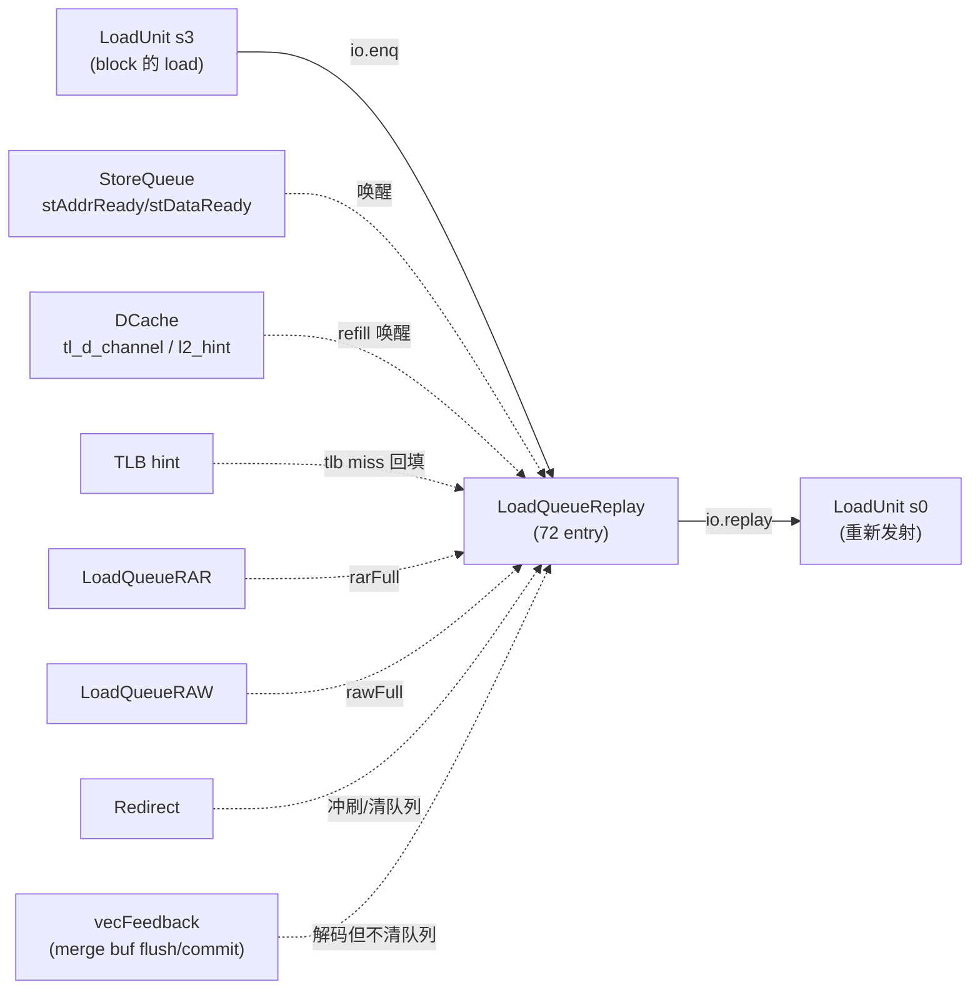
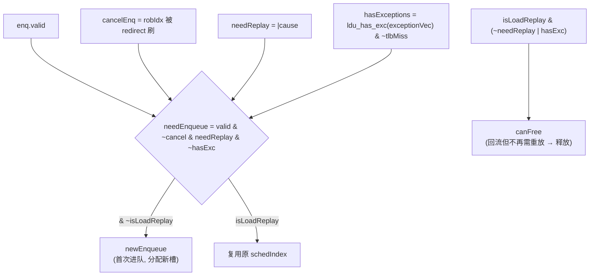
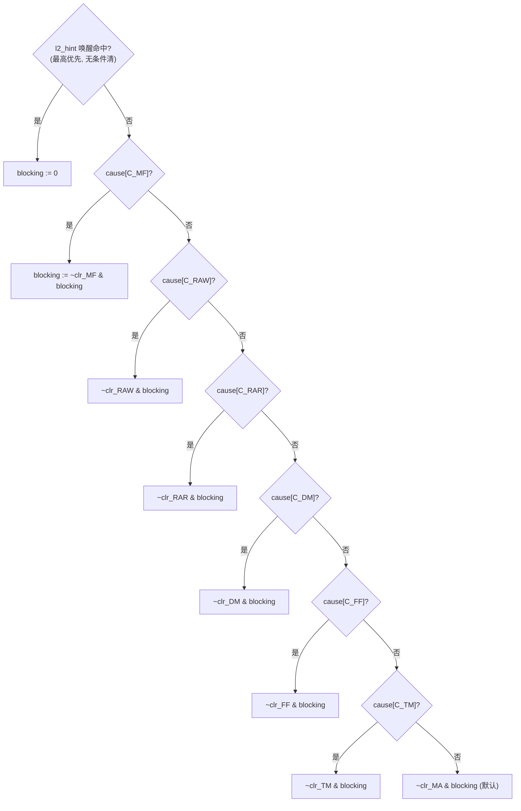
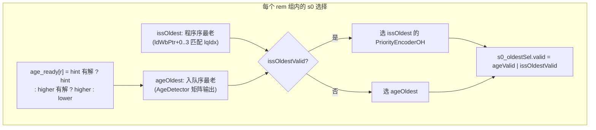
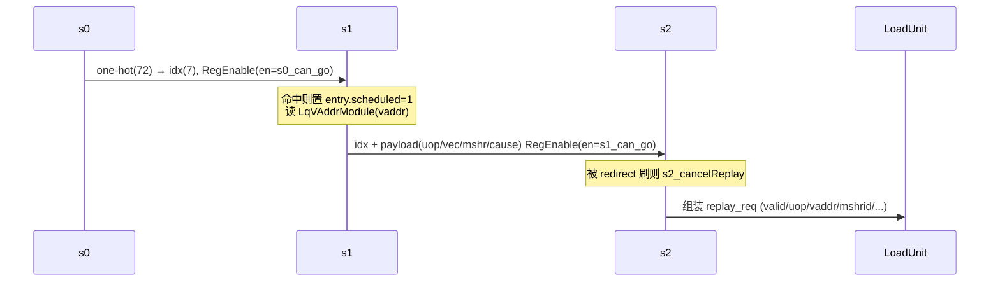

# LoadQueueReplay —— load 重放调度器

> 设计意图来源：`src/main/scala/xiangshan/mem/lsqueue/LoadQueueReplay.scala`（`class LoadQueueReplay`）
> 可读重写核：`rtl/memblock/LoadQueueReplay.sv`（`xs_LoadQueueReplay_core`）+ `loadqueuereplay_pkg.sv` + 多个 `loadqueuereplay_*.svh` 分节
> golden 同名 wrapper：`rtl/memblock/LoadQueueReplay_wrapper.sv`（端口扁平适配，FM/ST 用）

---

## 1. 这个模块在访存子系统里干什么

香山的 LoadUnit 是流水化的：一条 load 走

```
s0(发射) → s1(TLB 查询 / 读 StoreQueue forward) → s2(dcache 命中判定 / forward 数据合并) → s3(写回)
```

但 load 经常**没法一次走完**：可能 TLB miss、dcache miss、要 forward 的 store 数据还没写、dcache bank 冲突、RAR/RAW 违例检查队列满、检测到 store-load 重叠（nuke）等等。这时 LoadUnit 的 s3 会把这条 load「踢」到 **LoadQueueReplay**（`io.enq`），让它在这里排队等待，等 block 条件解除后再被选回 LoadUnit 重新发射（`io.replay`）。

所以 LoadQueueReplay 本质是一个**带优先级 + 年龄仲裁的重放调度器**：



与上下游的关系：
- **入队源**：LoadUnit s3（`io.enq`，3 路，`LoadPipelineWidth=3`）。
- **唤醒源**：StoreQueue（store 地址/数据就绪向量 + 指针）、DCache D-channel refill (`tl_d_channel`)、L2 提前唤醒提示 (`l2_hint`)、TLB hint (`tlb_hint`)、RAR/RAW 队列空满信号。
- **取消源**：**仅 Redirect**（分支误预测/异常冲刷 ROB）会清 entry（清 `allocated`、喂回 FreeList）。vecFeedback（向量 load 的 merge buffer flush/commit）虽被解码成 `vecLdCancel/vecLdCommit`，但在本模块 RTL 里**算出后从未被使用**——**vec flush 不清本队列**（详见 §7）。
- **出口**：`io.replay`（3 路），把选中的 entry 组装成 replay 请求发回 LoadUnit。

---

## 2. 核心数据结构：72 个 entry

队列有 `LoadQueueReplaySize = 72` 个 entry，**非环形**，用一个外部 `FreeList` 子模块管理空闲槽分配。每个 entry 保存：

| 字段 | 含义 |
|------|------|
| `allocated` | 该槽是否被占用 |
| `scheduled` | 已被选入重放流水（避免被重复选） |
| `blocking`  | block 条件仍未解除（不可重放） |
| `strict`    | C_MA 严格序（`loadWaitStrict`，地址未定 store 之前严格不可越过） |
| `cause[11]` | 11 位 replay cause 向量（可同时挂多个 cause） |
| `uop`       | 重放时要回填给 LoadUnit 的 microOp 元数据 |
| `vecReplay` | 向量 load 相关字段 |
| `blockSqIdx`| C_MA / C_FF 在等的那个 store 的 sqIdx |
| `missMSHRId`| C_DM 在等的 MSHR id（用于 D-channel/l2_hint 匹配唤醒） |
| `tlbHintId` | C_TM 在等的 TLB filter id |
| `dataInLastBeat` | refill 数据是否在最后一拍（用于 l2_hint 的 beat 选择） |
| `vaddr`     | 虚地址，**存在外部黑盒 `LqVAddrModule`**（省寄存器），核内只存一份 `debug_vaddr` 供 topdown 用 |

> 可读重写里，散落的 `Vec(72, Bool())` 状态位被聚合成 `entry_ctrl_t` 的 struct 数组 `ent[]`（`allocated/scheduled/blocking/strict`），其余按字段类型用独立数组。为对 Formality 友好，entry 数组按 `LQ_SLOTS = 128`（`2^7`）声明，只用 `0..71`，`72..127` 是 padding 永不分配且复位清 0 —— 这样 7 位下标读阵列恒静态在界，消除「非 2 幂数组动态下标越界」的 elab 误报。

---

## 3. 十一种 replay cause（优先级即编码值，低编码 = 高优先）

cause 的编码顺序**绝不能改**（Scala 源里有醒目警告：改了可能死锁）。编码值同时就是优先级：

| 编码 | enum | 含义 | 何时解除 block（唤醒条件） |
|------|------|------|-----------------------------|
| 0 | `C_MA`  | st-ld 违例重执行检查（地址未定 store 在前，mem ambiguous） | store 地址就绪 (`storeAddrValid`) |
| 1 | `C_TM`  | TLB miss | TLB hint 回填（命中本 entry tlb id 或 replay_all） |
| 2 | `C_FF`  | store→load forward 数据未就绪 | store data 就绪 (`storeDataValid`) |
| 3 | `C_DR`  | dcache replay（资源回压，可下拍重试） | 入队即不 block，下拍可重放 |
| 4 | `C_DM`  | dcache miss | D-channel refill 命中本 entry mshrId |
| 5 | `C_WF`  | way predictor 预测失败（可下拍重试） | 入队即不 block |
| 6 | `C_BC`  | dcache bank conflict（可下拍重试） | 入队即不 block |
| 7 | `C_RAR` | RAR 队列拒绝（满或年龄不够） | RAR 不满 或 不晚于 ldWbPtr |
| 8 | `C_RAW` | RAW 队列拒绝 | RAW 不满 或 store 地址就绪 |
| 9 | `C_NK`  | st-ld nuke 违例（确定的重叠，需重执行） | 入队即不 block |
| 10| `C_MF`  | misalignBuffer 满（非对齐 load 暂存满） | misalign buffer 不满 且 (允许投机 或 不晚于 ldWbPtr) |

这里有**两个不同维度的优先级**，务必分清（见 §5、§6）：
1. **block 解除时的「覆盖优先级」**：决定一个挂了多个 cause 的 entry，由哪个 cause 的解除条件说了算。
2. **重放选择时的「发射优先级」**：决定多个 ready entry 里先选哪个去重放。

---

## 4. 入队判定与 freelist 分配（§1）



关键坑（已在 RTL 注释）：
- **`hasExceptions` 只看 load 关心的异常位**：`exceptionVec[{3,4,5,13,19,21}]`（misalign/access/page fault 等），不是全 24 位 orR。否则非 load 异常位会误触发，错误地阻止入队。这对应 Scala 里的 `selectByFu(exceptionVec, LduCfg)`。
- **TLB miss 不算异常**（`& ~enq_tlbMiss`）：要去重放，不能当异常丢弃。
- **freelist 分配**：`isLoadReplay` 的回流 load 复用原来的 `schedIndex`；首次进队的从 freelist 拿第 `offset` 个空槽，`offset = 前面几路 newEnqueue 的个数`（PopCount）。RTL 里用显式 3 选 1（`pick_slot`）而非动态下标，避免 Formality 越界误报。

`lqFull = freeList.io_empty`。

---

## 5. block 解除：一个「优先级 mux」而非「OR 清除」（§2）

这是**最容易写错**的地方。Scala 用一串顺序的 `when(cause(i)(C_x)){ blocking(i) := ... }`，源码顺序是 `C_MA → C_TM → C_FF → C_DM → C_RAR → C_RAW → C_MF`。Chisel 的 last-connect 语义下，**后写覆盖前写**，于是生成的硬件是一个**优先级 mux**：

> 一个 entry 若同时挂多个 cause，**只有编码最高的那个 cause 的解除条件被检查**，其余被覆盖。

有效优先级（高 → 低）：`C_MF(10) > C_RAW(8) > C_RAR(7) > C_DM(4) > C_FF(2) > C_TM(1) > C_MA(0)`。



RTL 里写成 `if/else if` 链（priority），**绝不能写成「任一 cause 解除即清」的 OR**。`C_DR/C_WF/C_BC/C_NK` 没有解除分支——它们入队时就把 `blocking = 0`，下一拍即可重放。

**入队当拍即可预清 `blocking`（不止上面 4 个 cause）**：入队时 `blocking` 初值默认为 1，除 `C_DR/C_WF/C_BC/C_NK` 置 0 外，`C_TM` 与 `C_DM` 还各有一条**入队即预清**的特判（`loadqueuereplay_regupd.svh` 入队段，非 §5 这里的 `blkNext` 稳态解除）：

- **`C_TM`**：入队 `blocking` 初值 = `~enq_tlb_full & ~(tlb_hint_valid & (id 命中 或 replay_all))`。即 **TLB filter 已满**、**或**入队当拍已有匹配的 tlb hint，二者任一成立即预清 `blocking = 0`（可立即重放，不必再等一轮 hint）；只有「filter 未满 **且** 尚无匹配 hint」才保持 `blocking = 1` 去等 hint。
- **`C_DM & handledByMSHR`**：入队 `blocking` 初值 = `~enq_full_fwd & ~(tl_d_valid & mshrId 命中)`。即**可全量 forward**（`full_fwd`）、**或**入队当拍 refill 已在 D-channel 命中该 mshrId，任一成立即预清 `blocking = 0`；否则 `blocking = 1` 去等 refill。
- **`C_DM & ~handledByMSHR`（MSHR 未受理该 miss，如 MSHR 满）**：**不进上面那条 `C_DM` 特判**，`blocking` 走默认 1（继续阻塞等待）；且 `missMSHRId` **不写**（门控 = `needEnqueue & handledByMSHR`，见 §7），保留旧值——没拿到 mshrId 就无从靠 refill 匹配唤醒，只能后续重走 dcache 访问。

实现上 `clr_*` 各条件就地展开（不封装成 function），因为这些条件要读 entry 数组与多个模块端口（非局部变量），Formality 读 RTL 时对「函数内引用非局部变量」会报 `FMR_VLOG-091` 并升级为 elaboration error。

> StoreQueue 就绪向量 `stAddrReadyVec/stDataReadyVec` 宽 56（`SQ_SIZE`，非 2 的幂），按 6 位 sqIdx 下标读用 `sq_vec_read` 循环展开成 56 选 1（越界返 0），既正确又规避 Formality 越界误报。

---

## 6. 三级选择流水 s0/s1/s2（§3、§4）—— 著名的 oldest 选择

重放选择分 3 级流水。72 个 entry 按 `i % 3` **交织**分成 3 组（rem 组），第 `r` 路重放只在 `rem == r` 组（24 个 entry）里选，每组配一个 `AgeDetector`。

### s0：选出每路一个 one-hot 候选

发射优先级（Scala 注释明示，高 → 低）：
1. **L2 hint 唤醒**的 load（最高）；
2. **高优先 cause**：`C_DM`（dcache miss）或 `C_FF`（forward fail）；
3. **低优先 cause**：其余。

在每个优先级内再按**年龄**选最老，年龄有两条腿：



- **程序序 oldest（issOldest）**：`oldestPtrExt(j) = ldWbPtr + j`（`j = 0..OLDEST_STRIDE-1 = 0..3`）。匹配 `normalSelMask(i) & uop(i).lqIdx == oldestPtrExt(j)`。先看 `j==0`（最老）有没有命中，有就只取它；没有再取 `j>=1` 的合并。这就是按程序序「往后顺次找最老可重放项」。
- **入队序 oldest（ageOldest）**：`AgeDetector` 维护组内 24 个 entry 两两入队先后的上三角矩阵，结合 `ready` 掩码归约出「在 ready 项中入队最早」的 one-hot。
- **issOldest 优先于 ageOldest**：`oldestSel = issOldestValid ? issIndexOH : ageIndexOH`。

> **`s2_oldestSel` 假阳性家族**：s0 选出的 one-hot 在 s1 转成 7 位下标，s2 再用这个下标去读 `uop/cause/missMSHRId` 等数组组装 replay 请求。复位/未选时该下标可能为 X，而 SV 中 `array[X]` 恒为 X。golden（firtool 展平）用大量标量 mux 天然收敛，而可读重写用 struct 数组下标读不会自动收敛。**所有「按 s2/s1 下标读数组」一律包成三元 mux：仅 valid 时取，否则取 `entry[0]`**，强制 X 收敛。这是与 LsqWrapper 同源的 FM 假阳性根源。

### s1 / s2



- `s1_can_go = (未冷却 & (s2 无效 | s2 发射成功)) | s2 被取消`
- `s0_can_go = s1_can_go | s1 项被 redirect 刷`
- 取消用**当前拍 + 上一拍** redirect 各判一次（双重 needFlush，与 golden 一致）。
- 组装时 `exceptionVec[5]`（loadAddrMisaligned）清 0、`loadWaitStrict` 清 0（重放时不再带对齐异常/严格序）。
- `forward_tlDchannel = cause[C_DM]`（告诉 LoadUnit 这是 dcache miss 重放，s1 去抓 D-channel forward）。

### 重放冷却（防饿死）

每路一个 4 位 `coldCounter`。`lastReplay = RegNext(replay.fire)`；若本拍与上拍**同口连发**则 `+1`，到 `COLD_DOWN_THRESHOLD = 12` 触发冷却（`replayCanFire = coldCounter < 12`），冷却期 `s1_can_go` 被压住，让其它口有机会发射，计数器继续 `+1` 直到溢出回绕清 0。避免某一口被同一批 load 长期霸占。

---

## 7. entry 寄存器统一更新（§5）—— 多口 last-wins 的陷阱

所有 entry 状态的更新在一个 `always_ff` 里逐 entry 求 next 值，优先级（与 Scala `when` 顺序一致，后写覆盖前写）：

```
(1) 默认保持
(2) blocking := blkNext   (§5 的优先级解除)
(3) s0 选中 → scheduled := 1
(4) 入队写入 (needEnqueue & ready) → allocated/scheduled/blocking/cause/uop/...
(4b) allocated/scheduled 与 isLoadReplay 回流释放/清 scheduled 逐口交错
(6) redirect 取消 (needCancel) → allocated := 0  (最高优先；vec flush 不在此列)
```

两个**致命陷阱**（已在 RTL 详注）：

1. **逐字段门控不同，不能用一个统一 last-wins 循环**：不同字段的写使能不同——
   - `allocated/scheduled/uop/vec/cause/...`：门控 = `needEnqueue[w]`
   - `missMSHRId`：门控 = `needEnqueue[w] & handledByMSHR[w]`（仅 MSHR 处理过才更新）
   - `tlbHintId`：门控 = `needEnqueue[w] & cause[w][C_TM]`
   - `blockSqIdx`：C_MA 写 `addr_inv`、C_FF 写 `data_inv`（口内 C_FF 后写覆盖 C_MA）

   若把所有字段塞进同一个「按口 last-wins」循环，高编号口的「保持」会误把低编号口对它本不写的字段（如 `missMSHRId` 在 `handledByMSHR=0` 时）的写覆盖掉，读出旧值不一致。故每字段用各自门控独立判断「本口是否写本字段」。

2. **enqueue 与 isLoadReplay 回流在 Scala 是同一 `for((enq,w))` 循环体内交错**（enqueue 在前、replay 在后）：真实先后是 `w0:{enq,replay}, w1:{enq,replay}, w2:{enq,replay}`。**绝不能拆成「先所有 enqueue，再所有 replay」**——否则低编号口的 replay-free 会错误覆盖高编号口的 enqueue-set。RTL 里 (4b) 对每 entry 按 `w=0..2` 顺序施加 set/clear 实现「同 entry 后写赢」。

`freeMaskVec`（喂回 FreeList 的 `io_free`）= redirect 取消的槽（`needCancel`）| isLoadReplay 回流且不再需重放的槽。**注意这里没有 vec 分支**——与上面 (6) 一致：`needCancel` 只由 redirect（`rob_need_flush`）决定，`vecLdCancel/vecLdCommit` 不参与清 `allocated`、也不参与 `freeMaskVec`。故 **vec merge buffer flush/commit 既不清队列也不释放槽**，只有 redirect 会。（`vecLdCancel/vecLdCommit` 在 RTL 里算出后为死信号，参见 §1。）

---

## 8. topdown / perf（§6、§7）

- **topdown**：在所有 `allocated` 且 `debug_vaddr == robHeadVaddr` 的 entry 中按 `lqIdx` 归约出程序序最老者，用其 cause 点亮 `robHeadTlbMiss/TlbReplay/LoadVio/LoadMSHR` 等调试可视化信号。纯调试，无功能副作用。
- **perf**：13 个 perf event（enq/deq/deq_block/replay_full + 各 cause 入队计数），每个经两级寄存（`HasPerfEvents` 的 `RegNext∘RegNext`），零扩展到 6 位输出。

---

## 9. 子模块（黑盒，UT/FM 两侧共用 golden 定义）

| 子模块 | 作用 | 端口要点 |
|--------|------|----------|
| `LqVAddrModule`  | 72 entry 虚地址存储（3 读 3 写，写延迟 2 拍），存外部省寄存器 | raddr/waddr 7 位，rdata/wdata 50 位 |
| `FreeList_5`     | 空闲槽分配器（72 槽，3 路分配 / 4 路释放，预分配） | allocateSlot 7 位，free 72 位，empty |
| `AgeDetector_38` | 入队先后年龄矩阵（24 entry，3 enq 口），3 路重放各一个，每个管 `rem=port` 的 24 个 entry | enq/deq/ready/out 各 24 位 |

例化见 `loadqueuereplay_subinst.svh`。这三个黑盒在 UT 双例化和 FM 中两侧引用同一份 golden 定义。

---

## 10. 结构 / 文件组织

| 文件 | 内容 |
|------|------|
| `loadqueuereplay_pkg.sv` | 参数、11 cause enum、指针 struct + 环形比较函数、uop/vec struct |
| `LoadQueueReplay.sv` | 可读核 `xs_LoadQueueReplay_core`，分节 include 各 svh |
| `loadqueuereplay_ports.svh` | 核端口表（struct/数组端口） |
| `loadqueuereplay_block.svh` | §2 block 解除（优先级 mux） |
| `loadqueuereplay_s0sel.svh` | §3 s0 选择（hint/优先级 mask + 年龄选择） |
| `loadqueuereplay_pipe.svh` | §4 s1/s2 流水 + replay 组装 + 冷却 |
| `loadqueuereplay_regupd.svh` | §5 entry 寄存器统一更新 |
| `loadqueuereplay_perf.svh` | §6/§7 topdown + perf |
| `loadqueuereplay_subinst.svh` | 3 个黑盒子模块例化 |
| `LoadQueueReplay_wrapper.sv` | golden 同名扁平端口适配层（机械打包，FM/ST 用） |

`scripts/gen_loadqueuereplay.py` 由 golden 端口表生成 wrapper、UT 的 `variants_xs.sv`（`LoadQueueReplay_xs` 镜像）和 `tb.sv`。

---

## 11. 验证结果

### 单元测试（UT）

方法：golden `LoadQueueReplay`（`u_g`）与可读重写镜像 `LoadQueueReplay_xs`（`u_i`，内部例化 `xs_LoadQueueReplay_core`）**双例化逐拍比对所有输出**。两侧共用同一份 golden 子模块（AgeDetector_38 / FreeList_5 / LqVAddrModule）。受限随机激励覆盖各 cause、年龄选择、流水背压/冷却、redirect 取消、vecFeedback 输入（驱动但不清队列，见 §7）、freelist 分配/释放。`+define+SYNTHESIS` 关闭随机初始化与行为断言。X 比对用 `!$isunknown(golden)` 跳过 don't-care；`replay_*_bits_*` 按对应 `valid` 选通（不 valid 时是陈旧值，don't-care）。

| seed | checks | errors | 结果 |
|------|--------|--------|------|
| 1  | 249993 | 0 | PASSED |
| 7  | 249993 | 0 | PASSED |
| 42 | 249993 | 0 | PASSED |

三种子各约 25 万拍、全部输出逐拍 errors=0。

### 形式等价（FM）

golden 顶层（含 3 子模块黑盒）vs 手写同名 wrapper（→ 可读核 + 同 3 子模块黑盒），子模块设为黑盒，`set_app_var verification_merge_duplicated_registers false`（队列状态规模大，合并同值寄存器会令未配对寄存器搜索空间组合爆炸）。

**FM 结论：不收敛（按「UT 充分 + FM 不可判」先例处理，已用层次探针证伪失败点）。**

FM 跑完报 `Verification FAILED`，但实质是**配对不收敛**而非真不等价：

- 1155 Passing / **20 Failing** / **17141 Unverified** compare points；matching 阶段 18311 点按名字配对、**0 点靠签名分析配对**、5 点靠拓扑——大量 struct 数组打包寄存器（`cause_reg[i][b]`、`blockSqIdx_reg[i]`）无法与 golden 的逐字段标量寄存器（`cause_<i>`、`blockSqIdx_<i>_{flag,value}`）配对，21504 个 ref 寄存器 unmatched。这是本工程预期的「struct 数组 vs 扁平标量配对不收敛」情形。
- 已报告的 20 个 failing 点全部落在 `u_core/cause_reg[0]`、`u_core/cause_reg[54]`、`u_core/blockSqIdx_reg[66]`——典型的「FM 把可读核的某个 packed 寄存器位错配到 golden 的另一个标量位」误报。注意 **20 是 Formality 默认 `verification_failing_point_limit=20` 的截断上限**（verify 攒满 20 个失配即提前中止，17141 个 Unverified 点未验）；下方层次探针**覆盖全部 72 个 entry**，其覆盖面远超 FM 已判的这 20 点。

**失败点证伪（层次探针，UT 内部信号比对）**：在 UT testbench 用层次引用逐拍直接比对两侧真实内部状态——`u_g.cause_<i>` vs `u_i.u_core.cause[i]`、`u_g.blockSqIdx_<i>_{flag,value}` vs `u_i.u_core.blockSqIdx[i].{flag,value}`，**覆盖全部 72 个 entry**（远超 FM 报的 3 个点，含 entry 0/54/66）。X 用 `!$isunknown(golden)` 选通。

| seed | probe_checks | probe_mismatch | output errors | 结果 |
|------|--------------|----------------|---------------|------|
| 1  | 249994 | **0** | 0 | PASSED |
| 7  | 249994 | **0** | 0 | PASSED |
| 42 | 249994 | **0** | 0 | PASSED |

三种子各约 25 万拍，golden 内部寄存器与可读核 struct 数组寄存器**逐拍 bit-for-bit 完全一致（mismatch=0）**，证明 20 个 FM 失败点为假阳性。探针 tb 见 `verif/ut/LoadQueueReplay/tb_probe.sv` + `probe_block.svh`，结果见 `sim_probe_{1,7,42}.log`。

> `s2_oldestSel` 家族的下标读 X 收敛已在可读核中用三元 mux 保证（见 §6）。综上：正确性以**充分 UT（三种子各 25 万拍逐拍全输出 errors=0）+ 全内部寄存器层次探针（mismatch=0）**为权威；FM 为部分验证——1155 passing，20 failing（截断上限）已证伪，17141 unverified 未覆盖（struct 数组配对不收敛）。

---

## 12. 关键微架构坑速查

1. **cause 编码 = 优先级，绝不能改顺序**（Scala 源警告：死锁）。
2. **block 解除是优先级 mux 不是 OR**：多 cause entry 只由最高编码 cause 的解除条件决定（§5）。
3. **发射优先级**：hint > 高优先(C_DM/C_FF) > 低优先；级内再按年龄（issOldest 程序序 > ageOldest 入队序）（§6）。
4. **`hasExceptions` 只看 LduCfg 的 6 个异常位**，且 tlbMiss 不算异常（§4）。
5. **多口入队逐字段门控不同**，且 enqueue 与 isLoadReplay 回流必须逐口交错（last-wins），不能分两批（§7）。
6. **s2/s1 下标读数组必须三元 mux 强制 X 收敛**（§6 假阳性家族）。
7. **冷却计数防同口饿死**：同口连发到阈值 12 强制冷却（§6）。
