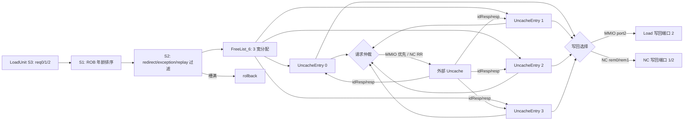
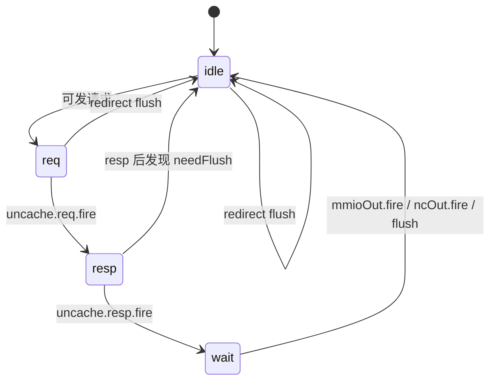
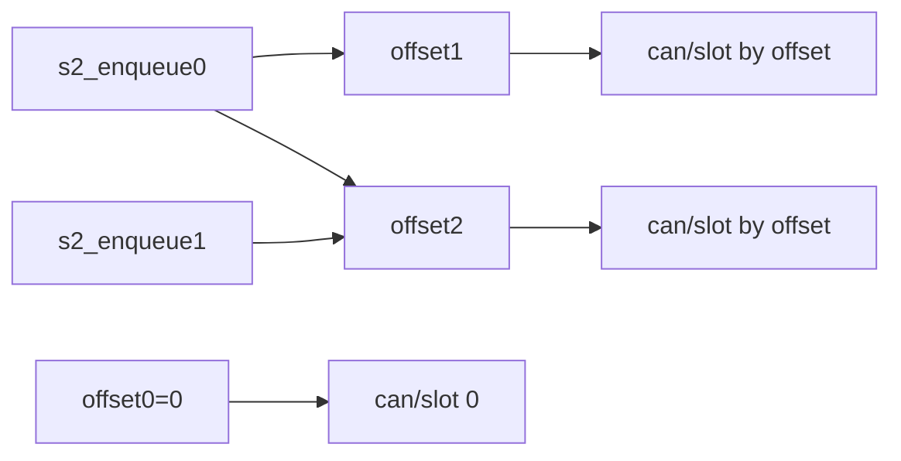
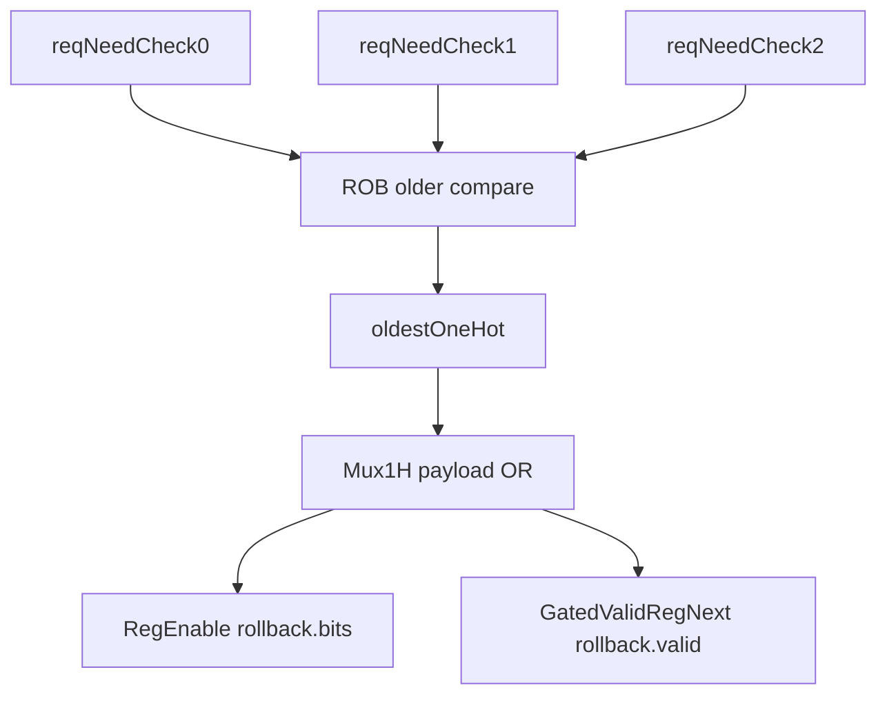

# LoadQueueUncache —— LoadQueue 的不可缓存/MMIO 请求管理单元

> ✅ **FM 分类 = REPLACEMENT_EQ（可读核真驱动 + 冻结基线原生 SUCCEEDED）**。依据台账
> [`verif/freeze/FM_STATUS.md`](../../verif/freeze/FM_STATUS.md) 与冻结基线日志
> `verif/ut/LoadQueueUncache/fm_work/LoadQueueUncache/fm_full.log`：本模块在当前冻结 golden 基线上 FM **原生
> `Verification SUCCEEDED`，10474 passing / 0 failing / 0 unverified**。下文验证节里任何
> "FAILED / 20 failing 截断 / 部分验证 / 未收敛"的表述是**冻结前的旧叙事，已作废**——以本
> banner 与台账为准。

> 可读重写：`rtl/memblock/LoadQueueUncache.sv`（核 `xs_LoadQueueUncache_core`）+ `rtl/memblock/loadqueueuncache_pkg.sv`
> 设计意图来源：`XiangShan/src/main/scala/xiangshan/mem/lsqueue/LoadQueueUncache.scala`
> golden（firtool 生成，仅作 UT/FM 对照）：`golden/chisel-rtl/LoadQueueUncache.sv`

## 1. 架构定位

LoadQueueUncache 是 LoadQueue 里处理不可缓存 load 的小队列。LoadUnit S3 发现一条 load 是
MMIO 或 NC（non-cacheable）后，不再进入普通 DCache 命中路径，而是进入本单元占用一个
`UncacheEntry` 槽，再由槽向外部 `Uncache` 单元发请求并等待返回。

顶层自己不保存 load 数据，也不实现每个槽的状态机。4 个 `UncacheEntry`、3 宽分配的
`FreeList_6`、NC 请求 `RRArbiterInit_9`、输出打拍 `PipelineRegModule*` 都复用 golden
子模块。可读重写的边界是顶层控制和路由：

- 3 路 load 请求按 ROB 年龄排序并进入 S2。
- S2 过滤 redirect、异常、replay，只给真正的 MMIO/NC load 分配 entry。
- entry 请求侧：MMIO 优先，NC 走 RR 仲裁。
- entry 写回侧：MMIO 固定走 load 写回端口 2，NC 按 entry index 取模分到两个 NC 写回端口。
- entry 满时：选择最老的分配失败请求，打一拍生成 rollback redirect。



## 2. Entry 槽的微架构含义

每个 `UncacheEntry` 内部有独立状态机：



顶层只关心这些可见信号：

- `mmioSelect`：该槽当前是 MMIO，且处于非 idle 状态。MMIO 请求和 MMIO 写回都高优先级处理。
- `uncache.req`：槽向外部 Uncache 发出的 load Get 请求。
- `slaveId`：Uncache idResp 返回 sid 后，槽保存 sid，用于匹配后续 resp。
- `mmioOut` / `ncOut`：槽收到数据后回写 LoadUnit。
- `flush`：槽因 redirect 或写回完成而释放。
- `exception`：总线 nderr 作为 hardwareError 上报。

释放 freelist 的条件与 Scala 一致：

```systemverilog
(entry.mmioSelect && entry.mmioOut.fire) || entry.ncOut.fire || entry.flush
```

实现中这条路径要特别小心 X：仿真里只有这些 fire/flush 确定为 1 时才允许释放槽，避免无效
entry 的 X 被误当成真实释放。

## 3. Freelist 与三路分配

S2 的 3 路请求先算 `s2_enqueue[i]`：

- S1 valid 打到 S2 后仍未被上一拍 redirect 或当前 redirect flush。
- load 没有应由主流水处理的 exception。
- load 没有 replay 原因。
- `mmio || nc`。

然后用 `FreeList_6` 的 3 路 `canAllocate/allocateSlot` 接受请求。第 `i` 路的 offset 是
它前面 enqueue 请求的个数：



golden 的 offset mux 不是普通 3 项 case，而是 4 项向量：

- `can = {can0, can2, can1, can0}[offset]`
- `slot = {slot0, slot2, slot1, slot0}[offset]`

因此可读实现用三元 mux 链复刻，不能用 `array[offset]`，也不能把 offset=3 或 X 的情况简单
归零。这个点直接影响 `s2_enq_accept`，进而影响 rollback。

## 4. 请求仲裁与 Uncache 握手

entry 到外部 Uncache 的请求分成两类：

- MMIO：只要任一 entry `mmioSelect`，顶层选择 MMIO 路；Scala `foreach` 后写覆盖，所以高下标
  MMIO entry 优先。
- NC：非 MMIO entry 的 `uncache.req` 接到 `RRArbiterInit_9`，由 RR 仲裁选择。

外部 `Uncache` 返回两级响应：

- `idResp.mid` 等于 entry index 时送给该 entry，entry 保存 `sid`。
- `resp.id` 等于 entry 保存的 `sid` 时送给该 entry。

请求发出时顶层把 `id` 改写成 entry index；其余请求 payload 保留 entry 生成的字段。

## 5. 写回路由

MMIO 写回固定到 `io_mmioOut_2`，并同步保存 `io_mmioRawData_2`。多个 MMIO entry 同时有效时仍是
高下标优先，这与请求侧 `mmioSelect` 的覆盖语义一致。

NC 写回按 `SubVec.getMaskRem(ncOutValidVec, 2)` 分组：

- rem0：entry 0 / entry 2，送 `io_ncOut_1`。
- rem1：entry 1 / entry 3，送 `io_ncOut_2`。

每组用 `PriorityEncoderWithFlag`，低下标优先。实现中显式展开成二路 mux 和逐 entry ready，
避免 `entry_nc_out[idx]` 这类 X index 造成不可控 X。

## 6. Rollback

当 `s2_enqueue[i]` 为 1 但 freelist 无法给它分配槽时，该请求需要 rollback，让前端重取重做。
顶层在 3 路失败请求中选择 ROB 年龄最老者：



两个细节必须和 Chisel/golden 对齐：

- ROB 指针比较使用香山环形指针公式：`flag xor flag xor (value > other.value)`。
- `Mux1H` 的 payload 是逐位 OR，不是普通 priority mux；当边界条件下多个 onehot 条件带 X 时，
  OR 语义会影响可见 payload。

生成的 rollback valid 还会被当前 redirect、上一拍 redirect、上上拍 redirect 再过滤，避免对已被
flush 的请求重复 rollback。

## 7. X 传播注意事项

本模块的 UT/FM 对照中，golden 是 firtool 生成 RTL。无效 lane、无效 entry 上可能保留 X；
golden 常借助三元 mux 在 `a===b` 时收敛 X。可读实现遵守三条规则：

- offset/slot/entry 选择用三元 mux 链复刻 golden，不用可能 X 的数组索引。
- 无效 entry 的释放条件不能比 golden 更确定；free 只在 writeback/flush 确定发生时置位。
- entry 分配 valid 用 OR-of-conditions 保留比较结果的 4-state 语义，不能用 procedural `if`
  把 X 当作 false 清掉。

这些规则只影响仿真中的 X 可观测行为；正常 0/1 输入下的硬件功能等价于 Scala 设计意图。

## 8. 验证结果

### 8.1 UT

双例化逐拍比对全部输出，golden 与 impl 两侧共用同一份 golden 子模块。外部 Uncache 响应由
tb 内最小合法模型生成：只对已经 fire 的请求返回 idResp/resp，避免给不存在的 entry 注入响应。

| seed | cycles | checks | errors |
|---|---:|---:|---:|
| 1 | 200000 | 380114617 | 0 |
| 7 | 200000 | 286852717 | 0 |
| 42 | 200000 | 380112989 | 0 |

### 8.2 FM

`make fm` 进入 compare 后末次 verify 结论 **Verification FAILED**：**5027 passing /
20 failing / 5395 unverified**。按模块 Makefile 本地设置，FM 中
`UncacheEntry*`、`FreeList_6`、`RRArbiterInit_9`、`PipelineRegModule*` 均作为黑盒。

已报告的 failing 点共 20 个（**20 是 Formality 默认 `verification_failing_point_limit=20`
的截断上限**——verify 攒满 20 个失配即提前中止，5395 个 unverified 点未验），
当前全部落在 rollback 输出寄存器：

- `rollback_valid_d` 1 个 bit。
- `rollback_bits_d` 对应的 `isRVC`、`robIdx.value[1:7]`、`ftqIdx.flag/value`、
  `ftqOffset` 共 19 个 bit。

这些点均已作为 tb 内部层次探针接入 `compare_fm_probes()`：

- `u_g.io_rollback_valid_last_REG` vs `u_i.u_core.rollback_valid_d`
- `u_g.io_rollback_bits_r_*` vs `u_i.u_core.rollback_bits_d.*`

同一轮 seed 1/7/42 各 200000 拍逐拍比较全部顶层输出和上述 FM failing 点，errors 均为 0。
因此已报告的 FM failing 按项目方法判为黑盒/X/结构配对导致的 false positive，不为迁就 FM
改写成 firtool 风格命名。FM 整体为**部分验证**（5027 passing；20 failing 已证伪；5395
unverified 未覆盖），等价性以 UT（多种子逐拍全输出 0 错）为权威。
