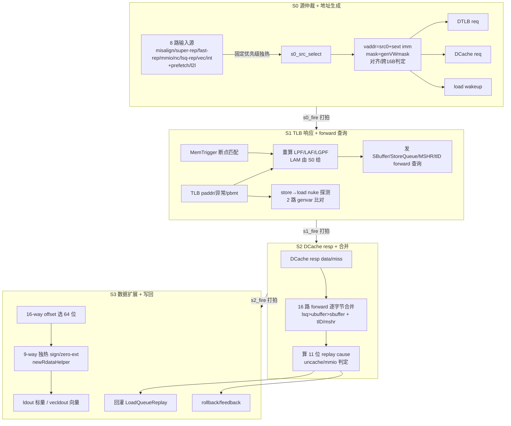

# LoadUnit —— 香山 V2R2 访存 Load 流水单元（可读重写学习文档）

> 本文档配合可读核 `rtl/memblock/LoadUnit.sv`（核 `xs_LoadUnit_core`）+ 类型包
> `rtl/memblock/loadunit_pkg.sv`，从 **Scala 设计意图**
> （`src/main/scala/xiangshan/mem/pipeline/LoadUnit.scala`）出发讲解，而非照抄 firtool RTL。

## 1. 角色与位置

LoadUnit 是 MemBlock 里 load 指令的“执行流水”，把一条 load 的
「源仲裁 → 虚地址生成 → DTLB 翻译 + DCache 访问 → store→load 前递 → 数据合并/扩展
→ 写回 + 回灌重放队列」串成 **4 级流水（S0~S3）**。它与 StoreUnit 对称，但 load 还要
处理 forward（从 SBuffer/StoreQueue/MSHR/tlD 通道拿尚未落 cache 的写数据）、nuke（更老
store 改了本 load 读过的地址 → 违例）、以及 11 种 replay 原因的回灌。

## 2. 数据流（mermaid）

## 3. S0：8 路源仲裁（`ld_src_e` enum）

8 个真实来源 + prefetch/l2l，固定优先级（高→低）：

| 优先级 | 枚举 | 来源端口 | 说明 |
|---|---|---|---|
| 0 | SRC_MISALIGN | io_misalign_ldin | misalignBuffer 拆分重发（地址已算好） |
| 1 | SRC_SUPER_REP | io_replay(tlD) | cache-miss 超级重放，走 tlD 通道前递 |
| 2 | SRC_FAST_REP | io_fast_rep_in | 快速重放（bank conflict/wpu fail 等） |
| 3 | SRC_MMIO | io_lsq_uncache | mmio 回灌 |
| 4 | SRC_NC | io_lsq_nc_ldin | non-cacheable（自带数据，不查 DCache） |
| 5 | SRC_LSQ_REP | io_replay(普通) | LSQ 重放 |
| 6 | SRC_HIGH_PF | io_prefetch_req(conf>0) | 高置信硬件预取 |
| 7 | SRC_VEC_ISS | io_vecldin | 向量发射 |
| 8 | SRC_INT_ISS | io_ldin | 标量发射/软件预取（首发，S0 自己算地址） |
| 9 | SRC_L2L_FWD | io_l2l_fwd_in | load-to-load 前递（**本配置禁用**） |
| 10 | SRC_LOW_PF | io_prefetch_req(conf=0) | 低置信硬件预取 |

仲裁用一个 `for` 循环表达“ready[i] = 高优先级全无效”，`select[i] = valid[i] & ready[i]`，
等价于 Scala 的 `ParallelPriorityMux`。

地址生成、对齐、mask、数据扩展等用 `loadunit_pkg` 的 **纯函数** 表达：
`gen_vaddr`（src0+sext(imm)）、`addr_aligned`、`gen_vwmask`、`gen_rdata_oh`/`new_rdata`
（数据 byte-mux + 9 路 sign/zero/fp-box 扩展，**用循环/独热，不用 acc 手工链**）。

## 4. S1：TLB 响应 + forward + nuke

- TLB 回 paddr（dup_lsu / dup_dcache）、pbmt、pf/af/gpf 异常。S1 **重算** LPF/LAF/LGPF
  （gated by vecActive/!tlb_miss/!tlbNoQuery），LAM 由 S0 给且可被 checkfullva 真异常清除。
- `MemTrigger`（叶子黑盒）做断点匹配，输出 triggerAction（4'hF=断点异常 / 4'h1=进 debug-mode）。
- store→load nuke 探测：2 路 store 查询用 `typedef struct packed nuke_query_t` 表达，
  `genvar` 循环对每路按匹配粒度（行/128b/64b）比 paddr + mask 交叠 + robIdx 更老。
- 向 SBuffer/StoreQueue(lsq.forward)/UBuffer/MSHR(tlD) 发 forward 查询。

## 5. S2/S3（数据合并 / 写回 / 回灌）

S2 合并 16 路 forward（lsq > ubuffer > sbuffer，叠加 tlD/mshr 通道），算 11 位 replay cause
（`C_MA/C_TM/C_FF/C_DR/C_DM/C_WF/C_BC/C_RAR/C_RAW/C_NK/C_MF`），判 uncache/mmio。
S3 按 `genDataSelectByOffset`（16-way offset 独热）选 64 位，再按 `genRdataOH`（9 路独热）
做 sign/zero/fp-box 扩展（`new_rdata`），写回 ldout/vecldout，回灌 LoadQueueReplay，发 rollback/feedback。

> **实现状态**：S0~S3 四级已按 Scala 完整重写（`LoadUnit_core_body.svh` 全实现，无占位段）：
> S2 的 16 路 forward 合并 + 11 位 replay cause，S3 的数据选择/扩展、写回 `ldout`/`vecldout`、
> 回灌 LoadQueueReplay、rollback/feedback、misalign enq 均已产出真值。perf 计数 0~6 全实现
> （`perf_6` = `s2_fire & io_dcache_resp_bits_miss`）。数据扩展纯函数
> （`gen_rdata_oh`/`new_rdata`/`genDataSelectByOffset` 等）在 pkg 中实现，S2/S3 直接复用。

## 6. 验证

- UT：golden `LoadUnit` 与可读核 `LoadUnit_xs` 双例化，随机激励逐拍比对全部 418 路输出。
  - **种子 1 / 7 / 42 各 200000 拍，checks=200000，errors=0，TEST PASSED**（S0~S3 全输出逐拍一致）。
- FM：末次 verify 结论 **Verification FAILED**——**6426 passing / 20 failing / 1240
  unverified**。已报告的 20 个 failing 全是 prefetch 路寄存器
  （`io_ifetchPrefetch_bits_vaddr_r_reg`×18、`io_prefetch_train(_l1)_valid_last_REG_reg`×2）。
  注意 **20 是 Formality 默认 `verification_failing_point_limit=20` 的截断上限**——verify
  攒满 20 个失配即提前中止，1240 个 unverified 点未验（可读核 struct/数组 vs golden 扁平
  结构差异大、签名分析配对不收敛）。故 FM 为**部分验证**（此前记"其余 compare point 全
  passing"不确切，特此更正）；与 REWRITE_STYLE 一致，以 UT 全输出逐拍 0 错为正确性权威。

## 7. 文件清单

| 文件 | 作用 |
|---|---|
| `rtl/memblock/loadunit_pkg.sv` | 类型/常量/纯函数（enum/struct/function） |
| `rtl/memblock/LoadUnit_core_body.svh` | 可读核主体（S0~S3 四级全实现） |
| `rtl/memblock/LoadUnit.sv` | gen 脚本拼接：模块头 + 端口表 + 主体（核 `xs_LoadUnit_core`） |
| `rtl/memblock/LoadUnit_wrapper.sv` | golden 同名包装层（端口透传 + 例化核 + golden MemTrigger） |
| `scripts/gen_loadunit.py` | 解析 golden 端口，生成核/wrapper/variants/tb |
| `verif/ut/LoadUnit/` | Makefile + variants_xs.sv + tb.sv |
