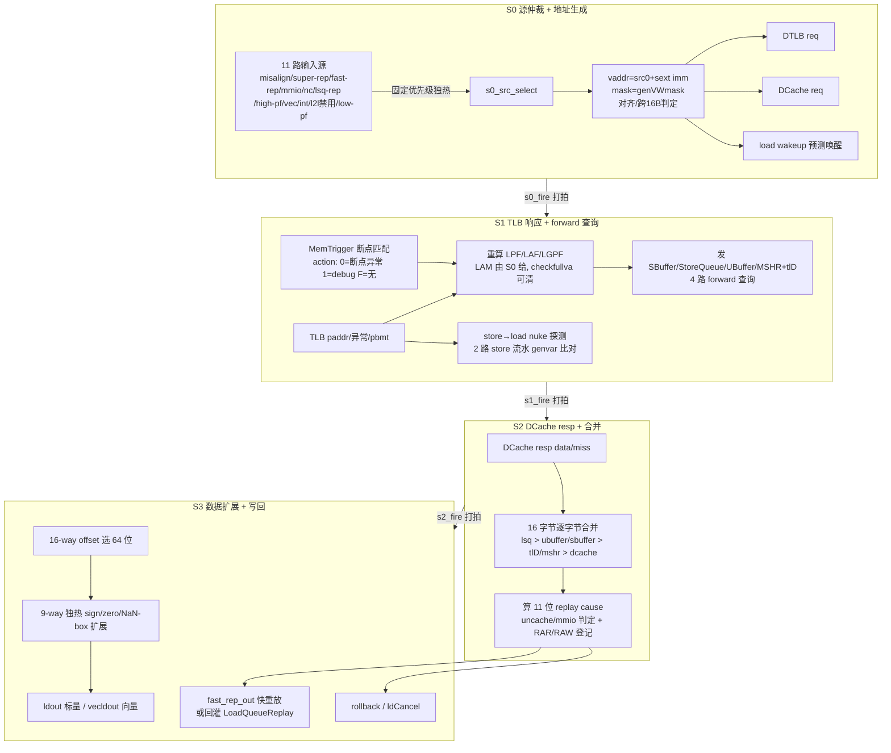

# LoadUnit —— 香山 V2R2 访存 Load 流水单元（可读重写学习文档）

> ✅ **FM 分类 = REPLACEMENT_EQ（可读核真驱动 + 冻结基线原生 SUCCEEDED）**。依据台账
> [`verif/freeze/FM_STATUS.md`](../../verif/freeze/FM_STATUS.md) 与冻结基线日志
> `verif/ut/LoadUnit/fm_work/LoadUnit/fm_full.log`：本模块在当前冻结 golden 基线上 FM **原生
> `Verification SUCCEEDED`，7713 passing / 0 failing / 0 unverified**。下文验证节里任何
> "FAILED / 20 failing 截断 / 部分验证 / 未收敛"的表述是**冻结前的旧叙事，已作废**——以本
> banner 与台账为准。

> 本文档配合可读核 `rtl/memblock/LoadUnit.sv`（核 `xs_LoadUnit_core`）+ 类型包
> `rtl/memblock/loadunit_pkg.sv`，从 **Scala 设计意图**
> （`src/main/scala/xiangshan/mem/pipeline/LoadUnit.scala`）出发讲解，而非照抄 firtool RTL。
> 原理层背景（为什么要"执行流水 + 队列族"）见
> [`arch/2-LOAD_STORE_PIPELINE_PRINCIPLES.md`](arch/2-LOAD_STORE_PIPELINE_PRINCIPLES.md)，
> 本文往下钻**实现层**。

## 1. 角色与位置

LoadUnit 是 MemBlock 里 load 指令的“执行流水”，把一条 load 的
「源仲裁 → 虚地址生成 → DTLB 翻译 + DCache 访问 → store→load 前递 → 数据合并/扩展
→ 写回 + 回灌重放队列」串成 **4 级流水（S0~S3）**。本配置例化 3 份（`LoadPipelineWidth=3`）。
它与 StoreUnit 对称，但 load 还要处理 forward（从 StoreQueue/SBuffer/UncacheBuffer/MSHR/tlD
通道拿尚未落 cache 的写数据）、nuke（更老 store 改了本 load 读过的地址 → 违例）、以及
11 种 replay 原因的回灌。关键位宽（与 golden 一致）：vaddr 50、paddr 48、mask 16（=VLEN/8）、
robIdx.value 8、lqIdx.value 7（VirtualLoadQueueSize=72）、sqIdx.value 6（StoreQueueSize=56）、
mshr_id 4（nMissEntries=16）、tlb_id 4。

## 2. 数据流（mermaid）


```mermaid
flowchart TD
  subgraph S0[S0 源仲裁 + 地址生成]
    A[11 路输入源\nmisalign/super-rep/fast-rep/mmio/nc/lsq-rep\n/high-pf/vec/int/l2l禁用/low-pf] -->|固定优先级独热| SEL[s0_src_select]
    SEL --> VA[vaddr=src0+sext imm\nmask=genVWmask\n对齐/跨16B判定]
    VA --> TLBREQ[DTLB req] & DCREQ[DCache req] & WK[load wakeup 预测唤醒]
  end
  S0 -->|s0_fire 打拍| S1
  subgraph S1[S1 TLB 响应 + forward 查询]
    TR[TLB paddr/异常/pbmt] --> EXC[重算 LPF/LAF/LGPF\nLAM 由 S0 给, checkfullva 可清]
    EXC --> FWD[发 SBuffer/StoreQueue/UBuffer/MSHR+tlD\n4 路 forward 查询]
    TR --> NK[store→load nuke 探测\n2 路 store 流水 genvar 比对]
    MT[MemTrigger 断点匹配\naction: 0=断点异常 1=debug F=无] --> EXC
  end
  S1 -->|s1_fire 打拍| S2
  subgraph S2[S2 DCache resp + 合并]
    DR[DCache resp data/miss] --> MG[16 字节逐字节合并\nlsq > ubuffer/sbuffer > tlD/mshr > dcache]
    MG --> CAUSE[算 11 位 replay cause\nuncache/mmio 判定 + RAR/RAW 登记]
  end
  S2 -->|s2_fire 打拍| S3
  subgraph S3[S3 数据扩展 + 写回]
    SEL16[16-way offset 选 64 位] --> EXT[9-way 独热 sign/zero/NaN-box 扩展]
    EXT --> OUT[ldout 标量 / vecldout 向量]
    CAUSE --> REP[fast_rep_out 快重放\n或回灌 LoadQueueReplay] & RB[rollback / ldCancel]
  end
```

## 3. S0：11 路源仲裁（`ld_src_e` enum）

load 的入口远不止“后端发射”一路——**凡是走不完的 load 都要能回到 S0 再走一遍**，重放/
回灌通道就是队列族送 load 回流水的入口。11 路固定优先级（高→低）：

| 优先级 | 枚举 | 来源端口 | 什么场景走这路 | 为什么排这里 |
|---|---|---|---|---|
| 0 | SRC_MISALIGN | io_misalign_ldin | LoadMisalignBuffer 把跨 16B 的 load 拆成两次对齐子访问重发（地址已算好）；`misalignNeedWakeUp` 特殊流也走此口 | **最高**：MAB 深度 1，且其中的 load 必须已到 LQ 队头（最老）才允许入队——不让它先走，整个非对齐通路乃至提交都会被堵死（Scala 注释 "misalign is the highest priority"） |
| 1 | SRC_SUPER_REP | io_replay(`forward_tlDchannel=1`) | cache-miss 重放被 `l2_hint` 提前 2~3 拍唤醒，掐着 refill 数据到达 tlD 通道的拍进流水 | 时间窗最硬：迟一拍就错过在途数据，只能等 refill 落 cache 再走一遍全 miss 流程 |
| 2 | SRC_FAST_REP | io_fast_rep_in | S3 直接回灌的快速重放（bank 冲突、MissQueue nack、nuke 快重放） | 指令已在飞、失败原因是瞬态的，转一圈立即重试收益最大 |
| 3 | SRC_MMIO | io_lsq_uncache | LoadQueueUncache 完成 MMIO 读后回灌写回 | 只借用 S3 写回口（走影子链、不进主流水、不占 DCache），尽快消化避免 UncacheBuffer 堵塞 |
| 4 | SRC_NC | io_lsq_nc_ldin | non-cacheable（Svpbmt NC）load 回灌，**自带数据**，不查 DCache | 同上，uncache 返回优先于普通重放 |
| 5 | SRC_LSQ_REP | io_replay(普通) | LoadQueueReplay 调度出的普通重放 | 旧 load 是瓶颈（RAR/RAW/Replay 队列都被它占着），高于新发射；但有 `s0_rep_stall` 年龄闸门（见下）防倒挂 |
| 6 | SRC_HIGH_PF | io_prefetch_req(conf>0) | 高置信硬件预取 | 预取时效性强（晚到无用）；被顶掉的发射 IQ 会重试不丢，预取被顶掉就没了 |
| 7 | SRC_VEC_ISS | io_vecldin | 向量 load 发射 | 向量 load 拆成多个 uop，已发射一部分的指令优先走完（Scala NOTE） |
| 8 | SRC_INT_ISS | io_ldin | 标量 load / 软件预取（prefetch.r/w/i）**首发**，S0 自己算地址 | 新工作优先级最低于在飞工作 |
| 9 | SRC_L2L_FWD | io_l2l_fwd_in | load-to-load 指针追逐前递 | **本配置 `EnableLoadToLoadForward=false` 恒无效**，golden 已裁剪全部 l2l/ld_fast/s2_ptr_chasing 端口 |
| 10 | SRC_LOW_PF | io_prefetch_req(conf=0) | 低置信硬件预取 | 纯机会主义：只在完全没活干的拍填空，防止污染带宽 |

仲裁用一个 `for` 循环表达 `ready[i] = 高优先级全无效`，`select[i] = valid[i] & ready[i]`，
等价于 Scala 的 `ParallelPriorityMux`。配套的反压输出：
`io.canAcceptLow/HighConfPrefetch = s0_src_ready[对应位] & dcache_req_ready`，
`io.replay.ready / io.ldin.ready / io.vecldin.ready / io.misalign_ldin.ready` 同理。

**重放公平性 `s0_rep_stall`**：普通重放让位于**更老的**发射——若 `io.ldin`/`io.vecldin`
有效且 `replay.lqIdx` 比它年轻（`isAfter` 环形比较），replay 本拍让位。否则重放流量大时
新 load 永远发不进来；反过来 super-rep 不受此限（数据窗口不等人）。

### 3.1 三个地址与三种“非主流水”流

S0 并存三个地址（golden 同名信号）：

- `s0_tlb_vaddr`：送 DTLB 的查询地址，misalign > replay > vec/int 首发（int 自算
  `src0 + sext(imm12)`，pkg 纯函数 `gen_vaddr`）；
- `s0_dcache_vaddr`：送 DCache 的地址，fast_rep > 硬件预取（`{alias[1:0], paddr[11:0]}`，
  仅低 14 位有效）> nc（仅用于对齐检查）> `s0_tlb_vaddr`；
- `s0_out.vaddr`：进流水的地址，nc-with-data 时取原始来源 vaddr，否则 = dcache_vaddr。

三种流**不走**（或不完整走）S1~S2 主流水：

1. **mmio 流**：`s0_mmio_select` 不置 `s0_valid`，uop/数据走 `RegNextN(·,2)`+`RegNext`
   的**影子寄存器链**在 S3 汇入 `ldout`（见 §6.2）；
2. **nc-with-data 流**：进主流水（要做 forward/nuke/写回），但 `io.dcache.req.valid`
   排除它（数据已在 `bits.data` 里带来，129=VLEN+1 位）；
3. **misalign-wakeup 流**：`misalign_ldin.misalignNeedWakeUp` 置位时 `s0_valid` 被压掉，
   走 3 拍影子链直达 `misalign_ldout`（MAB 只要一个“唤醒回执”，不需要真访存）。

### 3.2 mask / 对齐 / 128bit 判定与请求发出

- mask：misalign/vec/nc/replay(vec) 来源自带；否则 `gen_vwmask(vaddr, size)`——按
  size(fuOpType[1:0]) 生成 1/2/4/8 字节连续 mask 左移 `vaddr[3:0]`。
- 对齐：`addr_aligned(size, vaddr)`（b 恒对齐 / h 看 bit0 / w 看 [1:0] / d 看 [2:0]）。
  不对齐再分两类：`vaddr[4:0]+size-1` 的 bit4 翻转 = **跨 16B**（`s0_rs_cross16Bytes`，
  要进 MAB 拆分）；不翻转 = `misalignWith16Byte`（16B 窗口内错位，**升级成 128-bit 访问**
  一次读完，不必拆分）。`s0_is128bit = 来源自带 | vec unit-stride 128b | misalignWith16Byte`。
- LAM（loadAddrMisaligned，异常向量 bit4）在 S0 记：`(!对齐 | 来源已带) & vecActive &
  !misalignWith16Byte`；`isMisalign` 则不排除 16B 错位（供 S2 判 misalign 入队用）。
- 同拍发 DTLB 请求（`checkfullva` 仅 vec/int 首发置位；hlv/hlvx 按 fuOpType 判；
  `no_translate = s0_tlb_no_query`= 硬件预取/prefetch.i/fast_rep/mmio/nc——它们要么带
  paddr 要么不需要翻译，但仍要过 PMP）与 DCache 请求（cmd = M_XRD/M_PFR/M_PFW，
  `is128Req`、lqIdx、replacementUpdated 等）。
- **load wakeup（预测唤醒）**：`io.wakeup` 在 S0 就告诉后端“这条 load 的结果 3 拍后到”，
  让依赖指令提前调度；覆盖 super/fast/lsq_rep、int 首发（非预取、无 vec/high_pf 竞争）、
  mmio/nc/misalign-wakeup fire。若 load 实际没走成，S3 的 `ldCancel.ld2Cancel` 取消被
  错误唤醒的消费者。本配置 **feedback_fast/slow 端口整链被 firtool 裁剪**（Scala 里
  feedback_fast.valid 恒 false；slow 通路后端不消费）——load 的“没走成”闭环全靠
  replay 队列 + wakeup/ldCancel，不走 RS feedback。
- `io.ifetchPrefetch`：`prefetch.i`（Zicbop）打一拍后把 vaddr 送前端做取指预取。

## 4. S1：TLB 响应 + forward 查询 + nuke 探测

### 4.1 TLB 响应与异常重算

TLB 回双份 paddr（`paddr_0` 给 LSU/forward、`paddr_1` 给 DCache——物理布线降扇出，
`tlbNoQuery` 时用 S0 透传的 paddr）、gpaddr、pbmt、miss/fastMiss 与异常位。S1 **重算**
三个翻译异常（缩写展开）：

| 缩写 | 异常 | 向量位 | S1 重算式 |
|---|---|---|---|
| LPF | load page fault（load 缺页） | 13 | `tlb.excp.pf.ld & vecActive & !tlb_miss & !tlbNoQuery` |
| LGPF | load guest page fault（虚拟化二级缺页） | 21 | `tlb.excp.gpf.ld & !tlb_miss & !tlbNoQuery`（**不**被 vecActive 门控） |
| LAF | load access fault（PMA/PTE 权限） | 5 | `tlb.excp.af.ld & vecActive & !tlb_miss & !tlbNoQuery` |
| LAM | load addr misaligned（非对齐） | 4 | S0 给出；当 `RegNext(checkfullva)` 且 LPF/LGPF/LAF 任一命中时**清除**——整 64 位地址检查出真翻译异常时，优先报翻译异常而非非对齐 |

`vecActive=0`（向量非活跃元素）压掉几乎一切异常——非活跃元素在体系结构上等于没执行。
`s1_dly_err`（fast_rep 携带的**延迟 ECC 错误**，S0 锁存）置位时清空全部翻译异常、改立
hardwareError（bit19）；`lateKill` 则直接杀掉本条（`s1_kill` 的一项）。
`s1_kill` 还要比对**当拍与上一拍**两份 redirect（S0→S1 边界可能错过一拍冲刷）。

### 4.2 MemTrigger 断点

`MemTrigger`（叶子子模块，UT/FM 中黑盒）拿 4 组 tdata（tdata2 比对值/matchType/chain 链式
触发）对 `s1_vaddr` 做断点匹配，输出 `triggerAction`（**编码：0 = BreakpointExp 断点异常
（置异常向量 bit3）；1 = DebugMode 进调试模式；15(4'hF) = None**，见 `TriggerAction`）与
命中的 `triggerVaddr/triggerMask`（供向量 load 算 `vecVaddrOffset/vecTriggerMask`——
向量部分元素触发断点时要报出精确元素位置以更新 vstart）。

### 4.3 nuke 探测（store→load 违例，现场版）

两条 store 流水（`StorePipelineWidth=2`）在其 S1 广播 `stld_nuke_query`
（valid + robIdx + paddr + mask + matchType），本 load 在 S1/S2 各做一次**现场比对**
（`nuke_query_t` struct + genvar 循环）。判定 = 四条同时成立：

1. **query 有效**；
2. **store 更老**：`isAfter(load.robIdx, store.robIdx)`——环形年龄比较
   `flag_l ^ flag_s ^ (val_l > val_s)`（flag 相同比大小，flag 不同则 value 小的一方已绕圈、
   反而更年轻）；
3. **paddr 按粒度匹配**——粒度由 store 的写脚印决定：

   | matchType | 谁用 | 比较位段 | 粒度 |
   |---|---|---|---|
   | CacheLine(2'b10) | cbo（整行操作，mask 全 1） | paddr[47:6] | 64B 行 |
   | QuadWord(2'b01)，或本 load 是 128-bit（vec/misalignWith16Byte） | 128-bit 访问 | paddr[47:4] | 16B |
   | Normal(2'b00) | 普通标量 | paddr[47:3] | 8B |

4. **mask 交叠**：`(load.mask & store.mask) != 0`——paddr 比到 16B/8B 粒度后由 16 位
   byte-mask 精判字节重叠。

再 `& !tlb_miss`（paddr 无效则比对无意义）、`& !软件预取` 后作为 `rep_info.nuke` 进 S2。
S2 用**当拍 live 的** query 输入对 S2 锁存的 load 信息再比一次（覆盖 store 晚一拍到的窗口），
两级结果 OR。这套“现场比对”与 LoadQueueRAW 的“事后 CAM”（store 撞已完成的 load）互补：
前者管还在流水里的 load，后者管已拿到数据的 load。

### 4.4 四路 forward 查询（问谁、问什么）

`s1_fwd_query_valid = s1_valid & !(异常|tlb_miss|kill|dly_err|prefetch)`，同拍并行发查：

| 通道 | 问谁 | 问什么 / 带什么 key |
|---|---|---|
| `io.lsq.forward` | **StoreQueue**（在飞、未提交 store） | paddr+vaddr 双 CAM、mask、`sqIdx` + `sqIdxMask`（S0 预算的 56 位掩码，圈定“比我老的 store”）；还带 store-set 的 `waitForRobIdx/loadWaitBit/loadWaitStrict` 供 addrInvalid 判定 |
| `io.sbuffer` | **SBuffer**（已提交、未落 DCache 的 store 数据） | paddr+vaddr、mask |
| `io.ubuffer` | **LoadQueueUncache**（NC 写缓冲） | 同上；仅 `nc_with_data` 流发起 |
| `io.forward_mshr` + `io.tl_d_channel` | **MissQueue MSHR** / L2 refill 在途数据 | mshrid + paddr；仅 super_rep（`forward_tlDchannel`）发起。tlD 侧当拍比对 `mshrid` 与 beat（`paddr[5]==last`），命中则把 256 位 refill 数据按 `paddr[4:3]` 选窗锁存进 S2 |

结果（forwardMask/forwardData/dataInvalid/addrInvalid/matchInvalid）在 **S2** 返回。

## 5. S2：数据合并 + 11 位 replay cause + uncache 判定

### 5.1 16 字节逐字节 forward 合并

合并分两层（`VLEN/8 = 16` 字节独立 mux）：

- **mask 层**：`fwd_mask[i] = lsq | sbuffer | ubuffer` 任一命中即该字节不用 cache 数据；
- **byte 层优先级**：`lsq > (nc ? ubuffer : sbuffer)`。**为什么 lsq 最高**：StoreQueue 里是
  程序序**更新**（未提交）的 store，SBuffer 里是已提交（必然更老）的 store——同一字节两处
  都有时必须取新值。ubuffer 只在 NC 流替换 sbuffer 的位置（NC load 只可能撞 NC 写缓冲）。
- **底层 raw 数据**（未被 forward 覆盖的字节）：`tlD 通道 > MSHR forward > nc 自带数据
  > DCache resp data`——refill 在途数据比 cache array 新（miss 正在回填），nc 数据根本
  不在 cache 里。
- `s2_full_fwd`：`(~fwd_mask & mask)==0 & !dataInvalid`——所有请求字节全由 forward 提供，
  DCache miss 也无所谓。
- `matchInvalid`（lsq/sbuffer/ubuffer 任一）：vaddr CAM 与 paddr CAM 结论**不一致**
  （同义地址别名）→ `s2_vp_match_fail` → S3 rollback 从取指重来（数据不可信）。

### 5.2 uncache / mmio 判定

pbmt（Svpbmt 页属性：0=PMA 默认 / 1=NC / 2=IO）与 PMP/PMA 响应在此合并：
`s2_actually_uncache = !tlbMiss & !翻译异常 & (Pbmt.isPMA & pmp.mmio | nc | mmio)`；
`s2_mmio = !prefetch & !异常 & !tlbMiss & (pbmt 非默认 ? 页属性说了算 : tlb_hit & pmp.mmio)`。
mmio/nc load **不能投机执行**（读有副作用），本次流水作废，写 LQ 后由 LoadQueueUncache
在提交点重新发起（回灌走 SRC_MMIO/SRC_NC 口）。`memBackTypeMM = !pmp.mmio`（物理内存
属性，供 NCIO 与 NC-mem 区分）。misalign 且 uncache 的非向量 load 在此改报 LAM 异常
（uncache 空间不支持拆分访问）。

### 5.3 11 位 replay cause——触发与解除

`s2_troublem = !异常 & (!uncache | nc_with_data) & !prefetch & !delayedLoadError`（真值时
才允许记 cause——异常/uncache/预取各有自己的归宿）。cause 编号即 LoadQueueReplay 的
调度优先级（数值小者优先被治，见 [LoadQueueReplay](LoadQueueReplay.md)）：

| # | cause | 全称 | S2/S3 触发条件 | 回灌后的 blocking 解除（唤醒）条件 |
|---|---|---|---|---|
| 0 | C_MA | memory ambiguous | store-set 预测本 load 依赖某 store（`storeSetHit`）且 `lsq.forward.addrInvalid`（那条 store 地址未算出） | 记 `addr_inv_sq_idx`；等该 store **地址就绪**（stAddrReadyVec 命中 / stAddrReadySqPtr 越过 / sqEmpty；`loadWaitStrict` 时只认指针越过） |
| 1 | C_TM | tlb miss | DTLB miss | 等 `tlb_hint`（PTW 回填通知，id 匹配或 replay_all）；入队时 tlb hint 表满则不阻塞 |
| 2 | C_FF | forward fail | `lsq.forward.dataInvalid`：地址命中但 store **数据**还没写进 SQ | 记 `data_inv_sq_idx`；等该 store **数据就绪**（stDataReadyVec/指针/sqEmpty） |
| 3 | C_DR | dcache replay | DCache `s2_mq_nack`：MissQueue 拒收（MSHR 满/同行冲突/端口冲突） | 不阻塞，次拍即可重发 |
| 4 | C_DM | dcache miss | resp.miss 且无 tlD/MSHR forward 且非 full_fwd 且非 nc | 记 `mshr_id`（仅 `handledByMSHR`）；等 tlD refill 命中该 mshr_id；或被 `l2_hint` **提前 2~3 拍**唤醒成 super_rep 去流水里追数据 |
| 5 | C_WF | way-predictor fail | **本配置恒 0**（WPU 关闭，golden 无 wpu 端口，rep_carry 通路一并被裁） | — |
| 6 | C_BC | bank conflict | BankedDataArray 读 bank 冲突（`s2_bank_conflict`） | 不阻塞 |
| 7 | C_RAR | rar nack | `ldld_nuke_query.req` 被拒——LoadQueueRAR 满，登记不进去 | 等 `!rarFull`，或本 load 已最老（`lqIdx ≤ ldWbPtr`，不需要登记了） |
| 8 | C_RAW | raw nack | `stld_nuke_query.req` 被拒——LoadQueueRAW 满 | 等 `!rawFull`，或 `sqIdx ≤ stAddrReadySqPtr`（更老 store 地址全已就绪，无违例可查） |
| 9 | C_NK | nuke | §4.3 探测命中（S1 锁存 或 S2 现场） | 不阻塞（多数情况走 fast_rep 快路，见下） |
| 10 | C_MF | misalign nack | **S3 才产生**：要进 LoadMisalignBuffer 被拒（占用中/未到队头） | 等 MAB 空闲且（允许投机 或 已最老） |

细节：C_DM/C_DR/C_BC 都被 `!s2_fwd_frm_d_chan_or_mshr & !s2_full_fwd & !nc` 门控——数据
既然从别处拿到了，这些 cache 侧失败就不算失败。RAR 登记条件带一个时序妥协：本配置
`LoadQueueRARSize(72) == VirtualLoadQueueSize(72)`，故 `ldld_nuke_query.req.valid =
s2_valid & !prefetch`（不必等 `s2_can_query`，队列必够大，只排除预取）。

### 5.4 fast replay 判定与 safe_wakeup

```
s2_dcache_fast_rep = mq_nack | (!dcache_miss & bank_conflict)
s2_fast_rep = !isFastReplay & !mem_amb & !tlb_miss & !fwd_fail
              & (s2_dcache_fast_rep | 纯nuke) & troublem
```
即：失败原因**纯瞬态**（nack/bank 冲突/nuke）且没有叠加结构性原因（tlb miss、forward 数据
未就绪）时，不进 replay 队列，S3 直接经 `fast_rep_out → fast_rep_in` 转一圈回 S0（省去
入队/调度/出队 3+ 拍）。已是 fast replay 的不再嵌套（防活锁）。

`s2_safe_wakeup = 无 replay cause & !mmio & (!nc | nc_with_data) & !mis_align & !真异常`——
S0 的预测唤醒是否兑现；`s2_safe_writeback = 真异常 | safe_wakeup | vp_match_fail`——
是否有资格写回（异常也要写回让 ROB 处理；vp_match_fail 写回后靠 rollback 重来）。

## 6. S3：数据扩展 + 写回 + 回灌 + rollback

### 6.1 数据通路：16-way 窗口 + 9 路扩展

S2 已按 uop 预译码两组独热（打拍进 S3，缩短关键路径）：

- `s3_data_select_by_offset`：`paddr[3:0]` → 16 位独热，从 128 位合并数据里选“起始字节”
  窗口。窗口 o 取 `merged[min(8o+63,127) : 8o]`——o≤8 是完整 64 位滑窗，o>8 只剩
  `128-8o` 位高段（golden 语义：上层扩展只消费有效低字节，高位无所谓）。golden 用
  Mux1H（并行 OR）非优先链，可读核 bug-for-bug 对齐。
- `s3_data_select`：`gen_rdata_oh(fuOpType, fpWen)` → 9 位独热，`new_rdata` 按位扩展：

| sel | 扩展 | 对应指令 |
|---|---|---|
| [0] | zext8 | lbu / hlv.bu |
| [1] | zext16 | lhu / hlv.hu / hlvx.hu |
| [2] | zext32 | lwu / hlv.wu / hlvx.wu |
| [3] | raw64 | ld / hlv.d |
| [4] | sext8 | lb / hlv.b |
| [5] | sext16 | lh / hlv.h |
| [6] | sext32 | lw / hlv.w |
| [7] | **NaN-box H**：高 48 位补 1 | flh（fpWen 的 16 位 load） |
| [8] | **NaN-box S**：高 32 位补 1 | flw（fpWen 的 32 位 load） |

NaN-box：RISC-V 要求窄浮点数装进宽浮点寄存器时高位全 1（合法 NaN 盒），否则读出即
非法值。golden 把这套数据通路复制 3 份（`LdDataDup=3`，分别喂 ldout/vecldout/
misalign_ldout 降扇出）。向量路 `rdataVecHelper` 按 `alignedType` 零扩展；128-bit 向量
与 misalignWith16Byte 直接取整段 `merged_data`。

### 6.2 写回三口 + mmio 影子链

- `io.ldout`（标量）：`valid = s3_mmio_req_valid | (s3_out_valid & 非vec非mabuf打拍)`。
  流水口与 mmio 影子链在此合流——mmio 的 uop/异常走 3 拍影子寄存器链，数据从
  `lsq.ld_raw_data`（LQ uncache 缓冲原始数据）同样 3 拍平移后按 `addrOffset` 选 8 字节、
  `mmio_rdata`（LookupTree 版扩展，含 hlvx 零扩展特例）扩展。**流水口优先**（数据/元数据
  均 `Mux(s3_valid, 流水, mmio)`）；两者同拍相撞的规避依赖上游 uncache 返回时机（golden
  源码此处留有 "FIXME: add 1 cycle delay?" 注释，具体互斥保证在 MemBlock/LSQ 层，待核）。
- `io.vecldout`（向量）：写 VLMergeBuffer；`hit = !need_rep | lsq.ldin.ready` 兼作
  向量粒度 feedback（vecFeedback），异常按 VlduCfg 过滤。
- `io.misalign_ldout`：回给 LoadMisalignBuffer（拆分子访问的结果 + 独立的
  `s3_misalign_rep_cause`——MAB 自己决定重发哪半；misalign-wakeup 影子链也从这里出）。

### 6.3 回灌：fast_rep 与普通 replay 的分岔

```
s3_fast_rep_canceled = super_rep 正在抢 S0 | misalign_ldin 有效 | !dcache_req_ready
io.fast_rep_out.valid = s3_valid & s3_fast_rep
io.lsq.ldin.valid     = s3_valid & (!s3_fast_rep | s3_fast_rep_canceled) & !feedbacked
```
fast 路被抢占（更高优先级源占了 S0）就**降级**成普通回灌——两条路互斥，load 不会丢也
不会双份。`io.lsq.ldin` 是唯一的 LQ 写回口：既更新 VirtualLoadQueue 状态（走没走成都要
报到），也把 `rep_info`（cause 优先编码后**只保留最高优先级一位**，异常/hw_err/
vp_match_fail/mabuf 流则清零）交给 LoadQueueReplay。C_MF 在此拍生成：
`toMisalignBufferValid & !(misalign_enq.req.ready & s3_misalign_can_go)`。
misalign 入队限制：`s3_misalign_can_go = 本load已到LQ队头 | misalign_allow_spec`——
跨 16B 拆分默认不许投机（防拆一半被冲刷留下副作用）。
`fast_rep_out.bits.lateKill/delayedLoadError` 把 S3 才知道的 vp_match_fail/ECC 错误捎给
下一圈的 S1（对应 §4.1 的 `s1_dly_kill/s1_dly_err`）。
`ldld/stld_nuke_query.revoke`（`s3_revoke`）：本 load 要重放/有异常时，撤销 S2 在 RAR/RAW
队列的登记（那次执行作废，登记项不能留着误伤别人）。

### 6.4 rollback 与 feedback 协议

`io.rollback`（Valid(Redirect)，直通全局重定向仲裁）三个来源，均 `& !s3_exception`
（异常路径更老，优先）：

| 来源 | 含义 | level |
|---|---|---|
| `s3_vp_match_fail` | forward 的 vaddr/paddr CAM 不一致，本 load 数据不可信 | **flush**（含自己，重取本条） |
| `s3_ldld_rep_inst` | LoadQueueRAR 报 ld-ld 违例（resp.rep_frm_fetch，受 CSR `ldld_vio_check_enable` 门控） | **flushAfter**（保住本条已写回的结果，冲掉之后的） |
| `s3_frm_mis_flush` | misalign 拆分子访问撞上 fwd_fail/mem_amb/nuke/RAR/RAW nack——拆分流不能局部重放 | **flush** |

携带 robIdx/ftqIdx/ftqOffset、target=pc。**告诉后端的语义**：这不是异常，是“为了内存序
正确必须回到取指重来”。`ldCancel.ld2Cancel = s3_valid & !safe_wakeup & !isvec` 则是
纯调度信号：撤销 S0 预测唤醒的连锁发射。标量 RS feedback 在本配置不存在（§3.2）；
向量的 hit/feedback 语义并入 `vecldout`。

## 7. 一条 load 的完整旅程

### 7.1 命中场景（标量 `ld`，全程 4 拍写回）

- **T0 (S0)**：`io.ldin` fire（SRC_INT_ISS，无更高优先级源）。算 `vaddr=src0+sext(imm)`、
  `mask=0xFF<<vaddr[3:0]`、对齐 OK。同拍 DTLB req（checkfullva=1）+ DCache req（M_XRD）
  发出；`io.wakeup` 预测唤醒后端依赖指令。
- **T1 (S1)**：TLB 当拍回 paddr（hit）、pbmt=0、无 pf/af/gpf → LPF/LAF/LGPF 重算全 0；
  MemTrigger 无命中（action=F）。paddr 送 DCache（`s1_paddr_dup_dcache`）。
  向 StoreQueue（带 sqIdxMask）与 SBuffer 发 forward 查询；ubuffer/mshr 路不发
  （非 nc/非 super）。两条 store 流水恰无同地址老 store → nuke 不命中。
- **T2 (S2)**：DCache resp hit，data 128 位；lsq/sbuffer 回 forwardMask=0（无在飞老 store
  覆盖）→ 16 字节全取 cache 数据。PMP 非 mmio、pbmt 默认 → 非 uncache。11 位 cause 全 0，
  `troublem=1` 但无病；`safe_wakeup=1`。同拍在 LoadQueueRAR/RAW 登记（req.ready=1）。
  `genRdataOH`/offset 独热打拍进 S3。
- **T3 (S3)**：`paddr[3:0]` 选 64 位窗口 → 9 路独热扩展（如 lw 走 sext32）→
  `io.ldout.valid=1` 写回；`io.lsq.ldin.valid=1` 通知 LQ“完成，cause=0”；无 rollback、
  无 ldCancel。之后 ROB 提交、RAR 登记随 release 窗口关闭而释放。

### 7.2 miss-replay 场景（DCache miss → l2_hint 唤醒 → super_rep 追 refill）

- **第一遍 T2 (S2)**：resp.miss=1、MissQueue 受理（`handledByMSHR`，mshr_id=k）、无
  forward → `cause[C_DM]=1`。`s2_fast_rep=0`（miss 是结构性失败）。
- **第一遍 T3 (S3)**：不写回（`safe_writeback=0`）、`ldCancel.ld2Cancel=1` 撤销 T0 的预测
  唤醒；`io.lsq.ldin` 回灌：LoadQueueReplay 分配 entry，`blocking=1`、`missMSHRId=k`。
- **等待期**：L2 即将回 GrantData 前 2~3 拍发 `l2_hint(sourceId=k)` → entry 解除 blocking
  并以最高调度优先级（hint-wake）被选中，从 `io.replay` 发出且 `forward_tlDchannel=1`。
- **重放 T0' (S0)**：SRC_SUPER_REP（优先级 1）入场；仍查 TLB（paddr 要重新拿），DCache req
  带 replacementUpdated。
- **T1' (S1)**：`io.forward_mshr.valid=1`（mshrid=k 问 MissQueue）；同拍 tlD 通道正淌着
  refill 数据——`mshrid` 匹配且 beat 对上（`paddr[5]==last`），256 位数据按 `paddr[4:3]`
  选窗锁存。
- **T2' (S2)**：`s2_fwd_frm_d_chan=1` → raw 数据取 tlD 锁存值；`s2_dcache_miss` 被
  `fwd_frm_d_chan_or_mshr` 压掉 → cause 全 0。
- **T3' (S3)**：正常扩展写回，`lsq.ldin` 报完成，replay entry 释放。全程比“等 refill 落
  cache 再重放”省一次完整 miss 往返。

## 8. 术语表

| 术语 | 含义 |
|---|---|
| nuke | store→load 违例（更老 store 的写命中了本 load 已读/在读的字节），也叫 st-ld violation；名字取“这条 load 被炸掉重来” |
| tlD 通道 | TileLink D channel——L2→L1 refill 数据通道；load 可在数据还没写进 cache array 时直接从通道上“截胡”（`tl_d_channel` forward） |
| super_rep | 超级重放：被 l2_hint 提前唤醒、`forward_tlDchannel=1` 的 cache-miss 重放，掐拍去流水里接 refill 数据 |
| fast_rep | 快速重放：S3 直接回灌 S0（不进 replay 队列）的瞬态失败重试 |
| l2l | load-to-load forward（指针追逐）：用上一条 load 的结果直接当下一条的地址投机访问；**本配置禁用** |
| pbmt | Svpbmt 页属性（Page-Based Memory Type）：PMA 默认 / NC / IO，TLB 按页给出，覆盖物理属性 |
| LAM / LAF / LPF / LGPF | load 的四个异常：Addr Misaligned（bit4）/ Access Fault（bit5）/ Page Fault（bit13）/ Guest Page Fault（bit21，虚拟化两级翻译） |
| hlv / hlvx | hypervisor load（HLV.\*）/ 带执行权限检查的 HLVX.HU/WU，H 扩展指令，TLB 走两级翻译 |
| robIdx / lqIdx / sqIdx | ROB / VirtualLoadQueue / StoreQueue 的环形指针 `{flag, value}`；flag 是绕圈标志，年龄比较用 `flag^flag^(value>value)` |
| wpu | way predictor unit（DCache 路预测）；本配置关闭，C_WF 恒 0 |
| NaN-box | 窄浮点装宽寄存器时高位全 1；flh/flw 写回前必须做，否则 FP 寄存器读出非法 |
| mem_amb | memory ambiguous：store-set 预测有依赖但被依赖 store 地址未知，宁等勿错 |
| store-set | 违例历史学习器：把曾经违例的 load/store 配对，此后让 load 等那条 store（`storeSetHit/waitForRobIdx`） |
| MSHR | miss status holding register，MissQueue 的 miss 追踪项（本配置 16 项） |
| ubuffer | LoadQueueUncache 的 NC 写缓冲 forward 口 |
| nc_with_data | 自带数据的 NC 流（来自 `nc_ldin` 或 fast_rep 携带），不访 DCache 但要走 forward/nuke |
| troublem | "trouble me"：本条 load 有资格记 replay cause（非异常/非 uncache/非预取/非延迟错误） |
| ldWbPtr / lqDeqPtr | VirtualLoadQueue 的已写回/出队指针——“已到队头 = 我最老”判定基准 |
| rep_carry | WPU 重放携带的路预测信息；本配置随 WPU 裁剪 |
| fof | fault-only-first（向量 `vleff`）：仅首元素异常生效，后续元素异常改写 vl |

## 9. 验证

- UT：golden `LoadUnit` 与可读核 `LoadUnit_xs` 双例化，随机激励逐拍比对全部 418 路输出。
  - **种子 1 / 7 / 42 各 200000 拍，checks=200000，errors=0，TEST PASSED**（S0~S3 全输出逐拍一致）。
- FM：冻结 golden 基线上原生 **`Verification SUCCEEDED`，7713 passing / 0 failing /
  0 unverified**（见文首 banner 与台账 `verif/freeze/FM_STATUS.md`；日志
  `verif/ut/LoadUnit/fm_work/LoadUnit/fm_full.log`）。`MemTrigger` 作为叶子子模块两侧
  同名配对。

## 10. 文件清单

| 文件 | 作用 |
|---|---|
| `rtl/memblock/loadunit_pkg.sv` | 类型/常量/纯函数（enum/struct/function） |
| `rtl/memblock/LoadUnit_core_body.svh` | 可读核主体（S0~S3 四级全实现） |
| `rtl/memblock/LoadUnit.sv` | gen 脚本拼接：模块头 + 端口表 + 主体（核 `xs_LoadUnit_core`） |
| `rtl/memblock/LoadUnit_wrapper.sv` | golden 同名包装层（端口透传 + 例化核 + golden MemTrigger） |
| `scripts/gen_loadunit.py` | 解析 golden 端口，生成核/wrapper/variants/tb |
| `verif/ut/LoadUnit/` | Makefile + variants_xs.sv + tb.sv |
