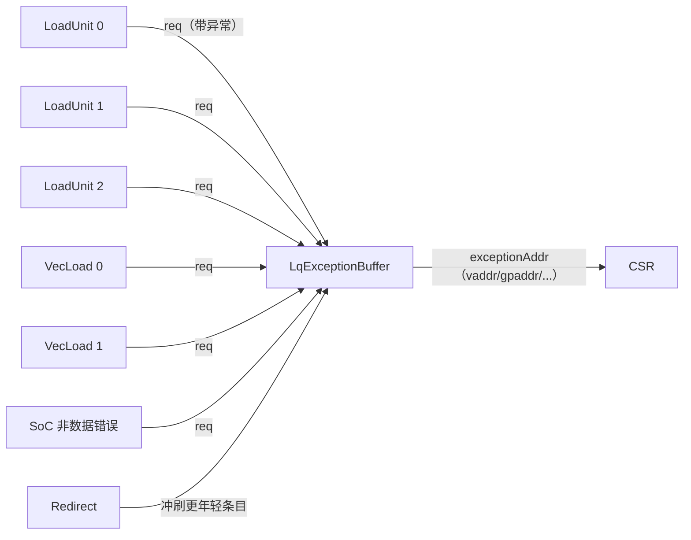
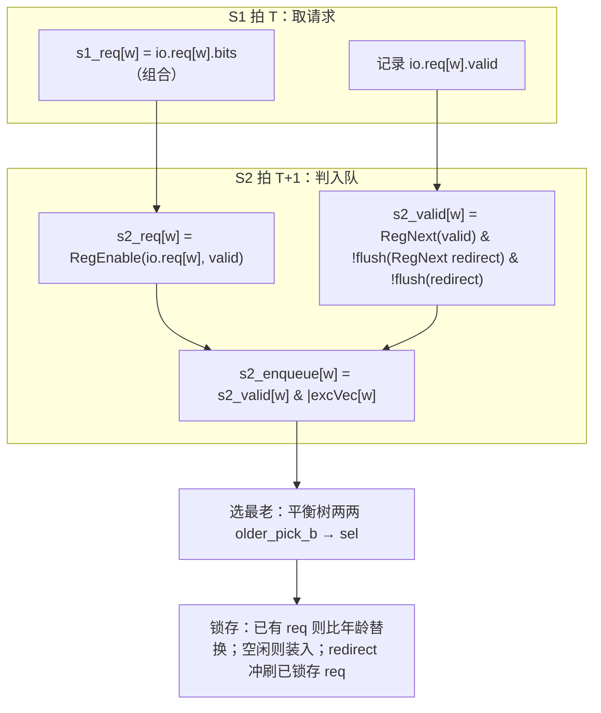
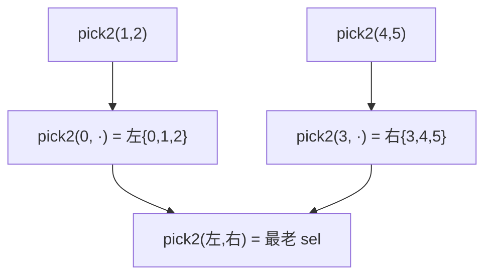

# LqExceptionBuffer —— Load 访存异常缓冲

> 可读重写学习文档。设计意图源：
> `src/main/scala/xiangshan/mem/lsqueue/LoadExceptionBuffer.scala`（class LqExceptionBuffer）。
> 可读核：`rtl/memblock/LqExceptionBuffer.sv`（`xs_LqExceptionBuffer_core`）+ 共享包
> `rtl/memblock/exceptionbuffer_pkg.sv`（与 StoreExceptionBuffer 共用年龄比较/最老选择）。

---

## 1. 它在访存子系统中的位置与作用

香山是乱序核，多条 load 在不同流水口并行执行。一条 load 在执行到 **load_s2** 时可能检出
访存异常：断点、地址非对齐、访问错误、缺页、硬件错误、Guest 缺页（虚拟化两级页表）。
这些异常不能就地处理——必须等对应 uop 在 **ROB 提交点**按程序序处理。于是每条带异常的
load 把自己的异常信息（虚地址 fullva、物理 gpaddr、是否 hyper/vaNeedExt 等）报给本缓冲。

`LqExceptionBuffer` 的职责很简单但关键：**在所有报上来的异常里只保留最老的一条**，
并持续把它的地址信息输出给 CSR（trap 发生时读取 `mtval`/`htval` 等）。



**为什么只留最老一条？** 异常在提交点按序处理，最老的异常最先到达提交点、最先触发 trap
或重定向；它引发的 redirect 会把更年轻的指令（含其异常）全部冲掉。因此缓冲只需维护
“当前看到的最老异常”这一条状态即可，无需排队。

### 入口构成（enqPortNum = LoadPipelineWidth + VecLoadPipelineWidth + 1 = 3+2+1 = 6）
| 入口 | 来源 |
|------|------|
| 0,1,2 | 3 条标量 load 流水（LoadPipelineWidth） |
| 3,4   | 2 条向量 load 流水（VecLoadPipelineWidth） |
| 5     | SoC/总线侧产生的非数据错误（mmio bus non-data error） |

---

## 2. 两级流水时序



### S2 的两次 redirect 冲刷（Lq 特有，易错点）
`s2_valid` 同时排除 **两个版本的 redirect**：
```
s2_valid(w) = RegNext(s1_valid(w))
            & !robIdx.needFlush(RegNext(io.redirect))   // 上一拍的 redirect
            & !robIdx.needFlush(io.redirect)            // 当拍的 redirect
```
原因：被报上来的请求在 S1→S2 之间跨了一拍，这一拍内可能来 redirect；既要挡住与 s2_req
同拍捕获的“旧 redirect”，也要挡住“当拍 redirect”，两者命中任一都说明该 load 已被冲刷、
其异常作废。可读核里对应 `redirect_*_q`（打 1 拍版）与当拍 `redirect_*` 各做一次
`rob_need_flush`。

> 注意：这是与 **StoreExceptionBuffer 的关键区别**——store 在 S1 就把异常判定与一次
> redirect 冲刷折进 `s1_valid`，S2 只再排除一次**当拍** redirect（没有 RegNext 版）。

---

## 3. 选最老：平衡归约树

Chisel `selectOldest` 把 6 路请求递归二分（`take(3)` 与 `takeRight(3)`），逐层两两比年龄
选更老的一条。可读核用纯函数 `pick2`（封装 pkg 的 `older_pick_b`）显式搭出同样的树：



**两两选最老 `older_pick_b`（pkg）** 返回“应选 b（即 a 比 b 年轻、丢弃 a）”：
```
两方都 valid : isAfter(a,b) | (robIdx 平手 & a.uopIdx > b.uopIdx)
否则         : 选 valid 的一方（va ? a : b）
```
- `isAfter(a,b) = a.flag ^ b.flag ^ (a.value > b.value)`：a 比 b 更年轻 → 选 b（更老）。
- 平手维度：robIdx 相同（同一指令的不同 uop），uopIdx 大者更靠后 → 选 uopIdx 小的。
  **Lq 这里用严格相等 `rob_eq`**（`eq_is_not_before=0`）。

---

## 4. 锁存最老异常（单条 req 寄存器）

```
// valid 续命/置位/冲刷
req_valid 已置 且 被 redirect 冲刷 → req_valid := 本拍是否有新入队
否则 有新入队                      → req_valid := 1
// bits 更新
已锁存 req：若新选出的 sel 更老（即已锁存的 req 比 sel 更年轻）→ 用 sel 替换
空闲     ：有新入队即装入 sel
```
“已锁存 req 比 sel 更年轻”用同一个 `older_pick_b(va=1, vb=sel_v, req, sel, …)` 复用判断
（仍是 Lq 严格相等语义）。这样无论 req 是否已被冲刷，新来的更老异常都能正确替换，
保持输出始终是“迄今最老”。

输出直接来自锁存寄存器：
```
exceptionAddr.vaddr             = req.fullva
exceptionAddr.vaNeedExt         = req.vaNeedExt
exceptionAddr.isHyper           = req.isHyper
exceptionAddr.gpaddr            = req.gpaddr
exceptionAddr.isForVSnonLeafPTE = req.isForVSnonLeafPTE
```
（Scala 还赋了 `vstart`/`vl`，但下游未用，firtool 已消除，故 golden/可读核均无该输出端口。）

---

## 5. 接口表（golden 扁平端口）

| 端口 | 方向 | 说明 |
|------|------|------|
| `io_redirect_*` | in | 重定向（冲刷比其更年轻的条目/已锁存 req） |
| `io_req_{0..5}_valid` | in | 各入口请求有效 |
| `io_req_{0..5}_bits_uop_exceptionVec_{3,4,5,13,19,21}` | in | Ldu 6 个相关异常位 |
| `io_req_{0..5}_bits_uop_{uopIdx,robIdx_flag,robIdx_value}` | in | 年龄信息 |
| `io_req_{0..5}_bits_{fullva,vaNeedExt,gpaddr,isHyper,isForVSnonLeafPTE}` | in | 异常地址信息 |
| `io_exceptionAddr_{vaddr,vaNeedExt,isHyper,gpaddr,isForVSnonLeafPTE}` | out | 当前最老异常的地址信息 |

> **死代码端口**（firtool 按下游裁剪）：入口 3,4 无 `isHyper/isForVSnonLeafPTE`；入口 5 无
> `vaNeedExt`。wrapper 对缺失输入补 golden 折叠的常量：`isHyper/isForVSnonLeafPTE` 补 0，
> 入口 5 的 `vaNeedExt` 补 **1**（golden 把缺失的 `s2_req_5_vaNeedExt` 折成常量 1）。

---

## 6. 验证

### 6.1 结构闸门（实测）
| 指标 | core | 共享 pkg |
|------|------|----------|
| `typedef struct packed` | 1（`s2_entry_t`，含输出 req 寄存器） | 1（`rob_ptr_t`） |
| `typedef enum` | 0 | 2（`ldu_exc_e`/`sta_exc_e` 标注异常位含义） |
| `function automatic` | 1（`pick2`） | 5（年龄比较 + `older_pick_b`） |
| `for` 循环 | 2（s2 寄存器更新 / s2_enqueue 判定） | — |
| 展平名/生成痕迹 grep | 0 | 0 |
| 行数 | 197 | （pkg 共享）对比 golden 1026（≈5×精简） |

### 6.2 UT（golden `u_g` vs 可读 `u_i` 双例化逐拍比对全部 5 个输出）
seed 1 / 7 / 42 各 **199995 checks，errors = 0**（WARMUP=4 跳过复位瞬态）。
激励：6 个入口的 valid（~67% 概率）、异常位（~50%/位）、robIdx/uopIdx 小范围随机，
使“多入口同拍带异常 + 年龄并列”频繁发生，充分覆盖选最老树与替换逻辑；redirect ~6% 概率。

### 6.3 FM
golden 顶层（纯叶子）vs 可读同名 wrapper（→ 可读核）。末次 verify 结论 **Verification
FAILED**：**1055 passing / 20 failing / 113 unverified**（20 是 Formality 默认
`verification_failing_point_limit=20` 的截断上限——verify 攒满 20 个失配即提前中止，
113 个 unverified 点未验）。已报告的 20 个 failing 全部为 `u_core/req_r_reg[fullva]`，
根因是寄存器边界命名差异：
- golden 把 6 个入口的 `RegNext(io.req.valid)` 写成不规则命名的 6 个标量
  （`s2_valid_REG`、`s2_valid_REG_2`、`…_10`），把每入口的 `RegNext(redirect)` 复制成 6 份；
  可读核用一个向量 `s2_valid_q[6]` + 一份 `redirect_*_q`。
- golden 的 req 寄存器是逐字段标量（`req_uop_robIdx_value`/`req_uop_uopIdx`/`req_fullva`…），
  可读核是一个 `s2_entry_t` struct（`req_r[robIdx][value]`/`req_r[uopIdx]`/`req_r[fullva]`）。

共享 `fm_eq.tcl` 的展平名自动配对规则无法跨越这两类结构差异（golden 不规则标量名 ↔ 向量
下标名；struct 字段名 ↔ golden 逐字段标量名），导致这些寄存器 unmatched，其下游
`req_r[fullva]` 比对点误判 failing。**已用 tb 内部层次探针证伪**：在 200000 拍内逐拍
直接比对 `u_g.req_fullva/req_gpaddr/req_uop_robIdx_value/req_uop_uopIdx` 与可读核
`u_core.req_r.*`，三种子 **probe_mm = 0**（数值恒等）。结论口径：UT（5 个输出逐拍 0 错 +
探针 0 分歧）为权威；FM 为部分验证——1055 passing，20 failing（截断）已证伪，113
unverified 未覆盖。

> 不为了让 FM 好过而把可读核改回 golden 的展平标量命名（违反重写准则）。
