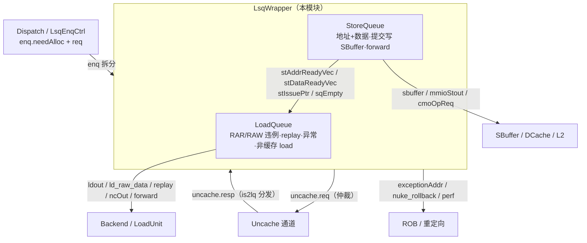
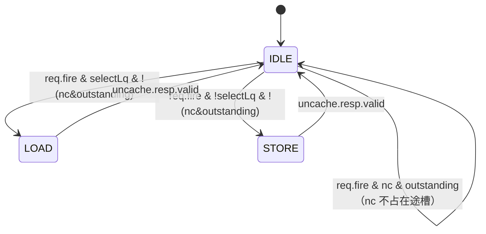

# LsqWrapper —— Load/Store 队列包装器

> ⚠ **FM 分类 = ASSEMBLY_EQ（装配层，仅证 glue）**。依据台账
> [`verif/freeze/FM_STATUS.md`](../../verif/freeze/FM_STATUS.md)：本模块 FM 把 `LoadQueue / StoreQueue`
> 两侧同名黑盒（`FM_INTERFACE_ONLY`），**只证明本层包装 glue（入队拆分/uncache FSM/异常地址
> 选择/perf）相对队列边界引脚等价**，不等于整个 LSQ 功能等价（两队列在各自模块证明）。

> 香山 V2R2 乱序访存（LSU）的**队列层顶层**。
> 设计意图来源：`src/main/scala/xiangshan/mem/lsqueue/LSQWrapper.scala`
> 可读核：`rtl/memblock/LsqWrapper.sv`（`xs_LsqWrapper_core`）+ `rtl/memblock/lsq_pkg.sv`

## 1. 架构定位

`LsqWrapper` 把两个大子模块拼装成统一的访存队列接口：

- **LoadQueue**：维护在飞 load——虚/实地址、数据、异常、replay 信息；做
  load-load(RAR) 与 store-load(RAW / nuke) 违例检测；向 ROB 报异常；调度 replay；
  处理非缓存 load；回写 `ldout` / `ld_raw_data` / `forward`。
- **StoreQueue**：维护在飞 store——地址 + 数据入队；提交后向 SBuffer/DCache 写；
  给 load 提供 `forward` 数据；处理非缓存/MMIO store、CMO。

`LsqWrapper` 自身**只承担包装级控制**，逻辑量很小；绝大多数端口是两队列与顶层
之间的直通连线（共 1609 个端口，682 输出大多是子模块输出口的直连）。

## 2. 包装级逻辑（本模块真正实现的 5 件事）

### 2.1 入队拆分 + canAccept 联立
Dispatch 一拍最多送 6 条访存 uop。每条 uop 的 `needAlloc` 是 2 bit：
`bit0` 需要 LoadQueue 表项、`bit1` 需要 StoreQueue 表项。拆分后各自与 `req.valid`
相与得到写入对应队列的 fire。两队列的 `canAccept` 互为对方入队前提
（`io_lqCanAccept` / `io_sqCanAccept` 分别反映）。用 `genvar` 铺开 6 路。

### 2.2 StoreQueue → LoadQueue 就绪互联
LoadQueue 做 RAW 违例与 forward 时需要 StoreQueue 各表项的“地址就绪/数据就绪”
向量与发射/就绪指针（`stAddrReadyVec[56]` / `stDataReadyVec[56]` / `stIssuePtr` /
`sqEmpty`）。这些纯属两队列内部联络，不出顶层（`sqEmpty` 例外，也外露）。

### 2.3 非缓存（uncache / MMIO）仲裁状态机
下游 uncache 通道一次只能在飞一笔事务，故用 3 态 FSM 仲裁 Load/Store 两路请求：

- `selectLq = pick_load(...)`：IDLE 拍按 **robIdx 年龄**择老者放行
  （只 Load 有请求选 Load；两者都有则较老者优先）。
- `req` 仅在 IDLE 拍放行；`resp` / `idResp` 按 `is2lq` 分发回对应队列。
- `cmd`：load 带自身 cmd，store uncache 固定 `5'h1`。
- **复位域**：`unc_state`（golden `pendingstate`）是本模块唯一用**异步复位**的寄存器
  （golden `always @(posedge clock or posedge reset)`）；其余(exceptionAddr 选择打拍 /
  perf 打拍)为同步或无复位。可读核照搬异步复位，否则 FM 判 async-DFF vs sync-DFF 不等价。

`age_before` / `pick_load` 实现为 `lsq_pkg` 的纯函数。

### 2.4 异常地址延迟选择
ROB 提交触发异常到队列 deqPtr 更新延迟两拍。异常地址在 trigger 之后一拍被用，
故把“该异常是否来自 store”打一拍（`exc_is_store_d`），用它在 StoreQueue 与
LoadQueue 给出的 7 个异常地址字段间选择。

### 2.5 性能事件两级打拍
36 个性能计数器（LoadQueue 前 28、StoreQueue 后 8）各打两拍对齐后输出，
用 `genvar` 统一铺开。

## 3. 文件清单

| 文件 | 说明 |
|------|------|
| `rtl/memblock/lsq_pkg.sv` | 参数 + `rob_idx_t` struct + `uncache_arb_e` enum + `age_before`/`pick_load` 纯函数 |
| `rtl/memblock/LsqWrapper.sv` | 可读核 `xs_LsqWrapper_core`（手写包装级逻辑，含 5 节）|
| `rtl/memblock/LsqWrapper_ports.svh` | 核端口表（生成）|
| `rtl/memblock/LsqWrapper_inst.svh` | LoadQueue/StoreQueue 实例连接表（生成，直通端口连顶层、被接管端口连 readable 网）|
| `rtl/memblock/LsqWrapper_perf_out.svh` | 36 路 perf 接出（生成）|
| `rtl/memblock/LsqWrapper_wrapper.sv` | golden 同名扁平 wrapper（FM/ST 用，生成）|
| `scripts/gen_lsqwrapper.py` | 生成器 |
| `verif/ut/LsqWrapper/` | UT（Makefile / variants_xs.sv / tb.sv）|

> 说明：可读核例化 `LoadQueue` / `StoreQueue` 两个 golden 子模块（与 golden 完全
> 一致）。手写的包装级逻辑约 320 行（核 239 + pkg 81）；实例连接表 `*_inst.svh`
> 约 1942 行纯属与两队列的机械互联（无任何生成临时名），是不可约的接线。

## 4. 验证结果

- **UT**：与 golden `LsqWrapper` 双例化逐拍比对全部 682 个输出。
  种子 1 / 7 / 42 各 200000 检查 **errors=0 TEST PASSED**。
  两侧共用同一批 golden 子模块（LoadQueue/StoreQueue 及其 41 个闭包子件）。
- **FM（ASSEMBLY_EQ：仅包装级 glue 等价）**：`make fm` 结论
  **Verification SUCCEEDED —— 13929 passing / 0 failing / 0 unverified**（全貌 limit=5000）。
  **该 SUCCEEDED 只覆盖本层 glue**（两队列 `FM_INTERFACE_ONLY` 黑盒），不代表整 LSQ 功能等价。
  三处关键设置：
  1. **`FM_INTERFACE_ONLY = LoadQueue StoreQueue`**：两队列两侧读同一份 golden，用 interface_only
     在**边界处**黑盒(保留端口方向、不展开内部)。否则 FM 需在 `u_core/loadQueue` 与 golden
     `loadQueue` 之间逐位配对 7 万+ 队列内部寄存器，层次名 + 展平差异令绝大多数无法配对、余下误
     判失配(~4640)。队列各自有独立 UT/FM，本层只验包装 glue 相对**队列边界引脚**的等价。
  2. **实例名与 golden 对齐**(`loadQueue`/`storeQueue`，原 `u_load_queue`/`u_store_queue`)，
     使黑盒后边界 BBPin 两侧按 实例名+引脚名 配对。
  3. **`fm_pins_pre.tcl`**：golden perf 用逐下标具名寄存器 `io_perf_<N>_value_REG[_1]`，impl 用
     genvar 数组 `perf_stage1/2_reg[N]`；命名同构但 stem 不同，auto_match 对个别下标跨级误配，
     故预钉全部 36 路两级 + uncache FSM 状态(`pendingstate`↔`unc_state`)。
     `FM_MERGE_DUP` 采用默认 `true`：黑盒队列后不再需要关合并，反而需开启以让 golden 把
     exceptionAddr 选择寄存器复制的 5 副本归一，配对 impl 合并后的单个 `exc_is_store_d`。
  - **修复的真实 glue bug**：`unc_state` 原用同步复位，golden `pendingstate` 是异步复位，改为
    `always_ff @(posedge clock or posedge reset)` 对齐(见 §2.3 复位域)。
- 本层 glue 等价以 FM(ASSEMBLY_EQ SUCCEEDED，仅 glue) + UT(682 输出、3 种子各 200k 拍逐拍
  errors=0)佐证；**整 LSQ 功能等价须叠加 LoadQueue/StoreQueue 各自证明**（见文首 banner）。

## 5. 结构门槛（可读性自检）

可读核 + pkg：`typedef struct packed` ×1（`rob_idx_t`）、`typedef enum` ×1
（`uncache_arb_e`）、`function automatic` ×2（`age_before` / `pick_load`）、
`genvar/for` ×3（enq 拆分 / perf）。核 + pkg 中展平名/生成痕迹
（`io_x_n_m` / `_REG_n` / `_GEN_` / `_T_n` / `RANDOMIZE`）计数 = 0。
