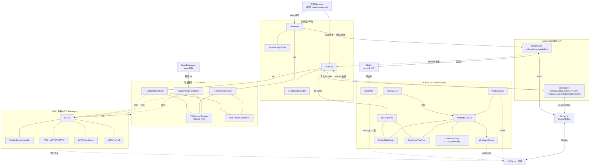

# 香山 V2R2（昆明湖）访存子系统 MemBlock —— 学习导读 + 重写计划

> 前端(Frontend)已全部可读重写+验证完成(见 `docs/frontend/`)。本文是访存子系统的总览与
> 重写进度索引,作为阅读 `docs/memblock/` 下各模块文档的脉络。

## 1. MemBlock 在做什么

后端把访存指令(load/store/atomic)发给访存子系统。MemBlock 负责:
1. **地址翻译**:虚拟地址 → 物理地址(DTLB),miss 时走页表(L2TLB/PTW),并做权限检查(PMP)。
2. **load 执行**:LoadUnit 流水 —— 查 DTLB、访 DCache、从 StoreQueue/SBuffer forward、未命中 replay。
3. **store 执行**:StoreUnit 算地址写 StoreQueue;数据待提交后经 SBuffer 合并写 DCache。
4. **顺序与一致性**:LoadQueue/StoreQueue(LsqWrapper)维护访存顺序、检测 load-store 违例、重放。
5. **缓存**:DCache(DCacheWrapper)+ SBuffer(写合并)+ Uncache(MMIO/非缓存)。

## 2. 顶层结构(golden MemBlock 直接例化)

```
MemBlock (31138 行, 1346 端口)
├─ LsqWrapper      (5735)  load/store 队列:LoadQueue + StoreQueue + 违例检测/重放
├─ Sbuffer         (21725) store 写合并缓冲(提交后的 store 攒够再写 DCache)
├─ DCacheWrapper   (1579+) L1 数据缓存(MainPipe/MissQueue/WBQueue/Meta/Data/Replacer…)
├─ L2TLBWrapper    (850)   共享 MMU:页表遍历器 PTW + page cache（前端 ITLB 也回这里走页表）
├─ TLBNonBlock ×3  (4516)  数据侧 DTLB:load / store / prefetch（→ TlbStorageWrapper）
├─ PMP (2269) + PMPChecker ×8 (861)  物理内存保护(权限/PMA 检查)
├─ Uncache         (1740)  非缓存/MMIO 访问(TileLink)
└─ TLBuffer/TLXbar/Pipeline/PFEvent/DelayN  TileLink 缓冲/交叉开关/性能

注:LoadUnit(5435)/StoreUnit(1640) 是 load/store 执行流水单元,RTL 层级上在 MemBlock 之外
    (Backend/XSCore 级例化),但功能上是访存的心脏,一并纳入访存重写范围。
```

### 2.1 子系统级互联大图(模块到模块)

> 下图把访存各**真实模块**(对应 `rtl/memblock/*.sv`)连成互联图:后端发 load/store →
> 地址翻译(DTLB+PMP)→执行单元(Load/StoreUnit)→顺序队列(LsqWrapper)→缓存(DCache/SBuffer/Uncache)→L2;
> MMU(L2TLB/PtwCache/PTW)作为 TLB miss 时的旁路页表服务。框可点开对应文档(链接见图下)。



**图中模块 → 文档**:
[MemBlock](MemBlock.md)(顶层) · [LoadUnit](LoadUnit.md) / [StoreUnit](StoreUnit.md) · [LoadMisalignBuffer](LoadMisalignBuffer.md) / [StoreMisalignBuffer](StoreMisalignBuffer.md) · [TLBNonBlock](TLBNonBlock.md) / [TlbStorageWrapper](TlbStorageWrapper.md) / [TLBFA](TLBFA.md) · [PMP](PMP.md) / [PMPChecker](PMPChecker.md) · [LsqWrapper](LsqWrapper.md) · [LoadQueue](LoadQueue.md)([VirtualLoadQueue](VirtualLoadQueue.md)/[LoadQueueRAR](LoadQueueRAR.md)/[LoadQueueRAW](LoadQueueRAW.md)/[LoadQueueReplay](LoadQueueReplay.md)/[LoadQueueUncache](LoadQueueUncache.md)/[LqExceptionBuffer](LqExceptionBuffer.md)) · [StoreQueue](StoreQueue.md)([StoreExceptionBuffer](StoreExceptionBuffer.md)) · [DCache](DCache.md) / [DCacheWrapper](DCacheWrapper.md) · [LoadPipe](LoadPipe.md) / [StorePipe](StorePipe.md) / [MainPipe](MainPipe.md) / [MissQueue](MissQueue.md) / [WritebackQueue](WritebackQueue.md) / [ProbeQueue](ProbeQueue.md) · [BankedDataArray](BankedDataArray.md) / [DuplicatedTagArray](DuplicatedTagArray.md) / [L1CohMetaArray](L1CohMetaArray.md) / [L1FlagMetaArray](L1FlagMetaArray.md) · [Sbuffer](Sbuffer.md) · [Uncache](Uncache.md) · [StorePfWrapper](StorePfWrapper.md) · [L2TLB](L2TLB.md) / [L2TLBWrapper](L2TLBWrapper.md) / [PtwCache](PtwCache.md) / [PTW](PTW.md) / [LLPTW](LLPTW.md) / [HPTW](HPTW.md) / [L2TlbMissQueue](L2TlbMissQueue.md) / [L2TlbPrefetch](L2TlbPrefetch.md) · [TLBuffer](TLBuffer.md) / [Pipeline](Pipeline.md)(TileLink)

## 3. 重写顺序(自底向上 + 并行,沿用前端方法学)

**第 1 层 叶子(纯逻辑/无子模块,FM 直接干净,可并行)**：
- LoadUnit、StoreUnit（LSU 流水核心,教学价值最高）
- PMP、PMPChecker（内存保护,前端/访存共用）
- TlbStorageWrapper（DTLB 的存储,解阻塞 TLBNonBlock）

**第 2 层 中层**：
- TLBNonBlock（DTLB,用 TlbStorageWrapper）、Uncache、L2TLBWrapper(PTW)
- Sbuffer（写合并,大）、DCache 各子件(MainPipe/MissQueue/Meta/Data/Replacer)

**第 3 层 聚合**：
- DCacheWrapper、LsqWrapper(LoadQueue+StoreQueue)

**第 4 层 顶层**：
- MemBlock（总集成,1346 端口）

## 4. 方法学(与前端一致,已验证)

- 每模块:可读核 `xs_<M>_core`(struct/enum/数组/genvar/纯函数 + 中文注释,0 生成痕迹)
  + golden 同名 wrapper(机械适配)+ 多种子 UT(seed 1/7/42)+ Formality 等价。
- 子模块当 golden 黑盒例化(`hdlin_unresolved_modules=black_box`);叶子模块 FM 直接干净。
- **X 铁律**:`array[可能为X的索引]` 恒 X → 改三元 mux。FM 假阳性(黑盒引脚/不可达态)用 tb 内部
  层次探针逐拍证伪。验证流程见 `scripts/ut_common.mk` / `fm_eq.tcl`。

## 5. 进度

| 模块 | 层 | 状态 | 文档 |
|------|----|------|------|
| LoadUnit | 1 | ✅ 完成 | [LoadUnit.md](LoadUnit.md) |
| StoreUnit | 1 | ✅ 完成 | [StoreUnit.md](StoreUnit.md) |
| PMP / PMPChecker | 1 | ✅ 完成 | [PMP.md](PMP.md) |
| TlbStorageWrapper | 1 | ✅ 完成 | [TlbStorageWrapper.md](TlbStorageWrapper.md) |
| TLBFA | 1 | ✅ 完成 | [TLBFA.md](TLBFA.md) |
| Uncache | 2 | ✅ 完成 | [Uncache.md](Uncache.md) |
| TLBNonBlock (DTLB) | 2 | ✅ 完成 | [TLBNonBlock.md](TLBNonBlock.md) |
| Sbuffer | 2 | ✅ 完成 | [Sbuffer.md](Sbuffer.md) |
| LoadQueueRAR | 2 | ✅ 完成 | [LoadQueueRAR.md](LoadQueueRAR.md) |
| LoadQueueRAW | 2 | ✅ 完成 | [LoadQueueRAW.md](LoadQueueRAW.md) |
| StoreQueue | 2 | ✅ 完成 | [StoreQueue.md](StoreQueue.md) |
| DCacheWrapper | 3 | ✅ 完成(DCache内层黑盒) | [DCacheWrapper.md](DCacheWrapper.md) |
| LsqWrapper | 3 | ✅ 完成(LoadQueue/StoreQueue黑盒) | [LsqWrapper.md](LsqWrapper.md) |
| VirtualLoadQueue | 2 | ✅ 完成 | [VirtualLoadQueue.md](VirtualLoadQueue.md) |
| LoadQueueReplay | 2 | ✅ 完成(replay调度器55k→1243行) | [LoadQueueReplay.md](LoadQueueReplay.md) |
| LoadQueueUncache | 2 | ✅ 完成(codex产出+resume) | [LoadQueueUncache.md](LoadQueueUncache.md) |
| Lq/StoreExceptionBuffer | 2 | ✅ 完成 | [LqExceptionBuffer.md](LqExceptionBuffer.md) |
| Load/StoreMisalignBuffer | 2 | ✅ 完成 | [LoadMisalignBuffer.md](LoadMisalignBuffer.md) |
| LoadQueue 顶层 | 3 | ✅ 完成(6子队列黑盒互联) | [LoadQueue.md](LoadQueue.md) |
| PTW (页表遍历器) | 2 | ✅ 完成(codex产出+resume) | [PTW.md](PTW.md) |
| L2TLBWrapper | 3 | ✅ 完成(L2TLB黑盒) | [L2TLBWrapper.md](L2TLBWrapper.md) |
| StorePfWrapper | 2 | ✅ 完成(codex产出) | [StorePfWrapper.md](StorePfWrapper.md) |
| HPTW | 2 | ✅ 完成(H扩展G-stage) | [HPTW.md](HPTW.md) |
| LLPTW | 2 | ✅ 完成(末级PTW,6路并发) | [LLPTW.md](LLPTW.md) |
| L2TlbMissQueue | 2 | ✅ 完成 | [L2TlbMissQueue.md](L2TlbMissQueue.md) |
| L2TlbPrefetch | 2 | ✅ 完成 | [L2TlbPrefetch.md](L2TlbPrefetch.md) |
| MainPipe (DCache主流水) | 2 | ✅ 完成(MESI一致性) | [MainPipe.md](MainPipe.md) |
| WritebackQueue (DCache) | 2 | ✅ 完成 | [WritebackQueue.md](WritebackQueue.md) |
| ProbeQueue (DCache) | 2 | ✅ 完成 | [ProbeQueue.md](ProbeQueue.md) |
| LoadPipe (DCache) | 2 | ✅ 完成 | [LoadPipe.md](LoadPipe.md) |
| StorePipe (DCache) | 2 | ✅ 完成(golden空壳+学习核) | [StorePipe.md](StorePipe.md) |
| PtwCache (页表cache) | 2 | ✅ 完成(最大模块,探针揪出两轮真bug) | [PtwCache.md](PtwCache.md) |
| DCache MissQueue | 2 | ✅ 完成 | [MissQueue.md](MissQueue.md) |
| BankedDataArray | 2 | ✅ 完成 | [BankedDataArray.md](BankedDataArray.md) |
| DuplicatedTagArray | 2 | ✅ 完成 | [DuplicatedTagArray.md](DuplicatedTagArray.md) |
| L1Coh/FlagMetaArray | 2 | ✅ 完成 | [L1CohMetaArray.md](L1CohMetaArray.md) |
| L2TLB 顶层 | 3 | ✅ 完成(MMU总集成,子模块黑盒) | [L2TLB.md](L2TLB.md) |
| DCache 顶层 | 3 | ✅ 完成(23.6k行互联,setPLRU) | [DCache.md](DCache.md) |
| TLBuffer / Pipeline | 2 | ✅ 完成(codex产出) | [TLBuffer.md](TLBuffer.md) |
| MemBlock 顶层 | 4 | ✅ 完成(总集成1346端口/71实例,全子模块黑盒) | [MemBlock.md](MemBlock.md) |

> **访存子系统 MemBlock 全部模块重写完成**(约 43 个模块,含 capstone 顶层)。验证标准:可读核结构闸门(struct/enum/function/genvar>0,0生成痕迹) + 多种子UT(seed1/7/42全输出逐拍0错)
> + FM等价(叶子模块直接SUCCEEDED;大模块因struct数组vs golden扁平标量配对不收敛→以UT为权威+层次探针证伪failing点)。
> 部分模块由 codex(gpt-5.5)并行产出/调试(PTW/LoadQueueUncache/StorePfWrapper/TileLink/PtwCache起步),其余由 Claude 子agent产出,**全部经独立复核**(结构grep+多种子UT重跑+FM,不凭自报)。
> **关键教训**:UT输出会漏覆盖内部状态分叉,必须用tb内部层次探针逐拍比对golden内部寄存器才能抓到真bug(PtwCache的l1v/l3v valid分叉、l1/l2/l3replace漏reset即此类,UT全过却是真潜伏bug)。
