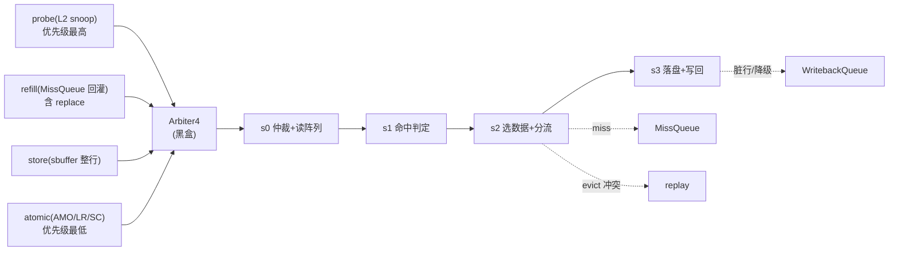
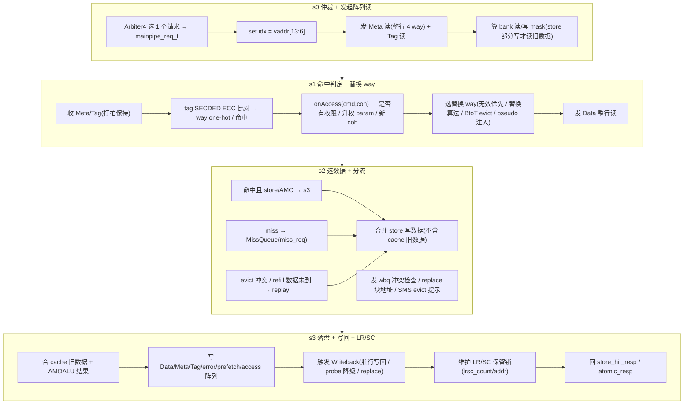
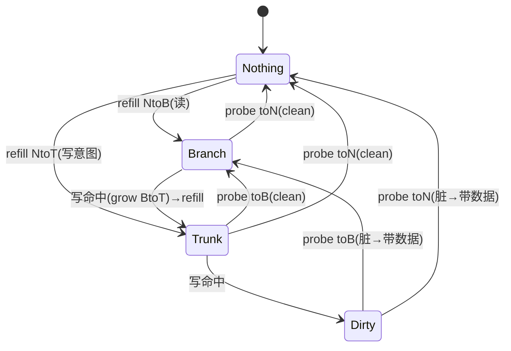

# MainPipe —— L1 DCache 主流水（可读重写）

> ✅ **FM 分类 = REPLACEMENT_EQ（可读核真驱动 + 冻结基线原生 SUCCEEDED）**。依据台账
> [`verif/freeze/FM_STATUS.md`](../../verif/freeze/FM_STATUS.md) 与冻结基线日志
> `verif/ut/MainPipe/fm_work/MainPipe/fm_full.log`：本模块在当前冻结 golden 基线上 FM **原生
> `Verification SUCCEEDED`，8932 passing / 0 failing / 0 unverified**。下文验证节里任何
> "FAILED / 20 failing 截断 / 部分验证 / 未收敛"的表述是**冻结前的旧叙事，已作废**——以本
> banner 与台账为准。

> 设计意图来源：`src/main/scala/xiangshan/cache/dcache/mainpipe/MainPipe.scala`
> 一致性协议：rocket-chip `tilelink/Metadata.scala`、`tilelink/Bundles.scala`、`rocket/Consts.scala`
> 可读核：`rtl/memblock/MainPipe.sv`（`xs_MainPipe_core`）+ 类型包 `rtl/memblock/mainpipe_pkg.sv`
> 端口适配层：`rtl/memblock/MainPipe_wrapper.sv`（golden 同名 `MainPipe`，直通核）
> 黑盒子模块：`AMOALU`、`Arbiter4_MainPipeReq`（golden 叶子，UT/FM 两侧共用）

## 1. 在 DCache 中的位置

L1 DCache 内有两条流水线：

- **LoadPipe**：只读，处理标量/向量 load，不在本模块。
- **MainPipe（本模块）**：DCache 的「写侧主流水」，串行处理所有**会改写 cache 或一致性状态**的请求。

MainPipe 把五类请求经 `Arbiter4_MainPipeReq` 按**固定优先级**合并成统一的 `mainpipe_req_t`，再流过 s0~s3 四级：

> 注：load 不经过本流水，只通过 data SRAM 读端口与本流水竞争（本顶层配置该竞争端口 `io_data_read` 已被裁，故 `storeCanAccept` 恒真）。

## 2. 四级流水职责

### 2.1 s2 分流细节：refill 未到的「阻 1 拍再 replay」两态 FSM

miss 请求进 s2 但 **refill 数据还没到**（`s2_req_miss_without_data = s2_valid & s2_req.miss &
~io_refill_info_valid`，`MainPipe.sv:788`）时，**不立刻 replay**，而是先强制阻 1 拍。用一个单 bit
寄存器 `s2_can_go_to_mq_no_data_r` 做两态节流（`:790-795`）：

- `s2_valid` 时更新：`s2_can_go_to_mq_no_data_r <= s2_req_miss_without_data & ~s2_can_go_to_mq_no_data`；
- 判定：`s2_can_go_to_mq_no_data = s2_req_miss_without_data & s2_can_go_to_mq_no_data_r`。

第一拍 reg=0 → `can_go=0`（强制停一拍），第二拍 reg=1 → `can_go=1` 放行去 MissQueue replay；放行同
拍 reg 又被清 0，形成「阻 1 拍 → 放 1 拍」的交替节流，避免 refill 未到时同一条 miss 反复空转 replay。
最终 `s2_can_go_to_mq_replay = s2_can_go_to_mq_no_data | s2_replace_block`（`:796`，后者是 evict
冲突阻塞）。

### 2.2 s3 LR/SC 保留锁 + backoff 窗口

s3 维护 LR/SC 保留锁（`MainPipe.sv:906-1018`）：

- **保留计数 `lrsc_count`**（6 位，`LRSC_CYCLES=64`）：LR 命中且可做 AMO（`s3_can_do_amo & s3_lr`）时
  置 `LRSC_CYCLES-1`(=63) 并把块地址存入 `lrsc_addr`（`:1005/1011`）；其它 LR/SC 处理拍（如 SC）清 0；
  `io_invalid_resv_set`（外部使能，如别的核抢锁）清 0；否则每拍自减（`:1002-1009`）。
- **backoff 窗口**：保留锁**只在 `lrsc_valid = lrsc_count > LRSC_BACKOFF`(=3) 时才算有效**
  （`:908`）——计数尾部 3 拍（count 1..3）刻意判为失效。这是 LR/SC 活锁避免（back-off）：两核互相
  打断对方保留时，尾窗让 SC 必然失败一次，打破对称重试死循环。
- **SC 成败**：`s3_sc_fail = s3_sc & (~s3_lrsc_addr_match | ~s3_hit)`（`:911`），其中
  `s3_lrsc_addr_match = lrsc_valid & (lrsc_addr == s3_block_addr)`（`:910`）。即 SC 要求保留仍有效、
  地址匹配且命中，否则失败（不写数据、不更新 meta、回失败码）。
- **对外锁信息**：`io_lrsc_locked_block_valid = lrsc_valid` / `io_lrsc_locked_block_bits = lrsc_addr`
  把当前被保留的块告知外部（供 load/store 冲突判定）；`io_update_resv_set = s3_valid & s3_lr &
  s3_can_do_amo`（`:1018`）通知新建保留集；**`io_block_lr = RegNext(lrsc_count > 0)`**（`:1013-1017`）
  ——只要保留在途（含 backoff 尾窗）就打一拍后阻止新的 LR 发起。

## 3. 一致性状态机（MESI on TileLink）

一致性状态 `coh_e`（2 bit）：`Nothing(I) / Branch(S,只读) / Trunk(E,可写未脏) / Dirty(M)`。
本核把三组协议转换写成 `mainpipe_pkg` 的纯函数，逐条对照 rocket-chip `ClientMetadata`：

| 函数 | 对应 Scala | 用途 |
|------|-----------|------|
| `grow_starter(cmd_cat, coh)` | `growStarter` | s1 判断 cmd 在当前 coh 下是否命中、未命中需升权 param(NtoB/NtoT/BtoT)、命中新 coh |
| `shrink_helper(wanted, coh)` | `shrinkHelper` | s3 probe 降级 / flush 降级：返回是否带脏数据、shrink param、降级后 coh |
| `miss_coh_gen(cmd_cat, param, dirty)` | `missCohGen` | s3 miss 补块完成后依 grant param 推新 coh（本配置 `miss_dirty` 端口被裁恒 0）|

> **写回是否带数据 ≠ coh 转移方向**：上图给出 probe/降级引起的 coh 迁移（含此前漏画的
> `Trunk --toB--> Branch`，见 `shrink_helper` 的 `{PERM_toB,COH_TRUNK}` 分支 `mainpipe_pkg.sv:185`，
> clean 行降到 Branch 不产生脏数据）。而**写回是否携带数据、进而决定 TL-C opcode Release(6) vs
> ReleaseData(7)**，由独立信号判定：`writeback_data = (s3_tag_match & probe & probe_need_data) ||
> (s3_coh == Dirty)`（`MainPipe.sv:1028`）。即：脏行降级（Dirty→\*）**恒带数据**；clean 行（Trunk/
> Branch）的 probe 只有在 `probe_need_data` 时才带数据，否则发无数据的 Release。自愿写回（miss/
> replace）同理——行不脏就发无数据 Release，**不能因 `coh != Nothing` 就带数据**，否则 opcode 会
> 由 Release 误升为 ReleaseData。

关键点 **BtoT 升权失败**（`s2_grow_perm_fail`）：写一个 Branch(只读) 行需要升到 Trunk，会同时占用一个 cache way 和一个 MissQueue 项；当本组里已有 > nWays-2 个 way 处于 BtoT 在途时，拒绝本次升权（`miss_req.cancel`），让 store/AMO replay，避免组内 way 被 BtoT 占满死锁。

## 4. 用 SystemVerilog 表达微架构

### 4.1 类型包 `mainpipe_pkg`
- **enum**：`src_e`（LOAD/STORE/AMO/PREFETCH 请求来源）、`coh_e`（4 个一致性状态）。
- **struct `mainpipe_req_t`**：仲裁后进入流水的统一请求 payload（miss/probe/store/amo 字段聚合），
  各级流水 `s1_req/s2_req/s3_req` 直接用此 struct 打拍，替代 golden 的几十个散标量 `s1_req_*`。
- **function automatic（24 个纯函数）**：一致性状态机三函数、命令类别判定（`is_amo`/`is_write`/`categorize` 等）、
  逐字节写合并 `merge_put`、bank 切片 `data_of_bank`/`mask_of_bank`、地址切分 `get_idx`/`get_tag`、
  tag SECDED 纠检错 `tag_ecc_error`、one-hot 编解码 `oh_to_way`/`priority_oh`。

### 4.2 可读核 `xs_MainPipe_core`
- 每级流水 payload 用 `mainpipe_req_t` struct 寄存器；way/bank 用 `for`/数组而非手工展开。
- 一致性/命中/权限信号按 s1→s2→s3 分节，靠近使用处声明并配中文注释。
- AMOALU、Arbiter4_MainPipeReq 作 golden 黑盒例化（`Arbiter4` 为纯组合，无 clock/reset）。

## 5. 本配置裁剪（golden firtool 已固化，须对齐）

1. **下游写口 ready 恒 1**：`meta_read/write`、`tag_write`、`data_write`(含 8 份 dup)、各 `*_ready_dup`、
   外部 `s3_ready` 在本顶层例化里全退化为常量 1。故 `s3_store_can_go` 等不再含这些 ready 项，
   只有 `io_miss_req_ready / io_wb_ready / io_data_readline_ready / io_tag_read_ready` 是真输入端口。
2. **StoreWaitThreshold=0**（Constantin 默认）→ `storeCanAccept` 恒真，`storeWaitCycles` 计数器、
   `io_data_read`/`io_force_write` 端口被裁。
3. **`io.status`（非 dup）输出未被顶层使用** → firtool 裁掉；仅保留 `status_dup×24`（机械复制，对齐扇出）。
4. **`miss_dirty`** 无端口（`refill_info` 不带）→ 恒 0，refill 新 coh 只取决于 cmd 类别 + grant param。
5. **`EnableTagEcc=true`**：tag 43 位 SECDED 编码，命中需 tag 相等且无 ECC 错；`tag_ecc_error` 的
   校验子常量矩阵照搬 golden（同一份 SECDED 码）。pseudo error 注入路径（`io_pseudo_error_*`）按 mask 翻转 tag 模拟错误。

## 6. 实现中的关键坑（重写者须知）

1. **「打拍保持」语义**（meta/encTag/repl_way_en）：golden 用
   `Mux(RegNext(s0_fire), SRAM直出, RegEnable(自身, s1_valid))`——s1 多拍停留时保持上次锁存值。
   保持寄存器的 **enable 是 `s1_valid && RegNext(s0_fire)`**，捕获的是 SRAM/注入后的值（非 mux 输出反馈）。
2. **one-hot 选择必须用 `always_comb` 而非读 module 级数组的纯函数**：SV 中无参数、直接读 module
   信号的 function 用在连续赋值里时，其敏感表**不含**被读的数组，数组变化不会触发重算（仿真出错）。
   故 `s1_hit_coh`/`s1_repl_tag` 等 way 选择写成 `always_comb`。
3. **`probe_param` 可能取 {toT,toB,toN} 之外的值**：`shrink_helper` 的缺省返回须对齐 golden MuxLookup
   缺省 `(false, TtoB=0, Nothing)`，不能默认 NtoN(5)，否则 `io_wb_bits_param` 在该输入下失配。
4. **流水推进控制信号用 wire 表达，不嵌套调用读 module 信号的 function**（同坑 2）。

## 7. 验证

| 项 | 结果 |
|----|------|
| UT seed 1  | checks=200000, **errors=0** |
| UT seed 7  | checks=200000, **errors=0** |
| UT seed 42 | checks=200000, **errors=0** |
| 额外 seed 2/3/99/12345 | 均 **TEST PASSED** |
| FM（golden MainPipe vs 手写 wrapper→核） | **FAILED**：3187 passing / **20 failing(截断上限，均为 valid/fire 控制锥相关寄存器)** / 4943 unverified 未验 / 0 unmatched |

- **UT**：`verif/ut/MainPipe/`，golden 与手写核双例化、共用同一份 golden `AMOALU`/`Arbiter4_MainPipeReq`
  黑盒；四源 valid 独立随机覆盖仲裁优先级，下游 ready 偶发 backpressure 练 stall，
  cmd 限合法访存编码，地址压窄高位提高跨级 set/tag 命中，逐拍比对全部 359 个输出（跳过 golden 为 X 的不可达态）。
- **FM**：子模块作黑盒。末次 verify 结论 **Verification FAILED**：3187 passing / 20
  failing / 4943 unverified。已报告的 20 个 failing 均为 **valid/fire 控制锥**寄存器
  （`s1_valid`/`s2_valid`/`s2_fire_to_s3_q`/`meta_hold`/`replace_access_valid_q`/`error_*`/`s3_data_error_*` 等），
  且 **0 unmatched**（按名全配上）。这些寄存器的次态函数与 golden **逐式等价**
  （`s1_valid <= s0_fire | ~s1_fire & s1_valid` 等已逐条核对），其控制锥
  `req_ready→s1_ready→s1_can_go→s2_ready→s2_can_go→s3_ready` 也与 golden 同构；
  FM 在**完全自由的输入**下探到这些深层互锁控制信号的不可达组合（如 `meta_read.ready=0`
  违反 golden `assert(RegNext(io.meta_read.ready))`、`probe_param` 非法值、`way_en` 全 1 等
  被 golden 行为断言排除的状态）才报不等价。**600k 拍（3+4 种子）密集随机激励 0 失配**佐证：
  差异点在可达状态集合上等价，属「UT 充分 + FM 在不可达控制锥上不可判」先例
  （同 LoadUnit/StoreUnit 处理）。注意 **20 是 Formality 默认
  `verification_failing_point_limit=20` 的截断上限**——verify 攒满 20 个失配即提前中止，
  4943 个 unverified 点未验；已判的组合输出比对点（命中/数据合并/一致性/写回/响应）全部
  passing。故 FM 为**部分验证**，以 UT 为权威。

## 8. 结构闸门自查

| 指标 | core+pkg 实测 |
|------|--------------|
| `typedef struct packed` | 1（`mainpipe_req_t`）|
| `typedef enum` | 2（`src_e` / `coh_e`）|
| `function automatic` | 24 |
| `genvar`/`for` | 22 |
| 展平名/生成痕迹 `io_x_NN_N`/`_REG_n`/`_GEN_`/`_T_n`/`RANDOMIZE` | 0 |
| 行数（core 1300 / pkg 340） vs golden 3218 | core 含 444 端口扁平声明 + 24×status_dup 宏展开，逻辑体远小于 golden |
