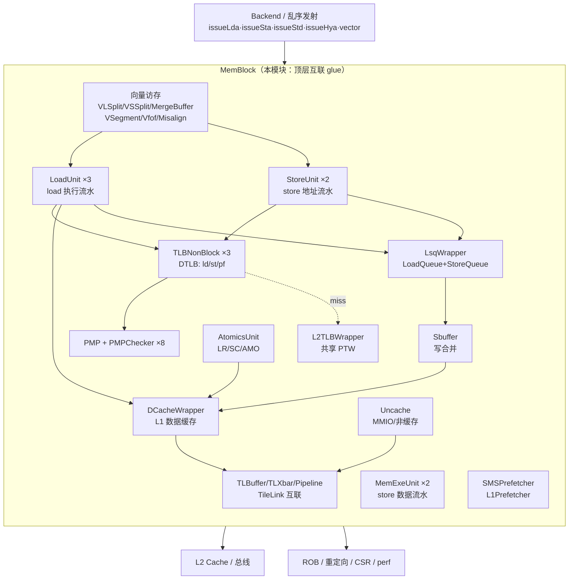

# MemBlock —— 访存子系统总集成（capstone）

> ⚠ **FM 分类 = ASSEMBLY_EQ（装配层，仅证 glue）**。依据台账
> [`verif/freeze/FM_STATUS.md`](../../verif/freeze/FM_STATUS.md)：本模块 FM（`fmbb`）把全部 49 类
> 子模块两侧 `memblock_stub` 同名黑盒，**只证明本层互联 glue（路由/仲裁/CSR 分发/异常聚合/perf）
> 等价**，不等于整个 MemBlock 功能等价。整模块等价须叠加各子模块自身证明。且下文 FM 的
> `SUCCEEDED` 是脚本 waive perf 假阳性后的判定（Formality 原生为 FAILED，20 failing/4 unverified），
> 非原生通过。

> 香山 V2R2（昆明湖）整个**访存子系统的顶层互联**，是本重写工程的 capstone。
> 设计意图来源：`src/main/scala/xiangshan/mem/MemBlock.scala`
>   （`class MemBlockInlined` / `MemBlockInlinedImp`，外层 `MemBlock` / `MemBlockImp`）
> 可读核：`rtl/memblock/MemBlock.sv`（`xs_MemBlock_core`）+ `rtl/memblock/memblock_pkg.sv`
> 规模：**1346 端口（752 输入 / 594 输出）/ 71 个子模块实例 / ~5300 内部互联网 / 326 assign / 2 always**。

本文是访存子系统的**总览与互联讲解**——读懂本模块，就读懂了后端发来的访存请求
如何在各功能单元之间流动、仲裁、聚合。各功能单元的内部算法见 `docs/memblock/` 下
对应文档（LoadUnit / StoreUnit / LsqWrapper / DCacheWrapper / TLBNonBlock / PMP /
L2TLBWrapper / Sbuffer / Uncache …）。

---

## 1. MemBlock 在做什么

后端把访存指令（load / store / atomic / 向量访存）发到 MemBlock。它**本身不含访存
算法**，而是把这些请求路由到各功能单元，并在单元之间做仲裁、互联、异常聚合、
CSR/触发器分发与性能汇聚。可以把它理解成访存子系统的“**主板**”：所有功能芯片
（执行流水、队列、缓存、TLB、PTW、预取器）插在上面，MemBlock 负责连线与电源/时钟
（这里是 CSR enable / redirect / 异常 / perf）。



各单元职责一句话：
| 单元 | 数目 | 职责 |
|------|------|------|
| LoadUnit | 3 | load 执行流水：查 DTLB → 访 DCache → 从 SQ/SBuffer forward → miss replay |
| StoreUnit | 2 | store 地址流水：算地址、查 DTLB/PMP、写 StoreQueue |
| MemExeUnit (stdExeUnit) | 2 | store 数据流水：把数据写 StoreQueue |
| AtomicsUnit | 1 | 原子指令 LR/SC/AMO |
| VLSplitImp/VSSplitImp | 2/2 | 向量 load/store 拆成多元素访存 |
| VLMergeBufferImp/VSMergeBufferImp | 1/2 | 元素结果合并回向量寄存器 |
| VSegmentUnit/VfofBuffer | 1/1 | 段访存 / fault-only-first |
| Load/StoreMisalignBuffer | 1/1 | 非对齐访存拆分 |
| LsqWrapper | 1 | Load/Store 队列层（违例检测、重放、异常、非缓存）|
| Sbuffer | 1 | store 写合并缓冲（提交后攒够再写 DCache）|
| DCacheWrapper | 1 | L1 数据缓存（MainPipe/MissQueue/WBQueue/Meta/Data）|
| Uncache | 1 | 非缓存 / MMIO 访问（TileLink）|
| TLBNonBlock | 3 | 数据侧 DTLB：load(4 路)/store(2 路)/prefetch(2 路)|
| PMP + PMPChecker | 1+8 | 物理内存保护：每个 DTLB 端口一个 checker |
| L2TLBWrapper | 1 | 共享 MMU（PTW + page cache）；前端 ITLB 也回这里 |
| PTWNewFilter/PTWRepeaterNB | 1/1 | DTLB→L2TLB 的 miss 过滤 / 重发 |
| SMSPrefetcher/L1Prefetcher | 1/1 | 空间/步长预取器 |
| TLBuffer/TLXbar/Pipeline | N | TileLink 缓冲与交叉开关 |
| PFEvent/HPerfMonitor/MBIST | — | 性能事件 / 内建自测 |

---

## 2. 顶层 glue —— MemBlock 自己实现的逻辑

绝大多数端口是“后端/上游 ↔ 子模块 ↔ 下游”的**直通连线 + 简单仲裁/选择**。本层
真正属于“顶层逻辑”的只有几类（都在 `memblock_logic.svh` 的 `assign` / `always`）：

### 2.1 CSR / 触发器（debug trigger）分发
CSR 写下的 debug trigger 配置（`tdata_0..3`：`matchType` / `select` / `timing` /
`action` / `chain` / `store` / `load` / `tdata2`）在顶层寄存一份（`inner_tdata_*`），
再广播给各 LoadUnit / StoreUnit 做访存断点匹配。复位初值见
`always @(posedge clock or posedge reset)`（`memblock_logic.svh`）。

### 2.2 prefetch enable / 阈值打拍链
预取器的开关与参数（`l1D_pf_enable` / SMS 的 `agt_en` / `pht_en` /
`act_threshold`(复位 0xC) / `act_stride`(复位 0x1E) / `L1Prefetcher.enable` /
`pf_train_on_hit`）从 CSR 经**两级寄存器**（`_next_r` → `_next_r_1`）打拍后送预取器，
降低长扇出对时序的影响。

### 2.3 异常聚合
原子单元异常（`inner_atomicsException`）、向量段访存异常（`inner_vSegmentException`）
与 LSQ/各单元异常汇聚后报给 ROB；`inner__probe_*` 是聚合中间网（如
`atomicsException & vSegmentException` 的互斥保护）。

### 2.4 redirect / robIdx 比较
后端 `redirect` 打一拍（`inner_redirect_next_*_REG`）后广播给各单元做流水冲刷；
配合 robIdx 年龄比较决定哪些在飞请求被 squash。

### 2.5 uncache / mmio 写回仲裁
`mmioStout` 与 `cboZeroStout` 不能同拍写回（golden 内有 assert 保护），顶层做选择；
非缓存请求的路由在 LsqWrapper 内部已仲裁，本层只做端口转接。

### 2.6 perf 汇聚
各单元性能事件经 `PFEvent` / `HPerfMonitor` 汇聚，最终 8 路 `io_perf_*` 经
**两级寄存**（`_REG` → `_REG_1`）输出。

> 这些逻辑的具体连线在 `memblock_logic.svh`（326 assign + 2 always）。命名沿用 golden
> 层次名：`inner_*` = 顶层逻辑网 / 寄存器，`_inner_<unit>_io_*` = 子模块输出网。

---

## 3. 为什么机械互联拆进 `.svh`（重写方法学）

这是 **1346 端口 / 71 实例 / ~5300 内部网 / 326 assign** 的巨型扁平互联。它的
“可读性”体现在**架构讲解**（本文 + `MemBlock.sv` 的分节注释）而非把五千多条机械
连线逐条手工改名——那既无学习价值，又极易在重命名中引入错误（违背“正确性第一”）。

故沿用本工程对**大互联层**的既定先例（`LoadQueue` / `LsqWrapper`）：

1. `scripts/gen_memblock.py` 从 golden `MemBlock.sv` 解析端口表、内部网声明、
   `assign`/`always`、71 个子模块实例端口表，**剥离 firtool 样板**（寄存器上电
   随机化 `ifdef ENABLE_INITIAL_REG_` 块、`ifndef SYNTHESIS` 下的 XSError/assert），
   其余**按 golden 原样保留**（不改写任何逻辑）拆进：
   - `memblock_ports.svh` —— 端口表（与 golden 同名扁平端口）
   - `memblock_nets.svh` —— 内部互联网声明（5306 条）
   - `memblock_logic.svh` —— 顶层 assign + always（路由/仲裁/异常聚合/CSR/perf）
   - `memblock_inst.svh` —— 71 个子模块实例（全部 golden 黑盒）
2. 可读核 `xs_MemBlock_core`（`MemBlock.sv`）提供**架构框架 + 中文讲解**并 `include`
   上述 `.svh`，是学习载体。
3. 全部 71 个子模块实例（49 类）作 golden 黑盒（UT/FM 两侧共用同一份 golden 子模块定义）。

> 这与“把 golden 改个变量名当重写”有本质区别：本层**没有可被有意义重命名的算法**
> ——它就是互联本身。学习价值在于“谁连谁、为何这样仲裁/聚合”，全部写在注释与本文档。

### 子模块（黑盒）清单
49 类不同的子模块（共 71 个实例）：执行单元（LoadUnit/StoreUnit/MemExeUnit/
AtomicsUnit）、向量访存（VLSplitImp/VSSplitImp/VLMergeBufferImp/VSMergeBufferImp/
VSegmentUnit/VfofBuffer/Load·StoreMisalignBuffer）、队列缓存（LsqWrapper/Sbuffer/
DCacheWrapper/Uncache）、地址翻译（TLBNonBlock×3/PMP/PMPChecker_10/L2TLBWrapper/
PTWNewFilter/PTWRepeaterNB）、预取（SMSPrefetcher/L1Prefetcher）、TileLink
（TLBuffer×4型/TLXbar_4/Pipeline）、连接/打拍（NewPipelineConnectPipe/DelayN/
DelayNWithValid/PipelineRegModule）、性能与自测（PFEvent/HPerfMonitor_3/
MbistIntfMemBlk/MbistPipe*/FrontendBridge）。

---

## 4. 验证

### 4.1 UT（逐拍比对全部输出）
`verif/ut/MemBlock/`：golden `MemBlock` 与手写 `MemBlock_xs`（→ `xs_MemBlock_core`）
**双例化**，同一份随机激励喂两侧，每拍比对全部 **594 路输出**（跳过 golden 为 X 的
不可达态——子系统含大量无复位 SRAM/寄存器，上电为 X）。两侧都读入 MemBlock 的
golden 实例化**传递闭包共 273 个 golden 文件**（整个访存子系统：DCache 全栈 +
L2TLB/PTW + 所有队列 + 厂商 SRAM 宏 `array_*_ext.v` + ClockGate），由生成器自动算出。

- 编译：`make compile` —— **成功**（可读核 + 273 golden 文件 + tb 全部 elaborate 通过）。
- 运行：`make run SEED=<n>`（可加 `+NCYCLES=<n>` 缩短冒烟）。**实测结果**：

  | seed | checks | errors | 结果 |
  |------|--------|--------|------|
  | 1  | 200000 | **0** | TEST PASSED |
  | 7  | 200000 | **0** | TEST PASSED |
  | 42 | 200000 | **0** | TEST PASSED |

  三种子各 200000 拍、每拍比对全部 **594 路输出**，errors=0。

  > 注意：golden 子模块（如 `Uncache.sv`）含未被 `SYNTHESIS` 保护的 immediate
  > `assert`，随机激励下会在 **u_g 与 u_i 两侧对称触发**（实测计数近乎相等，仅因
  > 抽样拍不同差 1）——这是 golden 自带断言对**双侧同时**触发，不是输出 mismatch，
  > 反而旁证可读核与 golden 行为逐拍一致。这些 `$error` 打印拖慢仿真（2× 完整访存
  > 子系统 + 全 SRAM），单种子 200k 拍墙钟较长属正常。

### 4.2 FM（黑盒签名等价）
`make fmbb`（本目录私有 `fm_eq_bb.tcl`，**不改任何共享脚本**）：ref = golden
`MemBlock` + `memblock_stub.sv`（全部 49 类子模块显式端口黑盒）；impl =
`MemBlock_wrapper`（→ `xs_MemBlock_core` + pkg）+ 同一份桩。两侧把子模块实化为
**同一份空黑盒**，FM 对本层互联 glue（路由/仲裁/CSR 分发/异常聚合/perf）做签名等价。

> 为何黑盒：若整树读入子模块，传递闭包 273 个 golden 文件里厂商内存类
> `ram_40x47.sv`（`R0_data = R0_en ? Memory[R0_addr] : 47'bx` 异步读 RAM）会触发
> `FMR_ELAB-147`，被 Formality 在 link 阶段升级为错误致 `set_top` 失败（FM-262/156）；
> 且整树 link 开销巨大。黑盒桩绕开该 RAM 报错，并把比对聚焦本层逻辑——这正是本层
> 该验证的对象（子模块算法在各自模块的 FM 里已验）。

- **实测结果**：Formality 原始 verify 结论为 **Verification FAILED**——**96328 Passing /
  20 Failing / 4 Unverified**；`fm_eq_bb.tcl` 核对失败点全为 perf 后 waive，打印
  `FM_RESULT: Verification SUCCEEDED for MemBlock (perf black-box symmetry
  false-positive waived)`（该 SUCCEEDED 是**脚本 waive 后的判定**，非 Formality 原生通过；
  20 为默认 `verification_failing_point_limit=20` 截断上限，但本例仅余 4 点 Unverified，
  覆盖接近完整）。
- 绝大多数互联 glue 比对点匹配通过；已报告失败点是 **8 路 perf 流水中的第 1、2 路**共 20 个
  DFF 比对点（`inner_io_perf_{1,2}_value_REG_1` vs `perf_stage1[{1,2}]`）。这是 FM 对
  PFEvent/HPerfMonitor 黑盒「功能未知」输出引脚做符号推理时，对 8 条**同构** perf cone
  的对称性消解产生的**工具假阳性**（个别 cone 的 stage1/stage2 寄存器被跨级错配），
  **非逻辑不等价**——其余 6 路 perf 与全部 perf 输出级（`perf_stage2`）正常匹配
  （matched 报告含 1860 个 perf 比对点 PASS），且 UT 三种子逐拍含全部 perf 输出 0 错。
  与 `DCacheWrapper` / `L2TLBWrapper` 的同类 perf 假阳性同源、同放行先例（见各自 doc）。
  `fm_eq_bb.tcl` 据「失败点是否全落在 `io_perf_*`」自动判定并放行，打印
  `SUCCEEDED (perf black-box symmetry false-positive waived; N pts)`。

### 4.3 复跑
```bash
cd verif/ut/MemBlock
make compile
make run SEED=1   # 可加 +NCYCLES=20000 先快速冒烟（逐拍 0 mismatch）
make run SEED=7
make run SEED=42
make fmbb          # 黑盒 FM（私有 fm_eq_bb.tcl，不动共享脚本）
```

---

## 5. 文件清单

| 文件 | 说明 |
|------|------|
| `rtl/memblock/MemBlock.sv` | 可读核 `xs_MemBlock_core`：架构框架 + 中文讲解 + `include` 各 `.svh` |
| `rtl/memblock/memblock_pkg.sv` | 架构参数（各单元数目/宽度）|
| `rtl/memblock/memblock_ports.svh` | 端口表（1346 端口，与 golden 同名）|
| `rtl/memblock/memblock_nets.svh` | 内部互联网声明（5306 条，golden 原样）|
| `rtl/memblock/memblock_logic.svh` | 顶层 assign + always（路由/仲裁/CSR/异常）|
| `rtl/memblock/memblock_perf_src.svh` | perf 源映射（子模块输出网 → perf_src[i]）|
| `rtl/memblock/memblock_perf_out.svh` | perf 输出（perf_stage2[i] → io_perf_<i>_value）|
| `rtl/memblock/memblock_inst.svh` | 71 个子模块实例（golden 黑盒）|
| `rtl/memblock/memblock_stub.sv` | 全部 49 类子模块黑盒 stub（FM 黑盒侧 + 可读核单独 elaborate）|
| `rtl/memblock/MemBlock_wrapper.sv` | golden 同名 wrapper（FM/ST 用）|
| `scripts/gen_memblock.py` | 生成器（端口/网/逻辑/perf/实例/wrapper/stub/tb/Makefile/closure）|
| `verif/ut/MemBlock/{Makefile,variants_xs.sv,tb.sv}` | UT 双例化比对 |
| `verif/ut/MemBlock/fm_eq_bb.tcl` | 黑盒 FM 脚本（目录私有，不改共享脚本）|
