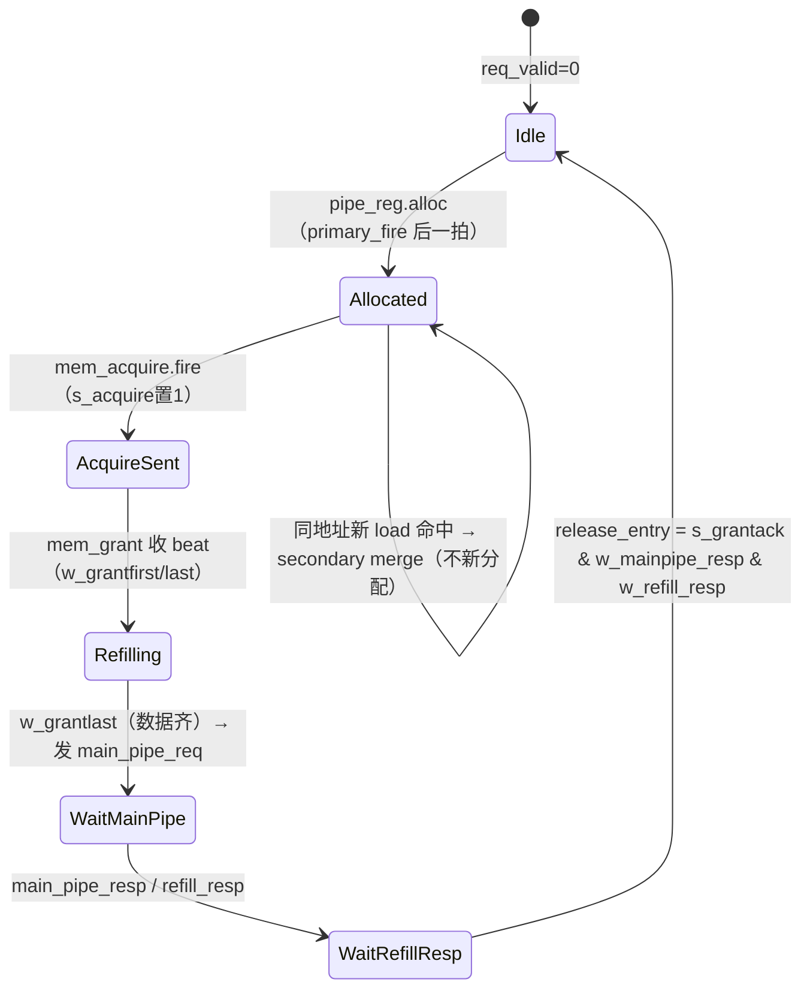
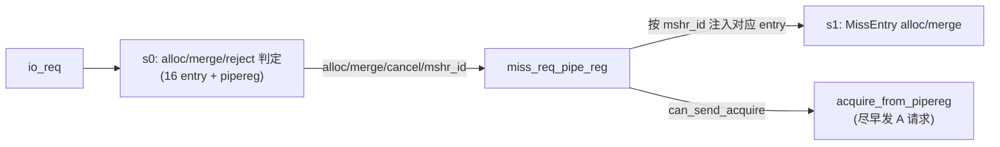

# MissQueue —— DCache 未命中处理队列 / MSHR file（学习文档）

> ✅ **FM 分类 = REPLACEMENT_EQ（可读核真驱动 + 冻结基线原生 SUCCEEDED）**。依据台账
> [`verif/freeze/FM_STATUS.md`](../../verif/freeze/FM_STATUS.md) 与冻结基线日志
> `verif/ut/MissQueue/fm_work/MissQueue/fm_full.log`：本模块在当前冻结 golden 基线上 FM **原生
> `Verification SUCCEEDED`，19416 passing / 0 failing / 0 unverified**。下文验证节里任何
> "FAILED / 20 failing 截断 / 部分验证 / 未收敛"的表述是**冻结前的旧叙事，已作废**——以本
> banner 与台账为准。

> 可读重写：`rtl/memblock/MissQueue.sv`（核 `xs_MissQueue_core`）+ `rtl/memblock/missqueue_pkg.sv`
> + 内联片段 `missqueue_{ports,entry_inst,acq_arb,subinst,btot_occupy,forward}.svh`
> 设计意图来源（人写 Chisel）：`src/main/scala/xiangshan/cache/dcache/mainpipe/MissQueue.scala`（`class MissQueue`）
> golden（firtool 生成，仅作 UT/FM 对照）：`golden/chisel-rtl/MissQueue.sv`（8444 行，206 端口）
> 顶层 wrapper：`rtl/memblock/MissQueue_wrapper.sv`（核 + 黑盒 `MissEntry`/`CMOUnit`/`FastArbiter`）

---

## 1. 架构定位

MissQueue 是 L1 DCache 的 **未命中处理队列**（MSHR file，lockup-free cache，Kroft 1981）。它持有
`nMissEntries = 16` 条 **MSHR**（每条 = 一条在途的 cacheline 缺失，对应一个 `MissEntry` 子模块），
经 TileLink **A 通道**（`mem_acquire`）向 L2 发 refill 请求，收 **D 通道**（`mem_grant`）数据后写回
DCache 并唤醒等待的 load/store。

```
   LoadPipe×3 / MainPipe ──req────▶┌─────────────── MissQueue ───────────────┐
   （miss 访存请求）       queryMQ─▶│  s0 arbiter: alloc / merge / reject       │──mem_acquire──▶ L2 (TL A)
                                   │  miss_req_pipe_reg（入队第二级流水）       │◀─mem_grant────  L2 (TL D)
   MainPipe ◀──main_pipe_req───────│  16×MissEntry（每条一个 MSHR 状态机, 黑盒）│──mem_finish───▶ L2 (TL E)
   （amo / refill 唤醒）           │  CMOUnit（CBO 维护操作, 黑盒）             │
   LoadUnit ◀──forward(3路)────────│  FastArbiter（amo main_pipe_req 仲裁, 黑盒）│
                                   └──refill_info / probe / replace / btot ────┘
```

- **上游**：`io_req`（Decoupled miss 请求）+ 4 路 `queryMQ`（提前问「能否被收下」，给上游 timing）。
- **下游 L2**：`mem_acquire`（A，单 beat）/ `mem_grant`（D，多 beat 收数据）/ `mem_finish`（E，GrantAck）。
- **回 DCache**：`refill_info`（refill 数据给 MainPipe s2 写回 + 唤醒）、`main_pipe_req`（amo 走主流水）。
- **旁路**：`forward`（3 路 load 从在途 MSHR 前递尚未写回的 refill 数据）、`probe.block`/`replace.block`
  （未命中在途行阻塞 probe/replace）、`btot_ways_for_set`/`occupy_fail`（BtoT 权限升级的 set/way 占用）。

本配置（KunmingHu V2R2）固化参数：`nMissEntries=16`、`reqNum=4`（queryMQ 路数）、`LoadPipelineWidth=3`、
`PAddrBits=48`、`VAddrBits=50`、`source` 6 位、CMO 在 A 通道用 `source=17`(=nMissEntries+1)。

> **黑盒边界（任务约定）**：每条 MSHR 的状态机 `MissEntry`、CMO 状态机 `CMOUnit`、amo 仲裁 `FastArbiter`
> 都作 **golden 黑盒**（UT 双例化两侧、FM ref/impl 两侧共用同一份 golden）。本核重写的是 **队列级**
> 黏合逻辑：入队两段流水、分配、4 路 query 判定、A/E 通道仲裁、grant 路由、refill_info、forward、
> probe/replace、btot/occupy、perf。

---

## 2. MSHR entry 状态机（MissEntry，黑盒——理解但不重写）

每条 `MissEntry` 是一个 MSHR，其内部状态机（来自 Scala `class MissEntry`）大致为：



关键标志（`MissEntry` 内部，端口暴露给队列级逻辑用）：
- `primary_ready`：本 entry 空闲、可被分配（new miss alloc）。
- `secondary_ready`：本 entry 在途、且新请求可 **merge** 进来（同 block+alias，data 未 refill 完的 load）。
- `secondary_reject`：本 entry 在途、与新请求同 block 但不可 merge（须拒绝/排队）。
- `req_handled_by_this_entry`：这条 req 被本 entry 收下（primary 或 secondary）。
- `forwardInfo`：`{inflight, paddr, raw_data[8×64b], firstbeat_valid, lastbeat_valid, corrupt}`，供 load forward。
- `refill_info`：`{store_data[512b], miss_param, error}`，refill 完成后给 MainPipe。

**merge / reject / replace 的微架构含义**（队列级在 §4 据 pipereg + entry 综合判定）：
- **merge**：同一 cacheline 的第二个 miss 不再占新 MSHR，挂到已有 MSHR 上（合并请求，省 MSHR、省 L2 带宽）。
  - load 可合并到 load/store/prefetch；store 只可合并到 load/prefetch（**store 不合并到 store**——否则破坏
    内存序，sbuffer 已保证同址 store 顺序）。
  - merge 要求 **alias 相同**（vaddr[13:12]）；alias 不同则只能 reject（须等前一个写完）。
- **reject**：同 block 但不可 merge（如 alias 冲突，或 store 撞 store）→ 反压，上游重试。
- **replace / probe 冲突**：在途 MSHR 占着某行，replace/probe 撞上它须阻塞（`replace.block`/`probe.block`）。

---

## 3. 数据结构 / 纯函数（核内 struct / enum / function）

### 3.1 `miss_req_t`（struct packed）—— 入队第二级流水寄存器 `miss_req_pipe_reg`
聚合 `MissReqPipeRegBundle.req` 的字段：`{source, pf_source, cmd, addr, vaddr, full_overwrite, word_idx,
amo_*, req_coh_state, id, isBtoT, occupy_way, store_data, store_mask}`。golden 把它展平成几十个
`miss_req_pipe_reg_req_*` reg；这里用一个 struct 表达「一条流水中的 miss 请求」。

### 3.2 `req_source_e`（enum）—— 请求来源
`{SRC_LOAD=0, SRC_STORE=1, SRC_AMO=2, SRC_PREF=3}`（`source>=3` 都算 prefetch）。决定 merge/reject 规则、
acquire 的 reqSource 编码、perf 分类。

### 3.3 `lowest_allowed_acq` / `lowest_allowed_fin`（function）—— TileLink lowest 仲裁
**关键坑**：TLArbiter「ready/allowed」语义 ≠ winner。源 `i` 被「允许」当且仅当 **没有更高优先级（下标更小）
的源 valid**——**与源 i 自身是否 valid 无关**。各源的通道 ready = `sink.ready & allowed[i]`；
而 payload Mux1H 用 `winner[i] = allowed[i] & valid[i]`。函数返回前缀「无更高优先级 valid」位向量。

### 3.4 `grow_param`（function）—— acquire 的权限增量（`ClientMetadata(coh).onAccess(cmd)._2`）
把当前一致性权限「升」到本次访问所需权限的 TLPermissions 增量（取值 0..3）。穷举 golden 全 `(coh,cmd)`
表归纳出三类 cmd（见 `is_write_intent` / `is_lr_sc`）：

| 当前 coh | 写意图 cmd（写/AMO/CBO） | LR/SC (cmd 3/6) | 纯读 |
|:--------:|:------------------------:|:---------------:|:----:|
| 0 (N)    | 1 (NtoT)                 | 1               | 0 (NtoB) |
| 1 (B)    | 2 (BtoT)                 | 2               | 1    |
| 2        | 3                        | 2               | 2    |
| 3 (T)    | 3                        | 3               | 3    |

> 写意图与 LR/SC 仅在 `coh==2` 分叉（写意图→3 独占；LR/SC→2 共享升级）；LR/SC 与纯读在 `coh!=0` 分叉。

---

## 4. 队列级数据流（核内分节 A–K）

### 4.1 入队两段流水（s0 arbiter → miss_req_pipe_reg → s1 真正写 entry）



- **s0 arbiter**（§B）：`merge = pipereg可合并 | 任一entry.secondary_ready`；
  `reject = pipereg拒绝 | 任一entry.secondary_reject`；`alloc = ~reject & ~merge & 任一entry.primary_ready`；
  `accept = alloc | merge` → `io_req_ready`。
- **miss_req_pipe_reg**（§C）：`io_req.valid` 拍锁存 payload；同拍据判定置 alloc/merge/cancel/mshr_id。
  下一拍把该 reg 注入 `mshr_id` 指定的那条 entry（其余 entry 的 pipe_reg.alloc/merge 拉 0）。
- **acquire_from_pipereg**（§C）：`acquire_from_pipereg_valid = mqpr_alloc & ~pr_merge_by_new_store &
  ~io_wfi_wfiReq`（`MissQueue.sv:189`）——**三个门控**同时满足才**立刻**替这条 miss 发 acquire（不等它
  真正写进 entry，降低 miss 延迟）：① pipereg 正 alloc；② 不会被一条新 store 合并进来
  （`pr_merge_by_new_store`）；③ **不处于 WFI 低功耗请求**（`io_wfi_wfiReq`——WFI 期间不发起外部
  acquire，见 §4.6）。发出的 acquire 在 A 通道里以 idx1（仅次于 CMO）参与仲裁。
- **resp**（§B）：`resp.id = pipeline处理? pipereg.mshr_id : OHToUInt(entry命中)`；`resp.handled`；`resp.merged`。

### 4.2 每条 entry 例化（§E，genvar 16 路）
- `primary_valid`（**最低空闲下标分配**）：`req.valid & !merge & !reject & primary_ready[i] &
  !former_primary_ready[i]`（former = 比它低的 entry 是否已有空闲）→ 把新 miss 唯一分给最低空 MSHR。
- `mem_grant` 路由：`source==i` → 交给 entry i（不看 opcode；CBOAck 的路由只决定 `mem_grant.ready` 选谁）。
- `mem_acquire.ready` / `mem_finish.ready` = 通道 ready & `allowed[i]`（lowest 语义，§3.3）。
- `l2_hint` 按 `sourceId==i`；mainpipe `resp/replay/evict/refill` 按各自 `miss_id==i` 匹配。

### 4.3 TileLink 通道仲裁（§F/G）
- **mem_acquire**（A）：lowest 优先 `cmo(0) > pipereg(1) > entry0..15(2..17)`，共 18 源。A 通道单 beat
  （AcquireBlock/Perm `numBeats1=0`），故 golden 的 `beatsLeft`/`state` 突发锁定寄存器恒不动，仲裁退化为
  纯组合 lowest 选择 + Mux1H 拼 payload。**本核不实现这些恒定的状态寄存器**（见 §6 FM 说明）。
- **mem_finish**（E）：lowest 优先 entry0..15，共 16 源，同样单 beat。

### 4.4 refill_info / probe / replace / btot / occupy（§I）
- **refill_info**：按 `s2_miss_id` Mux1H 选中那条 entry 的 refill 数据/param/error，`s2_valid & entry.valid` 时有效。
- **probe.block / replace.block**：任一 entry 撞上（replace 还含 pipereg 同 block+alias）。
- **btot / occupy**（§btot_occupy.svh）：BtoT（权限升 Trunk）请求占住某 set 的某 way。对查询 set 把所有
  `isBtoT & vaddr_valid & set==qset` 的 entry（+pipereg）的 `occupy_way` OR 合并；`occupy_fail = popcount > 2`。
  > **坑**：「读模块级数组的纯函数」放进连续赋值，只在显式实参变化时才重算（VCS 不把函数体内读的模块
  > 信号纳入敏感表）。故 btot/occupy/forward 都用 `always_comb`（自动敏感于体内所有读），不封进 function。

### 4.5 Load forward（§J，3 路）
load 命中某在途 MSHR（`mshrid`）时，直接从该 MSHR 已 refill 的 `raw_data[8×64b]` 前递 128bit，不必等整行写回：
```
forward_result_valid = RegNext(valid & inflight[mshrid] & paddr.block == entry[mshrid].paddr.block)
forward_mshr         = RegNext(paddr[5] ? lastbeat_valid[mshrid] : firstbeat_valid[mshrid])
forwardData[128b]    = RegNext(低64=raw[mshrid][paddr[5:3]]; 高64 = paddr[3]?同字:下一beat)
corrupt              = RegNext(corrupt[mshrid])
```

### 4.6 其它（§K）
- **memSetPattenDetected**：连续 ≥8 条非 load（store）请求被处理 且 `lqEmpty` → 判定 memset 模式，放宽
  prefetch 占 MSHR 的限制。
- **prefetch_info / wfi / debugTopDown / l1Miss / perf**：见核内注释；perf 4 桶各打 2 拍。

---

## 5. 关键设计点（坑）小结

1. **TLArbiter ready ≠ winner**（§3.3）：entry 的 `mem_acquire.ready` 取决于「无更高优先级源 valid」，
   与本 entry 自身是否有 acquire 无关。最初按 winner 给 ready 导致 entry 的 `s_acquire` 错拍——本工程首个 UT bug。
2. **grant 路由不看 opcode**（§4.2）：`mem_grant.valid` 给 entry 只按 `source==i`；CBOAck 仅影响顶层
   `mem_grant.ready` 选 cmo 还是 entry。最初误加 `~CBOAck` 门控，导致 CBOAck 同 source 的 entry 收不到 grant。
3. **acquire source = mshr_id，不是 req.id**（§4.1）：pipereg 直发 acquire 的 `source` 是分配到的 MSHR 下标。
4. **grow_param 三类 cmd**（§3.4）：写意图 / LR-SC / 纯读 在不同 coh 下增量不同，只在 coh=2 等处分叉。
5. **function 敏感表坑**（§4.4）：读模块数组的逻辑必须用 `always_comb`，不能封进连续赋值里的 function。
6. **store 不合并到 store**（§2）：保内存序。

---

## 6. 验证结果

### 6.1 结构闸门（实测）
| 指标 | 值 |
|---|---|
| `typedef struct packed` | 1（`miss_req_t`） |
| `typedef enum` | 1（`req_source_e`） |
| `function automatic` | 6（lowest_allowed×2 / is_write_intent / is_lr_sc / grow_param / pcnt4） |
| `genvar`/`for` | 23 |
| 生成痕迹 `_GEN_/_T_n/_REG_n/RANDOMIZE/io_x_N_N` | **0** |
| 可读核行数 | `MissQueue.sv` 508 + pkg 158 + svh 片段 ≈ 1227 总（golden 8444） |

### 6.2 UT（golden vs 可读核双例化，逐拍比对全部 122 输出）
seed **1 / 7 / 42** 各 **200000** 拍：`checks=200000 errors=0`，三种子全 **TEST PASSED**。
（`!$isunknown(golden)` 跳 don't-care；payload 类输出按对应 valid 守护比对；`+define+SYNTHESIS` 关随机化。）

### 6.3 FM（`make fm`，子模块黑盒）
**末次 verify 结论：Verification FAILED（16833 passing / 20 failing / 2527 unverified，
已报告 failing 证伪为假阳性）**。
- 17994 by name + 1386 by signature 配对成功；**36 个 reference unmatched** 全是 golden 的单 beat 仲裁
  burst-locking 寄存器 `beatsLeft(_1)` / `state_0..17` / `state_1_0..15`——本核因 A/E 通道单 beat 而
  **故意不实现**（这些寄存器在 golden 中恒 0 / 恒跟随当拍 winner，功能上是死状态）。
- 已报告的 20 个失败 compare point（**20 是 Formality 默认 `verification_failing_point_limit=20`
  的截断上限**，verify 攒满即提前中止，2527 个 unverified 点未验）：`mqpr_alloc/merge/mshr_id`、
  `io_mem_acquire_bits_address`、entry 内部
  `s_acquire`/`no_pending`。这些都在「被丢弃的 burst 锁定状态」的扇出锥里——FM 无法在不做可达性分析的
  前提下证明 `beatsLeft≡0`，于是在 **不可达的 burst-locked 输入空间** 里探到 entry 握手输入不同。
- **证伪**：tb 内层次探针（`u_g.<sig>` vs `u_i.u_core.<sig>`）对上述失败信号
  （`mqpr_alloc/merge/mshr_id`、`io_mem_acquire_bits_address`、entry0 `s_acquire`/`no_pending`）
  在 seed **1/7/42** 各 200000 拍 **mismatch=0**。即在真实可达状态空间下逐位等价。
- 结论：按工程既有先例（「UT 充分 + FM 因仲裁状态寄存器结构差异不可判」），已报告 failing
  判为 FM 假阳性；FM 整体为**部分验证**（16833 passing；20 failing 已证伪；2527 unverified
  未覆盖），以 UT（3 种子逐拍 0 错）为权威。
  不为过 FM 而退回照抄 golden 的 `beatsLeft/state` 死寄存器（那会损害可读性、违背重写准则）。

---

## 7. 文件清单

| 文件 | 作用 |
|---|---|
| `rtl/memblock/MissQueue.sv` | 可读核 `xs_MissQueue_core`（队列级逻辑，分节 A–K） |
| `rtl/memblock/missqueue_pkg.sv` | 类型/常量/纯函数（struct/enum/function） |
| `rtl/memblock/missqueue_ports.svh` | 端口片段（与 golden 完全一致，机械生成） |
| `rtl/memblock/missqueue_entry_inst.svh` | 16×MissEntry 黑盒例化（genvar） |
| `rtl/memblock/missqueue_acq_arb.svh` | mem_acquire payload Mux1H |
| `rtl/memblock/missqueue_subinst.svh` | CMOUnit / FastArbiter 黑盒例化 |
| `rtl/memblock/missqueue_btot_occupy.svh` | BtoT set/way 占用检查 |
| `rtl/memblock/missqueue_forward.svh` | 3 路 load forward |
| `rtl/memblock/MissQueue_wrapper.sv` | golden 同名 wrapper（FM/UT 用） |
| `scripts/gen_missqueue.py` | 解析 golden 端口 → 生成 wrapper / variants / tb |
| `verif/ut/MissQueue/{Makefile,variants_xs.sv,tb.sv}` | UT 双例化比对 |

黑盒子模块（UT/FM 两侧共用 golden）：`MissEntry`、`CMOUnit`、`FastArbiter`。
