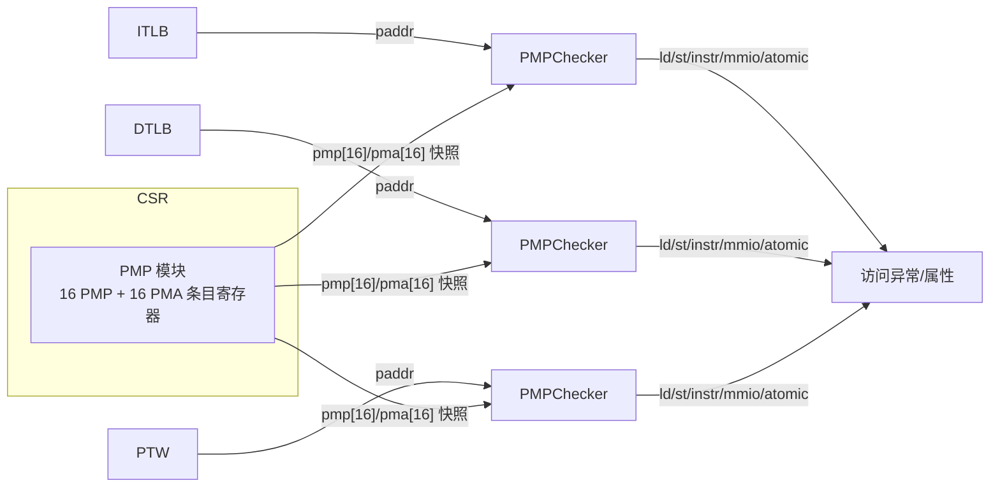

# PMP —— 物理内存保护/属性的配置寄存器组

> 可读重写：`rtl/memblock/PMP.sv`（核 `xs_PMP_core`）+ `rtl/memblock/pmp_pkg.sv`（共享类型/纯函数）
> golden：`golden/chisel-rtl/PMP.sv`；Scala 设计意图：`XiangShan/src/main/scala/xiangshan/backend/fu/PMP.scala`、`PMA.scala`

## 1. 在地址翻译链中的角色

香山的取指与访存都要经过「虚→实」翻译，翻出物理地址后还要过一道**权限/属性关卡**：



- **PMP 模块**只负责「存」与「写」：保存 16 条 PMP（保护：能否读/写/执行）+ 16 条 PMA（属性：可否缓存/原子、是否 MMIO）的架构状态，响应 CSR 写，把最新条目快照广播给各处 PMPChecker。
- 真正的「逐地址匹配 + 权限判定」在 [PMPChecker](PMPChecker.md)。

## 2. 条目编码

每条目配置 `cfg` 为 8 bit（与 RISC-V `pmpcfg` 寄存器布局一致）：

| 位 | 7 | 6 | 5 | 4:3 | 2 | 1 | 0 |
|----|---|---|---|-----|---|---|---|
| 字段 | `l` 锁 | `c` 可缓存 | `atomic` 原子 | `a` 匹配模式 | `x` 执行 | `w` 写 | `r` 读 |

- `c`/`atomic` 在 PMP 中是保留位（无意义但照样存），仅 PMA 使用。
- `a` 匹配模式：`OFF(0)` 关闭 / `TOR(1)` 区间上界 / `NA4(2)` 4 字节 NAPOT / `NAPOT(3)` 2 幂对齐区。

8 个 cfg 打包进一个 64 位 CSR，故 cfg CSR 只有 2 个（条目 0–7 → `pmpcfg0`，条目 8–15 → `pmpcfg2`）。

地址寄存器 `addr` 为 46 位（物理地址 48 位丢掉最低 2 位，最小粒度 4 字节）；`mask` 48 位，用于 NAPOT 匹配。

### CSR 地址

| 寄存器 | 地址 |
|--------|------|
| pmpcfg0 / pmpcfg2 | `0x3A0` / `0x3A2` |
| pmpaddr0..15 | `0x3B0`..`0x3BF` |
| pmacfg0 / pmacfg2 | `0x7C0` / `0x7C2` |
| pmaaddr0..15 | `0x7C8`..`0x7D7` |

## 3. 关键参数（KunmingHu V2R2）

| 参数 | 值 | 含义 |
|------|----|----|
| `PMPAddrBits` | 48 | 物理地址位宽 |
| `PMPOffBits` | 2 | 地址寄存器丢弃的低位（4B 粒度） |
| `PlatformGrain` | 12 | 平台保护粒度 log2(4KB)=一个页 |
| `NumPMP`/`NumPMA` | 16/16 | 条目数 |
| `KeyIDBits` | 0 | 无内存加密 |

因为 `PlatformGrain(12) > PMPOffBits(2)`，**CoarserGrain = true**：
- **NA4 不可选**；写 cfg 的 `a` 字段被规整为 `{a[1], a[1]|a[0]}`（OFF/TOR/NAPOT 三态，见 `xs_coarsen_a`）。
- 各条目 `mask` 至少覆盖一个 4KB 页（低 12 位恒为 1）。

## 4. CSR 写语义

写经过 `distribute_csr` 总线分发，**打一拍生效**（MaskedRegMap 的实现产物）：当拍寄存 `wdata`、并寄存每个 CSR 的写使能；下一拍按写使能更新对应寄存器。

### 写 cfg（`xs_write_cfg`）
逐字节处理（一个 CSR 8 个字节）：
- 若该字节旧 `l=1`（**locked**）→ 整字节保持旧值，软件不可改（即便 M 模式）。
- 否则写入新值，但：
  - `w := w & r`（不允许「可写不可读」）；
  - `a` 经 CoarserGrain 规整（去 NA4）；
  - 若新模式为 NAPOT，顺带按「现有 addr」刷新该条目的匹配 `mask`。

### 写 addr / mask（`xs_next_entry`）
- **锁定判定**：`addr_locked = cfg[i].l || (cfg[i+1].l && cfg[i+1].tor)`。
  后半项的物理含义：TOR 模式用「本条 addr」作为区间下界，所以本条 addr 会被「下一条且为 TOR 且锁」连带保护。最后一条无下一条，只看自身锁。
- 写本条 addr 且未锁 → 写入新 addr，并按新 addr 重算 `mask`（`a0` 取现有 cfg 的 `a[0]`）。
- 写 cfg→NAPOT 且未锁 → 用现有 addr 重算 `mask`（`a0` 取新 `a[0]`）。

> 写 cfg 与写 addr 物理上互斥（不同 CSR 地址不会同拍写）。firtool 对不同条目安排了不同的「先看 cfg 还是先看 addr」的书写顺序，可读核用 `PMP_CFG_FIRST`/`PMA_CFG_FIRST` 两张位表逐条目对齐 golden，仅为 Formality 签名比对，不影响功能。

### NAPOT 掩码（`xs_match_mask`）
```
c    = {paddr, a0} | 0x3FF            // 低 10 位（粒度内）置 1
mask = {c & ~(c+1), 2'b11}            // 取最低 0 位以下的全 1 串，再补 OffBits 个 1
```
`c & ~(c+1)` 抽出「最低连续 1 串」——NAPOT 区域大小正由地址里最低的连续 1 决定；这些「区域内位」在匹配时被忽略。

## 5. 结构（可读核）

- `pmp_cfg_merged[2]` / `pma_cfg_merged[2]`：两个 64 位 cfg CSR。
- `pmpMapping_addr[16]` / `pmpMapping_mask[16]`（PMA 同）：逐条目 addr/mask。
- 写流水：`wdata_reg` + `wen_pmpcfg[2]`/`wen_pmacfg[2]`/`wen_pmpaddr[16]`/`wen_pmaaddr[16]`。
- 主 `always_ff`：写使能打拍 + cfg 寄存器更新（复位）。
- 每条目一个 genvar `always_ff`：addr/mask 更新（常量索引，调纯函数 `xs_next_entry`）。
- 输出 `always_comb`：把寄存器组拆成 `pmp_entry_t` 结构数组输出。

PMA 复位为平台默认地址空间属性（来自 `pma_init`，描述 DDR/MMIO/外设的可缓存/原子等）。

## 6. 接口

| 端口 | 方向 | 含义 |
|------|------|------|
| `clock`/`reset` | in | 时钟/异步复位 |
| `io_distribute_csr_w_valid` | in | CSR 写有效 |
| `io_distribute_csr_w_bits_addr[11:0]` | in | CSR 地址 |
| `io_distribute_csr_w_bits_data[63:0]` | in | CSR 写数据 |
| `io_pmp[16]` (`pmp_entry_t`) | out | PMP 条目快照（cfg+addr+mask） |
| `io_pma[16]` (`pmp_entry_t`) | out | PMA 条目快照 |

> golden 端口把每条目展平成 `io_pmp_<i>_cfg_l/.../addr/mask`；wrapper（`PMP_wrapper.sv` / `variants_xs.sv`）做扁平↔结构适配。

## 7. 验证

- **UT**（`verif/ut/PMP/`）：golden(`PMP`) 与可读核(`PMP_xs`) 双例化，随机 CSR 写（合法地址池 + 偶发非法地址），逐拍比对全部 `io_pmp_*`/`io_pma_*` 输出。
  - 多种子 1/7/42：各 `checks=20000 errors=0` → **TEST PASSED**。
- **FM**（`make fm`）：`FM_RESULT: Verification SUCCEEDED for PMP`。
  - 需 `FM_MERGE_DUP = false`：PMA 的 16 个 mask 寄存器低 12 位恒为 `0xFFF`（NAPOT 粒度），merge-dup pass 会跨条目误并这些常量位、并在 wrapper/u_core 层次边界做不对称常量传播，把两个输出端口误判 fail（寄存器本身全部等价）。关掉合并即干净比对。

## 8. 踩坑记录（重写时遇到并解决）

1. **`function/task` 读非局部信号（FMR_VLOG-091）**：初版用 `task` 读模块寄存器写 addr/mask，FM 报错。改为纯函数 `xs_next_entry`（全部输入经形参传入）+ genvar `always_ff` 落寄存器。
2. **变量位选/数组变量下标**：用 genvar 展开，所有位选都是 `localparam` 常量索引，杜绝综合/FM 歧义。
3. **写 cfg 与写 addr 的 mask 更新优先序**：firtool 对不同条目给了不同顺序；用 `PMP_CFG_FIRST`/`PMA_CFG_FIRST` 逐条目对齐（互斥写，功能无关，仅为 FM）。
4. **`if (wen_addr & ~locked)` vs `if (wen_addr) {if ~locked}`**：golden 的「锁定且写 addr」会进入 addr 分支并保持、不再走 cfg 分支；可读核须同构，否则在「两写使能同时为 1」的不可达角上 FM 判不等价。
