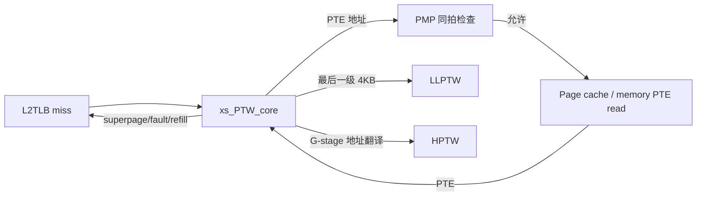
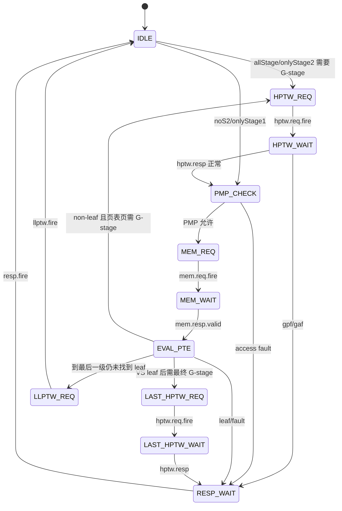

# PTW —— Page Table Walker（页表遍历器）

> 当前状态：已落地可读核 `rtl/memblock/PTW.sv`、类型包 `rtl/memblock/ptw_pkg.sv`、
> golden 同名 wrapper `rtl/memblock/PTW_wrapper.sv`、生成脚本与 UT 框架。
> 三种子随机 UT 已通过；FM 仍有 `full_gvpn_r` matched failing，但已用 UT 内部层次探针
> 证明 3 种子各 200k 拍无可达分歧。

## 架构定位

PTW 是共享 MMU/L2TLB 的串行页表遍历器。L2TLB miss 后，请求先进入 PTW：

PTW 本身只走高层页表项。遇到 leaf/superpage、page fault、access fault、guest fault 时直接返回；
如果走到最后一级仍是 non-leaf，则通过 `llptw` 交给并行 LLPTW。

## 状态机

代码里保留了 Scala 的 `s_* / w_*` 协议位：`sent_*` 表示请求是否已发送/无需发送，
`wait_*` 表示响应是否已回来/无需等待。`ptw_state_e` 是便于读波形的高层投影。

## PTE 解析

`ptw_pkg.sv` 将 RISC-V PTE 拆成 `pte_t`：

- `n/pbmt/reserved/ppn_high/ppn/rsw/perm` 对应 PTE bit[63:0]。
- `pte_page_fault()` 实现 reserved、PBMT、non-leaf 脏位、非法 `W&&!R`、NAPOT、superpage 对齐检查。
- `pte_access_fault()` 表示 PTE PPN 超过香山 48-bit 物理地址。
- `hptw_gen_ppn_s2()` 按 G-stage entry level 把 GPA 页内 VPN 段补回 host PPN。

## 已定位的坑

- `accessFault` 必须按 Scala `RegEnable(..., sent_to_pmp)` 更新，即使 `mem_addr_update=1` 也要刷新。
  漏掉这一点会让 FSM 在 access fault 摇摆时提前下降 level。
- `stage1.pteidx` 在真实设计中是 one-hot。随机 UT 若给 multi-hot，会激发 `OHToUInt` 不可达编码，
  干扰 `PtwMergeResp.genPPN()`；UT 已约束为 one-hot。
- `need_last_s2xlate` 在 allStage GPA 高位检查失败分支里是保留前值，而不是无条件清零。
  另一个容易漏掉的点是：flush 并不会清 `need_last_s2xlate`；但 noS2/onlyS1 新请求进入时
  Scala `otherwise` 分支会显式清零。两者任一搞错都会让下一次 allStage 高位失败请求的
  `resp_valid` 早/晚一拍。
- `PtwMergeResp.genPPN()` 内部的 `OHToUInt(pteidx)` 在真实协议中输入 one-hot；FM 无约束时
  会探索 multi-hot。为保持 golden 行为，`ptw_pkg.sv` 中按 Chisel `OHToUInt` 的 OR 归约编码
  处理 multi-hot，而不是 priority encoder。

## 验证状态

结构闸门（`PTW.sv + ptw_pkg.sv`）：

| 项 | 实测 |
|---|---:|
| `typedef struct packed` | 8 |
| `typedef enum` | 2 |
| `function automatic` | 11 |
| `genvar/for` | 4 |
| 生成痕迹 grep | 0 |
| 核+pkg 行数 | 807（golden 1843） |

UT：

| seed | checks | errors | `full_gvpn` 内部探针 | 状态 |
|---:|---:|---:|---:|---|
| 1 | 200000 | 0 | 0 | PASSED |
| 7 | 200000 | 0 | 0 | PASSED |
| 42 | 200000 | 0 | 0 | PASSED |

FM：

- `make fm` 末次 verify 结论：`Verification FAILED`——**147 passing / 20 failing /
  2336 unverified**。
- failing：已报告 20 个 matched DFF，全部为 `full_gvpn_reg_reg[0,1,10:27]`
  vs `u_core/full_gvpn_r_reg[0,1,10:27]`。注意 **20 是 Formality 默认
  `verification_failing_point_limit=20` 的截断上限**——verify 攒满 20 个失配即提前中止，
  2336 个 unverified 点未验（struct 数组 vs golden 扁平标量配对不收敛），已验 passing
  仅 147 点。
- 已在 `verif/ut/PTW/tb.sv` 加内部层次探针：
  `u_g.full_gvpn_reg` vs `u_i.u_core.full_gvpn_r`。
  seed 1/7/42 各 200000 拍均 `probe_full_gvpn=0`。
  因此已报告的 FM failing 判定为不可达输入/X 探索下的假阳性，而非 UT 可达行为差异；
  FM 整体为**部分验证**，等价性以 UT（三种子逐拍全输出 0 错）为权威。
