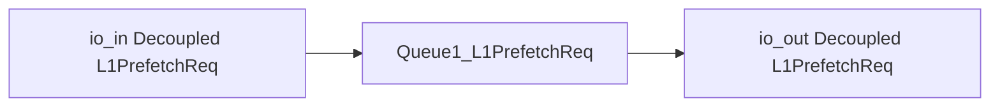
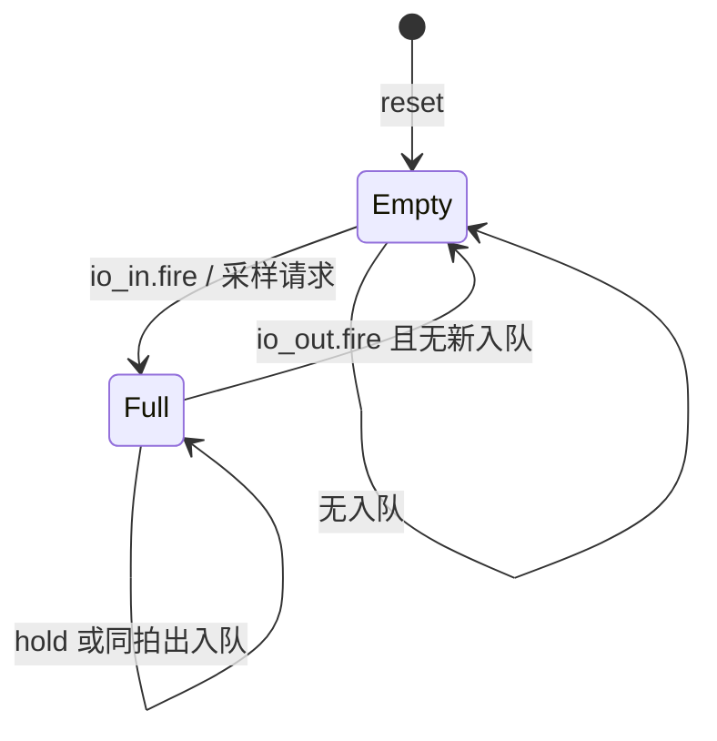
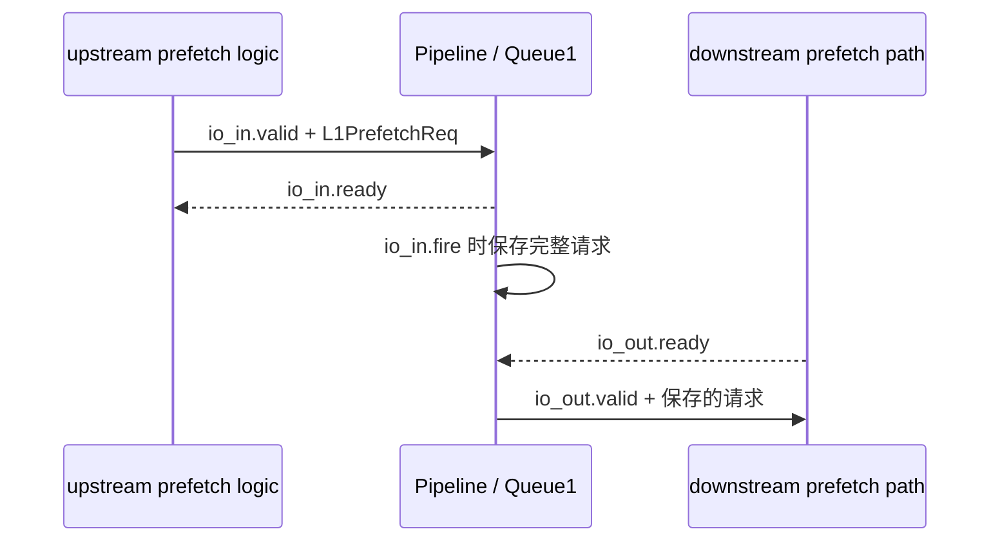

# Pipeline —— L1PrefetchReq 一拍流水缓冲

> 可读重写：`rtl/memblock/Pipeline.sv`（核 `xs_Pipeline_core`）+ `rtl/memblock/pipeline_pkg.sv`
> 设计意图来源：`src/main/scala/xiangshan/mem/MemCommon.scala` 中 Decoupled PipelineReg 语义
> golden（firtool 生成，仅作 UT/FM 对照）：`golden/chisel-rtl/Pipeline.sv`

---

## 1. 架构定位

Pipeline 是 L1 prefetch 请求路径上的可反压寄存点。它接收一条 `L1PrefetchReq`，
在下游未准备好时保持请求，在下游 `ready` 后释放；当寄存点为空或同拍出队时，
上游可以继续入队。

本模块不修改请求内容，只改变请求在流水中的时序位置。

---

## 2. Decoupled 语义

等价握手关系：

- `io_in_ready = !full || io_out_ready`
- `io_out_valid = full`
- `io_in.fire = io_in_valid & io_in_ready`
- `io_out.fire = io_out_valid & io_out_ready`

golden 本实例使用 `Queue1_L1PrefetchReq` 叶子实现这个一拍缓冲。可读核把 payload 聚合为
`l1_prefetch_req_t`，再把它接到共享 Queue1 黑盒。

---

## 3. 请求字段

| 字段 | 宽度 | 说明 |
|---|---:|---|
| `paddr` | 48 | 预取目标物理地址 |
| `addr_alias` | 2 | cache alias 信息，外部端口名仍为 `io_*_alias` |
| `confidence` | 1 | 预取置信度 |
| `is_store` | 1 | 请求是否来自 store 相关路径 |
| `pf_source_value` | 3 | 预取来源编码 |

`alias` 是 SystemVerilog 关键字，因此核内 struct 字段命名为 `addr_alias`；
这只影响内部可读命名，不改变 golden 端口。

---

## 4. 数据流

入口和出口的 `ready/valid` 被放入 `stream_handshake_t boundary_hs[]` 数组，
用 `stream_fire()` 统一表达 fire 条件。这样代码阅读时可以直接对应到流水寄存的
“采样”和“释放”两个动作。

---

## 5. 验证结果

### 5.1 UT

双例化 `Pipeline` golden 与 `Pipeline_xs`，两侧共用 golden `Queue1_L1PrefetchReq`。
随机驱动输入 valid、输出 ready 和 payload，逐拍比较所有输出；golden 输出含 X 时按
don't-care 跳过。

| seed | cycles | checks | errors |
|---:|---:|---:|---:|
| 1 | 200000 | 1400000 | 0 |
| 7 | 200000 | 1399995 | 0 |
| 42 | 200000 | 1400000 | 0 |

### 5.2 FM

`make fm`：`FM_RESULT: Verification SUCCEEDED for Pipeline`。

FM 配置中 `Queue1_L1PrefetchReq` 是同名黑盒边界，因此证明的是 Pipeline 本层
payload 聚合、拆分和 Decoupled 端口装配等价。

### 5.3 结构硬指标

对 `rtl/memblock/Pipeline.sv` 实测：

| 指标 | 值 |
|---|---:|
| `typedef struct packed` | 1 |
| `typedef enum` | 1 |
| `function automatic` | 2 |
| `genvar` / `for (` | 1 |
| 生成痕迹 grep | 0 |

黑盒子模块：`Queue1_L1PrefetchReq`。

---

## 6. 易错点

- 内部字段不能命名为 `alias`，这是 SystemVerilog 关键字。
- Queue1 的 payload 寄存器无复位；当 `io_out_valid=0` 时 payload 输出可为 X，
  UT 应按 golden X 为 don't-care 处理。
- Pipeline 只做时序缓冲，不应在此处过滤、重编码或重排 prefetch 请求。
