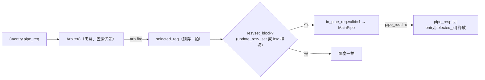

# ProbeQueue —— DCache 一致性 probe 请求队列（学习文档）

> 可读重写：`rtl/memblock/ProbeQueue.sv`（核 `xs_ProbeQueue_core`）+ `rtl/memblock/probequeue_pkg.sv`
> 设计意图来源（人写 Chisel）：`src/main/scala/xiangshan/cache/dcache/mainpipe/Probe.scala`（class ProbeQueue）
> golden（firtool 生成，仅作 UT/FM 对照）：`golden/chisel-rtl/ProbeQueue.sv`（652 行，23 端口）
> 顶层 wrapper：`rtl/memblock/ProbeQueue_wrapper.sv`（核 + 黑盒 `ProbeEntry` ×8 + `Arbiter8_MainPipeReq`）

---

## 1. 架构定位

ProbeQueue 处理来自 **L2 的一致性 probe**（TileLink **B 通道**）。当别的核要写一条本 L1 缓存着
的 cacheline 时，L2 发 `Probe` 让本 L1 降级/无效化它。本队列把每个 probe 收进一个 `ProbeEntry`，
由 entry 经 **DCache 主流水（MainPipe）** 执行降级，主流水做完回 `pipe_resp` 释放 entry。

```
        ┌──────────────────── DCache ────────────────────┐
 L2 ──mem_probe(TL B)──▶│  ProbeQueue（8 个 ProbeEntry）           │──pipe_req──▶ MainPipe
                        │   probe 翻译(vaddr重建) + 分配 + 仲裁     │◀─pipe_resp── (按 id 释放 entry)
 LSU ─lrsc_locked──────▶│   + 一拍延迟 + lrsc/resv-set 阻塞         │
       update_resv_set ▶└──────────────────────────────────────────┘
```

- 上游：`io_mem_probe`（TL B，opcode/param/address/data），`ready` 反压。
  （注：本模块 `io_mem_probe` 无 `source` 字段——golden 与可读核的 `io_mem_probe_bits_*`
  只有 opcode/param/address/data，见 `ProbeQueue.sv:26-29` / `golden ProbeQueue.sv:92-95`。）
- 下游：`io_pipe_req`（→ MainPipe，probe_param/need_data/vaddr/addr/id），`ready` 握手；
  `pipe_resp` 由 MainPipe fire 时内部生成（`valid = pipe_req.fire`，`id = selected_id`）。
- 旁路：`io_lrsc_locked_block`（LR/SC 锁定的块，probe 撞它要让路）、`io_update_resv_set`
  （reservation set 更新，下一拍阻塞所有 probe 以独立周期做地址比较）。

本配置（KunmingHu V2R2）固化参数：`nProbeEntries=8`、`PAddrBits=48`、pipe_req `vaddr` 50 位、
`id` 6 位（高 3 位恒 0）、`param` 2 位、`DCacheTagOffset=12`、`DCacheAboveIndexOffset=14`（别名 2 位）。

> **黑盒边界**：每个 entry 的 3 态状态机（`s_invalid → s_pipe_req → s_wait_resp`）封装在子模块
> `ProbeEntry`；8 路 pipe_req 的固定优先仲裁封装在 `Arbiter8_MainPipeReq`。按任务约定二者均作
> **golden 黑盒**（UT 双例化 / FM ref/impl 共用）。本核重写 **队列级** 逻辑：probe 翻译、分配、
> 仲裁后的一拍延迟与阻塞、perf。

---

## 2. 数据结构 / 纯函数（核内 struct / enum / function）

### 2.1 `pipe_req_t`（struct）—— 发往主流水的 probe 请求
`{probe_param, probe_need_data, vaddr(50), addr(48), id(6)}`，对应 Scala `ProbeEntry` 里
`pipe_req.probe := true; pipe_req.probe_param := req.param; ...`。

### 2.2 `tl_b_opcode_e`（enum）—— B 通道 opcode
本设计只接受 `TLB_PROBE = 6`（Scala 有 `assert(opcode === TLMessages.Probe)`）。
`opcode_is_probe()` 据此判定合法性（仅供阅读/波形）。

### 2.3 纯函数
- `prio_idx(v)`：最低位优先编码下标（分配 probe 给最低空闲 entry）。
- `same_block(a,b)`：去掉行内偏移低 6 位的 block 地址比较（lrsc / probe 冲突用）。

---

## 3. 数据流

### 3.1 probe 翻译：vaddr 重建（别名问题）

L2 用 **vaddr 的 index** 来 probe L1，但 probe 报文里只带 **paddr** + 几位 **别名位**（藏在 `data[2:1]`）。
当 DCache 存在 index 别名（`DCacheAboveIndexOffset(14) > DCacheTagOffset(12)`）时，要把别名位拼回 index：

```
vaddr = { 0,  addr[47:14],  alias=data[2:1],  addr[11:0] }
        └全0┘ └─tag 高段──┘ └─别名→index──┘  └index&偏移┘
```

- `need_data = data[0]`（probe 是否要回脏数据）。
- `param` / `addr` 直传。

### 3.2 分配（最低空闲 entry 优先）

```mermaid
flowchart LR
    probe["io_mem_probe<br/>(opcode=Probe)"] --> a{"有空闲 entry?"}
    a -->|allocate=|req_ready| pick["alloc_idx = prio_idx(req_ready)<br/>选最低空闲下标"]
    a -->|否| stall["mem_probe.ready=0 反压"]
    pick --> e["entry[alloc_idx].req.valid=1<br/>收下这条 probe"]
```

- `allocate = |entry_req_ready`；`io_mem_probe_ready = allocate`。
- `entry[i].req.valid = (alloc_idx==i) & allocate & mem_probe.valid`（唯一分配）。

### 3.3 仲裁 + 一拍延迟 + 阻塞

8 个 entry 的 `pipe_req` 经 **固定优先** `Arbiter8`（黑盒，低下标优先）汇聚成 `arb_out`，再 **打一拍**
存进 `selected_req`，下一拍送 `io_pipe_req`。中间插一拍是为了给 **lrsc / reservation-set 地址比较**
一个独立周期，改善时序（Scala 注释明确这样做以 better timing）。



关键时序信号（与 golden 一字对应）：
- `pipe_req_fire = io_pipe_req_ready & io_pipe_req_valid`，`io_pipe_req_valid = selected_valid & !resvset_block`。
- `arb_out_ready = !selected_valid | pipe_req_fire`（无锁存 或 锁存这拍 fire 腾位）。
- `arb_fire = arb_out_ready & arb_out_valid`：置位 `selected_valid`、`RegEnable` 锁存 payload。
- `selected_valid' = arb_fire | (~pipe_req_fire & selected_valid)`。
- `selected_lrsc_blocked = lrsc_valid & same_block(lrsc_addr, arb_fire ? arb_out_addr : selected_addr)`
  （后者还要 `& selected_valid`）。
- `resvset_block' = update_resv_set | selected_lrsc_blocked`。
- `pipe_resp`（释放 entry）：`valid = pipe_req.fire`，`id = selected_id[2:0]`，entry 在 `s_wait_resp`
  下 id 匹配则回 `s_invalid`。

---

## 4. 接口表（关键端口）

| 端口 | 方向 | 含义 |
|---|---|---|
| `io_mem_probe_*` | in | TL B probe（opcode/param/address/data(256)），`ready` 反压 |
| `io_pipe_req_*` | out | 发主流水的 probe（probe_param/need_data/vaddr(50)/addr/id(6)），`ready` 握手 |
| `io_lrsc_locked_block_{valid,bits}` | in | LR/SC 锁定块（probe 撞它要让路一拍）|
| `io_update_resv_set` | in | reservation set 更新（下一拍阻塞所有 probe）|
| `io_perf_{0..4}_value` | out | 5 路 perf 事件计数（各延迟 2 拍）|

---

## 5. 验证结果

### 5.1 UT（golden vs 可读核双例化，逐拍逐输出比对）

`verif/ut/ProbeQueue/`（`make run SEED=<n>`）。`u_g`(golden `ProbeQueue`) vs
`u_i`(`ProbeQueue_xs`→`xs_ProbeQueue_core`)，两侧共用 golden 的 `ProbeEntry` / `Arbiter8_MainPipeReq`。

| seed | 1 | 7 | 42 |
|---|---|---|---|
| 结果 | PASS（checks=200000 errors=0）| PASS | PASS |

测试台要点：
- `opcode` 固定 `Probe=6`（合法激励；`+SYNTHESIS` 已关 Scala 断言）。
- `address` / `lrsc_locked_block` 压窄高位（仅低 8 个 block）。配「不向已在途 block 再发 probe」的
  影子模型（probe 入队标记、pipe_req 完成清除），保持激励合法（避免 probe_conflict 路径）并提高 entry 占用。
- `lrsc_locked_block_valid`（1/4）/ `update_resv_set`（1/8）适度置位，覆盖 `selected_lrsc_blocked` /
  `resvset_block` 两条阻塞路径；`pipe_req.ready` 随机背压。
- payload 类输出（`pipe_req_bits_*`）仅在 `g_io_pipe_req_valid` 时比对。

### 5.2 FM（Formality 签名等价）

`make fm` → **`FM_RESULT: Verification SUCCEEDED`**。entry / arbiter 子模块两侧均例化同名 golden 黑盒，
FM 按名配对为黑盒；队列级逻辑（vaddr 重建、分配、一拍延迟与阻塞、perf）经签名分析全部等价，
**1092 compare points matched（140 by name + 952 by signature），0 unmatched / 0 failing**。
`FM_MERGE_DUP=false`（关「合并同值重复寄存器」pass）。

---

## 6. 结构门槛自检（可读核 `xs_ProbeQueue_core` + pkg）

- `typedef struct packed`：`pipe_req_t`（>0 ✓）
- `typedef enum`：`tl_b_opcode_e`（B 通道 opcode，>0 ✓）
- `function automatic`：`prio_idx / same_block / opcode_is_probe`（>0 ✓）
- `genvar/for`：8 路 entry 阵列例化、perf 计数用 generate/for（>0 ✓）
- 展平名/生成痕迹 `grep -E "io_[a-z_]+_[0-9]+_[0-9]+|_REG_[0-9]|_GEN_|_T_[0-9]|RANDOMIZE"` = 0 ✓
- 行数：核 ~288 + pkg ~85 ≈ 373（vs golden 652；entry 状态机 + 仲裁器在黑盒内）✓
