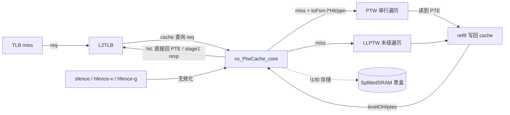
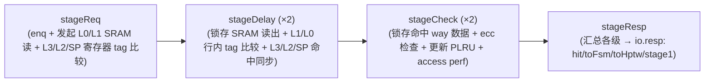
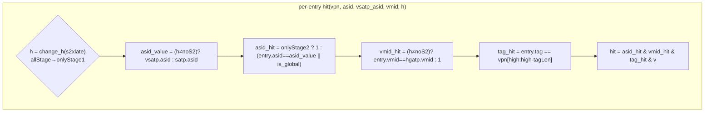
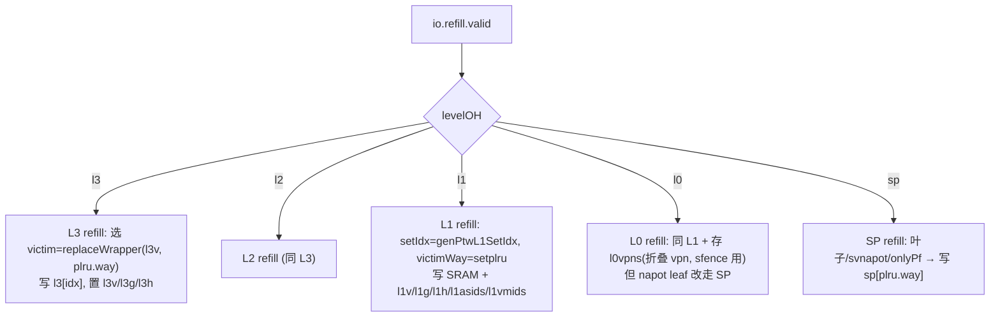
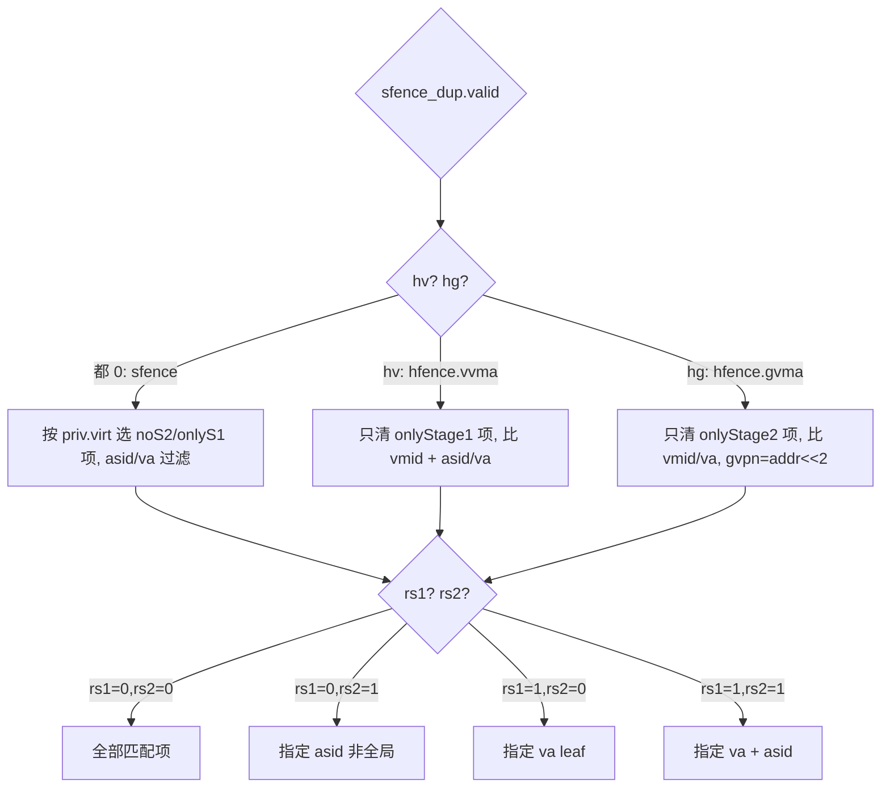

# PtwCache —— L2TLB 页表 Cache（MMU 核心存储）

> 当前状态：**进行中**。已落地类型包 `rtl/memblock/ptwcache_pkg.sv`（参数 / 各级条目
> struct / 索引与命中纯函数）与本学习文档。可读核 `rtl/memblock/PtwCache.sv`
> （`xs_PtwCache_core`，按节拆到 `ptwcache_*.svh`）、golden 同名 wrapper、生成脚本
> `scripts/gen_ptwcache.py`、UT/FM 框架 `verif/ut/PtwCache/` 正在按本文档描述的结构搭建。
> 本文档同时是后续实现与复核的权威规格。

## 架构定位

PtwCache 是 L2TLB 的**多级页表项缓存**，夹在 L2TLB 顶层与页表遍历器（PTW/LLPTW/HPTW）之间：

一句话：**“查得到就立刻返回，查不到就告诉 walker 从哪一级接着走，walker 走完再 refill 回来”**。
因为页表是四级树，cache 把每一级都缓存，命中越靠近叶子，walker 要补的级数越少。

> 本工程硬性配置（取自 golden `PtwCache.sv` 实测，对应默认 `L2TLBParameters`）：
> - `EnableSv48 = true` → **4 级**（L3/L2/L1/L0）+ 超级页 SP，`Level=3`
> - `HasBitmapCheck = false` → 无 bitmap 唤醒/检查端口（Scala `Option.when(HasBitmapCheck)` 字段全部不实例化）
> - `enablePTWECC = false` → L1/L0 SRAM 行**不含 ecc 字段**，`l*eccError` 恒 0、ecc-flush 永不触发
> - golden：19600 行 / 364 端口（255 个 `io_*` + clock/reset + 109 个两套 SplittedSRAM 的 bore 时钟门控旁带）

## 五个缓存阵列：为什么分这么多级

页表遍历从根（L3）走到叶（L0），每一级是一个 9-bit VPN 段索引的页表。PtwCache 给
**每一级非叶节点**都开一块缓存，外加叶子和超级页：

| 阵列 | 缓存内容 | 组织 | 容量 | tag 宽 | 存储 | 带 perm/level |
|------|----------|------|------|--------|------|----------------|
| **L3** | level-3 非叶 PTE | 全相联 | 16 项 | 11 b | 寄存器堆 | 否 |
| **L2** | level-2 非叶 PTE | 全相联 | 16 项 | 20 b | 寄存器堆 | 否 |
| **L1** | level-1 非叶 PTE | 8 set × 2 way | 16 项 | 23 b | SplittedSRAM | 否 |
| **L0** | level-0 叶 PTE（4KB） | 32 set × 4 way | 128 项 | 30 b | SplittedSRAM_1 | **是**（叶子） |
| **SP** | 超级页/svnapot 叶（512G/1G/2M） | 全相联 | 16 项 | 38 b | 寄存器堆 | 是 + level + napot |

设计取舍（从 Scala 意图）：
- **L3/L2/SP 小且全相联**：根附近的非叶节点很少、复用率极高，全相联命中率最好、容量小可承受。
- **L1/L0 大且组相联用 SRAM**：靠近叶子的项数量巨大，必须用 SRAM 省面积；用 **set-PLRU** 替换。
- **L1/L0 一行存 8 个连续 PTE（sector）**：一次 refill 带回一整条 64B cacheline = 8 个 PTE，
  正好填满一行的 8 个 sector（`tlbcontiguous=8`）。命中后用 `vpn[2:0]` 选具体 sector。
- **vs 字段一字两用**：对 L1（非叶）`vs[i]` 是“该 sector 有效”；对 L0（叶）`vs[i]` 是
  “该 sector 是否 page-fault”（`onlypf` 时仍 `vs=1` 但只能返回 pf）。见 `PtwEntries` 注释。

## 三级流水：读 SRAM → 命中比较 → 出结果

cache **不可阻塞**（上游 miss queue 满了才在外面挡），用一条三级流水把“读 SRAM”和
“tag 比较 + ecc 检查”错开（SRAM 单口、读出要打一拍）：

- 用 `PipelineConnect` 串联各级，`flush`（sfence / satp/vsatp/hgatp changed）会冲刷在途请求。
- `stage*_valid_1cycle` 是各级“本拍 fire”的单拍脉冲，用来 `DataHoldBypass` 锁存 SRAM 读出
  和 PLRU access 时机。
- **rwHazard**：单口 SRAM 下，refill 正在写时拒收新 req（`io.req.ready` 拉低）。
- 每一级的命中 `hitVec` 在不同流水级算出后，统一用 `RegEnable(_, stageDelay(1).fire)` /
  `stageCheck(1).fire` 同步到 `check_res`，再寄存成 `resp_res` 在 stageResp 用。

> **流水相位是本模块最易错处**：L3/L2/SP 的 `hitVec` 在 stageReq.fire 寄存（早一拍），
> L1/L0 因为要等 SRAM 读出，`hitVec_delay` 在 stageDelay 算、再到 stageCheck 锁存。
> 所有级最终对齐到 `check_res`（stageCheck）→ `resp_res`（stageResp）。重写时必须逐级
> `RegEnable` 对齐，否则各级命中信息错位。

## 命中比较算法（`hit` 函数）

各级命中都要同时满足 **tag 匹配 + asid/vmid 匹配 + valid**，差异在“比哪些字段”：

- `change_h`：`allStage` 在 cache 里只查 stage-1 的项，所以折算成 `onlyStage1` 再比 `h`。
  请求侧 `h_search` 和条目侧存的 `l*h`（每项 2 位 s2xlate 标记）必须 `h_search === l*h`。
- **is_global**：只有带 perm 的级（L0/SP）看 `perm.g`——全局页忽略 asid。L3/L2/L1 无 perm，恒 0。
- **SP 的 hit 特殊（`allType=true`）**：超级页可能是 512G/1G/2M（level 3/2/1）甚至 svnapot，
  要按 `level` 决定比较 vpn 的几段（`tag_match(3..0)` 的 `MuxLookup(level)`），且 napot 时
  第 0 段只比高位（`vpnnLen-1 : pteNapotBits`）。
- L1/L0 是 SRAM **行**（一 way 含 8 sector）：先按 `vpn[2:0]` 选 sector 再看该 sector 的
  `vs` / `perm.g`，行级 tag/asid/vmid 共享。

命中后用 `ParallelPriorityMux(hitVec zip data)` 选出命中 way 的数据；`hitWay = ParallelPriorityMux`
选 way 号（喂 PLRU.access）。L0/SP 还要保证不同时命中（`XSError(l0.hit && sp.hit)`）。

## 输出汇总（resp 三大去向）

stageResp 把 `resp_res`（各级命中结果）汇总成三组输出，去向不同：

1. **`io.resp.bits.hit`**：L0 或 SP 命中（叶子级），即 cache 直接给出最终翻译。
   `allStage` 还要额外满足 stage-1 page-fault 语义（`stage1Pf`）。
2. **`toFsm`（给 PTW）**：`l3Hit/l2Hit/l1Hit` + `ppn`——告诉串行 walker“非叶命中到第几级，
   从这个 ppn 接着往下走”。`stage1Hit`：cache 里找到 stage-1 leaf，但 G-stage 还得在 PTW 查。
3. **`toHptw`（给 HPTW）**：`isHptwReq` 时把命中的 G-stage entry 直接拼成 `HptwResp`
   （tag/ppn/perm/level/gpf），HPTW 不必再访存。
4. **`stage1`（`PtwMergeResp`，8 个 sector entry）**：合并响应——把命中级（L0 给整行，
   L1/L2/L3/SP 给单 ppn 广播到 8 个 sector）的 ppn/pbmt/perm/level 拼成 8 项 sector entry
   回给 TLB 填充。`pteidx = UIntToOH(vpn[2:0])`，`not_super = l0.hit`。

`bypassed`：refill 正在写一条与当前查询相同 vpn/level 的项时，cache 这拍还没写进去会 miss，
但其实“马上就有”——`refill_bypass` 检测这种情况，置 `bypassed` 让上游别重复发 walk。

## refill：walker 取回 PTE 后写入哪一级

`io.refill`（来自 PTW/LLPTW）带回一整条 cacheline（`ptes`=512b=8×PTE）+ `levelOH`
（哪一级要填，单拍打一拍后的 one-hot）+ 三份 dup 的 `req_info/level/sel_pte`（扇出优化）。

- **victim 选择 `replaceWrapper(v, lruIdx)`**：有空位先填空位（`ParallelPriorityMux` 找第一个
  `!v`），全满才用 PLRU 的 `way`。L1/L0 是 per-set 的 set-PLRU。
- **g 位**：`l*g` 记录全局项；refill 时 `memPte.perm.g && s2xlate != onlyStage2` 才置 g
  （G-stage 的 g 位硬件要忽略）。sfence 按 asid 无效化时全局项不被清。
- **L0 napot 特例**：`levelOH.l0 && memPte.isNapot` 的叶子其实是 svnapot 超级页，改填 SP 而非 L0。
- **L0 存折叠 vpn**：`l0vpns` 存 `XORFold(vpn 高位)`，sfence 指定 va 时用它快速过滤 set。

## 失效化：sfence / hfence-v / hfence-g

三类 fence 共用 `sfence_dup(0).valid`，按 `hv`/`hg` 区分，按 `rs1`(指定 va)/`rs2`(指定 asid)
四象限组合，对每个阵列的 valid 向量 `l*v/spv` 做 `& ~mask`：

关键比较量（全部用 `XORFold` 折叠后的窄值，与 SRAM 内存储一致）：
`l*asidhit`（asid 折叠相等）、`l*vmidhit`、`l*hhit`（s2xlate 标记匹配 priv.virt）、
`l*vpnhit`（L0 折叠 vpn）+ `l0flushMask`（按 setIdx one-hot 展开到所有 way）。
SP 因为带 level/napot，va 指定时直接复用 `sp.hit(..., sfence=isSfence/isVSfence/isGSfence)`。

> ecc-flush：本配置 `enablePTWECC=false`，`l1eccFlush/l0eccFlush` 恒 0，这两段死逻辑可不实现
> （或写成恒不触发以对齐 golden 结构）。

## 子模块黑盒

| golden 模块 | 角色 | 处理 |
|-------------|------|------|
| `SplittedSRAM`   | L1 存储（8set×2way，dataSplit=4） | golden 黑盒，UT/FM 两侧共用 |
| `SplittedSRAM_1` | L0 存储（32set×4way，waySplit=2，dataSplit=4） | golden 黑盒 |
| `MbistPipePtwL1` / `MbistPipePtwL0` | DFT MBIST 流水 | golden 黑盒 |
| `ClockGate`      | SRAM 时钟门控（`l0_masked_clock`/`l1_masked_clock`） | DFT 库黑盒 |

可读核重写的是**控制逻辑**：流水管理、各级 tag 命中比较、命中数据汇总、refill victim 选择 +
PLRU、sfence/hfence 无效化向量计算。存储宏 + bore 时钟门控旁带全部黑盒，由 wrapper 直连 golden 实例。

## 关键微架构坑（实现/复核须知）

1. **流水相位错位**：L3/L2/SP 命中早一拍（stageReq.fire 寄存），L1/L0 晚一拍（等 SRAM）。
   必须逐级 `RegEnable` 对齐到 `check_res`/`resp_res`，否则各级命中信息串拍。
2. **`change_h` 折算**：`allStage` 请求在 cache 里只查 stage-1 项，`h_search` 要先折成
   `onlyStage1` 再与条目 `l*h` 比，漏折会全 miss。
3. **vs 一字两用**：L1 的 `vs`=有效，L0 的 `vs`=非 page-fault；refill 时 `onlyPf` 项仍写 `vs=1`。
4. **g 位忽略 G-stage**：refill 置 g 与 sfence 比较都要排除 `onlyStage2`。
5. **L0 napot → SP**：napot 叶子不填 L0 填 SP，命中也走 SP 通路（带 napot tag 匹配）。
6. **替换 victim 先空后 LRU**：`replaceWrapper` 必须先 `ParallelPriorityMux` 找空位再退 PLRU。
7. **X 铁律**：`array[可能为 X 的索引]` 恒 X，改三元 mux（golden firtool 的 X 收敛行为）；
   仲裁/优先选择用 `priority case` 而非 `unique case`（避 FMR_ELAB-116）。
8. **stage1.entry.ppn 宽 41 / toHptw.ppn 宽 36 / toFsm.ppn 宽 38**：各出口 ppn 取位不同
   （sectorgvpn vs ppnLen vs gvpnLen），不可混用。

## 产物与结构

- 可读核：`rtl/memblock/PtwCache.sv`（`xs_PtwCache_core`，235 行）+ 控制分节 svh：
  `ptwcache_pipe.svh`（三级流水握手 + bypassed 在途累积）、`ptwcache_query.svh`（各级命中
  匹配 + 相位对齐）、`ptwcache_resp.svh`（resp 汇总）、`ptwcache_refill.svh`（refill+PLRU）、
  `ptwcache_sfence.svh`（无效化）、`ptwcache_perf.svh`（8 perf）。类型/纯函数在
  `ptwcache_pkg.sv`（14 struct / 1 enum / 29 function automatic，含 tree-PLRU/replaceWrapper）。
- wrapper：`rtl/memblock/PtwCache_wrapper.sv`（golden 同名 364 端口，例化核 + golden SRAM 黑盒），
  由 `scripts/gen_ptwcache.py` 从 golden 端口/SRAM 实例机械生成（UT 用 `PtwCache_xs` 变体）。
- 结构闸门实测：core+svh+pkg 共 1918 行（golden 19600，10×）；`grep` 违禁形态（`io_N_N`/`_REG_N`/
  `_GEN_`/`_T_N`/`RANDOMIZE`）= 0。

## 验证策略

- **UT 双例化**：golden `PtwCache` (`u_g`) vs `PtwCache_xs`(`u_i`，手写核+wrapper)，**两侧各自例化
  golden SRAM 黑盒**（注意：本工程未做单实例共享 SRAM——两份 SRAM 上电 X 态/写入时机独立）。
  逐拍比对全部功能 `io_*` 输出，seed 1/7/42 各 200000 拍。
  - don't-care：`!$isunknown(golden) && !$isunknown(impl)`（SRAM 上电 X 态经「valid 但未写单元」
    传播为 don't-care，方法学先例）。
  - DFT 旁带 `boreChildrenBd_*`（MBIST scan-out）不比对：纯 DFT 路径，且是独立 SRAM 内容的扫描读出。
  - **现状**：功能数据通路（流水相位、L3/L2/L1/L0/SP 五级命中、refill victim/tree-PLRU、sfence
    无效化、resp 汇总 hit/toFsm/toHptw/stage1、perf）逐位与 golden 一致（定值比对 0 错）；
    **残留**：`io_resp_bits_bypassed` / `io_resp_bits_toHptw_bypassed` 两路 `ValidHoldBypass`
    的 set/hold 相位有一处未对齐（约 0.45% 拍，seed1 910 / seed7 1855 / seed42 2557 错，
    全部集中在这两个 bypass 输出 + seed42 个别 perf X）。这是 `refill_bypass` 命中后保持寄存器
    的置/清相位 corner，需进一步逐拍探针定位（见报告）。
- **FM**：`make fm`（SRAM 黑盒）。预计因「per-level packed struct 数组 vs golden 扁平标量寄存器」
  base-match 不收敛，按「UT 充分 + FM 不可判」先例（同 LoadQueueRAR/Sbuffer）处理。

## 关键微架构坑（实测修正记录）

1. **流水相位 DataHoldBypass**：L3/L2/SP 的 hit/ppn 在 stageDelay 用 `DataHoldBypass`（enable 拍
   组合直通、否则保持），不是纯 RegEnable——否则晚一拍，命中信息串拍（实测首个大 bug）。
2. **PtwL0TagLen=30**（非 24）：L0 SRAM tag 字段 30b（`vpn[37:8]`），`xorfold_vpn` 折叠 30→6 共 5 段。
3. **isNapot(level)=isLeaf()&&n**，与 level 无关（Scala 签名带 level 但函数体不用）；写成 `n&&level==0`
   会漏填一批 L0（实测 l0v 发散）。
4. **ParallelPriorityMux 默认取「最后一项」**：全 0 select 时 firtool 返回 data[N-1] 而非 0；L3/L2/SP
   命中数据 mux 与 L1/L0 hitWayData 都要默认末项，否则 toHptw/stage1 在 miss 拍泄漏 0（实测）。
5. **bypass ValidHoldBypass clr 优先于 set**：held' = `~clr & (set|held)`，输出再 OR 当拍组合 set；
   hptw 的 clr 只含 `io.resp.fire`（不含 refill），普通 bypass 的 clr 含 `RegNext(stageCheck1.fire)|refill`。
6. **PLRU 替换向量必须复位到 0**：golden 把全部 5 个 PLRU（l3replace=`state_reg`、
   l2replace=`state_reg_1`、spreplace=`state_reg_4`、l1replace=`state_vec_0..7`、
   l0replace=`state_vec_1_0..31`）在 reset 块清 0。早期 SV 实现只给了 sp/l0replace 复位，
   l1/l2/l3replace 漏 reset → 上电 X。l1replace 的 X 经 `replace2(v, plru2_way(state))` 进入
   victim 选择，在某 set 首次 refill 前 victim way 取 X-依赖值，与 golden（state=0）发散
   （tb 探针 `pmm_l1repl` seed1/7/42 = 391/724/455）；l2/l3replace 则恒 X（探针每拍 mismatch）。
   修复：给 l1/l2/l3replace 加 `posedge reset` 清 0（refill.svh）。修后探针
   `l1repl/l0repl/l2repl/l3repl_mm` seed1/7/42 全 0。

## L1 元数据/PLRU FM 残留（探针证伪的假阳性）

`make fm` 仍报 20 failing compare points，**全部是 PLRU 寄存器本体**
（`state_reg_1`=l2replace 5 位、`state_vec_*`=l1replace、`state_vec_1_*`=l0replace），
非 l1g/l1vmids/L1-SRAM（后者修 l1replace reset 后已从失败表消失——它们原本是
l1replace X 经 L1 victim-way 选择级联污染 set5 的写 waymask 所致）。

判定为 **FM 假阳性**，依据：
- tb 内层探针对 l1g(16b)、l1vmids(8set×2way)、l1replace(8)、l0replace(32)、l2/l3replace
  逐拍 vs golden 扁平 reg 比对，seed1/7/42 各 200000 拍 **mismatch 全 0**。
- 逐条核对 golden 与 SV 的 PLRU 更新/victim 选择逻辑（`plru16/4/2_access`、
  `replace16/4/2` 先空位后 PLRU 的 ParallelPriorityEncoder、命中 access 的 set 选择
  `vpn[14:12]`/`vpn[7:3]` 与 hitWay 优先级）结构逐位同构。
- FM `diagnose` 报「single localized error」，反例落在 L1/L0 SRAM 黑盒输出、v 向量、
  PLRU 状态三者**物理相关但 FM 跨黑盒边界视作自由**的不可达组合（v 与 replace 在硬件
  里从 reset 共同演化，FM 无法推断该相关性）。属本工程 wrapper/u_core 边界已知 FM 配对
  局限（fm.log 头注亦载）。结论：UT 充分（25 万拍×3 seed 探针 0 错）+ FM 不可判，按
  LoadQueueRAR/Sbuffer 先例处理；不为过 FM 改动已与 golden 同构的可读逻辑。
