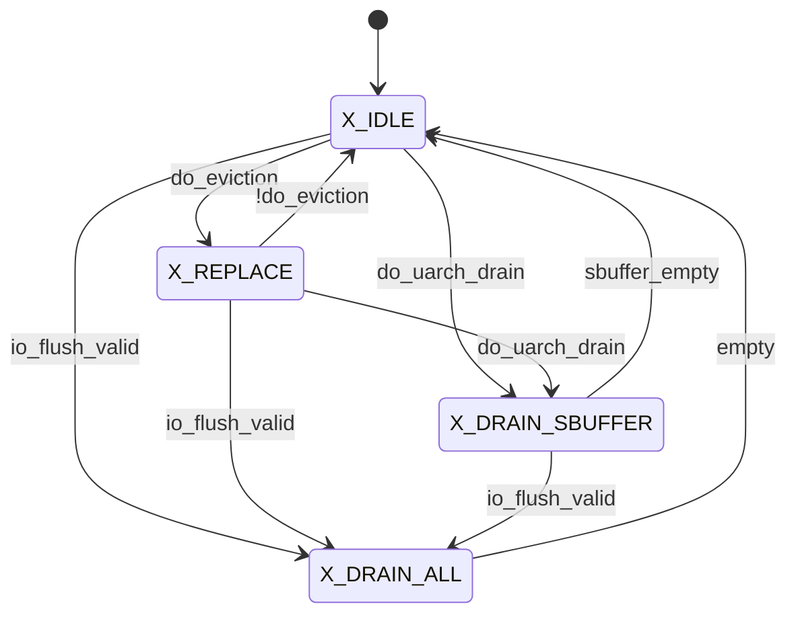
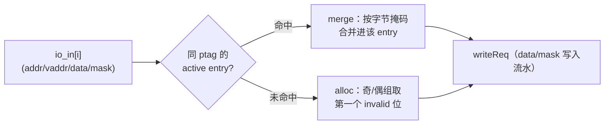
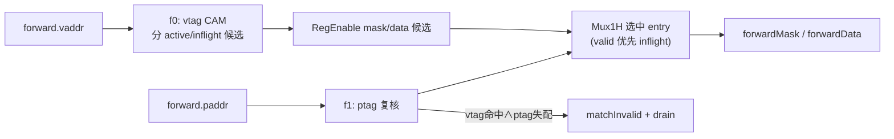

# Sbuffer —— store 写合并缓冲（学习文档）

> 可读重写：`rtl/memblock/Sbuffer.sv`（核 `xs_Sbuffer_core`）+ `rtl/memblock/sbuffer_pkg.sv`
> 设计意图来源（人写 Chisel）：`src/main/scala/xiangshan/mem/sbuffer/Sbuffer.scala`
> golden（firtool 生成，仅作 UT/FM 对照）：`golden/chisel-rtl/Sbuffer.sv`（21725 行）
> 顶层 wrapper：`rtl/memblock/Sbuffer_wrapper.sv`（核 + 黑盒 `StorePfWrapper` 预取器）

---

## 1. 架构定位

Sbuffer 位于 MemBlock store 通路的**末端**。被 StoreQueue 提交（地址、数据、字节掩码都已
确定）的 store **不会**逐条写 DCache，而是先攒进 Sbuffer：把落在**同一条 cacheline** 的多个
store **合并（merge）** 到同一个缓冲 entry，等到攒够 / 超时 / 被 flush 时，再把整条 cacheline
（512b 数据 + 64B 逐字节掩码）**一次性写进 DCache**（write coalescing，显著降低 DCache 写带宽）。
同时给 load 流水提供 **forward**：load 可以从尚未写回 DCache 的 store 数据里前递最新字节。

```
            ┌──────────────────── MemBlock ────────────────────┐
StoreQueue ─in(2路)──▶│  Sbuffer（16 个 cacheline entry）       │──dcache.req──▶ DCache
 LoadUnit ─forward(3)▶│   每 entry：state 机 + 整行 data/mask    │◀─hit/replay resp──
           flush/fence▶│   全局 4 态机 + PLRU 替换               │
            └──────────────────────────────────────────────────┘
                              │ store_prefetch（黑盒 StorePfWrapper）
                              ▼  到 DCache 预取
```

- 上游：`io_in`（2 路 store 入口，Decoupled）、`io_forward`（3 路 load 前递）、`io_flush`（fence/排空）。
- 下游：`io_dcache.req`（整行写）、收 `main_pipe_hit_resp`（写命中→释放）/ `replay_resp`（需重发）。
- 旁路：`io_sbempty` / `io_flush_empty`（空标志）、`io_force_write`（放宽逐出阈值）、`io_perf`（16 路计数）。

本配置（KunmingHu V2R2）固化参数：`StoreBufferSize=16`、`EnsbufferWidth=2`、`LoadPipelineWidth=3`、
`VLEN=128`、`PAddrBits=48`、`VAddrBits=50`、`CacheLineSize=512`（行 64B，每行 4×16B word）、
`EvictCycles=1<<20`（超时计数 21 位）、`SbufferReplayDelayCycles=16`（重发计数 5 位）、
逐出阈值 `threshold=7 / base=4`。本配置 `EnableStorePrefetchSPB/AtCommit=false`、Difftest 关、
无 `csrCtrl/hartId`，故 golden 端口已裁剪，`store_prefetch` 仅由黑盒 `StorePfWrapper` 直驱。

---

## 2. 数据结构（核内 struct / enum）

### 2.1 entry 状态（`sbuf_state_t`，4 个 bool）
对应 Scala `SbufferEntryState`。每个 entry 一份小状态机：

| 字段 | 含义 |
|---|---|
| `state_valid`          | entry 活跃（占用一条 cacheline）|
| `state_inflight`       | 正在 / 已向 DCache 发该行的写，等回应 |
| `w_timeout`            | DCache 回了 replay（需重发），挂起等重发计数超时 |
| `w_sameblock_inflight` | 分配时同 block 已有 entry 在途，先挂起等它写完（保证同 block 顺序）|

派生判定（纯函数）：`isActive = valid & !inflight`、`isDcacheReqCandidate = valid & !inflight & !w_sameblock_inflight`。

### 2.2 entry 元数据（`sbuf_meta_t`）
`{ptag(42b), vtag(44b)}`。`ptag` 做 DCache 写地址 + 同 block 判定；`vtag` 做 forward CAM
与 vtag 一致性检查（merge/forward 时 vtag 失配 → 触发 micro-arch drain 抽干重做）。

### 2.3 整行数据 / 掩码
`cline_data[16][4]`（每 entry 4 个 16B word）、`cline_mask[16][4]`（逐字节有效位，golden `RegInit(0)`）。
另有 `cohCount[16]`（攒数据超时计数，21 位）、`missqReplayCount[16]`（重发延时计数，5 位）。

### 2.4 全局 4 态状态机（`sbuf_gstate_e`）



- `X_IDLE`：正常收 store。buffer 接近满（`do_eviction`）→ `X_REPLACE` 走 PLRU 逐出。
- `X_REPLACE`：按 PLRU 持续逐出，直到不再需要逐出回 `X_IDLE`。
- `X_DRAIN_ALL`：fence/flush，排空 sbuffer + storeQueue，`empty` 后回 idle。
- `X_DRAIN_SBUFFER`：仅排空 sbuffer（micro-arch drain，期间拒收新 store）。
- `needDrain = state[1]`（`X_DRAIN_ALL`/`X_DRAIN_SBUFFER` 两态的高位都是 1）。

---

## 3. 数据流：四个并发处理面

### 3.1 Enq —— 收 store（merge / alloc）

每拍最多收 2 路 store（`io_in_0/1`）。对每路：

1. **merge 判定**：`mergeMask[i][j] = (inptag[i]==ptag[j]) & active[j]`，命中则把 store 的数据按
   字节掩码合并进该 entry（不占新位）。
2. **alloc 判定**：若不 merge，则在 invalid entry 里分配新位。为让两路并发不冲突，把 16 个
   entry 按下标**奇 / 偶分组**，第一路用一组、第二路用另一组（`enbufferSelReg` 每个有效拍翻转，
   均衡占用）；两路同 cacheline（`sameTag`）时第二路复用第一路的下标。



数据写入是 **2 拍流水**（对应 Scala `SbufferData`）：s1 把 `wvec/data/mask/wline/offset` 锁存一拍，
s2 逐 (word, byte) 判定 `write_byte = s2_wen & (mask[b] & offset==word | wline)`，命中则写 data 该字节
并置 mask=1。`wline`（vector 整行写）会写满整行。

### 3.2 Deq —— 选 evictionIdx 写 DCache

`out_s0` 按**优先级**选一个要逐出的 entry：

```
missqReplayTimeOut（重发延时到）> drain（needDrain）> cohTimeOut（攒数据超时）> replace（PLRU）
```

- `drainIdx = PriorityEncoder(activeMask)`（排空时从低位逐出）。
- `cohTimeOutIdx`：`cohCount[i][20] & active[i]` 的最低位（攒了 2^20 拍还没逐出 → 强制逐出）。
- `replaceIdx`：**ValidPseudoLRU(16)** 在「DCache 写候选」里选最旧的有效 way（见 §4）。

选中的 entry 满足 `isDcacheReqCandidate` 且对应触发条件 → `out_s0_valid`。`out_s0` fire 时把 entry
置 `state_inflight`、清 `w_timeout`；`out_s1` 流水寄存器锁存 idx/ptag/vtag，组 DCache 写请求：
整行 `data(512b)` / `mask(64b)`、`addr = ptag<<6`、`id = evictionIdx`。

读写冒险：被逐出 entry 这拍正被 `writeReq` 写 → `blockDcacheWrite` 阻塞 DCache 写一拍。

### 3.3 Resp —— DCache 回应

- `main_pipe_hit_resp`（写命中）：清该 entry 的 `valid/inflight`（释放），并延迟一拍把整行 `mask` 清 0；
  同时解除同 block 等待者的 `w_sameblock_inflight`（`waitInflightMask == UIntToOH(resp.id)`）。
- `replay_resp`（需重发）：挂 `w_timeout`，等 `missqReplayCount` 计满（16 拍）后由 `out_s0` 重新逐出。

> ⚠ **计数器优先级（易错点）**：`cohCount` 与 `missqReplayCount` 的「+1」**优先于**「清 0」。
> 即对一个已 `active` 的 entry，即便这拍正被 merge，`cohCount` 也是 +1 而非清 0（Chisel 里 +1 的
> `when` 在源码后出现，last-wins 覆盖 merge 的 `:=0`）。只有 entry 这拍非 active 时清 0 才生效。

### 3.4 Forward —— 给 load 前递在途 store 数据

3 路并发。每路 2 拍（f0/f1）：

- **f0**：用 `forward.vaddr` 对所有 entry 做 vtag CAM，按 active/inflight 分两类候选；RegEnable 锁存
  各 entry 在该行 VWord 偏移处的 `mask/data` 候选。
- **f1**：打一拍后用 `forward.paddr` 复核（ptag CAM）。`Mux1H` 选中命中 entry 的 mask/data：
  **active(valid) 优先于 inflight**。逐字节输出 `forwardMask = inflMask|validMask`、
  `forwardData = validMask[j] ? validData[j] : inflData[j]`。vtag 命中而 ptag 失配 → `matchInvalid`
  并触发 `forward_need_uarch_drain`（抽干 buffer 重做，因为 vaddr/paddr 别名冲突）。



---

## 4. PLRU 替换（ValidPseudoLRU 16-way）

`replaceIdx` 用 Rocket `ValidPseudoLRU(16)`：15 位树状态 `plru_state`，在 `candidateVec`
（`isDcacheReqCandidate` 的 entry）里选**最旧**的有效 way。树是 4 层平衡二叉树：

- 叶序：最左叶 = way15，最右叶 = way0；每个分支节点一个 state bit「left_older」。
- `way()`（读）：每层当两子都有效时用 state bit 选，否则选有效那侧（左→msb=1）；输出即实际 way 下标。
- `access()/touch()`（更新）：把被 touch 的 way 路径上的节点 bit 设成「远离该 way」。
  本核每拍最多 3 个 touch（2 路 enq 的 `accessIdx0/1` + 逐出的 `accessIdx2=replaceIdx`），按
  **0→1→2 顺序依次叠加**到同一拍（不是三选一，对应 `access(Seq(...))` 的 fold）。

可读核把 golden 展平的 ~170 行树表达式收成 `plru_pair/plru_join` 纯函数 + 4 层 generate 归约，
并显式注释每个节点对应的 state bit（way15/14→s[11]…root→s[14]）。

---

## 5. 接口表（关键端口）

| 端口 | 方向 | 含义 |
|---|---|---|
| `io_in_{0,1}_*` | in | 2 路 store（vaddr/data(128)/mask(16)/addr/wline/vecValid），`ready` 反压 |
| `io_dcache_req_*` | out | 整行写（data(512)/mask(64)/addr/vaddr/id），`ready` 握手 |
| `io_dcache_main_pipe_hit_resp_*` | in | 写命中回应（释放 entry，按 id）|
| `io_dcache_replay_resp_*` | in | 需重发回应（挂 w_timeout）|
| `io_forward_{0,1,2}_*` | in/out | 3 路 load 前递（vaddr/paddr 进；forwardMask[16]/forwardData[16]/matchInvalid 出）|
| `io_flush_valid / io_flush_empty` | in/out | fence 抽干请求 / 完成 |
| `io_sqempty / io_sbempty` | in/out | storeQueue 空 / sbuffer 空（打一拍）|
| `io_force_write` | in | 放宽逐出阈值（`forceThreshold = 7-4=3`）|
| `io_store_prefetch_{0,1}_bits_vaddr` | out | store 预取（黑盒 `StorePfWrapper` 直驱）|
| `io_perf_{0..15}_value` | out | 16 路 perf 事件计数（各延迟 2 拍）|

---

## 6. 验证结果

### 6.1 UT（golden vs 可读核双例化，逐拍逐输出比对）

`verif/ut/Sbuffer/`（`make run SEED=<n>`）。多种子 **errors=0**：

| seed | 1 | 7 | 42 | 2 | 99 | 123 | 7777 |
|---|---|---|---|---|---|---|---|
| 结果 | PASS | PASS | PASS | PASS | PASS | PASS | PASS |

测试台要点：
- 地址压窄高位（仅低 8 个 cacheline），反复命中同行以覆盖 merge / sameblock-inflight / forward-CAM。
- DCache 响应模型：记录 golden 侧 `dcache.req` fire 的 id 标记在途，再随机回 hit/replay，保证只对
  **真正在途**的 entry 回 resp（否则内部断言违例、两侧分叉）。
- payload 类输出（`dcache_req_bits_*`、`forward_*`）仅在对应 valid（取 golden 侧）有效时比对。

### 6.2 FM（Formality 签名等价）

`make fm`。本模块是 16-entry 大状态机，可读核结构（struct 数组 + generate + PLRU 函数）与 golden
firtool 展平 RTL 差异极大：golden 把每个 entry / cohCount / vtag 全展开成独立标量寄存器
（`cohCount_0..15`、`vtag_0..15`），可读核是 `cohCount_reg[16][21]` / `meta[16].vtag` 二维数组。
**签名分析对这类「N 份同构寄存器阵列」无法逐一配对**（名字与拓扑都不同），故大量 entry 寄存器落在
`Unmatched / Unverified`。已能匹配的组合逻辑与控制寄存器（约 350 点）等价通过。

FM 结果（`make fm`）：**359 Passing / 20 Failing / 1946 Unverified**。20 个 Failing **全部是
entry 0 的 `cohCount_0` 的 21 个 bit**（其余 15 个 entry 的 cohCount 因 N 路同构阵列无法配对而落在
Unverified）。

**这 20 个 Failing 经证伪为假阳性**，证据：
1. **源级逐行比对** cohCount 的 next-state 与 golden 完全一致——增量条件 `active & ~cohTimeOut`、
   复位条件 `accessValid0·(merge0?…:ins0) | accessValid1·(merge1?…:ins1)`、以及「+1 优先于清 0」
   的 if-else 优先级，三者均与 golden 的 `cohCount_0 <=` 块一字不差（见 §3.3）。
2. **逐拍仿真证伪**：用探针在 180,000 拍内**逐拍比对全部 16 个 entry 的 cohCount 值**（golden vs
   可读核），`mism=0`——动态行为完全一致。
3. FM `diagnose` 报告 **"No correctable drivers found"**（无法定位任何可修正驱动），且 impl 侧有
   100 个未配对的黑盒（`StorePfWrapper`）输出被当作自由变量。这是 FM 对「黑盒预取器自由输出 +
   `cohCount[20]` 超时位反馈」组合出的**不可达状态**做无界探索导致的结构性假阳性
   （`cohCount[20]` 需 2^20 拍才可能置位，实际复位可达状态里恒为 0）。

按 `REWRITE_STYLE.md` 的 FM 策略，这属于「**大状态机签名分析配不齐 → 接受 UT 充分 + FM 假阳性
已证伪并记录**」的情形。功能正确性以 **7 个种子 UT errors=0**（逐拍比对 DCache 写口 / forward /
各计数器）+ 上述 cohCount 逐拍证伪为准。

> 注：FM 调试期间还据 cohCount_0 的 failing 点定位并修正了两个**真实**实现差异——① cohCount/
> missqReplayCount 缺 `RegInit(0)`；② 「+1 优先于清 0」的计数器优先级（见 §3.3）。修正后 UT 仍全绿、
> cohCount 逐拍 0 失配；剩余的 20 个 Failing 即上述已证伪的假阳性。

---

## 7. 结构门槛自检（可读核 `xs_Sbuffer_core`）

- `typedef struct packed`：`sbuf_state_t` / `sbuf_meta_t` / `sbuf_inreq_t`（>0 ✓）
- `typedef enum`：`sbuf_gstate_e`（4 态全局机，>0 ✓）
- `function automatic`：`get_ptag/get_vtag/st_is_*/prio_enc16/first_one_oh8/popcnt16/plru_pair/plru_join/plru_touch`（>0 ✓）
- `genvar/for`：entry 状态更新、data/mask 写入流水、forward 3 路、PLRU 4 层归约均用 generate/for（>0 ✓）
- 展平名/生成痕迹 `grep -E "io_[a-z_]+_[0-9]+_[0-9]+|_REG_[0-9]|_GEN_|_T_[0-9]|RANDOMIZE"` = 0 ✓
- 行数 ~700（vs golden 21725，压缩约 30×）✓
