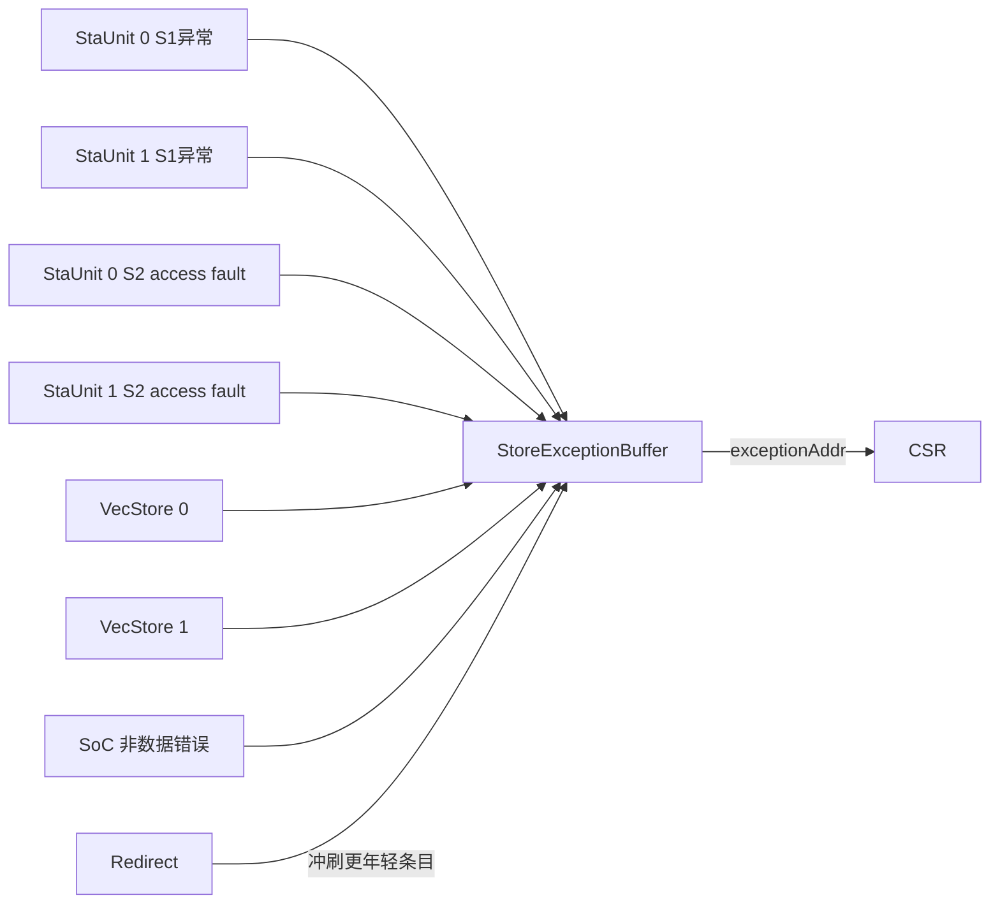
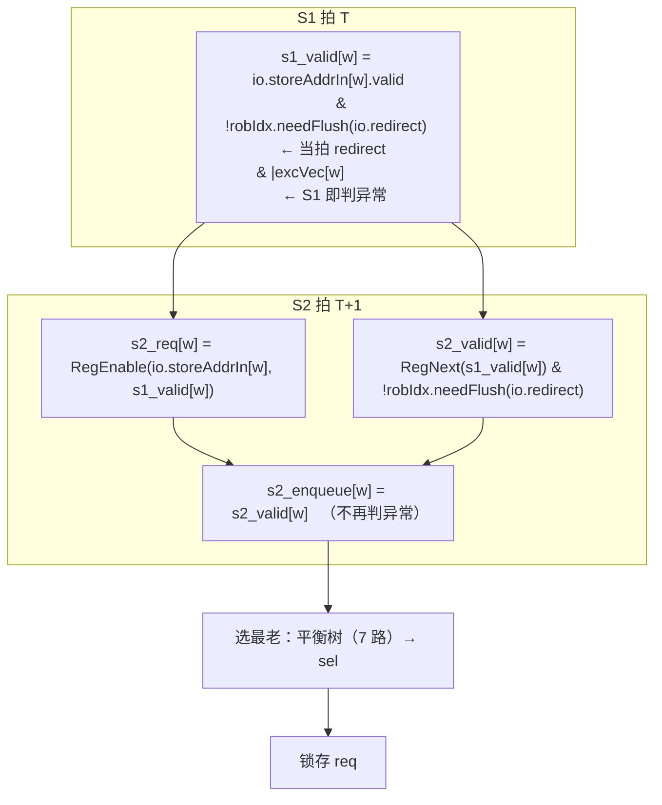
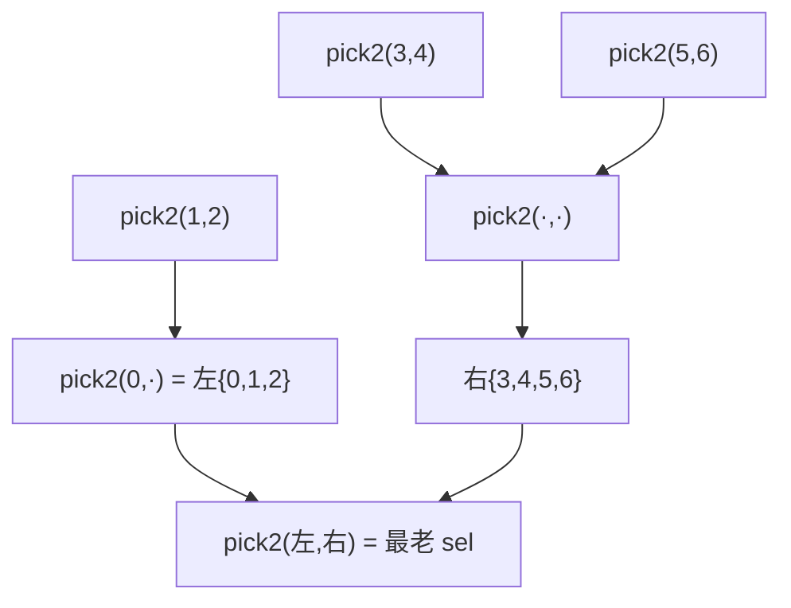

# StoreExceptionBuffer —— Store 访存异常缓冲

> 可读重写学习文档。设计意图源：
> `src/main/scala/xiangshan/mem/lsqueue/StoreQueue.scala`（class StoreExceptionBuffer）。
> 可读核：`rtl/memblock/StoreExceptionBuffer.sv`（`xs_StoreExceptionBuffer_core`）+ 共享包
> `rtl/memblock/exceptionbuffer_pkg.sv`（与 LqExceptionBuffer 共用年龄比较/最老选择）。

---

## 1. 它在访存子系统中的位置与作用

与 `LqExceptionBuffer` 完全同构，只是服务 **store**。store 地址流水（sta）在执行时检出
访存异常（断点/地址非对齐/访问错/缺页/硬件错/Guest 缺页），把异常信息报给本缓冲；
缓冲**只保留最老的一条**并持续输出给 CSR。



### 入口构成（enqPortNum = StorePipelineWidth*2 + VecStorePipelineWidth + 1 = 2*2+2+1 = 7）
| 入口 | 来源 | 备注 |
|------|------|------|
| 0,1 | 2 条 sta 流水在 **S1** 产生的异常（access fault 除外） | StorePipelineWidth |
| 2,3 | 2 条 sta 的 **access fault**（在 S2 才确定） | 再一组 StorePipelineWidth |
| 4,5 | 2 条向量 store 异常 | VecStorePipelineWidth |
| 6   | SoC 侧非数据错误 | 只可能是 hardwareError，故仅有 `excVec` bit19 一个端口 |

---

## 2. 两级流水时序（与 Lq 的关键差异）

Store 把 **异常判定 + 一次 redirect 冲刷** 提前折进 **S1**：



**与 Lq 的两处必须区分的差异**（写错则 UT/FM 立刻不过）：
1. **冲刷时机**：Store 在 S1 用当拍 redirect 冲刷一次（折进 `s1_valid`），S2 再用**当拍**
   redirect 冲刷一次——**没有** Lq 那个 `RegNext(io.redirect)` 版本。且 S2 不重判异常
   （S1 已判，`s2_enqueue = s2_valid`）。s2_req 的写使能是完整的 `s1_valid`。
2. **锁存替换的平手维度**：Store 用 `isNotBefore`（`>=`），Lq 用严格相等 `===`。见 §4。

---

## 3. 选最老：平衡归约树（7 路）

Chisel `selectOldest` 对 7 路二分为 `take(3)={0,1,2}` 与 `takeRight(4)={3,4,5,6}`：



树内部每个 `pick2` 用 pkg 的 `older_pick_b`，平手维度用**严格相等**（`eq_is_not_before=0`），
与 golden 内部 selectOldest 一致（`robIdx === robIdx & uopIdx >`）。

---

## 4. 锁存最老异常（单条 req 寄存器）

valid 续命/置位/冲刷规则与 Lq 相同。bits 替换条件用 `isNotBefore`：
```
替换 = sel_valid & ( isAfter(req, sel) | (isNotBefore(req, sel) & req.uopIdx > sel.uopIdx) )
isNotBefore(a,b) = a.flag ^ b.flag ^ (a.value >= b.value)
```
即“已锁存 req 不比 sel 老 且 uopIdx 更靠后”也触发替换——比 Lq 的严格相等多覆盖了
`a.value >= b.value` 中 flag 异或后的边界情形。这正是 golden 用 `req_differentFlag ^ (>=)`
而 Lq 用 `===` 的区别，可读核通过 `older_pick_b(..., eq_is_not_before=1'b1)` 表达。

输出同 Lq：`vaddr/vaNeedExt/isHyper/gpaddr/isForVSnonLeafPTE` 直接来自 req 寄存器。

---

## 5. 接口表（golden 扁平端口）

| 端口 | 方向 | 说明 |
|------|------|------|
| `io_redirect_*` | in | 重定向 |
| `io_storeAddrIn_{0..6}_valid` | in | 各入口请求有效 |
| `io_storeAddrIn_{0..5}_bits_uop_exceptionVec_{3,6,7,15,19,23}` | in | Sta 6 个相关异常位 |
| `io_storeAddrIn_6_bits_uop_exceptionVec_19` | in | 入口 6 仅 hardwareError |
| `io_storeAddrIn_{0..6}_bits_uop_{uopIdx,robIdx_flag,robIdx_value}` | in | 年龄信息 |
| `io_storeAddrIn_{0..6}_bits_{fullva,vaNeedExt,gpaddr,isHyper,isForVSnonLeafPTE}` | in | 异常地址（部分入口缺，见下） |
| `io_exceptionAddr_{vaddr,vaNeedExt,isHyper,gpaddr,isForVSnonLeafPTE}` | out | 当前最老异常地址信息 |

> **死代码端口**（firtool 裁剪）与 wrapper 补常量：
> - `isHyper` 缺于入口 4,5,6 → 补 0
> - 入口 6 缺 `gpaddr`/`isForVSnonLeafPTE` → 补 0；缺 `vaNeedExt` → 补 **1**（golden 折成常量 1）
> - 入口 6 仅有 `excVec` bit19，其余异常位补 0

---

## 6. 验证

### 6.1 结构闸门（实测）
| 指标 | core | 共享 pkg |
|------|------|----------|
| `typedef struct packed` | 1（`s2_entry_t`，含输出 req 寄存器） | 1（`rob_ptr_t`） |
| `typedef enum` | 0 | 2（`ldu_exc_e`/`sta_exc_e` 标注异常位含义） |
| `function automatic` | 1（`pick2`） | 5（年龄比较 + `older_pick_b`） |
| `for` 循环 | 3（s1_valid / s2 寄存器 / s2_enqueue） | — |
| 展平名/生成痕迹 grep | 0 | 0 |
| 行数 | 191 | （pkg 共享）对比 golden 969（≈5×精简） |

### 6.2 UT（golden `u_g` vs 可读 `u_i` 双例化逐拍比对全部 5 个输出）
seed 1 / 7 / 42 各 **199995 checks，errors = 0**（WARMUP=4 跳过复位瞬态）。
激励同 Lq 风格但 7 个入口，覆盖 7 路选最老树、S1 折叠异常/冲刷、`isNotBefore` 替换语义。

**踩坑记录**：早期 probe（直接比内部 req 寄存器）在 seed 7 报 4 次 mismatch，定位为复位
释放后 req 寄存器**首次装载的单拍瞬态**（golden 与可读核装载时机相差一拍；该拍的输出
被输出比对的 `$isunknown` 守卫跳过，故 5 个输出始终 0 错）。把 probe 预热窗口加大到 16 拍
后 probe_mm 恒 0——确认是启动瞬态而非功能差异。

### 6.3 FM
golden 顶层（纯叶子）vs 可读同名 wrapper（→ 可读核）。末次 verify 结论 **Verification
FAILED**：**1091 passing / 20 failing / 122 unverified**（20 是 Formality 默认
`verification_failing_point_limit=20` 的截断上限——verify 攒满 20 个失配即提前中止，
122 个 unverified 点未验）。已报告的 20 个 failing 全部为 `u_core/req_r_reg[fullva]`，
根因与 Lq 完全相同：golden 用不规则命名的
逐入口 `RegNext(s1_valid)` 标量 + 逐字段 req 标量寄存器，可读核用向量 `s2_valid_q` + struct
`req_r`，共享 `fm_eq.tcl` 的展平名自动配对规则无法跨越该结构差异，导致下游 `req_r[fullva]`
误判 failing。**已用 tb 内部层次探针证伪**：三种子逐拍直接比对内部 req 寄存器，
**probe_mm = 0**（数值恒等）；叠加 UT 5 个输出 0 错，功能等价以 UT+探针为权威，
FM 为部分验证。

> 不为让 FM 好过而退回 golden 命名（违反重写准则）。
