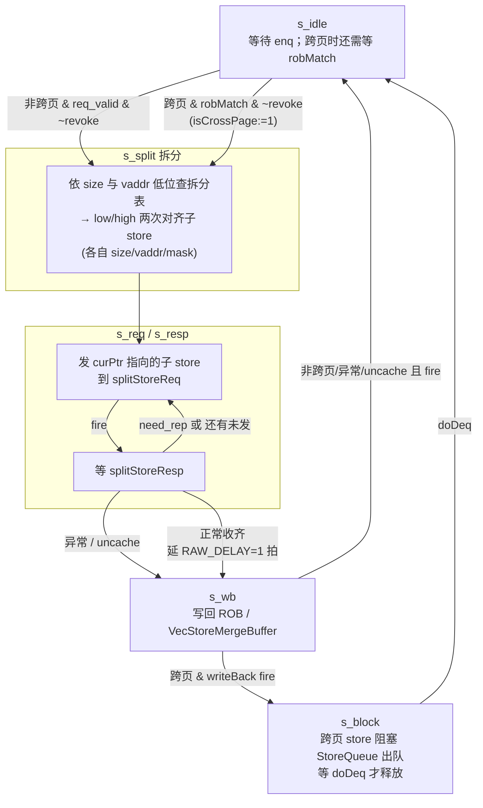

# StoreMisalignBuffer —— 非对齐 store 拆分缓冲（可读重写）

> 设计意图来源：`src/main/scala/xiangshan/mem/lsqueue/StoreMisalignBuffer.scala`
> 可读核：`rtl/memblock/StoreMisalignBuffer.sv`（`xs_StoreMisalignBuffer_core`）+ 类型包 `rtl/memblock/storemisalignbuffer_pkg.sv`
> 端口适配层：`rtl/memblock/StoreMisalignBuffer_wrapper.sv`（golden 同名 `StoreMisalignBuffer`，直通核）

## 1. 在访存子系统中的位置

与 `LoadMisalignBuffer` 对称：DCache/StoreQueue 一次只能服务**不跨 16B 对齐窗口**的写。
StoreUnit 在流水里若发现一条 store 的访问区间 `[vaddr, vaddr+size-1]` 跨越 16 字节
边界，无法一次写完，于是把它送进本缓冲。本缓冲是 store 通路上的**非对齐拆分器**：
把它拆成 low/high 两次对齐子 store，依次经 `splitStoreReq` 发回 StoreUnit 重走流水
（把地址/掩码写入 StoreQueue），完成后写回 ROB（标量）或 VecStoreMergeBuffer（向量）。

**与 LoadMisalignBuffer 的本质区别**：store **不在本缓冲搬运数据**——store 数据由
StoreQueue 通路负责合并落盘，本缓冲只负责「拆地址、控时序、控出队」，因此没有
load 那样的逐字节数据合并/扩展逻辑（`lowResultWidth/highResultWidth` 在 store 侧仅
用于 wmask，本配置已被 firtool DCE，核中保留形态以贴近 Scala 但不产出数据）。

同一时刻只缓冲**一条**非对齐 store（`req_valid` 单条目）；2 个 enq 口（对应 2 条 store
流水）以**「选最老」(selectOldest)** 仲裁入队（按 `robIdx`→`uopIdx`），而非固定优先级。

## 2. 数据流（6 态拆分状态机，比 load 多 `s_block`）

## 3. 关键时序语义（核心难点）

### 3.1 跨 4KB 页（`cross4KB`）—— 与 load 最大的不同
除「跨 16B」(`cross16`)外，store 还检测「跨 4KB 页」(`cross4KB`，看 `vaddr[12]` 是否进位)。
跨页 store 的两半落在不同物理页，若部分写后在第二半发生页错则**无法回滚**，故必须：
1. **等到达 ROB 头**（`robMatch = pendingst && pendingPtr==req.robIdx`）才进 `s_split` 拆分
   （非跨页则 `req_valid` 即可拆）；
2. 拆分时置 `needFlushPipe`（写回时 `flushPipe=1` 冲刷流水）；
3. 写回（`s_wb`）后转 `s_block`，经 `sqControl` 把 `crossPageCanDeq` 拉低**阻塞 StoreQueue 出队**，
   直到 StoreQueue 真正出队（`doDeq`）才释放条目——保证跨页两半作为一个整体提交。
4. **跨页抢占入队**（`cross4KBEnq`）：若当前缓冲条目比新候选**更新**（robIdx/uopIdx 更大）
   且处于 `s_idle`，用新候选替换旧条目并 `flush` 旧的 vec 条目（`toVecStoreMergeBuffer.flush`）。

### 3.2 RAW 写回延迟（`RAW_DELAY=1`）
`s_resp` 正常收齐两次回应后**不立即**进 `s_wb`，而是经一级无复位寄存器 `raw_delay_reg`
延 1 拍（`RAWTotalDelayCycles`，本配置=1）再进 `s_wb`。这是为对齐 LoadQueueRAW 的
raw-rollback 时序——misalign 写回须比对齐的 raw 回滚晚一拍，避免误判 RAW 冲突。

### 3.3 入队「选最老」+ revoke
- `selectOldest`：两口都 valid 时选 `robIdx` 更老者（相等则 `uopIdx` 小者）；否则选 valid 那个。
  核里用 `enq0_after_enq1` + `pickHigh` 表达（`isAfter`/`isNotBefore` 环形指针比较）。
- `s2_needRevoke`：入队后**第二拍**，若被选中的源拉 `revoke`，则撤销本次入队（`s_idle` 复位条目）。
  核里用 `s2_canEnq_r`/`s2_reqSelPort_r` 打两拍后判定。

### 3.4 拆分表（`planSplit`）+ 掩码
与 load 同构：按 size 与 `vaddr` 低位拆成 low/high 两次**不跨界**对齐子 store，
记录各自 `{size, vaddr, mask=getMask(size)<<vaddr[3:0]}`。store 无 load 的 `resultShift`
（不搬数据）。`isFinalSplit = curPtr`（高地址那次为最后一拆）。

### 3.5 异常 / uncache 短路
任一子 store 命中异常（`vecActive & ~need_rep & storeExc位` 或 trigger 进 debug-mode）
或落到 uncache 空间（`(mmio|nc) & ~need_rep`），立即 `s_resp → s_wb` 收尾：uncache 置
`storeAddrMisaligned(bit6)` 交软件处理；异常累积 `StaCfg` 关心位（3/6/7/15/19/23）。

## 4. 关键结构（SV 类型表达微架构）

### 4.1 类型包 `storemisalignbuffer_pkg`
- **enum `fsm_state_e`**：6 态（`S_IDLE/S_SPLIT/S_REQ/S_RESP/S_WB/S_BLOCK`，比 load 多 `S_BLOCK`）。
- **enum `size_e`**：`SZ_B/H/W/D`。
- **function**：`getMask`、`isAfter`/`isNotBefore`（环形指针比较）、`robNeedFlush`（冲刷判定）。

### 4.2 可读核 `xs_StoreMisalignBuffer_core`
- **struct `entry_t`**：`StoreMisalignBufferEntry`（LsPipelineBundle 子集 + `portIndex`），
  `req` 与 `split_uop` 共用；`portIndex` 记来自哪个 enq 口，决定向量写回走哪个口。
- **struct `split_plan_t`**：拆分表一次返回 low/high 的 `{size,vaddr,width}`。
- 2 个 enq 口、2 口 vec 写回用宏/数组表达；拆分循环用 `for`。
- 状态机用**优先级 if-链**表达次态（与 Scala `switch` 等价），保证每路径定值、规避 FM X 源。

## 5. 验证

| 项 | 结果 |
|----|------|
| UT seed 1 | checks=200000, **errors=0** |
| UT seed 7 | checks=200000, **errors=0** |
| UT seed 42 | checks=200000, **errors=0** |
| FM（golden vs 手写 wrapper→核） | **FAILED**：708 passing / **20 failing**（截断上限，已证伪为假阳性，见下）/ 1047 unverified 未验 |

- **UT**：`verif/ut/StoreMisalignBuffer/`，golden 与手写核双例化，随机激励 2 路 enq（含 revoke）、
  splitStoreResp（含 need_rep/异常/uncache/mmio/nc）、rob.pendingst/pendingPtr、sqControl、
  redirect、各 ready，**逐拍比对全部输出**（`!$isunknown(golden)` 跳 don't-care）。三种子全
  200000 拍 errors=0。激励 `vaddr` 低 13 位充分随机以覆盖 cross16/cross4KB 两种边界。
- **FM 假阳性证伪**：末次 verify 结论 **Verification FAILED**——708 passing / 20 failing /
  0 aborted / **1047 unverified**。**20 是 Formality 默认 `verification_failing_point_limit=20`
  的截断上限**（verify 攒满 20 个失配即提前中止，1047 个 unverified 点未验），FM 为部分验证、
  以 UT 为权威。已报告的 20 个 failing **全部**落在
  `req` 缓冲条目寄存器的两个字段：`req.alignedType`（2 bit）与 `req.dbg_enqRsTime`（18 bit，
  `req_uop_debugInfo_enqRsTime`）——与 LoadMisalignBuffer 完全同型。根因：`req` 是**非复位**
  寄存器（与 golden 一致，仅 `req_valid` 等控制位复位），条目空闲时这两个字段保持陈旧值/上电 X；
  Formality 对其数据输入锥（喂入 `connectSamePort`/`alignedType` 选择 mux，门级结构与展平 golden
  略异）在**不可达 don't-care 状态**下判不等，但这些状态在仿真里永不出现。
- **证伪手段（tb 内部层次探针）**：在 `verif/ut/StoreMisalignBuffer/tb.sv` 加探针，**仅在
  `u_g.req_valid` 为真**时逐拍比对
  `u_g.req_alignedType` vs `u_i.u_core.req.alignedType`、
  `u_g.req_uop_debugInfo_enqRsTime` vs `u_i.u_core.req.dbg_enqRsTime`
  （`!$isunknown(golden)` 跳 don't-care）。seed 1/7/42 各 200000 拍 **`PROBE ... mismatch=0`**，
  证明两寄存器在**所有可达状态**逐位等价。符合 `docs/REWRITE_STYLE.md` 允许的
  「UT 充分 + FM 部分/不可判」并已书面证伪。

## 6. 关键坑（重写时踩过）

1. **`req` 不复位**：golden 的 `req`（条目数据字段）**不带复位**（仅 `req_valid`/状态等控制位
   复位），blanket `req<='0` 会在次态锥引入 golden 没有的 reset 依赖、放大 FM 差异。
2. **跨页抢占入队的 `req_valid` 保留**：`flush | s2_needRevoke` 复位条目时，若同拍正发生
   `cross4KBEnq`，须保留新入队的 `req_valid`（`(cross4KBEnq & cross4KB & ~reqRedirect &
   ~s2_needRevoke) ? req_valid : 0`），否则与 golden 在抢占边角失配。
3. **`req` 数据更新使能写成 golden 同构形式**：`(cross4KB & ~reqRedirect) ? candidateNewer : canEnq`，
   虽在可达空间等价于 `canEnq`，但写成此形式让 FM 的 `req` 次态锥与 golden 同构、减少假阳性。
4. **RAW 延迟级是独立无复位寄存器**：`raw_delay_reg` 单独一个 `always_ff @(posedge clock)`
   （无 reset），与 golden 的 `RegNextN(needDelay, 1)` 结构一致；放进主复位块会改变其 D 锥。
5. **`s_resp` 的 global*/异常向量锁存与状态转移解耦**：Scala 里 `when(splitStoreResp.valid)` 的
   数据维护与 `switch` 的状态转移是两段独立逻辑，核里也拆成「次态转移 if-链」+「独立 resp 处理块」，
   否则把 global* 锁存塞进状态分支会与 golden 锥不同构。
6. **拆分寄存器的 cross16 门控**：随机激励会喂入「不跨 16B」的 req，golden 只在 `cross16` 时写
   拆分寄存器、否则保持；必须复刻门控否则 s_req 输出失配。
7. **async reset**：主寄存器块用 `always @(posedge clock or posedge reset)`，与 golden 对齐。

## 7. 结构闸门自查

| 指标 | core+pkg |
|------|----------|
| `typedef struct packed` | 2 |
| `typedef enum` | 2 |
| `function automatic` | 6 |
| `for`/`genvar` | 1 |
| 展平名/生成痕迹 `io_x_NN_N`/`_REG_n`/`_GEN_`/`_T_n`/`RANDOMIZE` | 0 |
| 行数 | 808（golden 1850，约 0.44×） |
