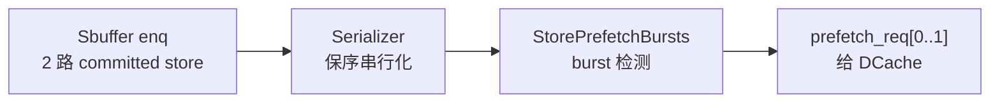

# StorePfWrapper —— store 预取包装层

> 可读重写：`rtl/memblock/StorePfWrapper.sv`（核 `xs_StorePfWrapper_core`）
> 类型包：`rtl/memblock/storepfwrapper_pkg.sv`
> golden：`golden/chisel-rtl/StorePfWrapper.sv`
> 设计意图来源：`StorePrefetchBursts.scala`

## 架构定位

StorePfWrapper 位于 Sbuffer 的 store 提交通路旁边。它不做预取算法本体，而是把 Sbuffer 每拍最多两路 store 训练请求接入两个子模块：

Wrapper 的 Scala 逻辑很薄：

1. `serializer.io.sbuffer_enq(i).valid := io.sbuffer_enq(i).valid && ENABLE_SPB`
2. `serializer.io.sbuffer_enq(i).bits := io.sbuffer_enq(i).bits`
3. `spb.io.sbuffer_enq := serializer.io.prefetch_train`
4. `serializer.io.prefetch_train.ready := true`
5. `io.prefetch_req <> spb.io.prefetch_req`

## 预取触发条件

SPB 只观察串行化后的一路 store 流。每来一个 store，就累计：

- `store_count`：训练 store 个数。
- `saturate_counter`：当前 store cache block 地址相对上一条 store 的 block 差值累加。

当 `store_count > N`（N=48）时做一次检查。若 `store_count / 8 == saturate_counter` 且差值非负，说明最近 store 呈现稳定正向 burst，SPB 分配一个 burst engine，从当前 block 开始连续发后续 cacheline 的预取请求。否则清零计数重新学习。

KunmingHu V2R2 当前 golden 中 `EnableStorePrefetchSPB=false`，firtool 常量传播后顶层只剩：

| 端口 | 含义 |
|---|---|
| `clock/reset` | Serializer 内部指针寄存器保留 |
| `io_prefetch_req_0_bits_vaddr` | SPB lane0 输出地址 |
| `io_prefetch_req_1_bits_vaddr` | SPB lane1 输出地址 |

因此可读核只做“SPB 输出到 wrapper 输出”的结构化透传，`Serializer`、`StorePrefetchBursts`、`PrefetchBurstGenerator`、`Arbiter2_StorePrefetchReq` 复用 golden 子模块作为 UT/FM 两侧共享黑盒。

## 验证

UT 位于 `verif/ut/StorePfWrapper`，双例化 golden `StorePfWrapper` 与实现侧 `StorePfWrapper_xs`，逐拍比对两路输出；golden 为 X 时跳过。FM 目标是 golden 同名 wrapper 与 `rtl/memblock/StorePfWrapper_wrapper.sv`。

实测结果见任务结束报告。
