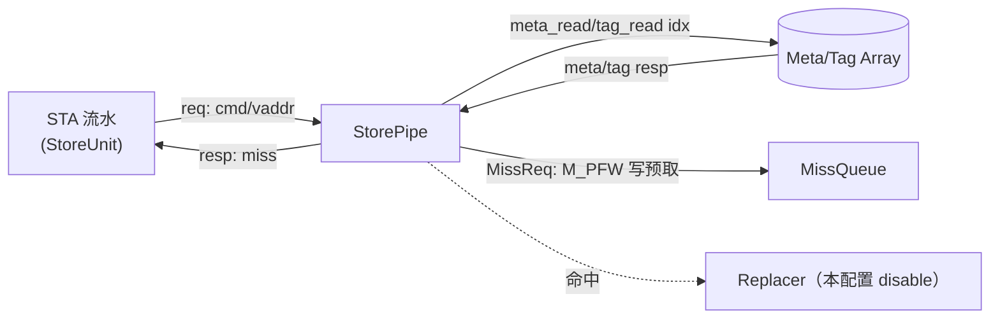

# StorePipe —— DCache store 探测流水（可读重写）

> 设计意图来源：`src/main/scala/xiangshan/cache/dcache/storepipe/StorePipe.scala`
> 可读核（完整三级流水）：`rtl/memblock/StorePipe.sv`（`xs_StorePipe_core`）+ 类型包
> `rtl/memblock/storepipe_pkg.sv`
> golden 同名顶层：`rtl/memblock/StorePipe_wrapper.sv`（本配置裁剪接口）

## 0. ⚠️ 必读：本顶层配置下 golden 被完全裁剪

KunmingHu V2R2 当前顶层里，golden `StorePipe.sv` 经 firtool 常量传播 + 死代码消除后
**只剩唯一端口 `input io_lsu_req_valid`、无任何输出/寄存器**。原因：

- DCache 例化 StorePipe（`stu_0/stu_1`）时，只接了 `io_lsu_req_valid`，其
  `resp / miss_req / meta_read / tag_read / replace_*` 等输出全部悬空（DontCare）；
- `EnableStorePrefetchAtIssue = false`，使 miss store 的预取请求通路也被裁。

```verilog
// golden/chisel-rtl/StorePipe.sv
module StorePipe(input io_lsu_req_valid);
  wire io_lsu_req_valid_probe = io_lsu_req_valid;
endmodule
```

因此本任务采用 **StorePfWrapper 同款处理**：
- **学习载体**是下面完整的三级流水可读核 `xs_StorePipe_core`（含 struct/enum/纯函数/
  genvar），它体现 StorePipe 在「未裁剪」配置下的真实微架构；
- **golden 同名顶层** `StorePipe`（wrapper）只暴露裁剪后的单端口，与 golden 逐位一致，
  供 FM / ST 对接。

## 1. 架构定位

StorePipe 是与 [LoadPipe](LoadPipe.md) **对称的「store 探测流水」**，跟随 STA（store
地址）流水。STA 在 s1 拿到物理地址后，经 StorePipe 查 DCache 的 tag/meta 判断这条 store
是否命中：

- **命中**：（可选）更新替换算法，让被命中的行多留一会（本配置 `replace_access` disable）；
- **缺失**：（视配置）向 DCache **MissQueue** 发一个 **store 写预取**请求（命令 `M_PFW`），
  把行提前取上来，减少后续真正写入时的 miss 延迟。

它**不搬运/写入 store 数据**——数据走 StoreQueue → Sbuffer → DCache 通路。



## 2. 数据流（三级流水 s0~s2）

```mermaid
flowchart TD
  subgraph s0["s0 发组读"]
    A1["valid = req.valid"] --> A2["idx = vaddr[13:6]"]
    A2 --> A3["发 meta_read / tag_read（全路使能）"]
    A3 --> A4["req.ready = meta_read.ready & tag_read.ready"]
  end
  s0 --> s1
  subgraph s1["s1 tag 比对 + 权限判定"]
    B1["4 路并行 tag 比对<br/>tag==paddr[47:12] & coh 有效"] --> B2["命中路 coh 独热 OR 选出"]
    B2 --> B3["onAccess(store)：<br/>has_perm = coh∈{Trunk,Dirty}"]
    B3 --> B4["hit = has_perm & new_coh==coh & tag命中"]
  end
  s1 --> s2
  subgraph s2["s2 resp + miss 写预取"]
    C1["resp.valid = s2_valid"] --> C2["resp.miss = ~hit"]
    C2 --> C3{"miss?"}
    C3 -->|miss & (PFatIssue 或 预取来源)| C4["发 MissReq：M_PFW / addr=行基址 / cancel=s2_kill"]
    C3 -->|hit| C5["（可选）更新 replacer"]
  end
```

## 3. 一致性权限模型（store 视角）

StorePipe 复用 TileLink `ClientMetadata.onAccess`，但 store 恒为**写访问**，故 onAccess
退化为两个简单纯函数（见 `xs_StorePipe_core`）：

| coh 当前状态 | `store_has_permission` | `store_new_coh`（访问后目标） |
|---|---|---|
| `COH_NOTHING`(0) | 否 | `COH_TRUNK`(2) |
| `COH_BRANCH`(1)  | 否 | `COH_TRUNK`(2) |
| `COH_TRUNK`(2)   | 是 | `COH_TRUNK`(2) |
| `COH_DIRTY`(3)   | 是 | `COH_DIRTY`(3) |

**命中** = `has_permission && new_coh==old_coh && tag命中`。即只有该行已独占（Trunk/Dirty）
才算 store 命中；共享只读（Branch）或无副本（Nothing）都算 miss，需要升级/取行。

## 4. 关键结构（用 SV 类型表达微架构）

- `coh_e`（enum）：4 个一致性状态，编码与 LoadPipe / golden 一致。
- `meta_t` / `s1_req_t` / `s2_req_t`（struct packed）：单路 meta 条目、s1/s2 流水级寄存
  的请求与命中信息。
- `store_has_permission` / `store_new_coh`（function automatic）：onAccess 的 store 特化。
- 4 路 tag 比对用 `genvar` + `for` 并行展开，命中 coh 用 `for` 循环独热 OR 选。
- `parameter EN_STORE_PF_AT_ISSUE`：表达 `EnableStorePrefetchAtIssue`。
  - `=1`：所有 miss store 都发写预取；
  - `=0`（本顶层）：仅「预取来源」的 miss store 发写预取。

## 5. 地址切片（与 LoadPipe 一致）

| 量 | 来源 | 物理含义 |
|----|------|----------|
| set 索引 `idx` | `vaddr[13:6]` | 256 组 |
| 物理 `tag` | `paddr[47:12]` | 36 位 |
| 行基址 | `{paddr[47:6], 6'h0}` | 64B 对齐（MissReq.addr） |

## 6. 验证结果

由于本配置 golden 是「无输出/无寄存器」的空壳，**不存在可与之逐位对照的功能 golden**。
据此采用双轨验证：

1. **golden 同名顶层 passthrough**：`StorePipe`（golden）vs `StorePipe_xs`（impl）逐拍比对
   内部 `io_lsu_req_valid_probe`——两者模块体逐字节相同，seed 1/7/42 各 **200000 checks，
   errors=0**。
2. **完整可读核行为参考模型自检**：tb 内联一个独立重述 StorePipe.scala 三级流水的参考
   模型，逐拍比对 `xs_StorePipe_core` 的全部输出（resp_valid/miss、miss_req
   valid/addr/coh 等）——seed 1/7/42 各 **200000 checks，errors=0**。激励让 paddr/tag 的
   tag 区压窄以提高 4 路命中概率，cmd/instrtype/kill/ready 全随机。

- **FM**：`make fm` 在本配置下**无法运行**——Formality 报 `FM-081`（reference design
  is a black box）：golden `StorePipe` 没有任何输出/寄存器，比较点为 0，FM 在 `verify`
  前即中止。这是**裁剪 golden 的固有属性，非实现缺陷**：impl wrapper 与 golden 模块体
  逐字节一致（同一单端口 + 同一 probe wire），等价性可一眼判定，并已由上述 passthrough
  UT 在 60 万拍上确认。

- **结构闸门**（`xs_StorePipe_core` + pkg）：`typedef struct packed` ×3、`typedef enum`
  ×1（`coh_e`）、`function automatic` ×2、`genvar`/`for` ×3；生成痕迹 grep = **0**；
  核 186 行。

## 7. 关键说明

- 本可读核是 StorePipe **未裁剪配置**下的完整实现，可直接用于未来打开
  `EnableStorePrefetchAtIssue` / 接通 resp 通路的顶层；当前顶层只用裁剪后的 wrapper。
- StorePipe 与 LoadPipe 共享同一套一致性/地址切片模型，阅读时可与 [LoadPipe.md](LoadPipe.md)
  的 §3/§4/§5 对照。
