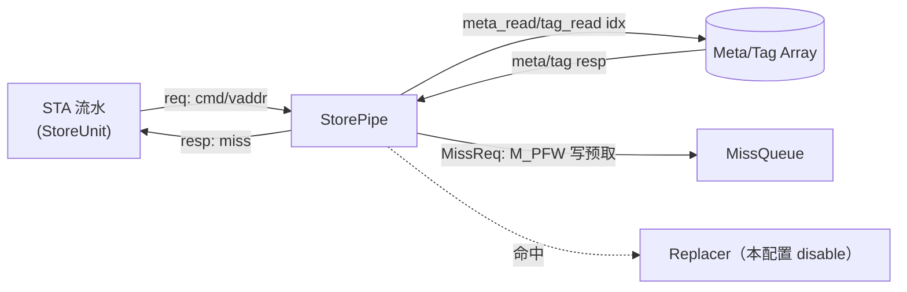

# StorePipe —— DCache store 探测流水（可读重写）

> **FM reference = canonical-derivative（codex_0088 §3 批准）**。本配置下全芯片 firtool
> 会把 golden `StorePipe.sv` 跨层 DCE 成 5 行空壳（0 输出/0 寄存器），旧路线只能得到
> VACUOUS/`FM-081`（reference blackbox, 0 比对点）。codex_0088 §3 批准：从**同一冻结
> G0 `SimTop.fir` 的 production pre-DCE StorePipe FIRRTL**，用锁定的 firtool-1.62.1 +
> G0 flags STANDALONE 重 lower 得到 `G0-StorePipe-observable-v1` canonical-derivative
> （50 output leaves + 6 perf probes, 11 真实流水寄存器），作官方 reference。本可读核
> `xs_StorePipe_core` 对齐该 derivative 的端口/shape/reset/**双 RegNext** 语义。
>
> 可观测面 = **36 output leaves + 6 perf probes**（逐位比较）；**14 UNSPECIFIED_BY_SOURCE**
> （Chisel `io.miss_req.bits := DontCare` 未覆写字段 + `io.replace_access.bits := DontCare`）
> **不具体化为 0、不 dont_verify**，从比较面排除。

> 设计意图来源：`XiangShan/src/main/scala/xiangshan/cache/dcache/storepipe/StorePipe.scala`
> 官方 reference：`G0-StorePipe-observable-v1`（canonical-derivative, plumbing owner 维护）
> 可读核（完整三级流水）：`rtl/memblock/StorePipe.sv`（`xs_StorePipe_core`）+ 类型包
> `rtl/memblock/storepipe_pkg.sv`
> FM impl 侧顶层：`rtl/memblock/StorePipe_wrapper.sv`（golden 同名 `StorePipe`，73 端口，
> 内部例化 `xs_StorePipe_core`，与 derivative 逐端口对齐）

## 0. ⚠️ 必读：golden 空壳的来由 + derivative 路线

KunmingHu V2R2 顶层里，DCacheWrapper 例化 StorePipe（`stu_0/stu_1`）时只接了
`io_lsu_req_valid`，其 `resp / miss_req / meta_read / tag_read / replace_* / error`
输出全部悬空（DontCare），且 `EnableStorePrefetchAtIssue = false`。全芯片 firtool 常量
传播 + 跨层死代码消除后，golden `StorePipe.sv` **只剩唯一端口 `input io_lsu_req_valid`**：

```verilog
// golden/chisel-rtl/StorePipe.sv（DCE 空壳，不可作 FM reference）
module StorePipe(input io_lsu_req_valid);
  wire io_lsu_req_valid_probe = io_lsu_req_valid;
endmodule
```

**关键：这是全芯片 DCE 产物，不是 source 缺失。** 冻结 `SimTop.fir` 仍完整保留 StorePipe
的 pre-DCE FIRRTL（全部 lsu/meta/tag/miss/replace/error IO + s1/s2 寄存器）。codex_0088
§3 路线：机械抽取该 FIRRTL，以 StorePipe 为 top 用锁定 firtool 单独 lower，使原始 IO 成为
顶层可观测端口不被父级 DCE。得到的 canonical-derivative 即官方 reference。

- **可读核** `xs_StorePipe_core` 对齐 derivative：73 端口（36 observable + 14 UNSPECIFIED
  + 22 输入 + clock/reset），**11 真实流水寄存器**（无 shadow DFF），init-free（无 async
  reset），双 RegNext 门控。
- **FM impl 侧顶层** `StorePipe`（wrapper）暴露同一 73 端口全可观测面，内部例化可读核。

## 1. 架构定位

StorePipe 是与 [LoadPipe](LoadPipe.md) **对称的「store 探测流水」**，跟随 STA（store
地址）流水。STA 在 s1 拿到物理地址后，经 StorePipe 查 DCache 的 tag/meta 判断这条 store
是否命中：

- **命中**：（可选）更新替换算法，让被命中的行多留一会（本配置 `replace_access` disable）；
- **缺失**：（视配置）向 DCache **MissQueue** 发一个 **store 写预取**请求（命令 `M_PFW`），
  把行提前取上来，减少后续真正写入时的 miss 延迟。

它**不搬运/写入 store 数据**——数据走 StoreQueue → Sbuffer → DCache 通路。


```mermaid
flowchart LR
  STA["STA 流水<br/>(StoreUnit)"] -->|req: cmd/vaddr| SP[StorePipe]
  SP -->|meta_read/tag_read idx| ARR[(Meta/Tag Array)]
  ARR -->|meta/tag resp| SP
  SP -->|resp: miss| STA
  SP -->|MissReq: M_PFW 写预取| MQ[MissQueue]
  SP -.命中.-> REPL[Replacer（本配置 disable）]
```

## 2. 数据流（三级流水 s0~s2）

```mermaid
flowchart TD
  subgraph s0["s0 发组读"]
    A1["valid = req.valid"] --> A2["idx = vaddr[13:6]"]
    A2 --> A3["发 meta_read / tag_read（全路使能）"]
    A3 --> A4["req.ready = meta_read.ready & tag_read.ready"]
  end
  s0 --> s1
  subgraph s1["s1 tag 比对 + 权限判定"]
    B1["4 路并行 tag 比对<br/>tag==paddr[47:12] & coh 有效"] --> B2["命中路 coh 独热 OR 选出"]
    B2 --> B3["onAccess(store)：<br/>has_perm = coh∈{Trunk,Dirty}"]
    B3 --> B4["hit = has_perm & new_coh==coh & tag命中"]
  end
  s1 --> s2
  subgraph s2["s2 resp + miss 写预取"]
    C1["resp.valid = s2_valid"] --> C2["resp.miss = ~hit"]
    C2 --> C3{"miss?"}
    C3 -->|miss & (PFatIssue 或 预取来源)| C4["发 MissReq：M_PFW / addr=行基址 / cancel=s2_kill"]
    C3 -->|hit| C5["（可选）更新 replacer"]
  end
```

## 3. 一致性权限模型（store 视角）

StorePipe 复用 TileLink `ClientMetadata.onAccess(cmd)`。为与 canonical-derivative **逐位
一致**，可读核忠实复刻 golden `Metadata.scala` 的 `growPermissions` 查表实现，而非做语义
化简：

- `growStarter(cmd)` 把 cmd 分成 2 位写/读类（`r_cat_hi/r_cat_lo`，对齐 `Consts.scala`
  isWrite 掩码：cmd∈{1,3,4,6,7,8,9,A,B,C,D,E,F,11,18,1A,1B} 等）；
- 拼上命中路 coh 成 4 位索引 `r_T = {r_cat_hi, r_cat_lo, hit_coh}`；
- 查 `gen5[16]`（= derivative `_GEN_5` = growPermissions.next LUT）得目标 coh；
- **命中** = `(r_T∈{有权限项}) & (gen5[r_T]==hit_coh) & tag命中`——即该 cmd 对该 coh 已有
  权限且无需升级（目标 coh == 当前 coh）且 tag 命中。

净效果与 store 直觉一致：只有行已独占（Trunk/Dirty）才算 store 命中；共享只读（Branch）
或无副本（Nothing）都算 miss。`gen5` LUT 已逐项（16 项）与 derivative 对齐验证通过。

## 4. 关键结构（用 SV 类型表达微架构）

- `coh_e`（enum）：4 个一致性状态，编码与 LoadPipe / golden 一致。
- `s1_req_t`（struct packed）：s1 流水级寄存的请求上下文（cmd/vaddr/instrtype）。
- 4 路 tag 比对逐 way 展开（`s1_tag_match_0..3`），命中 coh 用 Mux1H 独热 OR 选。
- `gen5[16]` growPermissions LUT + `r_T` 索引：逐位复刻 derivative 的 onAccess（见 §3）。
- **双 RegNext 语义**：`s2_valid = RegNext(s1_valid) & RegNext(~s1_kill)` = `s2_valid_REG
  & s2_valid_REG_1`（两个独立寄存器），与 derivative/Chisel `RegNext(s1_valid) &&
  RegNext(!io.lsu.s1_kill)` 一致。s2 数据组用 `RegEnable(..., s1_valid)`。
- **11 寄存器 init-free**：单 `always @(posedge clock)`，无 async reset（照抄 derivative
  的 RegNext/RegEnable lowering）。
- `parameter EN_STORE_PF_AT_ISSUE`：表达 `EnableStorePrefetchAtIssue`。
  - `=0`（production/derivative，默认）：仅「预取来源」的 miss store 发写预取；
  - `=1`：所有 miss store 都发写预取（未来打开 store 预取的顶层用）。

## 5. 地址切片（与 LoadPipe 一致）

| 量 | 来源 | 物理含义 |
|----|------|----------|
| set 索引 `idx` | `vaddr[13:6]` | 256 组 |
| 物理 `tag` | `paddr[47:12]` | 36 位 |
| 行基址 | `{paddr[47:6], 6'h0}` | 64B 对齐（MissReq.addr） |

## 6. 验证结果

**UT harness = derivative-vs-core 对拍**（`verif/ut/StorePipe/tb.sv`）：双例化 canonical-
derivative reference（module `StorePipe`，`StorePipe_derivative_ref.sv`，sha `7d675b69…`，
== G0-flags observable-G0flags.sv）vs 可读核 `xs_StorePipe_core`，同一随机激励喂两侧，逐拍
比对 **36 observable output leaves + 6 perf probes**：

- **36 observable**：lsu.req/resp(5) + meta_read(3) + tag_read(3) + miss_req live/const(10) +
  replace_access.valid(1) + replace_way(3) + error bundle(12)。
- **6 perf probes**：层次探针比对 derivative `_GEN/_GEN_0..4` vs 核 `perfCnt_*`
  （s0_valid_not_ready/store_fire/sta_hit/sta_miss/store_miss_prefetch_fire/not_fire）。
- **14 UNSPECIFIED_BY_SOURCE 排除**：miss_req `:=DontCare` 未覆写 12 字段 +
  replace_access.bits 2 字段；核把它们驱 `'x`（源未指定），不比对、不置 0、不 dont_verify。

激励让 paddr/tag 的 tag 区压窄以提高 4 路命中概率，cmd 覆盖全 5 位空间（打满 onAccess LUT），
instrtype/kill/ready 全随机。

**结果**：seed 1/7/42 + `+vcs+initreg+0` 各 **200000 checks，errors=0**。

**负控（证 harness 非 vacuous）**：把 `gen5[3]`（命中权限 LUT 一项）扰动为 0，立即产生
`resp_miss ref=0 impl=1` 失配 → **200000 checks，errors=49640，TEST FAILED**——harness
真实激励命中/miss datapath 并抓得住偏差。

- **FM**：官方 golden 由 manifest/runner 指向 canonical_derivative（main-owned，plumbing
  owner 负责）。impl 侧 `StorePipe` wrapper 暴露与 derivative 逐端口对齐的 73 端口全可观测面
  （VCS elaborate rc=0）。可读核 11 寄存器 init-free、与 derivative 逐字一致，无 shadow DFF。

- **11 寄存器（无 shadow DFF）**：`s1_valid, s1_req_{cmd,vaddr,instrtype}, s2_valid_REG,
  s2_valid_REG_1, s2_req_vaddr, s2_hit, s2_paddr, s2_hit_coh_state, s2_is_prefetch`。G0 flags
  `disallowLocalVariables` 把所有 automatic-local 临时量 hoist 成组合 wire——它们**不是**
  寄存器；旧 StorePipe-redo 报的 24 shadow DFF 是**错误 bare-firtool flags** 的产物，正确
  pre-DCE 语义下不存在，本核不加。

- **结构闸门**（`xs_StorePipe_core` + pkg）：`typedef struct packed` ×1（s1_req_t）、
  `typedef enum` ×1（`coh_e`）、忠实复刻 golden Metadata.scala `growPermissions` LUT
  （`gen5[16]` 逐项与 derivative `_GEN_5` 对齐验证通过）；生成痕迹 grep = **0**。

## 7. 关键说明

- 本可读核是 StorePipe **未裁剪配置**下的完整实现，可直接用于未来打开
  `EnableStorePrefetchAtIssue` / 接通 resp 通路的顶层；当前顶层只用裁剪后的 wrapper。
- StorePipe 与 LoadPipe 共享同一套一致性/地址切片模型，阅读时可与 [LoadPipe.md](LoadPipe.md)
  的 §3/§4/§5 对照。
