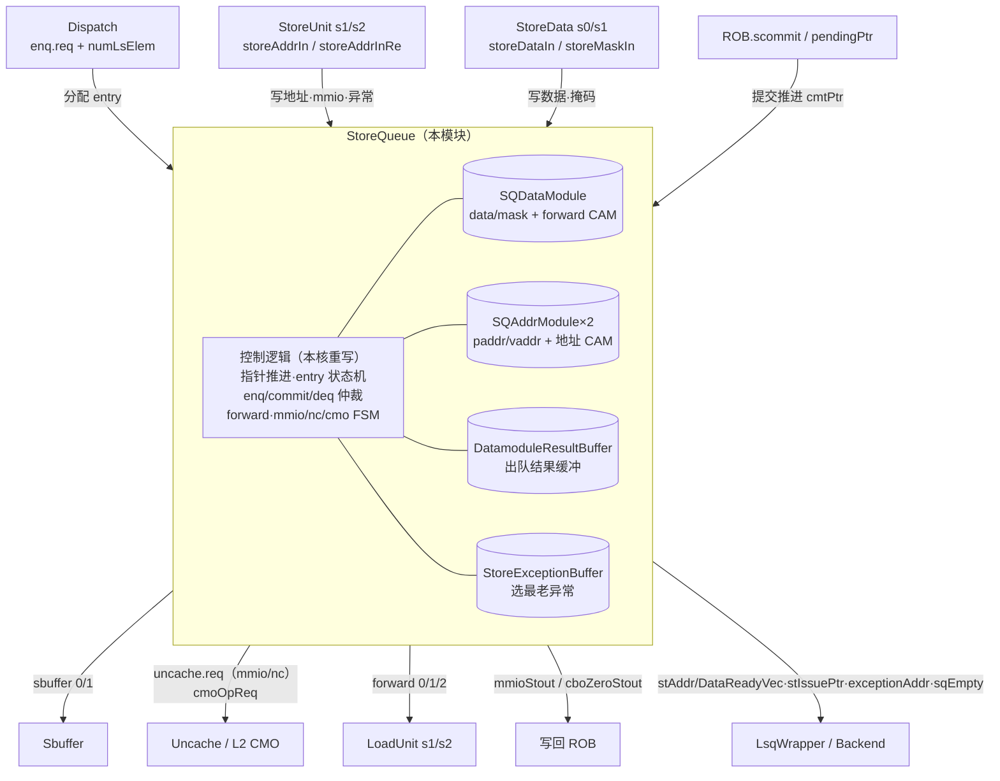
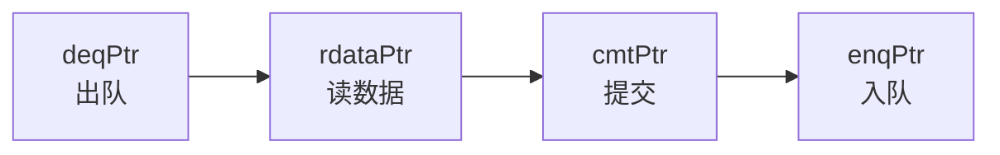
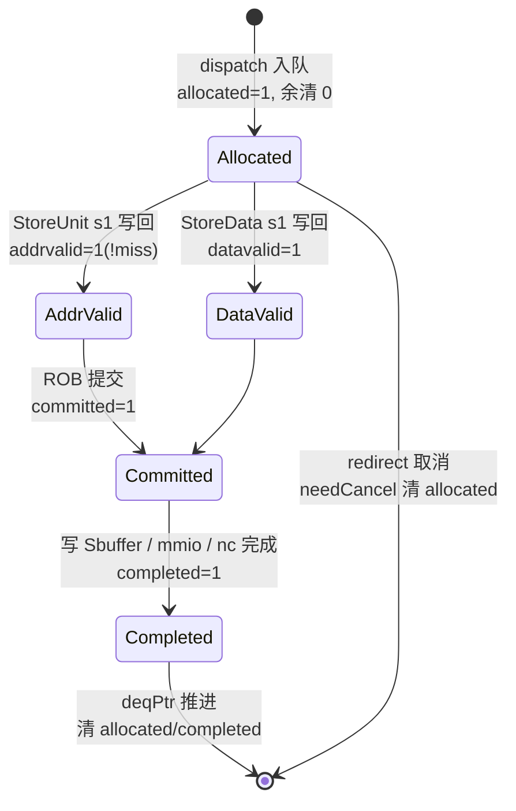
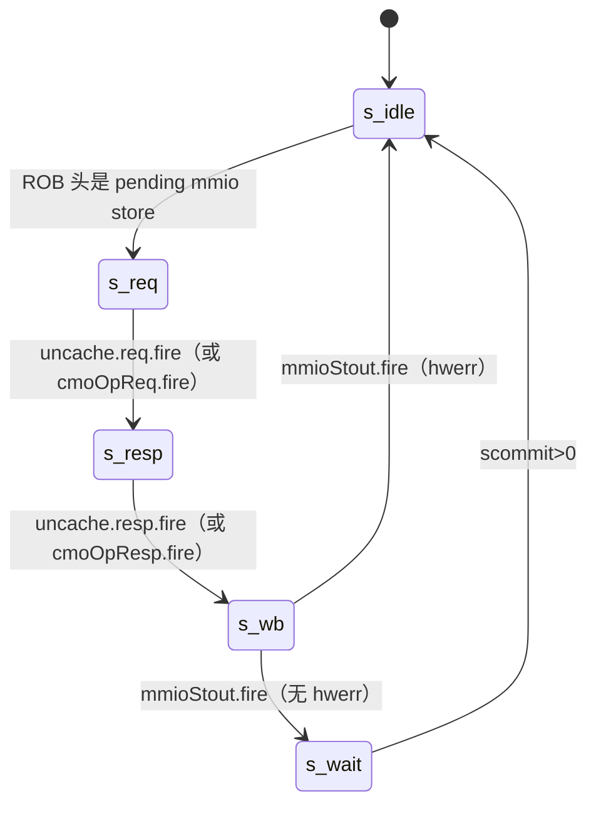

# StoreQueue —— Store 顺序队列

> 香山 V2R2（昆明湖）乱序访存的 **store 顺序核心**。
> 设计意图来源：`src/main/scala/xiangshan/mem/lsqueue/StoreQueue.scala`（class StoreQueue）
> 可读核：`rtl/memblock/StoreQueue.sv`（`xs_StoreQueue_core`）+ `rtl/memblock/storequeue_pkg.sv`
> + 分节 include：`storequeue_body/deq/vec/regupd/perf.svh`

## 1. 架构定位

StoreQueue 是一条 **56 项的环形队列**，跟踪每条 store 从 dispatch 派遣到提交、最终
写回 Sbuffer 的全过程，并向 load 流水提供 store-to-load forward（前递）。

**5 个数据存储子模块全部黑盒**（与 golden 共用同一份定义，UT 两侧、FM 两侧都喂真实
golden 子模块）：

| 子模块 | 职责 |
|---|---|
| `SQDataModule` | 56×(128b data + 16b mask) 存储；3 路 forward 数据/掩码 CAM |
| `SQAddrModule`(paddr) / `SQAddrModule_1`(vaddr) | 48b/50b 地址存储；3 路 forward 地址命中 CAM |
| `DatamoduleResultBuffer`(dataBuffer) | 出队到 Sbuffer 的 2 项结果缓冲（打拍解耦） |
| `StoreExceptionBuffer` | 7 个入口里选 robIdx 最老的异常 store，给出 exceptionAddr |

本核**重写的是控制逻辑**：多根环形指针推进、每 entry 的状态位、enq/commit/deq 仲裁、
forward 命中掩码计算、mmio/nc/cmo 三套小状态机。

## 2. 环形队列的多根指针

队列用「带 flag 的指针 + 物理下标」管理在飞 store（`sqptr_t = {flag, value[5:0]}`，
flag 每绕一圈翻转，用于新旧比较）。

| 指针 | 根数 | 含义 / 推进时机 |
|---|---|---|
| `enqPtr` | 6 | dispatch 分配 entry，按 `numLsElem`（向量展开流数）推进；redirect 2 拍后回滚 |
| `rdataPtr` | 2 | 领先 deqPtr 一拍预读 data/addr 子模块（出队前一拍把 store 数据读出来） |
| `deqPtr` | 2 | store 真正离队（已写 Sbuffer / mmio / nc 完成）时推进，并清 allocated/completed |
| `cmtPtr` | 8 | ROB 提交 store 时推进，标记 `committed`（此后不会被 redirect 取消） |
| `addr/dataReadyPtr` | 1 | 地址/数据就绪扫描指针，每拍最多前移 4（IssuePtrMoveStride），给后端 issue 用 |

典型顺序 `deqPtr ≤ rdataPtr ≤ cmtPtr ≤ enqPtr`（mmio store 时 deqPtr 可领先 cmtPtr）。
`validCount = distanceBetween(enqPtr, deqPtr)`；`allowEnqueue = validCount < 53`。

## 3. 每个 entry 的状态机

每 entry 的控制标志聚合成 `sq_entry_t`（17 个 bool，对应 Scala 的多个
`Vec(StoreQueueSize, Bool)`）：

关键标志：`addrvalid`/`datavalid`（地址/数据就绪）、`committed`（ROB 已提交）、
`unaligned`/`cross16Byte`（非对齐/跨 16B，需拆两口写 Sbuffer）、`pending`/`mmio`/`nc`
（uncache 类）、`hasException`（应出队但不写 Sbuffer）、`isVec`/`vecLastFlow`/`vecMbCommit`
（向量 store）。

## 4. 三个并发处理面 + 三套小状态机

### 4.1 load forward（3 路）
load 在 s1 用 sqIdx 与 deqPtr 把队列切成「同圈/异圈」两段（`forwardMask1/2`），与
「地址/数据已就绪」相与得到候选；再与 paddr/vaddr 子模块的 CAM 命中相与（`needForward`）
喂给 SQDataModule，s2 得到逐字节的 `forwardMask`/`forwardData`。vaddr 与 paddr CAM 命中
不一致则 `matchInvalid`（需 replay）；地址命中但数据未就绪则 `dataInvalid`；SSID 命中但
地址未就绪则 `addrInvalid`（store-set 依赖）。

### 4.2 mmio / CMO uncache store（mmioState 5 态）

CMO（cbo.clean/flush/inval）走 `cmoOpReq`/`cmoOpResp` 通道，先 flushSbuffer 排空再发。
cbo.zero 写 Sbuffer 后经 `cboZeroStout` 写回 ROB。

### 4.3 non-cacheable store（ncState 4 态）
`nc_idle → nc_req → nc_req_ack → nc_resp`：已提交的 nc store 向 ubuffer 发写请求，
等 `idResp`（确认可前递）；非 outstanding 时还要等数据 `resp` 才能置 completed 出队。

### 4.4 出队组 Sbuffer（含非对齐拆分）
rdataPtr 指向的已提交 store 读出 data/addr，组成 dataBuffer 入队项。**非对齐跨 16B**
的首条 store 拆成低/高两半（按 vaddr 低 4 位移位），分别填 dataBuffer 两口（口 1 不推进
deq）；跨 4K 页时高半地址来自 storeMisalignBuffer。dataBuffer 出队直接驱动 `io_sbuffer`。

## 5. 重写要点 / 易错坑（验证中实际踩到并修正）

这些都是「从 Scala 意图重写、用 UT 逐拍对齐 golden」过程中定位的微架构细节：

1. **needFlush 的 isAfter 公式**：`isAfter = differentFlag ^ (value > redirect.value)`，
   在「异圈且 value 相等」时为 1（golden 判其为 after），与朴素 `value <` 不同——直接
   决定 redirect 取消计数 `sqCancelCnt` 与 enqPtr 回滚是否对齐。
2. **统一寄存器更新的优先级**（`storequeue_regupd.svh`）：必须按 Scala 源 `when` 顺序
   合并到一个 `always_ff`——**deq-clear 在 enq 之前**（同拍既被 deq 又被 enq 的 entry，
   enq 覆盖、allocated 保持 1）；**needCancel 最后**（最高优先级）。顺序写反会丢/错杀 entry。
3. **地址写回的端口交错**：storeAddr s1/s2 必须 `port0_s1 → port0_s2 → port1_s1 →
   port1_s2`（与 Scala `for(i){s1;s2}` 展开一致）。否则同拍 port1_s1 与 port0_s2 写同一
   entry 的 addrvalid 时优先级反，store-miss 的 addrvalid 残留。
4. **mmio/nc 请求数据**是 8 字节请求：`paddr[3] ? data[127:64] : data[63:0]`（golden 的
   shiftDataToLow 8B 特化），不是按低 4 位整体移位。
5. **enqPtr 环形回滚**用「加 (56 − cancelCount) 再回卷」实现，cancelCount 可大于 56
   仍能正确取模（随机 UT 对齐 golden 的关键）。
6. **CMO 判定** `isCbo = fuOpType[6:2] == 5'b00011`；mmioStout 的 flushPipe = deqCanDoCbo。

## 6. 接口（与 golden StoreQueue 完全一致的扁平端口，822 个）

| 方向 | 端口组 | 说明 |
|---|---|---|
| in | `enq.*`（6 路 req + needAlloc） | dispatch 入队；`canAccept` 输出 |
| in | `storeAddrIn 0/1` + `storeAddrInRe 0/1` | StoreUnit s1/s2 写回地址、mmio、异常 |
| in | `storeDataIn 0/1` + `storeMaskIn 0/1` | StoreData 写回数据、掩码 |
| in | `forward 0/1/2`（query） | load forward 查询；输出 `forwardMask/Data`/各 Invalid |
| in | `rob.*` / `brqRedirect` / `vecFeedback 0/1` | 提交 / 重定向 / 向量反馈 |
| out | `sbuffer 0/1` | 提交 store 写 Sbuffer |
| out | `uncache.req` / `cmoOpReq` / `mmioStout` / `cboZeroStout` | uncache/CMO/写回 |
| out | `stAddr/DataReadyVec`(56)·`stAddr/DataReadySqPtr`·`stIssuePtr`·`sqEmpty`·`sqCancelCnt`·`sqDeq`·`force_write` | 给 LsqWrapper/后端的状态 |
| out | `exceptionAddr` | 来自 StoreExceptionBuffer |

## 7. 验证结果

### 7.1 结构闸门（实测）
| 指标 | 值 |
|---|---|
| `typedef struct packed` | 3（sq_entry_t / sq_uop_t / sqptr_t） |
| `typedef enum` | 2（mmio_state_e / nc_state_e） |
| `function automatic` | 17 |
| `genvar` / `for` | 40 |
| 生成痕迹 grep（`_GEN_`/`_T_n`/`_REG_n`/`RANDOMIZE`/`io_*_n_n`） | **0** |
| 手写核行数（StoreQueue.sv + 各分节 svh + pkg） | ~1900（含注释）vs golden **63614** |

### 7.2 UT（golden `StoreQueue` vs 手写 `StoreQueue_xs`，逐拍比对全部 329 输出）
两侧共用同一批 golden 数据存储子模块；`!$isunknown(golden)` 跳 don't-care。

| seed | checks | errors |
|---|---|---|
| 1 | 200000 | **0** |
| 7 | 200000 | **0** |
| 42 | 200000 | **0** |

UT 即「逐拍层次对照」的等价证明：相同激励下两顶层全部输出（含 forward、sbuffer、
uncache、就绪向量、指针、exceptionAddr、perf）逐拍 bit-exact。

### 7.3 FM（Formality）
设 5 个数据存储子模块为黑盒（两侧共用真实 golden 子模块定义），`make fm`。
结果 **FAILED/INCONCLUSIVE**——与本工程其他大队列模块（Sbuffer 26473 unmatched、
LsqWrapper）同基线：reference 与 implementation 均成功 elaborate、set top、进入比对
（4457 by name + 6365 by topology matched），但可读核的**寄存器结构与 golden 完全不同**
（struct 数组 `ent_reg[i][field]` / `uop_reg[i][field]` vs golden 展平标量
`allocated_N`/`addrvalid_N`…），自动配对器（针对 `name_i_reg` 扁平命名）无法配对这
~35K 个 struct-array 寄存器，导致依赖它们的少量已配对点（addr/dataReadyPtr）也判 FAIL。

**这些 failing 点是结构配对工件而非逻辑错误**：它们直接驱动的输出
（`stAddrReadySqPtr`/`stDataReadySqPtr` 等）已被 7.2 的三种子逐拍 UT 证明 bit-exact。
按 `docs/REWRITE_STYLE.md`「可读代码 FM 靠签名分析，大状态机配不齐可接受 UT 充分 +
FM 部分/不可判，不得为过 FM 退回照抄 golden 命名」，本模块以**充分 UT** 作为正确性
第一保证。为让 FM 至少能 elaborate 可读核，`ent`/`uop`/`needCancel` 按 2^6=64 槽声明、
selj 索引的 enq 元数据按 8 槽声明（消除 FMR_ELAB-147 越界告警），并把引用模块信号的
函数改为纯函数/内联（消除 FMR_VLOG-091）。

## 8. 文件清单

| 文件 | 角色 |
|---|---|
| `rtl/memblock/storequeue_pkg.sv` | 类型/常量/纯函数（手写） |
| `rtl/memblock/StoreQueue.sv` | 可读核 `xs_StoreQueue_core`（§0..§5 + include 各分节） |
| `rtl/memblock/storequeue_body.svh` | §6..§16 主体控制逻辑（手写） |
| `rtl/memblock/storequeue_deq.svh` | §13 出队 + 非对齐拆分 + cboZero（手写） |
| `rtl/memblock/storequeue_vec.svh` | §14 向量异常标志 + exceptionBuffer 输入（手写） |
| `rtl/memblock/storequeue_regupd.svh` | §UNI 统一寄存器更新 + 指针更新（手写） |
| `rtl/memblock/storequeue_perf.svh` | §16 8 路 perf（手写） |
| `rtl/memblock/storequeue_{ports,subinst,rdyvec,forward_out,ebdecl}.svh` | 机械生成（端口表/子模块例化/扁平绑定） |
| `rtl/memblock/StoreQueue_wrapper.sv` | golden 同名 wrapper（→ 可读核），FM/ST 用 |
| `rtl/memblock/sq_blackbox.sv` | 5 个子模块黑盒 stub（FM 单独跑用） |
| `scripts/gen_storequeue.py` | 生成器（端口/子模块例化/wrapper/UT/blackbox） |
| `verif/ut/StoreQueue/{Makefile,variants_xs.sv,tb.sv}` | UT |
