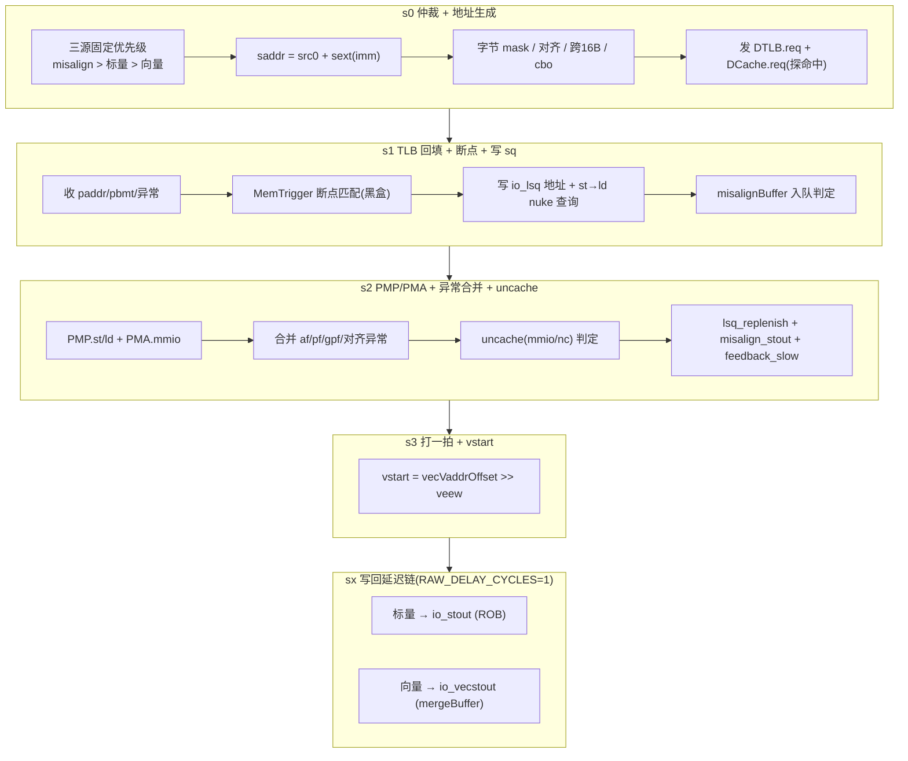

# StoreUnit —— store 地址流水单元（可读重写）

> 设计意图来源：`src/main/scala/xiangshan/mem/pipeline/StoreUnit.scala`
> 可读核：`rtl/memblock/StoreUnit.sv`（`xs_StoreUnit_core`）+ 类型包 `rtl/memblock/storeunit_pkg.sv`
> 端口适配层：`rtl/memblock/StoreUnit_wrapper.sv`（golden 同名 `StoreUnit`，直通核）

## 1. 在访存子系统中的位置

StoreUnit 是标量/向量 store 的 **地址流水线**：它只负责把一条 store 从发射推进到
「地址翻译完成、异常确定、写回」，**不搬运 store 数据**（数据经 StoreQueue 通路单独走）。
它接发射队列（标量 `stin` / 向量 `vecstin`）与 misalignBuffer 重发（`misalign_stin`），
向 DTLB/DCache 发地址请求，向 StoreQueue 写地址（`lsq`/`lsq_replenish`），做 st→ld
违例查询（`stld_nuke_query`），最终写回 ROB（标量 `stout`）或 mergeBuffer（向量 `vecstout`）。

## 2. 数据流（5 级流水）

## 3. 本配置的两个关键裁剪（golden 已固化，须对齐）

1. **`EnableStorePrefetchSMS = false`**：硬件预取源在本配置完全失效，故
   `s0_valid` 只由 `{标量 stin, 向量 vecstin, misalign 重发}` 三源驱动。
   `prefetch_train` / `s1_s2_prefetch_spec` / `io.issue` 等端口被 firtool 裁掉，
   wrapper/核端口随之裁剪。预取 `io_prefetch_req_bits_vaddr` 仍保留（仅参与 s0
   地址多选一的最后一档），但其 valid 已无，预取流不会真正 fire。
2. **下游 RS/issue-queue 恒 ready**：本顶层例化里各级 ready 退化为常量 1，
   流水推进只由各级 valid/kill 决定；`RAWTotalDelayCycles = 1`，s3 之后仅一级
   延迟寄存器 `sx[1]`。包/核用 `localparam s1_ready/s2_ready/s3_ready = 1` 表达。

## 4. 关键结构（用 SV 类型表达微架构）

### 4.1 类型包 `storeunit_pkg`
- **enum `align_e`**：`SZ_BYTE/HALF/WORD/DWORD`（对齐/size 类型）。
- **enum `st_src_e`**：`SRC_MISALIGN/SCALAR/VECTOR/PREFETCH`（s0 三源 + 预取，固定优先级）。
- **struct `rob_ptr_t`/`sq_ptr_t`**：`{flag, value}` 环形指针（替代散标量 `_flag`/`_value`）。
- **function automatic（11 个纯函数）**：
  `rob_need_flush`（环形冲刷判定）、`gen_saddr`/`gen_fullva_scalar`（地址生成）、
  `addr_aligned`/`cross16`（对齐与跨 16B）、`is_cbo_all`/`is_cbo_nozero`/`is_hsv`（指令类型）、
  `gen_vwmask`/`gen_basemask`（字节 mask；`gen_vwmask` 对 size∈{5,6} 落空返回 0，与
  golden `genVWmask128` 的 LookupTree 逐位一致）、`first_unmask`（mask 最低有效字节，**含 for 循环**）。

### 4.2 可读核 `xs_StoreUnit_core`
- 每级流水 payload 用 **`typedef struct packed`**（`s1_payload_t`/`s2_payload_t`/`s3_payload_t`/`sx_payload_t`），
  含 uop 字段、地址、mask、`rob_ptr_t`/`sq_ptr_t` 指针、被动透传异常位等。
- 指针用 struct、异常计算位用具名信号 + 纯函数。

## 5. trigger 三值规范化与异常向量

- **trigger action ∈ {0, 1, F}**（`TriggerAction`：None / DebugMode / BreakpointExp）。
  其高 3 位由 MemTrigger 黑盒同一布尔驱动；本核把 `s2/s3/sx` 的 trigger 寄存器**单列**
  为 `s2_in_uop_trigger` 等独立 4-bit 寄存器（不塞进 payload struct），与 golden 同名，
  保证 FM 逐位配对（塞进 struct 后高位签名歧义会令 trigger 全数失配）。
- 本单元关心的异常位：`3` breakPoint、`6` storeAddrMisaligned、`7` storeAccessFault、
  `15` storePageFault、`23` storeGuestPageFault。被动透传位（misalign/向量携带）直接连，
  主动计算位（s1 的 pf/af/gpf & vecActive、s2 的 PMP/uncache 合并）单独按 Scala 重算。

## 6. 验证

| 项 | 结果 |
|----|------|
| UT seed 1 | checks=200000, **errors=0** |
| UT seed 7 | checks=200000, **errors=0** |
| UT seed 42 | checks=200000, **errors=0** |
| FM（golden StoreUnit vs 手写 wrapper→核） | **SUCCEEDED**（3313 passing, 0 failing） |

- UT：`verif/ut/StoreUnit/`，golden 与手写核双例化、共用同一份 golden `MemTrigger_3`（黑盒），
  随机激励三源 valid + TLB 异常 one-hot + PMP，逐拍比对全部 187 个输出。
- FM：`MemTrigger_3` 放 `WRAPPER_SRCS` 让 impl 侧也读入（trigger 点两侧配对）；
  Makefile 设 `FM_MERGE_DUP=false`——本核刻意保留 golden 的 5 份同值 TLB-hit 打拍副本
  （`s2_*_REG`）与逐 bit trigger 寄存器并与 golden 同名，按名配对即可干净比对；
  若开启合并 pass，反而把黑盒同源驱动的 trigger 高位与 isCbo 折叠成两侧不对称而失配。

## 7. 结构闸门自查

| 指标 | core+pkg |
|------|----------|
| `typedef struct packed` | 7 |
| `typedef enum` | 2 |
| `function automatic` | 11 |
| `genvar`/`for` | 1（pkg `first_unmask` 优先级编码） |
| 展平名/生成痕迹 `io_x_NN_N`/`_REG_n`/`_GEN_`/`_T_n`/`RANDOMIZE` | 0 |
</content>
