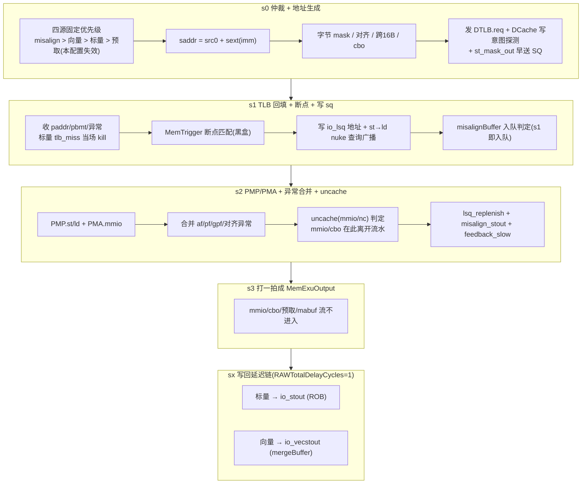

# StoreUnit —— store 地址流水单元（可读重写）

> 设计意图来源：`src/main/scala/xiangshan/mem/pipeline/StoreUnit.scala`
> 可读核：`rtl/memblock/StoreUnit.sv`（`xs_StoreUnit_core`）+ 类型包 `rtl/memblock/storeunit_pkg.sv`
> 端口适配层：`rtl/memblock/StoreUnit_wrapper.sv`（golden 同名 `StoreUnit`，直通核）
> 原理层背景见 [`arch/2-LOAD_STORE_PIPELINE_PRINCIPLES.md`](arch/2-LOAD_STORE_PIPELINE_PRINCIPLES.md)；
> 与 [LoadUnit](LoadUnit.md) 共用的术语（robIdx/sqIdx 环形指针、pbmt、nuke、matchType 粒度等）
> 见其 §8 术语表，本文只补 store 侧特有项（§10）。

## 1. 在访存子系统中的位置：只搬地址，不搬数据

StoreUnit 是标量/向量 store 的 **地址流水线**（本配置例化 2 份，`StorePipelineWidth=2`）：
把一条 store 从发射推进到「地址翻译完成、异常确定、写回 ROB」，**全程不碰 store 数据**。
证据就在 golden RTL：`StoreUnit.sv` 329 个端口里**没有任何数据端口**——`stin` 只剩
`src_0`（基址），Scala 里 `s0_out.data := src(1)` 的赋值因下游无人消费被 firtool 整链裁掉。

为什么这样拆？store 必须**等 ROB 提交才能真正改内存**（提交前可能被误预测分支/更老异常
冲掉），生命周期天然分三段、三套硬件各管一段：

| 段 | 硬件 | 干什么 | 为什么要早/晚 |
|---|---|---|---|
| 地址 | **StoreUnit**（本文） | s0 发射后立刻算地址、查 TLB、s1 就把地址写进 StoreQueue | 地址越早确定，load 越早能做 forward 匹配与违例检查——地址是全 LSU 的“公共依据” |
| 数据 | **StdExeUnit（StoreData 流水）→ StoreQueue 数据阵列** | 数据源操作数就绪后独立发射，直接写 SQ 的 data 模块 | 数据晚到不挡地址；地址/数据“两条腿”各自到位，SQ 用 `addrvalid/datavalid` 两个状态位分别跟踪 |
| 落盘 | **StoreQueue → SBuffer → DCache** | ROB 提交后按程序序合并写出 | 只有提交后的写才是体系结构可见的 |

所以 StoreUnit 的输出不是“数据写到哪”，而是：给 StoreQueue 的**地址+属性**
（`lsq`/`lsq_replenish`）、给 LoadUnit/LoadQueueRAW 的**违例查询**（`stld_nuke_query`）、
给 ROB 的**写回**（`stout`，报“地址侧完成+异常向量”）、给 mergeBuffer 的向量写回
（`vecstout`），以及 s0 早送 SQ 的 `st_mask_out`（mask 先行，load 的 forward 判定不用等
地址写入）。

## 2. 数据流（5 级流水 s0~s3 + sx）


```mermaid
flowchart TD
  subgraph s0["s0 仲裁 + 地址生成"]
    A1["四源固定优先级<br/>misalign &gt; 向量 &gt; 标量 &gt; 预取(本配置失效)"] --> A2["saddr = src0 + sext(imm)"]
    A2 --> A3["字节 mask / 对齐 / 跨16B / cbo"]
    A3 --> A4["发 DTLB.req + DCache 写意图探测<br/>+ st_mask_out 早送 SQ"]
  end
  s0 --> s1
  subgraph s1["s1 TLB 回填 + 断点 + 写 sq"]
    B1["收 paddr/pbmt/异常<br/>标量 tlb_miss 当场 kill"] --> B2["MemTrigger 断点匹配(黑盒)"]
    B2 --> B3["写 io_lsq 地址 + st→ld nuke 查询广播"]
    B3 --> B4["misalignBuffer 入队判定(s1 即入队)"]
  end
  s1 --> s2
  subgraph s2["s2 PMP/PMA + 异常合并 + uncache"]
    C1["PMP.st/ld + PMA.mmio"] --> C2["合并 af/pf/gpf/对齐异常"]
    C2 --> C3["uncache(mmio/nc) 判定<br/>mmio/cbo 在此离开流水"]
    C3 --> C4["lsq_replenish + misalign_stout + feedback_slow"]
  end
  s2 --> s3
  subgraph s3["s3 打一拍成 MemExuOutput"]
    D1["mmio/cbo/预取/mabuf 流不进入"]
  end
  s3 --> sx
  subgraph sx["sx 写回延迟链(RAWTotalDelayCycles=1)"]
    E1["标量 → io_stout (ROB)"]
    E2["向量 → io_vecstout (mergeBuffer)"]
  end
```

## 3. 本配置的两个关键裁剪（golden 已固化，须对齐）

1. **`EnableStorePrefetchSMS = false`**：硬件预取源在本配置完全失效，故
   `s0_valid` 只由 `{标量 stin, 向量 vecstin, misalign 重发}` 三源驱动。
   `prefetch_train` / `s1_s2_prefetch_spec` / `io.issue` 等端口被 firtool 裁掉，
   wrapper/核端口随之裁剪。预取 `io_prefetch_req_bits_vaddr` 仍保留（仅参与 s0
   地址多选一的最后一档），但其 valid 已无，预取流不会真正 fire。**连锁效应**：
   DCache 侧接口只剩 `io_dcache_req_valid` 一根线——Scala 里的“s0 发写意图探测
   （M_PFW 读 tag/meta 判命中）、s1 送 paddr、s2 收 resp.miss 喂 `lsq_replenish.miss`
   做预取训练”整条通路，因训练消费端不存在而全部被裁。
2. **下游 RS/issue-queue 恒 ready**：本顶层例化里各级 ready 退化为常量 1，
   流水推进只由各级 valid/kill 决定；`RAWTotalDelayCycles = 1`，s3 之后仅一级
   延迟寄存器 `sx[1]`。包/核用 `localparam s1_ready/s2_ready/s3_ready = 1` 表达。

## 4. s0：四源仲裁 + 地址生成

### 4.1 仲裁优先级：misalign > 向量 > 标量（> 预取）

```
use_ma  = misalign_stin.valid
use_vec = vecstin.valid & ~ma
use_rs  = stin.valid    & ~vec & ~ma
use_prf = prefetch.valid & ~rs & ~vec & ~ma      （本配置恒 0）
```

- **misalign 最高**：StoreMisalignBuffer 深度 1，且跨页 store 必须等到 ROB 头才敢拆分
  （见 §8）——它憋着的是全机最老的 store，不放行就堵提交。
- **向量高于标量**（注意 Scala 的屏蔽方向是 `use_rs` 被 `vec_valid` 屏蔽，而非反过来）：
  向量 store 已拆成多 uop，部分发射的指令先走完。
- ready 反馈按同一独热：`io.stin.ready = s1_ready & use_rs`，`io.vecstin.ready =
  s1_ready & use_vec`，`io.misalign_stin.ready = s1_ready & use_ma`——没被选中的源
  本拍就是 not-ready，IQ/缓冲各自重试。

### 4.2 地址 / mask / cbo / 对齐

- 标量自算 `saddr = src0[49:0] + sext(imm12)`；`fullva = src0 + sext(imm12)` 全 64 位
  （给 TLB 做整地址合法性检查，`checkfullva` 仅标量/向量首发置位）；向量/misalign 直接
  带地址进来。
- **cbo 判定**（仅标量源可能）：`isCboAll` = cbo.clean/flush/inval/**zero** 四条；
  `isCbo`(noZero) = 前三条。三处特殊化：mask 全 1（整行语义）、`addr_aligned` 强制成立
  （cbo 天然行对齐语义，不报非对齐）、TLB cmd 用**读权限**（`TlbCmd.read`，
  clean/flush/inval 只需要 R；cbo.zero 才是真写）。`wlineflag`（whole-line write）随
  cbo.zero 进 SQ，落盘时整行写。
- 对齐/跨界与 load 同一套纯函数：`addr_aligned` 按 size 查低位；`cross16` 判
  `vaddr[4:0]+size-1` 的 bit4 翻转；`misalignWith16Byte = !cross16 & !aligned`（16B 窗口
  内错位→升级 128-bit 一次访问，不拆分）；`is128bit = misalign 自带 | 向量 128b | 16B 内错位`。
- **mask 的一个 store 特有细节**：跨 16B 且不对齐时 s0 给的不是移位后的真 mask，而是
  `genBasemask`（按 size 的**未移位**连续 mask）——拆分/移位在 StoreQueue 里做
  （`unaligned/cross16Byte` 状态位配合两口写），s0 只交“基底”。
- `st_mask_out`（标量/向量发射拍即有效）：把 mask+sqIdx 提前写进 SQ 的 mask 阵列，
  这样更年轻的 load 在本 store 地址还没写入前就能拿 mask 做保守的 forward 判定。
- DTLB 请求：`io.tlb.req.valid = s0_valid`（**不看 dcache ready**——store 不赶数据，
  TLB 翻译一拍都不想等）；`memidx = {is_st, sqIdx}` 供 TLB hint 回填定位。
- DCache“写意图探测”：Scala 里 store 在 s0 以 M_PFW 读 tag/meta 判命中/预热（不写数据，
  真正的写在提交后经 SBuffer）且**不等 dcache ready**（不 ready 就干脆不探）；本配置该
  通路退化，只剩 `io_dcache_req_valid = s0_fire` 一个脉冲（§3）。

## 5. s1：TLB 回填 + nuke 广播 + 写 StoreQueue

### 5.1 标量 tlb_miss 当场 kill（与 load 的根本差异）

```
s1_kill = needFlush(redirect) | (s1_tlb_miss & !isvec & !frm_mabuf)
```

load 遇 TLB miss 走 C_TM replay（LoadQueueReplay 有 72 项可以蹲）；**标量 store 没有
replay 队列**——直接在 s1 杀掉流水，靠 `feedback_slow(hit=false)`（s1 算、s2 发，见 §6.3）
让 Store IQ 重发整条指令。代价可接受：store 不在关键数据通路上，重发射只费发射带宽。
向量 store 和 misalign 重发流**不能**这样杀（IQ 已经不认它们了）：向量流带着 miss 标记
走完流水、经 `vecstout.hit=false` 让 mergeBuffer 重发；mabuf 流经 `misalign_stout.
need_rep = RegEnable(s1_tlb_miss)` 让 StoreMisalignBuffer 重发。

### 5.2 stld_nuke_query：store 侧的违例“广播”

s1 一拿到 paddr 就广播（Valid 无握手，广播不许拒收）：

```
valid     = s1_valid & !s1_tlb_miss & !isHWPrefetch
bits      = { robIdx, paddr[47:0], mask[15:0], matchType[1:0] }
matchType = isCboAll ? CacheLine(2'b10) : is128bit ? QuadWord(2'b01) : Normal(2'b00)
```

**两类消费者、双向互补**（详细判定式见 [LoadUnit §4.3](LoadUnit.md)）：

1. **每条 LoadUnit 的 s1/s2**（`Flipped(Vec(2))`）：撞**还在流水里**的 load——现场比对，
   命中的 load 记 `C_NK` 重放（它还没写回，重走一遍即可，代价小）；
2. **LoadQueueRAW**（storeIn）：撞**已拿到数据、未提交**的 load——事后 CAM，命中说明
   那条 load 已经用了旧数据，只能 rollback 冲刷重取（代价大）。

为什么 s1 就发、不等 s2 异常确定？——晚一拍就漏掉恰好在 load s2/s3 即将写回的窗口；
宁可让个别最终有异常的 store 触发一次多余的 load 重放（保守方向，正确性无损）。

### 5.3 写 StoreQueue 地址（io.lsq）与 misalign 入队

- `io.lsq.valid = s1_valid & !isHWPrefetch`（**tlb_miss 也写**，`bits.miss = s1_tlb_miss`
  ——SQ 要把该项 `addrvalid` 保持为假、等重发；同拍还传 `updateAddrValid` 区分
  “这拍地址能不能置信”：misalign 未完成拆分的中间态不更新地址有效位）。
- 载荷：vaddr/fullva/paddr/gpaddr（RVH 两级翻译的客户机物理地址）、mask、`nc =
  Pbmt.isNC(pbmt)`、`mmio = Pbmt.isIO(pbmt)`、异常向量（s1 已合并 TLB 异常）、trigger。
- 三个翻译异常重算（对照 load 的 LPF/LAF/LGPF，store 版是 **SPF(15)/SAF(7)/SGPF(23)**，
  均 `& vecActive`）：注意每个都是 `st 位 | ld 位` 的 OR——**cbo.clean/flush/inval 以读
  权限查 TLB**（§4.2），其翻译错报在 `excp.pf/af/gpf.ld` 上，也要算成 store 异常。
  SAM(6) 在 s1 = `mmio & isMisalign`（golden `s1_exception_new_vec_6`；普通非对齐要么走
  misalignBuffer 拆分、要么 16B 内错位直接做，都不报异常，uncache 空间才真报，终判在
  s2）。Scala 源码里还有一段“`checkfullva` 命中翻译异常时清 SAM”的 when 块，但被其后
  对 SAM 的无条件重连（last-connect）完全遮蔽，golden RTL 中不存在该项——load 侧的同名
  机制（LoadUnit §4.1）才是活的。
- **MemTrigger（STORE 型，含 `isCbo` 输入）**：接口/编码同 load（action：**0=断点异常、
  1=debug mode、F=None**）；`vecVaddrOffset/vecTriggerMask` 供向量 store 精确定位触发元素。
- **misalign 入队在 s1**（load 在 s3！）：`s1_toMisalignBufferValid = s1_valid & !tlb_miss
  & !hw_prefetch & !frm_mabuf & !isCbo & isMisalign & !misalignWith16Byte &
  hd_misalign_st_enable`。store 不需要等 cache resp 才知道要不要拆——地址一出来就知道；
  早入队早占住深度 1 的缓冲。s2 若发现异常则 `misalign_enq.revoke` 撤销（入错了收回）。
- `io.s0_s1_valid = s0_valid | s1_valid`：告诉 vsMergeBuffer“store 地址流水前段有活”，
  用于其 misalign 处理的时序互锁。

## 6. s2：PMP/PMA 合并 + uncache 判定 + 反馈

### 6.1 异常合并（storeAccessFault 的四个来源）

```
SAF(s2) = ( s1 已带 SAF
          | pmp.st                          // PMP 写权限失败
          | pmp.ld & isCbo(noZero)          // cbo 以读权限查权限，PMP 读失败也算 store AF
          | (isvec | isCbo) & actually_uncache )  // 向量/cbo 不允许落在 uncache 空间
          & vecActive
```

`s2_exception` 统一用 `RegNext(s1_feedback.hit)`（=非 tlb_miss）门控——paddr 都不可信时
PMP/PMA 的结论无意义（Scala 注释原话）。`SAM(6)` 终判：`actually_uncache & !isvec &
(isMisalign | frm_mabuf) & 无其它翻译异常`——**uncache 空间的非对齐 store 报异常**而非
拆分（MMIO 设备不承诺拆分访问的原子性）。

### 6.2 uncache / mmio：在 s2 离开主流水

```
s2_mmio            = (s1 判的 mmio | Pbmt.isPMA & pmp.mmio) & RegNext(feedback.hit)
s2_actually_uncache= tlb_hit & 无翻译异常 & (PMA_mmio | nc | mmio) & RegNext(feedback.hit)
s2_kill            = (s2_mmio & !exception & !isvec & !frm_mabuf) | needFlush(redirect)
```

mmio 标量 store（含 cbo，`lsq_replenish.mmio = (s2_mmio | isCbo_noZero) & !exception`，
golden 注释“复用 sq 的 mmiostall 逻辑”）**在 s2 被 kill，不走 s3/sx 写回**：它必须在
提交点由 StoreQueue 的 mmio/cbo 状态机串行执行（经 Uncache 总线事务），完成后从 SQ 的
`mmioStout` 写回 ROB。地址流水对它的贡献到“把 mmio 属性写进 SQ”为止。

`lsq_replenish`（s2 版补充写 SQ）：af/mmio/nc、`memBackTypeMM = !pmp.mmio`、
`hasException`、`updateAddrValid`——s1 写的是“TLB 视角”的地址项，s2 补 PMP/PMA 才能
定的属性位。

### 6.3 feedback_slow / misalign_stout / vecFeedback

- **feedback_slow（标量，s1 算 s2 发）**：`hit = !s1_tlb_miss & !s2_misalignBufferNack`。
  `s2_misalignBufferNack` = s1 想进 misalignBuffer 但 `req.ready=0`（buffer 被占）且未被
  revoke——**入队失败也按 miss 反馈**，IQ 重发整条 store，晚点再试。这就是 store 版的
  “C_MF”，只是通道走 RS feedback 而非 replay 队列。
- **misalign_stout（s2 出，给 StoreMisalignBuffer）**：`valid = s2_valid & s2_can_go &
  frm_mabuf`，载荷含 paddr/mmio/nc/异常向量与 `need_rep`（=s1_tlb_miss）——mabuf 流
  不写回 ROB（`s3_valid` 排除 `frm_mabuf`），结果全部交还缓冲，由它聚合两半再统一写回。
- **s2_vecFeedback**：向量流的“地址侧成功”标记（非 tlb_miss、未被 nack、非 mabuf），
  打拍随 sx 链走到 `vecstout.hit/vecFeedback`。

## 7. s3 + sx：写回延迟链

### 7.1 s3——组装 MemExuOutput

```
s3_valid ⇐ s2_fire 时置位，条件 = (!mmio & !isCbo | exception) & !hwPrefetch
                                  & misalign_cango & !frm_mabuf
```

即真正走写回的只有：普通可缓存标量/向量 store、以及**带异常的**任何 store（异常必须
写回让 ROB 触发 trap）。注意 `!isCbo` 排除的是**全部四条** cbo（含 cbo.zero）——cbo
家族都不从本流水写回（见 §8）。misalign 要转入 misalignBuffer 的（`s2_mis_align`）也
不写回——拆分完成后由 mabuf 聚合路径负责。s3 本身零逻辑：把 `s2_out` 打拍装进
`MemExuOutput`（debug.isMMIO/isNCIO/paddr/vaddr 等）。

### 7.2 sx——为什么存在写回延迟链

`sx` 是 `RAWTotalDelayCycles+1` 级的透传链：`sx[0]` 组合直通 s3，`sx[1..N]` 是带
kill/背压的寄存器级；本配置 N=1，即 stout 比 s3 再晚 1 拍。**它对齐的是 LoadQueueRAW
的违例检出时延**。参数推导（`Parameters.scala`）：

```
TotalSelectCycles   = ceil(log2(LoadQueueRAWSize=32) / log2(RollbackGroupSize=8)) + 1 = 3
RAWTotalDelayCycles = TotalSelectCycles - 2 = 1        // 2 = store 自带的 s2、s3 两拍
```

时间线（设 store 在 s1 于 T1 广播 nuke query）：LoadQueueRAW 对 32 项做分组年龄选择树
（8 项/组，两级 + 出口拍 = 3 拍）→ 违例 rollback 于 **T1+3 = T4** 从 RAW 队列发出；
store 若不加 sx，s3 写回在 T3——ROB 可能在 rollback 生效前就把 store 连同**已用旧数据
写回的违例 load** 推向提交。补 1 拍后 stout 也在 T4，保证「本 store 可能触发的 rollback
一定不晚于本 store 变为可提交」——违例 load 永远来得及被冲掉（设计意图由上述参数
推导式直接佐证：`-2` 恰是 store 自带的 s2/s3 两拍）。

### 7.3 stout / vecstout 协议

- `io.stout`（标量 → ROB）：`valid = sx_last_valid & !isvec`；`ready` 由后端给（本配置
  恒 1）。异常向量按 `StaCfg` 过滤（BP(3)/SAM(6)/SAF(7)/SPF(15)/hardwareError(19)/
  SGPF(23)，golden stout 端口即这 6 位）。**语义**：
  store 的“执行完成”仅指地址+异常确定；数据齐不齐、落没落盘 ROB 不关心（那是 SQ 在
  提交后的事）。
- `io.vecstout`（向量 → vsMergeBuffer）：`valid = sx_last_valid & isvec`；`hit =
  vecFeedback`（false 则 mergeBuffer 重发该 uop）；带 elemIdx/alignedType/mask/
  vecTriggerMask/vstart（`vecVaddrOffset >> veew`，s2 算好）与按 `VstuCfg` 过滤的异常。
  向量 store 的 feedback 语义并入本口，不走 feedback_slow。

## 8. 非对齐 / 向量 / cbo 路径小结

| 情形 | 检测点 | 走向 |
|---|---|---|
| 16B 窗口内错位 | s0 `misalignWith16Byte` | 升级 `is128bit` 一次访问，不拆分、不报异常；nuke 粒度升为 QuadWord |
| 跨 16B（含跨 4KB 页） | s0 `cross16` → s1 入队 | s1 进 [StoreMisalignBuffer](StoreMisalignBuffer.md)（深度 1）拆两次对齐子访问经 `misalign_stin` 重发；**跨页要等 ROB 头**（前半写后、后半页错无法回滚）；子访问经 `misalign_stout` 收束，SQ 侧配合 `unaligned/cross16Byte` 两口写。mask 只给 basemask，移位拆分在 SQ |
| 向量 store | s0 `use_vec` | 每 uop 一次走流水；tlb_miss 不 kill，经 `vecstout.hit=false` 由 mergeBuffer 重发；`frm_mab_vec`（mabuf 里的向量）单独打标即“向量语义、mabuf 时序” |
| cbo.clean/flush/inval | s0 `isCbo_noZero` | TLB 读权限查询；nuke 按 CacheLine 粒度；s2 起并入 mmio 通道（`lsq_replenish.mmio` 复用 SQ 的 mmiostall），提交点由 SQ 发 `cmoOpReq` 以 CMO 事务执行；不走 stout，由 SQ 侧写回 |
| cbo.zero | s0 `isCboAll & !isCbo` | mask 全 1 + `wlineflag` 整行写，数据面走可缓存通路（SBuffer 整行合并）；但同样不走 stout——SQ 在整行写出并 flush SBuffer 后经专用 `cboZeroStout` 口写回 ROB |

## 9. 一条标量 store 的旅程（4+1 拍）

- **T0 (s0)**：`stin` fire（无 misalign/向量抢口）。`saddr=src0+sext(imm)`、mask 左移
  就位、对齐 OK、非 cbo。发 TLB req；`st_mask_out` 把 mask 先写进 SQ。
- **T1 (s1)**：TLB hit 回 paddr、无异常。**同拍**：`stld_nuke_query` 广播（2 类消费者
  现场撞在飞 load + RAW 队列 CAM 撞已完成 load）；`io.lsq` 把地址/属性写进 SQ 对应项
  （`addrvalid` 置位的依据）；feedback `hit=1` 备好。
- **T2 (s2)**：PMP 放行、非 mmio。`lsq_replenish` 补属性位；`feedback_slow` 发出
  hit=1（IQ 释放该项）。
- **T3 (s3)**：装进 MemExuOutput。
- **T4 (sx[1])**：`io.stout.valid=1` 写回 ROB——恰与“本 store 若引发 RAW 违例，rollback
  最晚到达”的拍对齐（§7.2）。此后：数据腿由 StoreData 流水独立写 SQ，ROB 提交后 SQ
  按程序序把 addr+data 合并经 SBuffer 落盘。

## 10. 术语表（store 侧特有；共用项见 [LoadUnit §8](LoadUnit.md)）

| 术语 | 含义 |
|---|---|
| saddr / fullva | s0 自算的 50 位虚地址 / 64 位全宽地址（整地址合法性检查用，`checkfullva` 门控） |
| cbo / CMO | Zicbom/Zicboz 缓存块操作指令（clean/flush/inval/zero）；前三条“读权限的 store”，zero 是整行写 |
| wlineflag | whole-line write 标志（cbo.zero），SQ/SBuffer 据此整行合并写 |
| st_mask_out | s0 提前送 SQ 的 mask+sqIdx——load forward 判定可用“mask 先行、地址后到”的保守信息 |
| stld_nuke_query | store s1 的违例查询广播：robIdx+paddr+mask+matchType，消费者 = LoadUnit s1/s2（现场）+ LoadQueueRAW（事后 CAM） |
| matchType | 违例比对粒度：Normal=8B（paddr[47:3]）/ QuadWord=16B（[47:4]）/ CacheLine=64B（[47:6]，cbo） |
| lsq / lsq_replenish | s1 写 SQ 的地址项 / s2 补写的 PMP 后属性项（af/mmio/nc/hasException） |
| updateAddrValid | 本拍写 SQ 的地址是否可置信（misalign 拆分中间态不置 `addrvalid`） |
| misalign_stin / misalign_stout | StoreMisalignBuffer 的重发入口 / 结果回收口（`need_rep`=tlb_miss 重发） |
| frm_mab_vec | “来自 mabuf 的向量 store”标记：StoreQueue/exceptionBuffer 需向量语义，但流水按 mabuf 时序处理 |
| feedback_slow | 标量 store 对 Store IQ 的重发反馈（s1 算 s2 发）：tlb_miss 或 misalignBuffer 满 → hit=false 整条重发 |
| s2_misalignBufferNack | s1 入 mabuf 被拒（占用中）→ 按 miss 反馈重发，store 版“C_MF” |
| sx / RAWTotalDelayCycles | 写回延迟链：把 stout 推迟到 LoadQueueRAW 违例选择树出结果之后（本配置 1 拍，公式见 §7.2） |
| vecFeedback | 向量 store 的地址侧成功标记，经 `vecstout.hit` 回 mergeBuffer |
| StdExeUnit / StoreData 流水 | 数据腿：独立发射、直写 SQ 数据阵列，与本单元（地址腿）汇合于 StoreQueue |

## 11. 验证

| 项 | 结果 |
|----|------|
| UT seed 1 | checks=200000, **errors=0** |
| UT seed 7 | checks=200000, **errors=0** |
| UT seed 42 | checks=200000, **errors=0** |
| FM（golden StoreUnit vs 手写 wrapper→核） | **SUCCEEDED**（3313 passing, 0 failing） |

- UT：`verif/ut/StoreUnit/`，golden 与手写核双例化、共用同一份 golden `MemTrigger_3`（黑盒），
  随机激励三源 valid + TLB 异常 one-hot + PMP，逐拍比对全部 187 个输出。
- FM：`MemTrigger_3` 放 `WRAPPER_SRCS` 让 impl 侧也读入（trigger 点两侧配对）；
  Makefile 设 `FM_MERGE_DUP=false`——本核刻意保留 golden 的 5 份同值 TLB-hit 打拍副本
  （`s2_*_REG`）与逐 bit trigger 寄存器并与 golden 同名，按名配对即可干净比对；
  若开启合并 pass，反而把黑盒同源驱动的 trigger 高位与 isCbo 折叠成两侧不对称而失配。

## 12. 结构闸门自查

| 指标 | core+pkg |
|------|----------|
| `typedef struct packed` | 7 |
| `typedef enum` | 2 |
| `function automatic` | 11 |
| `genvar`/`for` | 1（pkg `first_unmask` 优先级编码） |
| 展平名/生成痕迹 `io_x_NN_N`/`_REG_n`/`_GEN_`/`_T_n`/`RANDOMIZE` | 0 |
