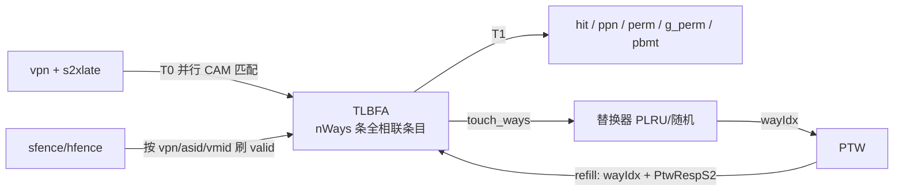
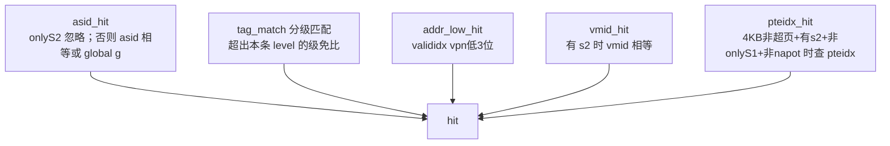

# TLBFA —— 全相联 TLB 存储（页表项缓存）

> 可读重写：`rtl/memblock/TLBFA.sv`（核 `xs_TLBFA_core`）+ `rtl/memblock/tlbfa_pkg.sv`（条目类型 / 匹配·取PPN·refill 纯函数）
> golden：`golden/chisel-rtl/TLBFA.sv`（3 端口）、`TLBFA_1.sv`（4 端口）
> Scala 设计意图：`XiangShan/src/main/scala/xiangshan/cache/mmu/TLBStorage.scala`（`class TLBFA`）+ `MMUBundle.scala`（`class TlbSectorEntry` 的 `hit/genPPN/apply`）

## 1. 在地址翻译链中的角色

香山的取指（ITLB）与访存（DTLB load/store）在「虚→实」翻译时，先查各自 TLB；TLB 内部用 **TLBFA**（全相联）保存若干已翻译的页表项。命中则直接给出物理页号与权限；未命中由 TLB 顶向 PTW（Page Table Walker）发起遍历，回填一条到 TLBFA。



- **查询**：1 拍读延迟。T0 接受请求并对 nWays 条目并行匹配，把命中向量寄存；T1 用 `Mux1H` 选出命中条目的 ppn/perm 等。
- **填充**：`io.w` 携带 `wayIdx`（替换器选的牺牲 way）+ `PtwRespS2`（stage1/stage2 两份页表项），解包写入对应条目。
- **刷新**：`sfence.vma` / `hfence.vvma` / `hfence.gvma` 按 vpn / asid / vmid 选择性或整体把条目 `valid` 清 0。
- **替换反馈**：把命中（或刚填充）的 way 报告给替换器，更新替换状态。

## 2. 什么是「sector TLB」

一条 TLBFA 条目不是只缓存 1 个 4KB 页，而是用一个 tag 覆盖 **`tlbcontiguous=8` 个连续 4KB 子页**（一个 sector）。每个子页有独立的：

- `valididx[8]`：该子页是否真的有效（命中除 tag 匹配外还必须 `valididx[vpn 低 3 位]`）；
- `pteidx[8]`：该子页是否为 stage1 末级 pte（两级翻译时校验）；
- `ppn_low[8]`：该子页的物理页号低 3 位（4KB 普通页拼最终 PPN 时用）。

好处是一次 PTW 可填充一整个 sector 的多个子页，提高 TLB 利用率；代价是同一条目可能多子页命中（“multi-hit”，Scala `wbhit` 有详细注释）。

## 3. 条目结构（`tlb_entry_t`，对应 `TlbSectorEntry`）

| 字段 | 宽 | 含义 |
|------|----|------|
| `tag` | 35 | sector vpn（vpn 高 35 位） |
| `asid` | 16 | 地址空间 id |
| `level` | 2 | 页大小：0=4KB 1=2MB 2=1GB（3 仅 Sv48） |
| `ppn` | 33 | sector ppn（物理页号高 33 位） |
| `n` | 1 | 1=64KB napot 页 |
| `pbmt`/`g_pbmt` | 2/2 | stage1 / stage2 内存类型（Svpbmt） |
| `perm` | 10 | stage1 权限 `{pf,af,v,d,a,g,u,x,w,r}` |
| `g_perm` | 10 | stage2(G-stage) 权限（同布局，下游只用部分位） |
| `valididx`/`pteidx` | 8/8 | 各子页有效 / 末级 pte 标志 |
| `ppn_low[8]` | 8×3 | 各子页 ppn 低位 |
| `vmid` | 14 | 虚拟机 id（H 扩展） |
| `s2xlate` | 2 | 本条目翻译模式 `noS2/onlyS1/onlyS2/allStage` |

`valid` 位单独放在条目数组外（`v[nWays]`），可被复位与 sfence 清 0；条目本体不复位。

## 4. 三个核心算子（`tlbfa_pkg` 纯函数）

### 4.1 `xs_tlb_hit` —— 单条目并行匹配（`hit`）

命中 = 下列全部为真：



**分级 tag 匹配**是关键：高位 vpnn 总要匹配；中/低级若条目 `level` 已覆盖（大页）则该级页内偏移不参与比较。这样一条 1GB 大页条目能匹配其覆盖范围内的任意 vpn。

调用方在 `hit` 之外另算 `s2xlate_hit`（`entry.s2xlate == req.s2xlate`）、`valid`、`!refill_mask`（屏蔽本拍正被写入的 way）。

### 4.2 `xs_tlb_genppn` —— 拼最终物理页号（`genPPN`）

命中后按 `level/n` 把存储 `ppn` 与请求 `vpn` 拼成 36 位 PPN：大页（`level>0`）的页内高位用 `vpn` 取代 `ppn`；4KB 非 napot 页时低 3 位用 `ppn_low[vpn 低位]`：

```
PPN = { ppn[32:24],
        level>=3 ? vpn[26:18] : ppn[23:15],
        level>=2 ? vpn[17:9]  : ppn[14:6],
        level>=1 ? vpn[8:0]
                 : n ? {ppn[5:1], vpn[3:0]}
                     : {ppn[5:0], ppn_low[vpn[2:0]]} }
```

### 4.3 `xs_tlb_refill` —— 解包 `PtwRespS2`（`apply`）

依 `s2xlate` 在 stage1 / stage2 两份页表项间选择：

- `level` 取两级中**较小页**（allStage 取 min）；
- `n`(64KB) 在 allStage 下按三种 napot 组合判定；
- `tag`：onlyS2 用 s2.tag 高位，否则 s1.tag；
- `ppn`：onlyS2 用 s2.ppn 高位与 s2.tag 低位按 level 拼接，否则 s1.ppn；
- `valididx/pteidx`：超页全置 1；onlyS2 用 s2.tag 低位的 one-hot；否则用 s1 的；
- `ppn_low`：onlyS2 各子页同值（来自 s2 的 full-ppn 低 3 位），否则 s1.ppn_low。

> 注意：`this.ppn`（sector 对齐）与 `ppn_low`（来自 full-ppn 的 `s2ppn_tmp`）是**两套不同拼接**——这正是首版 FM 暴露出的差异点，须分别计算。

## 5. refill 与 sfence 的优先级（关键时序）

Chisel 把所有更新合并成一个时序块，顺序决定优先级：

- **`valid` 位**：sfence/hfence 优先于 refill。某拍若有任意 sfence，则全部 way 取 flush 结果，**本拍 refill 的「置 valid」被丢弃**（但条目本体仍会写入）。无 sfence 时，refill 命中的 way 置 valid。
- **条目本体**：只要 `io.w.valid` 命中本 way 就写入，与 sfence 无关。
- 复位为**异步**（与 golden `posedge reset` 对齐），仅清 `valid` 与读流水的 `respValid/reqVpn/last_refill`；条目本体不复位。

## 6. sfence / hfence 刷新语义

按 `hg`（hfence.gvma）→ `hv`（hfence.vvma）→ 普通 `sfence.vma` 三路互斥，每路再分 `rs1`(全/特定地址)×`rs2`(全/特定 asid)：

| 指令 | rs1 | rs2 | 刷除条件（`v &= ~cond`） |
|------|-----|-----|--------------------------|
| hg   | -   | 1   | 有 s2 的条目 |
| hg   | -   | 0   | 有 s2 且 `{0,vmid}==id` |
| hv   | 1   | 1   | 有 s2 且 `vmid==hgatp.vmid` |
| hv   | 1   | 0   | 非 g、有 s2、`asid==id`、`vmid==hgatp.vmid` |
| hv   | 0   | 1   | 地址命中(忽略 asid，强制 hasS2) |
| hv   | 0   | 0   | 地址命中 且 非 g |
| sfence | 1 | 1   | 非 virt 刷 noS2；virt 刷本 vmid 的 s2 |
| sfence | 1 | 0   | 非 g：非 virt 且 noS2 且 asid==id；或 virt 且 s2 且 asid==id 且 vmid==hgatp.vmid |
| sfence | 0 | 1   | 地址命中(忽略 asid) |
| sfence | 0 | 0   | 地址命中 且 非 g |

「地址命中」复用 `xs_tlb_hit`（sfence_vpn = `addr[49:12]`，asid = `sfence.id`，vmid = `hgatp.vmid`，hasS2 = `priv.virt`）。`vmid` 端口为 16 位，比较时 `{2'b0, 条目14位vmid}` 与之全比较（与 golden 一致）。

## 7. 接口（扁平端口由 wrapper 适配）

可读核 `xs_TLBFA_core` 用 struct / 数组端口；golden 同名 wrapper（`scripts/gen_tlbfa.py` 生成）把它拆成 firtool 扁平端口供 FM/UT 对接。两变体参数：

| 变体 | PORTS | NDUPS | NWAYS |
|------|-------|-------|-------|
| TLBFA   | 3 | 1 | 48 |
| TLBFA_1 | 4 | 2 | 48 |

> `NDUPS` 只是把同一份查询结果复制成 nDups 份输出供下游分发，存储/匹配与 dup 无关。
> firtool 对各变体/各 dup 的 `perm/g_perm/ppn/pbmt/s2xlate` 输出做了**非均匀死代码裁剪**（只暴露下游真正用到的位），故 wrapper 的输出端口集合由脚本**直接从 golden RTL 解析**生成，逐变体精确对齐。

## 8. 验证

- **UT**（`verif/ut/TLBFA/`）：golden vs xs 双例化，随机查询 + refill(~25%) + sfence/hfence(~10%)，逐拍比对 `hit / ppn / perm / g_perm / pbmt / s2xlate / access`（resp.* 仅在命中时比对——未命中时 golden 输出为 don't-care）。
  - TLBFA / TLBFA_1，seed 1/7/42，各 60000 向量，**errors=0，TEST PASSED**。
- **Formality**：两变体均 **Verification SUCCEEDED**（TLBFA 8149 / TLBFA_1 8619 compare points 全 passing，0 failing，0 unmatched）。

## 9. 行数对比

| 文件 | 行数 |
|------|------|
| golden `TLBFA.sv` | 23035 |
| golden `TLBFA_1.sv` | 28981 |
| 可读核 `TLBFA.sv` + `tlbfa_pkg.sv` | **585**（304 + 281），参数化覆盖两变体 |

golden 巨大是因为 firtool 把「48 条目 × ports 路 × 宽匹配/取PPN/refill」全部手工展开；可读核用条目 struct 数组 + genvar 并行 + 三个纯函数，把指数级展开收敛成线性描述。
