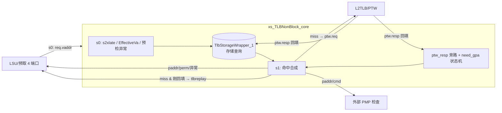

# TLBNonBlock —— 非阻塞数据 TLB（DTLB 顶层）

> ✅ **FM 分类 = REPLACEMENT_EQ（可读核真驱动 + 冻结基线原生 SUCCEEDED）**。依据台账
> [`verif/freeze/FM_STATUS.md`](../../verif/freeze/FM_STATUS.md) 与冻结基线日志
> `verif/ut/TLBNonBlock/fm_work/TLBNonBlock/fm_full.log`：本模块在当前冻结 golden 基线上 FM **原生
> `Verification SUCCEEDED`，3781 passing / 0 failing / 0 unverified**。下文验证节里任何
> "FAILED / 20 failing 截断 / 部分验证 / 未收敛"的表述是**冻结前的旧叙事，已作废**——以本
> banner 与台账为准。

> 可读重写：`rtl/memblock/TLBNonBlock.sv`（核 `xs_TLBNonBlock_core`）
> + `rtl/memblock/tlbnonblock_pkg.sv`（类型/纯函数）
> 设计意图来源：`src/main/scala/xiangshan/cache/mmu/TLB.scala`（`class TLB` / `class TLBNonBlock`，
> 本配置 `Width=4` / `nRespDups=2` / `Block=false`）。
> golden 对照：`golden/chisel-rtl/TLBNonBlock.sv`（4516 行）；本核 933 行（≈ 1/5）。

## 1. 架构定位

TLBNonBlock 是**数据侧 TLB 的顶层控制**。它本身不存页表项——存储 + 替换在内层
`TlbStorageWrapper_1`（全相联 TLBFA + Tree-PLRU，本工程已可读重写，UT/FM 用 golden 黑盒）。
本核负责：



- **非阻塞（non-block）**：miss 不阻塞后续请求——直接 resp（miss=1）并向 PTW 发请求；
  下游（LSU）自行 replay 该指令。区别于阻塞型 TLB（itlb 用 `handle_block`，会扣住请求等 PTW）。
- **两拍**：s0 收请求查存储；s1（下一拍）合成结果。`req.ready` 恒 1。

## 2. 数据流（两拍）

| 拍 | 做什么 |
|----|--------|
| **s0**（组合） | 算 `s2xlate`（翻译阶段）、`EffectiveVa`（指针掩码裁剪）、预检异常 `prepf/pregpf/preaf`（高地址截断检查）；把 `vpn` 转发给存储读口 `io_entries_rreq_*`。寄存请求字段到 `req_out_*`，`req_out_v`（带复位）。 |
| **s1**（寄存） | 拿存储读响应 `io_entries_*` + PTW 旁路 `p_*`（命中 `p_hit` 优先于存储）。合成 `hit/miss`、`paddr0/1`、`gpaddr`、`pbmt`，权限检查出 `pf/gpf/af`；miss → `handle_nonblock` 决定发 `ptw.req` 还是 `tlbreplay`。 |

## 3. 核心数据结构（pkg + core）

### 类型（`tlbnonblock_pkg.sv`）
```systemverilog
typedef enum logic [1:0] {            // 两阶段翻译（H 扩展）
  NO_S2XLATE, ONLY_STAGE1, ONLY_STAGE2, ALL_STAGE } s2xlate_e;
typedef struct packed { logic pf,af,v,d,a,u,x,w,r; } tlb_perm_t;   // 单阶段权限位
typedef struct packed { logic pf,af,d,a,x,w,r; }     tlb_gperm_t;  // G-stage 权限位
typedef struct packed { ... } read_dup_t;            // 每 dup 读结果聚合
```
纯函数：`calc_s2xlate`（翻译阶段 MuxCase）、`cmd_is_ld/st/inst/read/write`、`get_vpnn`。

### 核内纯函数（`TLBNonBlock.sv`）
PTW 回填项的 `hit()` 多级 tag/level/napot 匹配 —— 这是 TLB 的关键算法：
- `s1_entry_hit` / `s2_entry_hit` / `all_hit_full`：按 entry.level 决定比到第几级页号、
  napot(`n`)时比 16K 对齐位、`allStage` 时取两级较小 level + 两 `n` 组合。
PTW 回填地址合成（superpage 时页内段从 ppn 换成 vpn）：
- `gen_s1_ppn44` / `gen_s2_ppn38` / `gen_gvpn`（genPPN/genPPNS2/genGVPN）。
> 这些函数**全部把 PTW 字段经参数传入**（纯函数），既可读又让 FM 不把“函数读非局部信号”
> 判为 RTL 解释错误（FMR_VLOG-091）。

## 4. 关键有状态逻辑

- **`req_out_v[i]`**：请求在 s1 有效（`req.valid & ~kill`，复位清零）。
- **`p_hit[i]` / `p_*`（PTW 旁路）**：PTW 回填那拍若命中本请求 vpn，旁路 1 拍直接出结果
  （存储这拍还没写进去）。命中优先级：`p_hit` > 存储 `io_entries_hit`。
- **`need_gpa` 状态机**：命中项触发 *guest page fault*（`hasGpf`）时，需再向 PTW 要一次
  `gpaddr`。`need_gpa=1` 锁住该 vpn，等 PTW 回来填 `resp_gpa_gvpn` / `resp_gpa_refill=1`；
  被 redirect flush 或 refill 命中后清。4 端口优先级 3>2>1>0（`rr_T_redirect/enter/ptwhit`）。
- **`ptw_resp_bits_reg`（ptw_already_back）**：上拍 PTW 回填整包寄存，用于判“上拍刚回来命中”→replay。

## 5. handle_nonblock：miss 的去向

```
miss（req_out_v & miss_read）:
  ├─ ptw_just_back / ptw_already_back（本拍/上拍 PTW 刚回来命中该 vpn） → tlbreplay
  ├─ need_gpa 占用别的 vpn 且未 refill                                   → tlbreplay
  ├─ s1 kill（req_kill & 上拍 fire）                                      → tlbreplay
  └─ 否则                                                               → ptw.req.valid=1（发缺页）
```

## 6. 端口裁剪（firtool）

各端口 resp 字段被 firtool 按用途裁剪：端口 0 全字段（含 pf_st/af_st/gpf_st/isForVS/isHyper）；
端口 1/2 仅 ld 类异常 + gpaddr/fullva；端口 3 最简（无 paddr_1/gpaddr/fullva/isForVS、无 s1 kill）。
wrapper 按此打包/拆分核的数组端口，缺失项 tie 0。

## 7. 分层与例化

- 核 `xs_TLBNonBlock_core`：可读控制逻辑（packed 数组端口 + struct）。
- `TLBNonBlock_wrapper.sv`（golden 同名，FM/ST 用）：把 golden 扁平端口适配成核的数组端口，
  并例化 golden 黑盒 `DelayN_9`（sfence 延迟 2 拍）/ `DelayN_7`（csr 延迟 2 拍）/
  `TlbStorageWrapper_1`（存储 + PLRU）。`fenceDelay=2`。
- `verif/ut/TLBNonBlock/variants_xs.sv`：`TLBNonBlock_xs` 镜像（UT 用，例化同一批 golden 黑盒）。

## 8. 验证结果

### UT（双例化逐拍比对所有输出，跳过 golden-X 不可达态）
| seed | checks | errors |
|------|--------|--------|
| 1  | 200000 | **0** |
| 7  | 200000 | **0** |
| 42 | 200000 | **0** |

激励覆盖：4 端口随机 req（vaddr 压窄高位提高跨端口/PTW 命中）、satp/vsatp/hgatp 模式取 {关,Sv39,Sv48}、
ptw_resp 随机回填、redirect/sfence/csr-changed 偶发、kill/req_kill 随机。

### FM（签名分析，不靠名字）
`1262` 点按名匹配 + `825` 点按签名匹配；末次 verify 结论 **Verification FAILED**：
**792 passing / 20 failing（matched）/ 1275 unverified**。
已报告的 20 个 failing 全是 s0 预检异常流水寄存 `excp_*_REG` / `REG`(预检使能) 与 `need_gpa_vpn`。
**经 tb 内部层次探针（`u_g.<reg>` vs `u_i.u_core.<reg>`）逐拍比对，3 种子 ×200k 拍
`need_gpa_vpn / REG / pf_ld / af_ld / pf_st` 全 `0` 分歧 → 确认为假阳性**：
这些寄存器在 UT 实际激励下与 golden 逐拍 bit 等价，FM 的 failing 来自其探索的不可达输入组合
（约束广但仍不可达的 don't-care 态）。注意 **20 是 Formality 默认
`verification_failing_point_limit=20` 的截断上限**——verify 攒满 20 个失配即提前中止，
1275 个 unverified 点未验，故 FM 为**部分验证**，以 UT（多种子逐拍 0 错 + 探针 0 分歧）为权威。
其余 unmatched 为可读核 packed 数组/struct 与 golden
firtool 展平寄存器无法按名/签名配对（结构差异，预期）。

## 9. 结构门槛（逐条 grep）

| 项 | 值 |
|----|----|
| `typedef struct packed` | 3 |
| `typedef enum` | 1 |
| `function automatic` | 13（pkg 7 + core 6） |
| `genvar`/`for` | 8 |
| 展平名/生成痕迹 `io_*_N_M`/`_REG_N`/`_GEN_`/`_T_N`/`RANDOMIZE` | **0** |
| 行数 | 933 vs golden 4516（≈ 1/5） |
