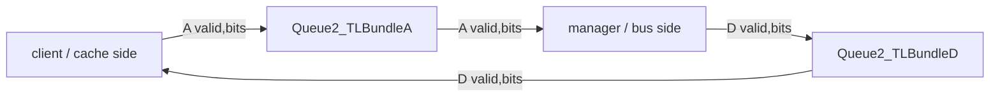
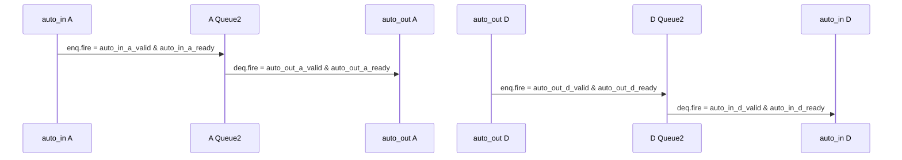

# TLBuffer —— TileLink A/D 通道时序缓冲

> 可读重写：`rtl/memblock/TLBuffer.sv`（核 `xs_TLBuffer_core`）+ `rtl/memblock/tlbuffer_pkg.sv`
> golden（firtool 生成，仅作 UT/FM 对照）：`golden/chisel-rtl/TLBuffer.sv`

---

## 1. 架构定位

TLBuffer 是 TileLink 网络中的轻量时序隔离点。它不改变协议内容，不解码 opcode，
也不在 A/D 之间做重排；它只在两个方向各插入一个队列：

作用是切断上下游的 `ready` 长组合路径，同时保持 TileLink 单通道内的 FIFO 顺序。
A 通道是请求方向 `client -> manager`；D 通道是响应方向 `manager -> client`。

---

## 2. 数据结构

可读核把 golden 扁平端口聚合成两个 TL bundle：

| bundle | 方向 | 主要字段 |
|---|---|---|
| `tl_a_bundle_t` | A 请求 | `opcode/param/size/source/address/user_amba_prot/mask/data/corrupt` |
| `tl_d_bundle_t` | D 响应 | `opcode/param/size/source/sink/denied/data/corrupt` |

核内还用 `decoupled_handshake_t` 表达每条被缓冲路径的 `ready/valid`，并用
`handshake_fire()` 统一说明 `fire = ready & valid`。这些握手视图不改变硬件行为，
只是让读者能直接看到 A/D 两条通道在什么时候真正入队或出队。

---

## 3. 缓冲语义

关键点：

- A/D 是两条独立队列；响应不会反压请求队列，反之亦然。
- payload 原样穿过队列，TLBuffer 不修改 `source/sink/address/data` 等字段。
- Queue2 是共享叶子：UT 中 golden 与 xs 核使用同一份 golden Queue RTL；FM 中两侧把
  Queue 当成同名黑盒，只验证 TLBuffer 本层的通道连接。

---

## 4. 接口表

| 端口组 | 方向 | 说明 |
|---|---|---|
| `auto_in_a_*` | client -> TLBuffer | A 请求入队端 |
| `auto_out_a_*` | TLBuffer -> manager | A 请求出队端 |
| `auto_out_d_*` | manager -> TLBuffer | D 响应入队端 |
| `auto_in_d_*` | TLBuffer -> client | D 响应出队端 |

---

## 5. 验证结果

### 5.1 UT

双例化 `TLBuffer` golden 与 `TLBuffer_xs`，两侧共用 golden `Queue2_TLBundleA`、
`Queue2_TLBundleD`、`ram_2x153`、`ram_2x90`。随机驱动 A/D valid、ready 和 payload，
逐拍比较所有输出；golden 输出含 X 时按 don't-care 跳过。

| seed | cycles | checks | errors |
|---:|---:|---:|---:|
| 1 | 200000 | 5400000 | 0 |
| 7 | 200000 | 5399953 | 0 |
| 42 | 200000 | 5399968 | 0 |

### 5.2 FM

`make fm`：`FM_RESULT: Verification SUCCEEDED for TLBuffer`。

FM 配置中 golden 顶层与 xs wrapper 都把 `Queue2_TLBundleA/D` 作为同名黑盒边界，
因此证明的是 TLBuffer 本层端口装配、bundle 拆装和方向连接等价。

### 5.3 结构硬指标

对 `rtl/memblock/TLBuffer.sv` 实测：

| 指标 | 值 |
|---|---:|
| `typedef struct packed` | 1 |
| `typedef enum` | 1 |
| `function automatic` | 1 |
| `genvar` / `for (` | 1 |
| 生成痕迹 grep | 0 |

黑盒子模块：`Queue2_TLBundleA`、`Queue2_TLBundleD`。

---

## 6. 易错点

- D 通道方向与 A 通道相反：D 的入队端是 `auto_out_d_*`，出队端是 `auto_in_d_*`。
- Queue 的 payload 输出在 `valid=0` 时可能来自未初始化 RAM；UT 比对必须遵守
  `!$isunknown(golden)` 的 don't-care 规则。
- TLBuffer 不应“优化”或合并 A/D 逻辑；两个通道在协议上独立，队列也是独立的。
