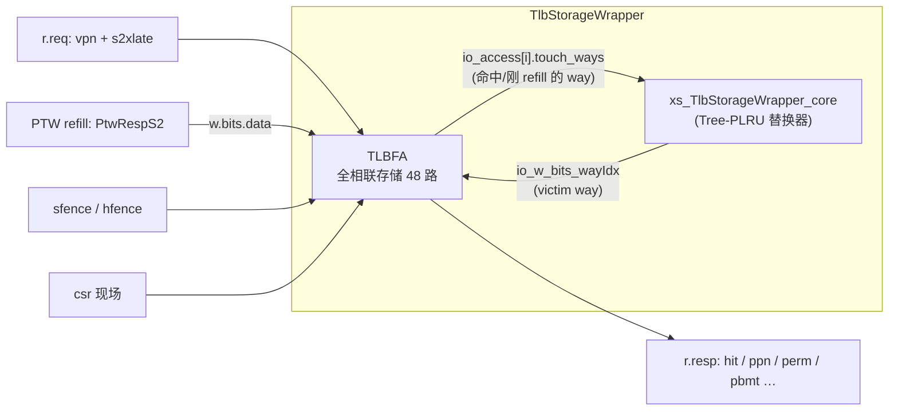
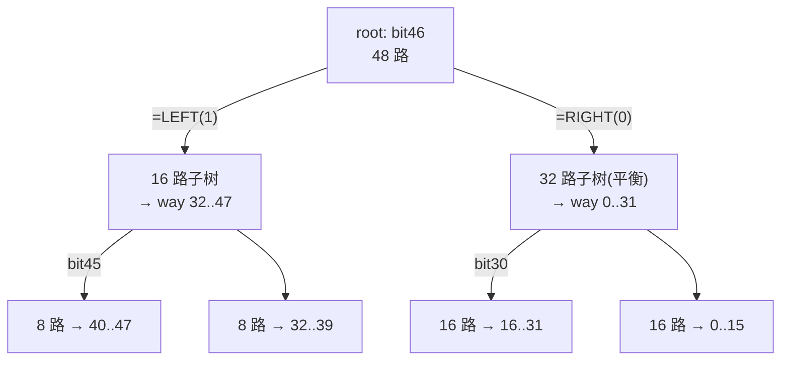

# TlbStorageWrapper —— TLB 存储 + 替换 包装层

> 可读重写：`rtl/memblock/TlbStorageWrapper.sv`（核 `xs_TlbStorageWrapper_core`，仅含替换器）+ `rtl/memblock/tlbstoragewrapper_pkg.sv`（Tree-PLRU 类型 / 纯函数）
> golden：`golden/chisel-rtl/TlbStorageWrapper.sv`（3 端口，itlb）、`TlbStorageWrapper_1.sv`（4 端口，dtlb）
> Scala 设计意图：`XiangShan/src/main/scala/xiangshan/cache/mmu/TLBStorage.scala`（`class TlbStorageWrapper`）+ 替换算法 `rocket-chip/src/main/scala/util/Replacement.scala`（`class PseudoLRU`）

## 1. 在地址翻译链中的角色

每个 TLB（ITLB / DTLB-load / DTLB-store）的顶层 `TLB.scala` 例化一个 **TlbStorageWrapper**，作为它的「页表项缓存 + 替换器」。它对外暴露 TLB 顶需要的存储接口，对内例化一个全相联存储 [TLBFA](./TLBFA.md)（`nWays=48`），并自带一套 **Tree-PLRU** 替换器。



**关键认识：本层自身几乎是“透明路由”。** Scala `class TlbStorageWrapper` 的绝大部分代码是把 `r.req / r.resp / sfence / csr / w.bits.data` 一字段一字段直连到内层 TLBFA（`rp.bits.ppn(d) := p.bits.ppn(d)` 之类），没有任何变换。本层**唯一拥有的有状态逻辑就是替换器**：

- 内层 TLBFA 每拍通过 `io_access[i].touch_ways`（一个 `Valid[UInt]`）反馈「本拍命中 / 刚 refill 的 way」；
- 替换器把各端口的 `touch_ways` 依次喂进 PLRU 树，更新替换状态；
- 组合地从当前状态算出 **victim way**（refillIdx），驱动 TLBFA 的 `io_w_bits_wayIdx`，告诉它下次 refill 写哪一路。

因为 `q.outReplace=false`，替换器在本层内部，不外引到 TLB 顶。

> 因此可读核 `xs_TlbStorageWrapper_core` **只实现替换器**这一份真正属于 wrapper 的逻辑；存储、CAM 匹配、refill 写、sfence 刷新等全部在内层 TLBFA 完成（UT/FM 按要求用 golden TLBFA 黑盒例化）。读 / 响应 / sfence / csr / wdata 端口对 TLBFA 全透传，由机械生成的包装层连线。

## 2. Tree-PLRU 替换算法（伪 LRU 二叉树）

替换策略由 Scala 的 `ReplacementPolicy.fromString("plru", NWays)` 选定，本体是 rocket-chip 的 `class PseudoLRU`（[Tree-PLRU](https://en.wikipedia.org/wiki/Pseudo-LRU#Tree-PLRU)）。

`n` 路用 **`n-1` 个状态位**，组织成一棵二叉树，每个内部节点 1 位，记录「左子树是否比右子树更老（更该被替换）」：

- **查 victim（`plru_replace_way`）**：从根沿「指向更老子树」的方向下行，到叶子即得 way 编码（从 MSB 到 LSB 逐级确定）。
- **更新（`plru_next_state`）**：访问某 way 后，把它路径上经过的每个节点翻成「指向另一侧」，即把刚访问的子树标记为「最近用过、不该被换」；未经过的子树状态保持不变。

### 非 2 的幂的拆分（与 rocket-chip 完全一致）

```
right_nways = 1 << (log2Ceil(nways) - 1)   // 右子树取 ≤ nways 的最大 2 的幂
left_nways  = nways - right_nways           // 左子树取剩余（可能更小、非平衡）
```

本配置 `nways=48`：root 把 48 拆成 **left=16 / right=32**；左子树 16 再拆成 8/8…直到叶子。注意左子树（16 路）只需 4 位编码，但它处在 root 的「左侧（MSB=1）」，故最终 way 落在 `32..47`；右子树（32 路，平衡）落在 `0..31`。

### 状态位布局（与 rocket-chip `extract` 索引逐位一致）

对一棵 `tree_nways` 路、状态切片起始于 `state_lo` 的子树：

| 量 | 取值 |
|----|------|
| 本节点位 | `state[state_lo + tree_nways - 2]`（子树状态最高位） |
| 左子树状态 | `state[state_lo + right_nways - 1 +: (left_nways - 1)]` |
| 右子树状态 | `state[state_lo +: (right_nways - 1)]` |

`plru_replace_way` 返回**右对齐**的 way 编码，宽度 = `log2Ceil(tree_nways)`，本节点位放在该编码的最高位（`bit log2Ceil(tree_nways)-1`），子树编码拼在其下——对应 rocket-chip 的 `Cat(node_bit, child_way)`（`Mux` 把较窄的左子树编码零扩展到与右子树同宽）。**这一“按子树深度放置节点位”是实现的关键**：若误把节点位一律放在最高位 bit5，非 2 的幂的左子树会算错（FM 会逐位抓出）。



### 多端口更新（foldLeft）

多个查询端口可能同拍都有 `touch_ways`。Scala 用 `foldLeft` 串联：

```scala
get_next_state(state, touch_ways) =
  touch_ways.foldLeft(state)((s, t) => Mux(t.valid, get_next_state(s, t.bits), s))
```

即按端口 0→1→…→P-1 顺序，每个端口（仅当 `valid`）在前一步结果上再应用一次 `get_next_state`。只要任一端口 `valid` 就在该拍写回状态寄存器。可读核用一个 `for` 循环把这个 fold 直接写出来。

## 3. 接口（透传端口由生成的包装层连线，可读核只接替换器信号）

可读核 `xs_TlbStorageWrapper_core`：

| 端口 | 方向 | 含义 |
|------|------|------|
| `io_access[PORTS]` | in | 每端口 `tlb_access_t{valid, way}`：TLBFA 反馈的 touch_ways（命中 / 刚 refill 的 way） |
| `io_w_bits_wayIdx` | out | 组合算出的 victim way，回灌 TLBFA 的 refill 写地址 |

包装层（`TlbStorageWrapper_wrapper.sv` 等，机械生成）：
- 例化 golden 黑盒 `TLBFA`（实例名沿用 golden `page_itlb_storage_fa` / `page_ldtlb_storage_fa`），把 wrapper 的全部 r/sfence/csr/wdata/resp 端口对 TLBFA 透传；
- 收 TLBFA 的扁平 `io_access_<i>_touch_ways_*` 打包成 `tlb_access_t access[]` 喂给替换核；
- 把替换核的 `io_w_bits_wayIdx` 回灌 TLBFA。

## 4. 两个变体

| 顶层 | PORTS | NWAYS | PLRU 状态位 | 用途 |
|------|-------|-------|-------------|------|
| `TlbStorageWrapper`   | 3 | 48 | 47 | itlb |
| `TlbStorageWrapper_1` | 4 | 48 | 47 | dtlb(load) |

两变体差别仅在查询 / access 端口数；PLRU 树形（48 路）完全相同。可读核以 `PORTS` 参数化单核覆盖。

## 5. 验证

### UT（golden vs 可读 双例化，逐拍比对所有输出）

两侧均例化同一份 golden 黑盒 TLBFA，差异只可能来自替换器 / wayIdx；随机激励覆盖 r.req（含 s2xlate）、refill、sfence/hfence、csr。

| 变体 | seed 1 | seed 7 | seed 42 |
|------|--------|--------|---------|
| `TlbStorageWrapper`   | 60000 checks, errors=0 | errors=0 | errors=0 |
| `TlbStorageWrapper_1` | 60000 checks, errors=0 | errors=0 | errors=0 |

> 提示：替换 wayIdx 是内部信号，仅经「refill 写到哪一路 → 后续查询命中/未命中」间接暴露；随机激励下 tag 罕有碰撞，UT 对 wayIdx 的敏感度有限。**wayIdx 的逐位正确性主要靠 FM 保证**（另用 200 万组随机状态把 `plru_replace_way` 与 golden 选择树逐位对齐验证过一次）。

### FM（Formality 签名 + 跨层次按名配对）

- ref = golden `TlbStorageWrapper` + 其内层 golden `TLBFA`；impl = 可读核 + 生成包装层 + 同一份 golden `TLBFA`。
- 两侧 TLBFA 实例同名（`page_*_storage_fa`），其内部寄存器按层次名自动配对；PLRU 状态寄存器命名与 golden 顶层一致（`refill_idx_state_reg`），替换核实例名 `u_core` 由脚本剥离后按名配对。
- `FM_MERGE_DUP=false`（内层 TLBFA 48 条目对称寄存器，关合并以免两侧不对称合并误配）。

| 变体 | 结果 | compare points |
|------|------|----------------|
| `TlbStorageWrapper`   | **SUCCEEDED** | 8175 matched, 0 unmatched, 0 failing |
| `TlbStorageWrapper_1` | **SUCCEEDED** | 8638 matched, 0 unmatched, 0 failing |

FM 给出完整时序等价证明（含替换状态更新），强于任何 UT；它也正是抓出早期 `plru_replace_way` 非 2 的幂子树位置 bug 的手段。

### 结构门槛（可读核 pkg + core，242 行 vs golden 909/1175）

| 指标 | tlbstoragewrapper_pkg.sv | TlbStorageWrapper.sv |
|------|--------------------------|----------------------|
| `typedef struct packed` | 1 (`tlb_access_t`) | — |
| `typedef enum` | 1 (`plru_dir_e`) | — |
| `function automatic` | 3 (`xs_log2ceil` / `plru_replace_way` / `plru_next_state`) | — |
| `for` / genvar | — | 1 (多端口 foldLeft) |
| 展平名 / firtool 痕迹 | 0 | 0 |

## 6. 复现

```bash
python3 scripts/gen_tlbstoragewrapper.py        # 生成包装层 / tb / Makefile
cd verif/ut/TlbStorageWrapper
make run  SEED=1 ; make run1 SEED=1             # 两变体 UT（可换 SEED=7/42）
make fm                                          # 两变体 FM
```
