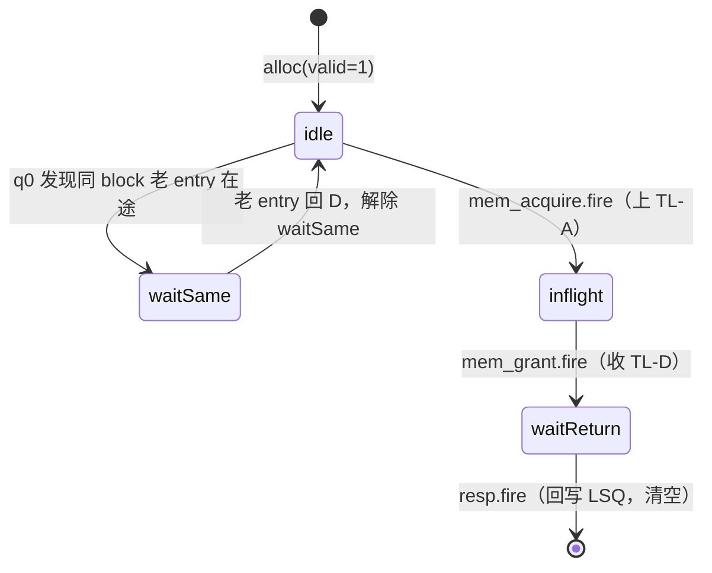
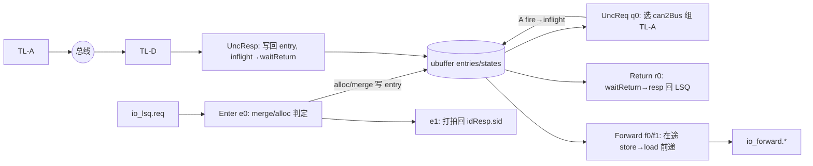

# Uncache —— 非缓存 / MMIO 访问单元（学习文档）

> 可读重写：`rtl/memblock/Uncache.sv`（核 `xs_Uncache_core`）+ `rtl/memblock/uncache_pkg.sv`
> 设计意图来源（人写 Chisel）：`src/main/scala/xiangshan/cache/dcache/Uncache.scala`
> golden（firtool 生成，仅作 UT/FM 对照）：`golden/chisel-rtl/Uncache.sv`

---

## 1. 架构定位

Uncache 是 DCache 的「旁路通道」。LoadQueue / StoreQueue 中被判定为 **uncached** 的访存
（强序 MMIO 设备访问，或 page 属性标为 non-cacheable 的 NC 访问）不进 L1 cache，而是
经过本单元转换成 **TileLink-UL（TL-UL）** 主端口请求，直接打到总线 / L2。

```
        ┌────────────────────── MemBlock ──────────────────────┐
 LSQ ──req/idResp/resp──▶│  Uncache（ubuffer: UNC_SIZE 个 entry）│──TL-UL A/D──▶ 总线/L2
LoadUnit ──forward──────▶│   每 entry 一个小状态机               │
        └───────────────────────────────────────────────────────┘
```

- 上游：`io_lsq`（请求/响应握手 + idResp 回 sid）、`io_forward`（3 路 load 前递查询）。
- 下游：`auto_client_out`（TL-UL：A 通道发请求，D 通道收响应；B/C/E 不用）。
- 旁路控制：`io_flush`（抽干）、`io_wfi`（等中断前确保无在途）、`io_busError`（总线错误上报）。

本配置（KunmingHu V2R2）固化参数：
`UncacheBufferSize=4`、`LoadPipelineWidth=3`、`XLEN=64`、`PAddrBits=48`、`VAddrBits=50`、
`DataBytes=8`、`VDataBytes=16`、cache line=64B（`blockOffBits=6`）。

---

## 2. 数据结构（核内 struct/enum）

### 2.1 entry payload（`unc_entry_t`）
保存一条 uncached 访存的命令/地址/数据/掩码/属性。`data` 在 store 时是写数据，
load 返回后被 TL-D 的读数据覆盖；`resp_nderr` 记录总线返回的 denied/corrupt。

| 字段 | 宽 | 含义 |
|---|---|---|
| cmd | 5 | `M_XRD=0`(load) / `M_XWR=1`(store) |
| addr | 48 | 物理地址（merge 后对齐到首个有效字节） |
| vaddr | 50 | 虚地址（forward 用 vaddr CAM） |
| data | 64 | store 写数据 / load 返回数据 |
| mask | 8 | 字节有效掩码 |
| nc | 1 | non-cacheable（区别强序 MMIO） |
| memBackTypeMM | 1 | 后端按 main-memory 处理 |
| resp_nderr | 1 | 总线返回 denied\|corrupt |

### 2.2 entry 状态（`unc_state_t` 四 bool）



- `idle = valid & !inflight & !waitSame & !waitReturn`（`can2Bus`，可上总线）
- `waitSame`：同 8B-block 已有 entry 在途，本 entry 先挂起以保证 uncached 同地址顺序。
- `inflight`：TL-A 已发、TL-D 未回。
- `waitReturn`：TL-D 已回、resp 未发回 LSQ。

### 2.3 非 outstanding 全局状态机（`ustate_e`）
`io_enableOutstanding=0` 时整单元一次只允许一条在途：
`US_IDLE →(A fire) US_INFLIGHT →(D fire) US_WAIT_RETURN →(resp fire) US_IDLE`。
outstanding 模式下该状态机被旁路（q0 只看各 entry 的 `can2Bus`）。

---

## 3. 五个处理面（数据流）



### 3.1 Enter Buffer（e0/e1）
对每个 entry 与新请求做关系判定（`canMergePrimary`/`canMergeSecondary`）：
- **merge**：同 block、cmd/nc/memBackTypeMM 同、合并掩码连续对齐（`continueAndAlign`），
  且老 entry 不在回程、不是这拍正被 q0 发送 → 把新数据逐字节合并进老 entry，并按
  合并掩码的首个有效字节重对齐 addr/vaddr。
- **allocWaitSame**：primary 满足但 secondary 不满足（老 entry 这拍正被发送）→ 新分配并挂 waitSame。
- **alloc**：无同 block 命中 → 占一个空 entry。
- **reject**：drain 中 / buffer 满且不可合并 / 同 block 但属性不符。
`req_ready = ~e0_reject`。e1 打一拍把分配/合并到的 `sid` 经 `idResp` 返回 LSQ。

> 优先级：merge > alloc（同 Scala 的 if/else）。merge 用 `e0_canMerge & req_valid`
> 触发（不消耗握手 ready）；alloc 用 `e0_fire`（valid & ready）触发。

### 3.2 Uncache Req（q0）—— 组 TileLink-UL A
在所有 `can2Bus` 的 entry 里按优先级（最低下标）选一个：
- store → `PutPartialData`(opcode=1)，带 `entry.mask` 与 `entry.data`；
- load  → `Get`(opcode=4)，data=0，mask 由地址低位与 size 自动生成（`tl_get_mask`）。
- `size = log2(PopCount(mask))`（`tl_lg_size`，合法值 1/2/4/8 字节）。
- A fire 时：被发 entry 置 `inflight`、清 `noPending`；其余同 block 未在回程的 valid
  entry 挂 `waitSame`。`a_valid = q0_canSent & ~wfiReq`（WFI 期间不再发新请求）。

### 3.3 Uncache Resp（收 TL-D）
`d.ready` 恒 1（单 beat）。D fire 时：按 `d.source` 定位 entry，load 写回读数据，
记录 `resp_nderr=denied|corrupt`，状态 `inflight→waitReturn`，置 `noPending`；并解除
同 block 等待者的 `waitSame`。busError 在「store 且 denied/corrupt」时上报 cache-line 基址。

### 3.4 Return（r0）
在所有 `waitReturn` 的 entry 里择一（最低下标）回写 LSQ：`resp.bits` 取该 entry 的
data/nc/nderr，`is2lq = (cmd==M_XRD)`。resp.fire 时清空该 entry 全部状态位。

### 3.5 Load Forward（f0/f1）
把 ubuffer 里**在途 store** 的字节前递给 load 流水（3 路并行）：
- **f0**：用 `forward.vaddr` 对所有「有效 store」entry 做 8B-block CAM；按状态分两类：
  `fly`（在途/等回写，旧数据）与 `idle`（已 alloc 未发，新数据）。
- **f1**：打一拍后用 `forward.paddr` 复核；merge 旧/新（new 覆盖 old），按 `paddr[3]`
  移到 16B 的高/低半区输出 `forwardData/forwardMask`；vaddr 命中而 paddr 失配 →
  `matchInvalid`，并触发 `f1_needDrain` 抽干 buffer（重做，避免别名错误前递）。

---

## 4. drain / WFI

- **drain**（`do_uarch_drain`）：forward 出现 vaddr/paddr CAM 失配，或外部 `flush.valid`，
  且 buffer 非空 → 进入 drain，期间拒绝新请求入 buffer，直到 `empty`。
  次态 = `((f1_needDrain | flush) & ~empty)`。
- **WFI**：`wfiSafe` = 打一拍的 `(所有 entry noPending) & wfiReq`，确保进入低功耗前无在途总线事务。

---

## 5. 接口表（按功能分组，端口名与 golden 一致）

| 组 | 端口 | 方向 | 说明 |
|---|---|---|---|
| TL-A | auto_client_out_a_{valid,ready,bits_*} | out/in | 发 uncached 请求 |
| TL-D | auto_client_out_d_{valid,bits_*} | in | 收响应（ready 恒 1） |
| LSQ 请求 | io_lsq_req_{ready,valid,bits_*} | in/out | uncached 访存入队 |
| LSQ idResp | io_lsq_idResp_{valid,bits_*} | out | 回 sid（mid→sid 映射） |
| LSQ 响应 | io_lsq_resp_{ready,valid,bits_*} | in/out | 回写结果 |
| forward×3 | io_forward_N_{vaddr,paddr,valid,forwardMask_*,forwardData_*,matchInvalid} | in/out | load 前递 |
| 控制 | io_enableOutstanding / io_flush_* / io_wfi_* / io_busError_* | | outstanding/抽干/WFI/错误 |

---

## 6. 验证结果

### 6.1 UT（双例化逐拍逐位比对）
- 激励：`scripts/gen_uncache.py` 生成。d 通道由 tb 内最小 TL-UL slave 模型驱动（以
  golden 的 A 通道为参考，记在途 source 后回 D），避免「为非在途 entry 回 D」违反
  golden 断言。payload 类输出按对应 valid 门控比对（valid=0 时 golden 暴露优先级编码器
  缺省值，与 impl 缺省不同属正常）。
- 结果：**seed 1 / 7 / 42 各 200000 拍，errors = 0**。
- 内部交叉验证：把 FM 失配点 `do_uarch_drain`、`entries[0].addr` 用层次引用接入比对，
  3 个种子 600k 拍 **mismatch 全 0**，证明这两点在所有可达状态下与 golden 逐位等价。

### 6.2 FM（形式化等价）
- 末次 verify 结论：**Verification FAILED——1079 passing / 20 failing（do_uarch_drain ×1 +
  entries_0_addr ×19）/ 1351 unverified**。**20 是 Formality 默认
  `verification_failing_point_limit=20` 的截断上限**——verify 攒满 20 个失配即提前中止，
  1351 个 unverified 点未验。
- 性质：`analyze_points` 显示 `entries_0_addr` 的失配**全部位于 `do_uarch_drain` 的扇出锥内**
  （do_uarch_drain → e0_reject → e0_fire → entry0 alloc/merge）；即根因是 `do_uarch_drain`
  这一个组合锥的签名分析未能配对。
- 判断：该次态 `((f1_needDrain|flush)&~empty)` 的全部输入（`f1_tagMismatch`=各路 matchInvalid、
  `empty`=states valid 归约、`flush`）在 FM 中均**已配对为 passing**，逻辑上恒等；UT 600k×3
  拍内部探针 0 失配进一步证明等价。残留失配是「可读 struct/genvar 结构 vs firtool 展平
  + entries 寄存器无复位（自由初值）」下 FM 对不可达组合的保守判定，**非功能缺陷**。
- 结论：按 `docs/REWRITE_STYLE.md` 的策略，本模块取「**UT 充分（逐位等价）+ FM 部分验证**」
  ——1079 passing，20 failing（截断）已证伪，1351 unverified 未覆盖，以 UT 为权威；
  不为迁就 FM 而退回照抄 golden 命名/结构。

### 6.3 结构硬指标（grep）
| 指标 | 值 |
|---|---|
| typedef struct packed | 2（entry + state） |
| typedef enum | 1（uState） |
| function automatic | 20 |
| genvar / for | 4 / 21 |
| 生成痕迹（`_GEN_/_T_/_REG_/RANDOMIZE`，代码区） | 0 |
| 行数 | 核 742 + pkg 184 vs golden 1740 |
