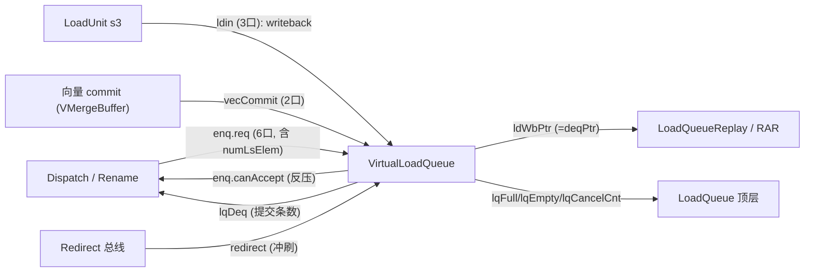
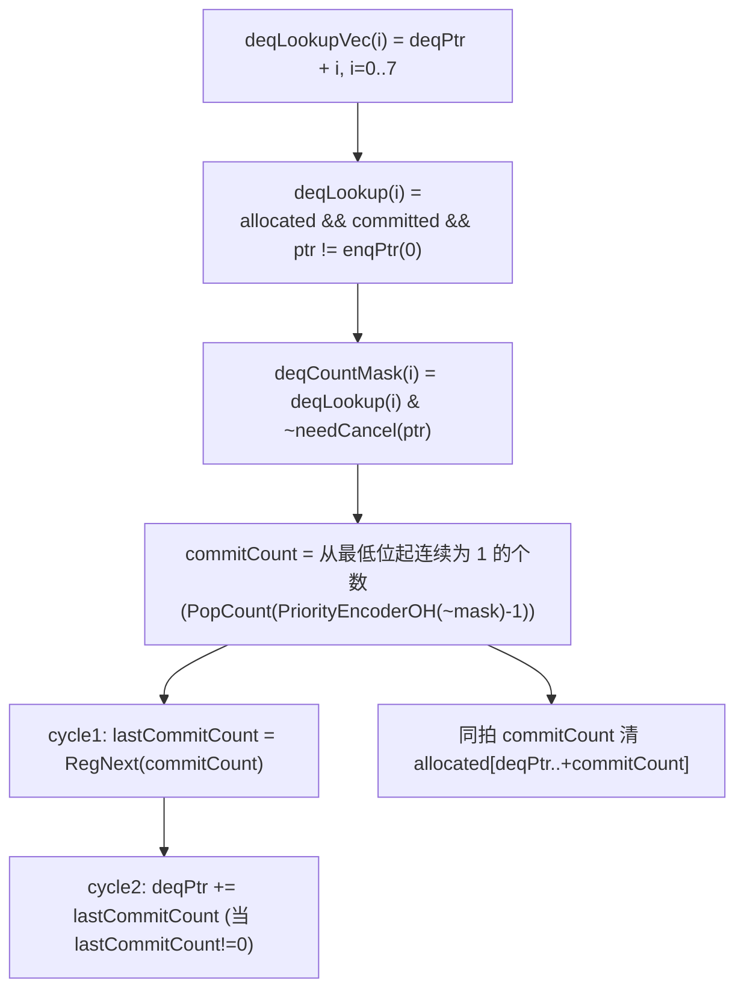

# VirtualLoadQueue —— load 顺序主队列

> 可读重写：`rtl/memblock/VirtualLoadQueue.sv`（核 `xs_VirtualLoadQueue_core`）+
> `rtl/memblock/virtualloadqueue_pkg.sv`（类型/常量/纯函数）。
> 设计意图来源（人写 Chisel，非 firtool golden）：
> `src/main/scala/xiangshan/mem/lsqueue/VirtualLoadQueue.scala`、
> `src/main/scala/utility/CircularQueuePtr.scala`、
> `src/main/scala/xiangshan/backend/rob/RobBundles.scala`（RobPtr.needFlush）。

## 1. 在 LSU 中的定位

VirtualLoadQueue 是 load 的**顺序主队列**。它按程序顺序（robIdx/lqIdx）为**每一条 load
（含向量 load 的每个 flow）**分配一个 entry，并维护该 entry 的极简生命周期状态。它本身
不存地址/数据（这些在 LoadQueueReplay / LoadQueueRAR / LoadQueueRAW / LoadQueueUncache
等子队列里），只回答「这条 load 走到哪一步了、是否可提交」，并以**入队指针 enqPtr /
出队指针 deqPtr**维护严格的程序顺序。

它是 LoadQueue 顶层下的「骨架」：dispatch 据其 canAccept 决定能否派发 load；其
deqPtr（= ldWbPtr）告诉其它子队列哪些 load 已顺序写回完成。



## 2. 本配置参数（golden 由 DefaultConfig 固化）

| 参数 | 值 | 含义 |
|------|----|----|
| `VirtualLoadQueueSize` | **72** | entry 数（**非 2 的幂**！）|
| `LqPtr.value` 位宽 | 7 | `log2Up(72)=7`；指针 = `{flag, value[6:0]}` 共 8 位 |
| `LoadPipelineWidth` | 3 | load 写回端口 `ldin_0..2` |
| `VecLoadPipelineWidth` | 2 | 向量 commit 端口 `vecCommit_0..1` |
| `CommitWidth`（= DeqPtrMoveStride）| 8 | 每拍最多提交 8 条 |
| `io.enq.req.length`（= RenameWidth）| 6 | dispatch 入队请求口 `req_0..5` |
| `io.enq.needAlloc` | 5 | `needAlloc_0..4`（见 §5）|
| `LSQLdEnqWidth` | 6 | allowEnqueue 余量：`validCount <= 72-6 = 66` |
| `robIdx.value` 位宽 | 8 | |
| `uopIdx` 位宽 | 7 | flow 在指令内下标（向量 commit 匹配用）|
| `numLsElem` 位宽 | 5 | `elemIdxBits`，向量 load 展开的 flow 数 |

> ⚠️ **Size=72 非 2 的幂**是本模块最大的坑：环形指针 `+`/`-` 必须按 `entries=72`
> 取模（见纯函数 `lq_ptr_add`/`lq_ptr_sub`），不能像 2 幂队列那样直接丢进位。

## 3. entry 状态位与置位/清除时机（微架构核心）

每条 entry 维护以下状态（`lq_entry_t` + 独立 `allocated[]`）：

| 状态 | 含义 | 置位时机 | 清除时机 |
|------|------|---------|---------|
| `allocated` | entry 已被某条 load 占用（生命周期主标志）| dispatch 入队命中（`entryCanEnq`）| ① commit（deqPtr 扫过且 committed）② redirect 冲刷（needCancel）|
| `committed` | 该 load 已**完成、可提交** | ① 标量 load 写回成功（`ldin`: `!need_rep && updateAddrValid && !isvec`）② 向量 commit 匹配（`vecCommit`）| 入队时清 0（开始新生命周期）|
| `isvec` | 该 entry 是向量 load flow | 入队时由 `isVLoad(fuType)` 决定 | 随入队覆盖 |
| `robIdx/uopIdx` | 年龄 / 向量 commit 匹配键 | 入队写入 | 随入队覆盖 |

**`committed` 的优先级（关键坑）**：Chisel 多个 `when` 块按源码顺序后写覆盖，firtool
展平后等价于一个合并表达式：

```
committed[i]_next = ldwb_set[i] | vec_set[i] | (~entryCanEnq[i] & committed[i])
```

即：**入队会“放弃”旧 committed**（仅当本拍未被入队覆盖才保留旧值），但标量写回置位
（`ldwb_set`）与向量 commit 置位（`vec_set`）OR 在最上层，**优先于入队的清零**。本核
正是用这一条合并 OR 表达式更新 `committed`（见核 §H + 时序块），而非简单的“入队后才
能写回”的串行假设——这点若做错，UT 会在写回与入队同拍命中同一 lqIdx 时失配。

**`allocated` 的优先级**：

```
allocated[i]_next = ~needCancel[i] & ~commit_clear[i] & (entryCanEnq[i] | allocated[i])
```

入队置 1 / 否则保留；commit 清除与 redirect 冲刷（needCancel）都强制清 0。

**标量 load「完成」判据 `ldwb_fire`**：`valid && !(|rep_info.cause) && updateAddrValid
&& !isvec`。`rep_info.cause`（11 位）任一置位表示该 load 需要 replay（cache miss / TLB
miss / 前递失败等），**不算完成**，不置 committed；向量 load 不走此路（由 vecCommit 置位）。

## 4. 双指针推进

### deqPtr（出队 / 提交，两拍流水）



`commitCount` 是**从 deqPtr 起连续可提交（allocated && committed && 未撞 enqPtr && 未被
本拍 redirect 取消）的 entry 个数**。注意 deqPtr 的推进打了两拍（cycle1 算→寄存
`lastCommitCount`，cycle2 用它推进），而 `allocated` 的清除用的是**本拍** `commitCount`
（与 Scala 一致）。`io.lqDeq = RegNext(RegNext(commitCount))`（两级寄存）。

### enqPtr（入队，6 个连续指针 + redirect 回退）

```
正常：     enqPtrExtNextVec(j) = enqPtrExt(j) + enqNumber
redirect 恢复(lastLastCycleRedirect)：enqPtrExtNextVec(j) = enqPtrExt(j) - redirectCancelCount
夹紧：     若 enqPtrExtNextVec(0) 仍在 deqPtrNext 之后 → 采用之；否则收缩到 deqPtrNext + j
```

- `enqNumber` = 本拍所有 valid 请求的 `numLsElem`（flow 数）之和——**向量 load 一次占多个
  entry**，故按 flow 数而非请求数推进。
- `redirectCancelCount` = `RegEnable(lastCycleCancelCount + lastEnqCancel, lastCycleRedirect.valid)`：
  - `lastCycleCancelCount = RegNext(PopCount(needCancel))`：上一拍在队、被冲刷的 entry 数；
  - `lastEnqCancel = RegNext(Σ enqCancelNum)`：上一拍入队请求里被冲刷的 flow 数。
  - 它也是对外输出 `io.lqCancelCnt`，告诉上游本次 redirect 取消了多少 load。
- 「夹紧」保证 enqPtr 不越过 deqPtr（队列不会因 redirect 回退过头而出现负容量）。

## 5. 入队分配（按 lqIdx 命中区间）

dispatch 给每个请求口 `j` 一个 `lqIdx` 与 `numLsElem`，占据 lqIdx 区间
`[lqIdx, lqIdx+numLsElem)`。entry `i` 若落在某个 valid 且未被 redirect 取消的请求区间内，
就被该请求写入（多请求命中时取**最低 j 优先** = `ParallelPriorityMux`）。区间可能跨环
回绕（`low.flag != up.flag`），此时命中条件由 `>=low && <up` 改为 `>=low || <up`。

> `needAlloc` 只有 5 位而 `req` 有 6 口：`needAlloc` 用于算每口的 lqIdx 偏移
> （`validVLoadOffset`），第 6 口（j=5）的偏移恒取 0（`validVLoadOffsetRShift` 右移一位
> 的效果）。本核中 `validVLoadOffset[j] = (j<5 && needAlloc[j]) ? flow : 0`。

`isvec = isVLoad(fuType) = fuType[vldu] | fuType[vsegldu]`。fuType 是 35 位 one-hot
（`OHEnumeration`），其中 vldu 在第 31 位、vsegldu 在第 33 位（golden 仅保留
`fuType[33:31]` 三位供本模块）。

## 6. 环形指针纯函数（非 2 幂的关键）

| 函数 | 语义 |
|------|------|
| `lq_ptr_add(p,v)` | `value+v`，若 `>= 72` 则减 72 并翻 flag（单步增量远小于 72，只需判一次回绕）|
| `lq_ptr_sub(p,v)` | `CircularQueuePtr.-` 的等价：`value>=v` 则 `value-v` flag 不变；否则 `value+72-v` 翻 flag |
| `lq_ptr_after(a,b)` | `a>b`：`(a.flag^b.flag) ^ (a.value>b.value)`（a 更年轻）|
| `lq_distance(enq,deq)` | flag 同：`enq.v-deq.v`；flag 异：`72+enq.v-deq.v` |
| `rob_need_flush(...)` | `RobPtr.needFlush`：`valid && (level&&this==robIdx \|\| isAfter(this,robIdx))` |

> **易错点**：`-72` 在非 2 幂队列里不能用截位实现；`lq_ptr_sub` 必须显式处理借位
> 与 flag 翻转，否则 redirect 回退后 enqPtr 错位、整个队列错乱。

## 7. 接口（golden 扁平端口）

| 方向 | 端口 | 说明 |
|------|------|------|
| in | `io_redirect_*` | 全局冲刷 redirect（robIdx + level）|
| in | `io_vecCommit_{0,1}_*` | 向量 commit（robidx + uopidx）|
| out/in | `io_enq_canAccept` / `io_enq_sqCanAccept` / `io_enq_needAlloc_{0..4}` | dispatch 握手 |
| in | `io_enq_req_{0..5}_*` | dispatch 入队请求（fuType/uopIdx/robIdx/lqIdx/numLsElem）|
| in | `io_ldin_{0,1,2}_*` | load 写回（lqIdx/isvec/updateAddrValid/rep_info_cause[10:0]）|
| out | `io_ldWbPtr_{flag,value}` | = deqPtr，告诉子队列顺序写回进度 |
| out | `io_lqEmpty` | `RegNext(validCount==0)` |
| out | `io_lqDeq` | 本拍提交条数（两级寄存）|
| out | `io_lqCancelCnt` | redirect 取消的 load 数 |
| in | `io_noUopsIssued` | topdown perf 输入 |
| out | `io_perf_0_value` | `mem_stall_anyload`（两拍寄存观测）|

> golden 已裁剪的端口：`io_enq_resp`（lqIdx 回送，仅内部 XSError 用 → 被优化掉）、
> `io_lqFull`（= `!allowEnqueue`，无对外端口）、debug_mmio/debug_paddr（无对外端口，
> 内部保留死寄存器）。本核同样不输出这些，仅保留 debug 影子寄存器以对齐结构。

> **rep_info_cause 聚合**：golden 把 `rep_info_cause` 展平成 11 根独立线
> `_cause_0.._10`；可读核把它聚合成一个 `[10:0]` 端口（`need_rep = |cause`）。
> wrapper（`gen_virtualloadqueue.py` 生成）负责把 11 根线 `{cause_10,...,cause_0}` 打包
> 后传给核。

## 8. 验证结果

### 结构闸门（实测）

| 项 | 实测 | 达标 |
|----|------|------|
| `typedef struct packed`（pkg）| 2（`lq_ptr_t` / `lq_entry_t`）| ✅ |
| `typedef enum` | 0 | 本模块状态是 allocated/committed/isvec 三个**独立布尔标志**，非互斥 FSM，**不适用**（与 LoadQueueRAW 先例一致）|
| `function automatic`（core+pkg）| 5（全在 pkg：指针 +/-、after、distance、needFlush）| ✅ |
| `for`（core+pkg）| 27（多口/多 entry generate）| ✅ |
| 生成痕迹 `io_*_N_M`/`_REG_N`/`_GEN_`/`_T_N`/`RANDOMIZE`（核+pkg）| 0 | ✅ |
| 行数 | 核 565 + 包 150 = 715 vs golden 13727（≈5.2%）| ✅ |

### UT（golden `VirtualLoadQueue` vs 手写 `VirtualLoadQueue_xs` 双例化逐拍比对全部 7 路输出）

tb 维护 enqPtr 模型按入队协议给出合法连续 lqIdx（满足 golden 内 `XSError(index!=lqIdx)`），
随机驱动 enq(6口)/ldin(3口)/vecCommit(2口)/redirect。

| seed | checks | errors |
|------|--------|--------|
| 1 | 200000 | 0 |
| 7 | 200000 | 0 |
| 42 | 200000 | 0 |

覆盖确认（seed1 探针）：`canAccept` 两态均出现（13259 满 / 186741 收）、`lqDeq` 非零事件
934 次（deqPtr 推进）、`ldWbPtr` 越过 40（指针绕行）、`lqEmpty` 出现 12939 次、`lqCancelCnt`
非零 199471 次、`perf` 活跃。所有 7 路输出非平凡激励。
`!$isunknown(golden)` 跳 don't-care；`+define+SYNTHESIS` 关 golden 行为断言/随机化。

### FM —— FAILED/INCONCLUSIVE（已用内部探针证伪，非真失配）

FM 链接成功（纯叶子无子模块），`match` 后 **601 matched / 0 unmatched**，但有
**20 failing compare points**：全部是 `allocated_43_reg .. allocated_62_reg`（连续 20 条
entry 的 allocated 寄存器，已被 auto-matcher 正确配上 `u_core/allocated_reg[43..62]`）。

原因分析：golden 把「commit 清 allocated」展平成每条 entry 的
`~(deqPtr+stride 命中 | _GEN) & ...` 长式，而可读核用「按 entry 索引正向比较
`deqLookupVec[k].value == i`」选择（为规避非 2 幂下变量下标越界 `FMR_ELAB-147` 被
形式工具升级为 link 错误而采用）。两者**结构不同构**，且 Size=72 的模运算
（`lq_ptr_add` 的条件减法）令 FM 签名分析在 deqPtr 落入特定环形带（对应 entry 43..62）
时无法对齐输入锥 → 判这 20 点 fail。

**已用 tb 内部层次探针证伪**（满足「不可只凭推断」要求）：逐拍比对全部 72 条
`u_g.allocated_<i>` vs `u_i.u_core.allocated[i]`（即 20 个 failing 点的超集）：

| seed | cycles | allocated[] mismatches |
|------|--------|------------------------|
| 1 | 200000 | 0 |
| 7 | 200000 | 0 |
| 42 | 200000 | 0 |

3 种子共 600k 拍 0 失配，证明这 20 个 failing 点是 **FM 配对/签名分析假阳性**（非 2 幂模
运算导致输入锥无法对齐），非真功能差异。叠加双例化 UT 全部 7 路输出 3 种子各 200k 拍
0 error，功能等价性由 UT + 内部探针充分保证。按 REWRITE_STYLE「UT 充分 + FM 不可判并
注明」结案；**不为迎合 FM 而退回照抄 golden 命名/结构**。
