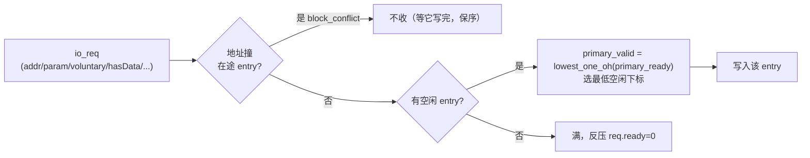
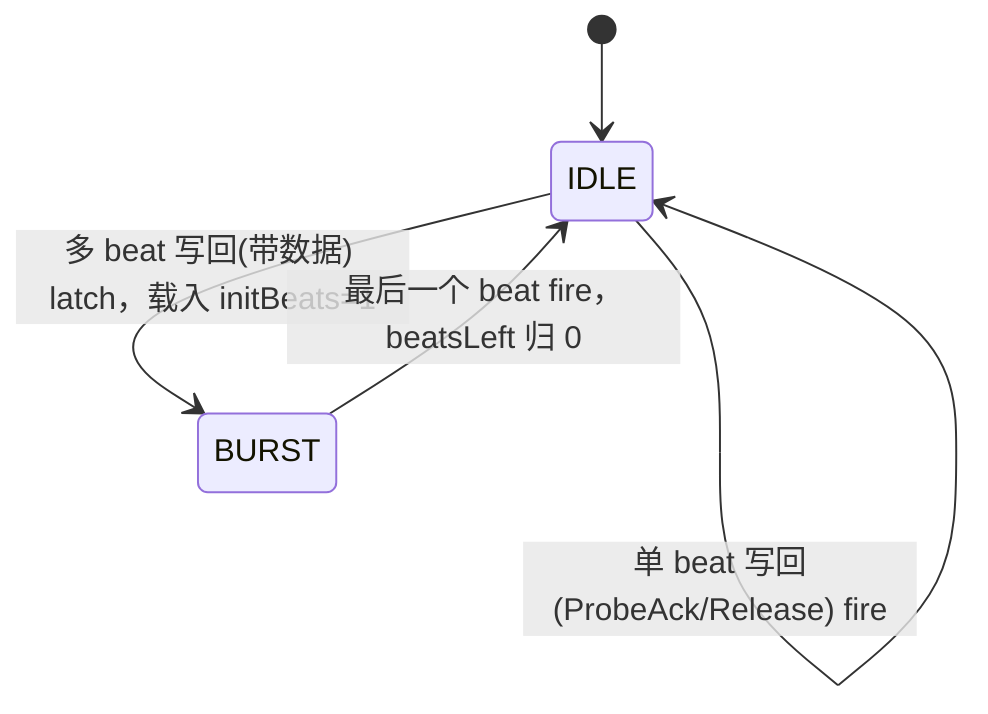

# WritebackQueue —— DCache 脏行写回队列（学习文档）

> 可读重写：`rtl/memblock/WritebackQueue.sv`（核 `xs_WritebackQueue_core`）+ `rtl/memblock/writebackqueue_pkg.sv`
> 设计意图来源（人写 Chisel）：`src/main/scala/xiangshan/cache/dcache/mainpipe/WritebackQueue.scala`
> golden（firtool 生成，仅作 UT/FM 对照）：`golden/chisel-rtl/WritebackQueue.sv`（1757 行，42 端口）
> 顶层 wrapper：`rtl/memblock/WritebackQueue_wrapper.sv`（核 + 黑盒 `WritebackEntry`/`WritebackEntry_15`）

---

## 1. 架构定位

WritebackQueue 坐落在 **DCache 与 L2 之间**，经 TileLink **C 通道**把 cacheline 写回/降级到 L2。
DCache 主流水（MainPipe）在两种情况下需要写回：

- **自愿写回（voluntary Release）**：DCache 容量逐出一条脏行，主动 `Release`/`ReleaseData` 给 L2，
  并要等 L2 回 **ReleaseAck（D 通道 / mem_grant）** 才算结束。
- **被动 probe 应答（ProbeAck）**：L2 来 probe 命中本地行，DCache 降级后回 `ProbeAck`/`ProbeAckData`，
  **不需要**等 ack。

```
            ┌──────────────── DCache ────────────────┐
 MainPipe ──req(整行data)──▶│  WritebackQueue（18 个 entry）       │──mem_release──▶ L2 (TL C)
                            │   每 entry：3 态写回状态机(黑盒)      │◀─mem_grant────  L2 (TL D, ReleaseAck)
 MissQueue ─conflict(5路)──▶│   分配 + block 冲突 + robin 仲裁      │
                            └──block_miss_req(5路)─────────────────┘
```

- 上游：`io_req`（写回请求，Decoupled）+ `io_req_bits_data`（整行 512b 数据）。
- 下游：`io_mem_release`（TL C，**多 beat** 突发，每 beat 256b）/ `io_mem_grant`（TL D，按 source 路由回 entry）。
- 旁路：`io_miss_req_conflict_check[5]` → `io_block_miss_req[5]`（3×LoadPipe + 1×MainPipe + 1×missReqArb）。

本配置（KunmingHu V2R2）固化参数：`nReleaseEntries=18`、`nMissEntries=16`、`releaseIdBase=17`、
`PAddrBits=48`、`CacheLineSize=512`、每 beat 256b → `refillCycles=2`、`source` 6 位。

> **黑盒边界**：每个 entry 的写回状态机（`s_invalid → s_release_req → s_release_resp`）封装在子模块
> `WritebackEntry`（下标 0–14，5 位 id）与 `WritebackEntry_15`（下标 15–17，6 位 id）里。按任务约定，
> golden 例化的子模块作 **golden 黑盒**（UT 双例化两侧、FM ref/impl 两侧共用同一份 golden 黑盒）。
> 本核重写的是 **队列级** 逻辑：分配、冲突探测、TileLink robin 仲裁、perf。

---

## 2. 数据结构 / 纯函数（核内 struct / enum / function）

### 2.1 `tl_c_t`（struct）—— TL C 通道写回 payload
`{valid, opcode, param, size, source, address, data, corrupt}`。是 robin 仲裁 Mux1H 选出的 sink 字段聚合。

### 2.2 `wb_req_ctrl_t`（struct）—— 写回请求控制字段
`{param, voluntary, hasData, corrupt, dirty, addr}`（对应 Scala `WritebackReqCtrl`，data 单独延迟一拍）。

### 2.3 `tl_c_opcode_e`（enum）—— C 通道写回 opcode
entry 黑盒输出 `opcode = {1'b1, voluntary, hasData}`，故只有 4 种：

| opcode | 值 | 含义 |
|---|---|---|
| `TLC_PROBE_ACK`      | 4 (100) | 被动 probe 应答，无数据 |
| `TLC_PROBE_ACK_DATA` | 5 (101) | 被动 probe 应答，带脏数据 |
| `TLC_RELEASE`        | 6 (110) | 主动写回，无数据 |
| `TLC_RELEASE_DATA`   | 7 (111) | 主动写回，带脏数据 |

- `opcode[1] = voluntary`：是否需等 ReleaseAck。
- `opcode[0] = hasData = numBeats-1`：决定 robin 锁定 1 个还是 2 个 beat。

### 2.4 纯函数
- `lowest_one_oh(v)`：最低位优先 one-hot（分配新 entry 给最低空闲下标）。
- `right_or_cap(x)` / `left_or(x)`：rocket util 的 `rightOR(_,2N,N)` / `leftOR`，robin 仲裁专用。
- `robin_readys(valid, mask)`：TileLink `roundRobin` 策略核心（见 §4）。

---

## 3. 数据流：三个处理面

### 3.1 分配 alloc + block 冲突



- `block_conflict = OR_i (entry_block_valid[i] & entry_block_addr[i]==req.addr)`：同 block 已有在途
  写回 → 这拍不分配，**保证同 block 写回顺序**（避免 L2 看到乱序的两条同块写回）。
- `alloc = |primary_ready`；`io_req_ready = alloc & !block_conflict`。
- 分配 one-hot：`primary_valid = lowest_one_oh(primary_ready)`——唯一选最低下标的空闲 entry。
- 数据延迟一拍：`req_data_data = RegEnable(req.data, req.valid)`（减少扇出，data 比控制晚一拍进 entry）。

### 3.2 miss 请求冲突探测（5 路）

MissQueue 侧 5 路 miss 请求地址若 **正被某 entry 写回**，则置 `block_miss_req[m]` 阻塞该 miss，
避免它从 L2 读到「尚未写回完成」的旧行。每路对 18 个 entry 做地址 CAM，`for`/`genvar` 二重归约。

### 3.3 输出仲裁（TLArbiter.robin）→ §4。

---

## 4. TileLink robin（轮转优先 + 多 beat 锁定）仲裁

18 个 entry 的 `mem_release` 要汇聚到 **单一** C 通道。用 Rocket `TLArbiter.robin`（轮转优先），
并在「一次写回的多 beat 突发」期间 **锁定** 授权给同一个 entry。三个时序状态：

| 状态寄存器 | 含义 |
|---|---|
| `arb_mask`     | 轮转屏蔽（上次赢家及其低位），保证下一次跳过它、公平轮转 |
| `arb_state`    | 突发期间锁定的赢家（one-hot），多 beat 期间 sink 一直选它 |
| `arb_beatsleft`| 剩余 beat 数（本配置 1 位：`numBeats1 = refillCycles-1 = 1`） |



- `arb_idle = !arb_beatsleft`；`arb_latch = arb_idle & mem_release_ready`（idle 且 sink 可收 → 夺取）。
- `arb_readys = robin_readys(rel_valid, arb_mask)`；`arb_winner = arb_readys & rel_valid`。
- `arb_muxstate = idle ? winner : state`；`arb_allowed = idle ? readys : state`（突发期间只放行锁定端）。
- `sink.valid = idle ? (|rel_valid) : Mux1H(state, rel_valid)`；`sink.bits = Mux1H(muxstate, payloads)`。
- 更新：`beatsLeft = latch ? initBeats : beatsLeft - sink.fire`；`state = idle ? winner : state`；
  `mask = (latch & |valid) ? leftOR(winner) : mask`。

**`robin_readys` 算法**（完全照搬 `Arbiter.scala:20` 的 `roundRobin` policy，N=18）：

```
filter  = {valid & ~mask, valid}                         // 2N 位
unready = (rightOR(filter, 2N, N) >> 1) | (mask << N)     // 2N 位
readys  = ~((unready >> N) & unready[N-1:0])              // N 位
```

其中 `rightOR(x, 2N, N)` 是 **部分** 向下 OR（移位步长上限 N，实现环绕屏蔽）。可读核把它收成
`right_or_cap` / `left_or` 两个 `while/for` 纯函数 + 一行 `robin_readys`，对应 golden 里
展开成的 `_GEN`/`_GEN_0..3`/`_readys_mask_T_*` 几十条扁平表达式。

---

## 5. 接口表（关键端口）

| 端口 | 方向 | 含义 |
|---|---|---|
| `io_req_*` | in | 写回请求（param/voluntary/hasData/corrupt/dirty/addr/data(512)），`ready` 反压 |
| `io_mem_release_*` | out | TL C 写回（opcode/param/size/source/address/data(256)/corrupt），多 beat，`ready` 握手 |
| `io_mem_grant_{valid,bits_source}` | in | TL D ReleaseAck，按 source==entry_id 路由回对应 entry |
| `io_miss_req_conflict_check_{0..4}_*` | in | 5 路 miss 请求地址探测 |
| `io_block_miss_req_{0..4}` | out | 对应 miss 请求是否撞在途写回（阻塞它）|
| `io_perf_{0..4}_value` | out | 5 路 perf 事件计数（各延迟 2 拍）|

> 注：本配置 golden 已裁剪 `io_req_ready_dup` / `io_primary_ready_dup`（`nDupWbReady` 扇出复制口），
> 故顶层只有单一 `io_req_ready`。

---

## 6. 验证结果

### 6.1 UT（golden vs 可读核双例化，逐拍逐输出比对）

`verif/ut/WritebackQueue/`（`make run SEED=<n>`）。`u_g`(golden `WritebackQueue`) vs
`u_i`(`WritebackQueue_xs`→`xs_WritebackQueue_core`)，两侧共用 golden 的 `WritebackEntry`/`WritebackEntry_15`。

| seed | 1 | 7 | 42 |
|---|---|---|---|
| 结果 | PASS（checks=200000 errors=0）| PASS | PASS |

测试台要点：
- `req.addr` / 5 路 `miss_req` 地址压窄高位（仅低 8 个 block），反复命中同 block 以覆盖 block_conflict /
  miss 冲突。
- `mem_grant` 响应模型：跟踪 golden 侧发出的 **voluntary**（opcode[1]=1）release 的 source 为「待 ack」，
  随机择一回 `mem_grant`（按 source 匹配 entry id 17..34）；ProbeAck 路径不回 ack。否则乱回 source 会让
  自愿 Release 永远等不到 ack、两侧 entry 状态分叉。
- `mem_release.ready` 随机背压，触发多 beat 突发的 robin 锁定路径。
- payload 类输出（`mem_release_bits_*`）仅在 `g_io_mem_release_valid` 时比对。

### 6.2 FM（Formality 签名等价）

`make fm` → **`FM_RESULT: Verification SUCCEEDED`**。entry / arbiter 子模块两侧均例化同名 golden 黑盒，
FM 按名配对为黑盒，队列级组合/时序逻辑（分配、冲突、robin 仲裁状态、perf）经签名分析全部等价，
**0 unmatched / 0 failing**。`FM_MERGE_DUP=false`（关「合并同值重复寄存器」pass，避免 18 份同构 entry
实例 / 仲裁状态寄存器跨 wrapper 边界被误折叠）。

---

## 7. 结构门槛自检（可读核 `xs_WritebackQueue_core` + pkg）

- `typedef struct packed`：`tl_c_t` / `wb_req_ctrl_t`（>0 ✓）
- `typedef enum`：`tl_c_opcode_e`（4 种写回 opcode，>0 ✓）
- `function automatic`：`lowest_one_oh / right_or_cap / left_or / robin_readys / opcode_is_voluntary`（>0 ✓）
- `genvar/for`：block 冲突、miss 冲突 2 路归约、entry 阵列例化、perf 计数均用 generate/for（>0 ✓）
- 展平名/生成痕迹 `grep -E "io_[a-z_]+_[0-9]+_[0-9]+|_REG_[0-9]|_GEN_|_T_[0-9]|RANDOMIZE"` = 0 ✓
- 行数：核 340 + pkg 145 ≈ 485（vs golden 1757，压缩约 3.6×；entry 状态机在黑盒内）✓
