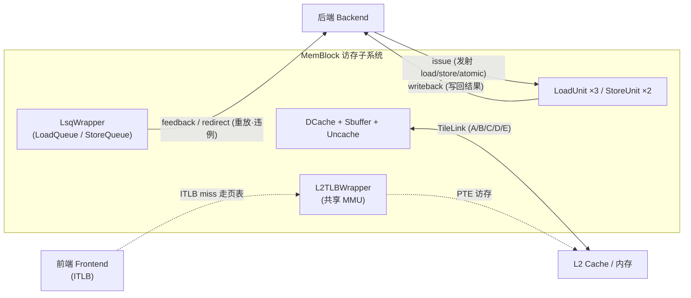

# 访存需求与设计目标

> 本文是香山 V2R2（昆明湖）访存子系统 MemBlock 的**背景/原理篇**：先讲清「访存要解决什么问题、面临哪些挑战、于是定了哪些设计目标与关键决策」，让读者在读[逐模块设计文档](0-MEMBLOCK_OVERVIEW.md)前先建立整体认知。这里**只讲动机与原理、点到结构为止**，不重复各模块的端口/实现细节。

---

## 1. 访存在整核里的角色

处理器执行的指令里，一大类是**访存指令**：load（读内存）、store（写内存）、atomic（原子读改写）。它们不像加减那样在寄存器堆里一拍算完，而是要跨越「虚拟地址 → 物理地址 → 缓存 → 内存」这条又长又不确定的路径。访存子系统 MemBlock 就是承包这条路径的部件，它在整核里扮演四个角色：

1. **执行 load/store**：接收后端发射的访存 uop，算地址、翻译、访缓存、取/写数据、写回。执行心脏是 `LoadUnit`（3 条流水）和 `StoreUnit`（2 条流水）。
2. **维护内存序**：乱序核里访存指令乱序执行，但架构语义要求内存访问表现得「像按程序顺序发生」。MemBlock 用 `LoadQueue` / `StoreQueue`（合于 [`LsqWrapper`](../LsqWrapper.md)）跟踪每条在飞访存，检测内存序违例并纠正。
3. **连接后端与 L2/内存**：向上通过 issue（发射）/ writeback（写回）/ feedback（反馈）与后端握手；向下通过 L1 DCache、Sbuffer、Uncache 经 **TileLink** 总线接 L2 缓存与内存。
4. **与前端共享 PTW**：数据侧 DTLB 与前端指令侧 ITLB miss 时，都回到同一个共享 MMU（[`L2TLBWrapper`](../L2TLBWrapper.md)：page cache + PTW）走页表。MemBlock 里例化的这套 MMU 同时服务取指与访存。

一句话：**访存子系统是「地址翻译 + 数据搬运 + 内存序维护」三合一的引擎**，是核内延迟最不确定、最影响性能的部分。

---

## 2. 挑战：为什么访存难

访存慢且不确定，难点集中在五处：

- **地址翻译延迟**：每次访存都要先把虚拟地址翻成物理地址。TLB 命中只需一两拍，但 TLB miss 要走多级页表（Sv39/Sv48），一次 walk 可能多次访存，延迟高达几十上百拍。
- **缓存 miss 延迟隐藏**：L1 DCache 命中约 2~4 拍，miss 则要向 L2/内存取整条 cacheline，延迟骤增。若一次 miss 就阻塞后续所有访存，性能崩溃——必须做到「miss 不停机」。
- **内存序违例**：乱序执行下，一条 load 可能比程序顺序在它之前的 store **提前**执行。若该 store 恰好写了 load 要读的地址（store→load 依赖），load 读到旧值即违例，必须检测并重做。
- **非对齐访问**：一次访存跨两条 cacheline 的非对齐 load/store 无法一拍完成，要拆分成两次、再拼合。
- **MMIO / uncache**：设备寄存器等 uncache 区不能进缓存、不能乱序、不能合并、不能预取，必须严格按序、逐条走专用通道。

这些挑战共同决定了：访存不能是一条「一发到底」的直路，而必须是**乱序发射 + 缓冲 + 检测 + 重放**的复杂机器。

---

## 3. 设计目标

针对上述挑战，昆明湖访存子系统定了两条顶层目标：

1. **load/store 多发射带宽**：一拍要能同时处理多条访存。本配置固化为 **3 条 load 流水**（`LoadPipelineWidth=3`）+ **2 条 store 地址流水**（sta），Sbuffer 写口 `EnsbufferWidth=2`，dispatch 一拍最多送 **6 条**访存 uop 入队。峰值带宽足够喂饱乱序后端。
2. **乱序访存、按序内存语义**：允许访存指令乱序执行以隐藏延迟，但对外表现出与「严格按程序顺序执行」一致的内存行为。这靠队列跟踪 + 违例检测 + 重放来兜底。

> 关键定量参数（本配置 KunmingHu V2R2，写具体数值以 RTL 与模块文档为准）：`VLEN=128`、`PAddrBits=48`、`VAddrBits=50`、`CacheLineSize=512`（64B/行）。

---

## 4. 五个关键决策

围绕目标，访存子系统做了五个结构性决策，它们决定了整个子系统的模块划分。

### ① LSU 流水 + LoadQueue/StoreQueue 乱序缓冲

访存执行拆成**流水单元**与**顺序缓冲**两层。[`LoadUnit`](../LoadUnit.md)/[`StoreUnit`](../StoreUnit.md) 负责「算地址、翻译、访缓存、forward、写回」的多级流水执行；[`LsqWrapper`](../LsqWrapper.md) 里的队列负责「记录每条在飞访存的顺序与状态」。

- **VirtualLoadQueue** 是 load 的顺序主队列，按程序顺序为每条 load 分配 entry（本配置 `VirtualLoadQueueSize=72`，注意**非 2 的幂**），只回答「这条 load 走到哪、能否提交」。
- **StoreQueue**（56 条）持有在飞 store 的地址 + 数据，提交前留在队列里，可向后续 load 做 forward。

这样执行单元可以乱序快速流过，而顺序信息集中由队列维护——**执行与保序解耦**。

### ② DCache 组相联 + MSHR 非阻塞

L1 数据缓存 [`DCache`](../DCache.md) 采用 **256 组 × 4 路组相联**、64B cacheline、Tree-PLRU 替换（`setplru`）。命中路径由 3 条 LoadPipe、2 条 StorePipe、1 条 MainPipe 组成（合计 6 条命中流水）。

隐藏 miss 延迟靠 **[`MissQueue`](../MissQueue.md)（MSHR file，非阻塞缓存，Kroft 1981）**：持有 **16 条 MSHR**（`nMissEntries=16`），每条对应一条在途 cacheline 缺失。一条 load miss 后登记进 MSHR 便让出流水，后续命中的访存继续走——**miss 不停机**。在途 refill 数据还能被 3 路 load 直接 forward。一致性由 MainPipe（MESI）配合 [`ProbeQueue`](../ProbeQueue.md)/[`WritebackQueue`](../WritebackQueue.md) 维护。

### ③ TLB + 两级 PTW / L2TLB

地址翻译走两级。第一级是数据侧 **DTLB**（[`TLBNonBlock`](../TLBNonBlock.md) ×3，load/store/prefetch 各一，存储在 [`TlbStorageWrapper`](../TlbStorageWrapper.md) / [`TLBFA`](../TLBFA.md)），命中一两拍出物理地址。miss 时不阻塞后续翻译，而是把请求甩给第二级——共享 **L2TLB/MMU**（[`L2TLBWrapper`](../L2TLBWrapper.md)）：先查 page cache（[`PtwCache`](../PtwCache.md)，L0/L1/L2/SP 多级页表缓存），仍 miss 才交给遍历器 [`PTW`](../PTW.md)（串行走高层页表项）、[`LLPTW`](../LLPTW.md)（末级并发遍历，多请求共享一个访存口）、[`HPTW`](../HPTW.md)（H 扩展 G-stage）向 L2 读 PTE。翻译结果回填 DTLB。物理地址还要过 [`PMP`](../PMP.md)/[`PMPChecker`](../PMPChecker.md) 做权限/PMA 检查。**前端 ITLB 也回这里走页表**，故 MMU 是取指与访存共享的。

### ④ Sbuffer 合并写

已提交的 store **不逐条写 DCache**，而是先攒进 [`Sbuffer`](../Sbuffer.md)（`StoreBufferSize=16` 条 cacheline entry）：落在**同一条 cacheline** 的多个 store 合并（merge）到同一 entry，等攒够 / 超时（`EvictCycles=1<<20`）/ 被 flush 时，再把整条 cacheline 一次写下去。

这样把「许多小写」变成「少数整行写」，既减少 DCache 写口压力，又给 load 提供了 store→load forward 的数据源（load 可从 StoreQueue / Sbuffer / 在途 MSHR 三处 forward 未落 cache 的写数据）。

### ⑤ 违例检测 + replay 保序

乱序执行难免出错，靠**检测 + 重放**兜底，而不是禁止乱序：

- **违例检测**：[`LoadQueueRAW`](../LoadQueueRAW.md) 检测 store→load 违例（nuke，老 store 写了已提前执行的 load 的地址），[`LoadQueueRAR`](../LoadQueueRAR.md) 检测 load→load 顺序违例。命中违例则触发流水线重定向（redirect），把出错点之后的指令冲刷重做。
- **重放（replay）**：load 常常没法一次走完——TLB miss、DCache miss、要 forward 的 store 数据还没到、bank 冲突、违例队列满等。此时 LoadUnit 把这条 load 踢进 [`LoadQueueReplay`](../LoadQueueReplay.md)（带优先级 + 年龄仲裁的重放调度器），等 block 条件解除再选回 LoadUnit 重发。

非对齐由 [`LoadMisalignBuffer`](../LoadMisalignBuffer.md)/[`StoreMisalignBuffer`](../StoreMisalignBuffer.md) 拆分拼合；MMIO/uncache 走 [`Uncache`](../Uncache.md) + [`LoadQueueUncache`](../LoadQueueUncache.md) 严格按序处理。

---

## 5. 子系统边界

访存子系统与外部三条边界：

- **与后端**：`issue` 发射访存 uop 进 Load/StoreUnit；执行结果经 `writeback` 写回；重放需求、违例重定向、队列满等经 `feedback` / `redirect` 通知后端。
- **与 L2**：DCache（MissQueue 取行 / WritebackQueue 写回 / ProbeQueue 一致性）、Uncache、MMU 的 PTE 读，都经 **TileLink**（A/B/C/D/E 五通道）连 L2 与内存。
- **与前端**：数据侧 DTLB 与前端 ITLB **共享同一 L2TLB/MMU**——miss 时都回到这里走页表。

---

## 6. 后续阅读

- 想看整体模块清单与互联大图：[MEMBLOCK 总览](0-MEMBLOCK_OVERVIEW.md)。
- 想深入各原理主题（load/store 流水时序、DCache 一致性、MMU 页表遍历、内存序与重放机制），见本 `arch/` 目录下后续原理篇。
- 想看某模块的端口/实现细节：从上文各链接进入对应逐模块文档（`docs/memblock/*.md`）。
- RTL 实现：[`rtl/memblock/`](../../../rtl/memblock/) 下各 `*.sv` 与 `*_pkg.sv`。
