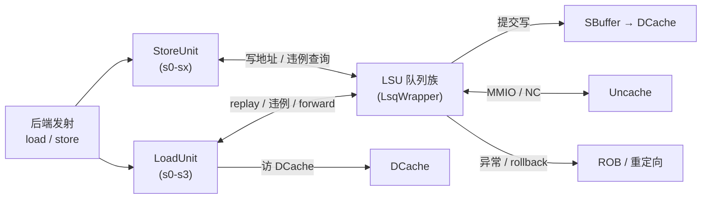
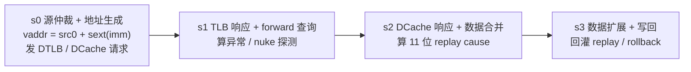
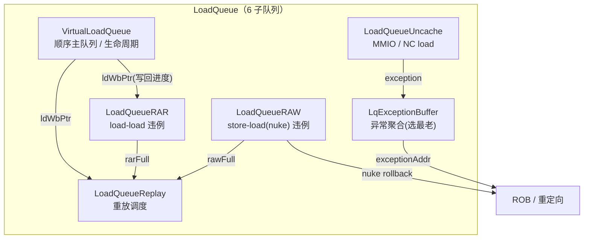
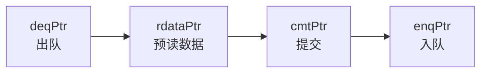
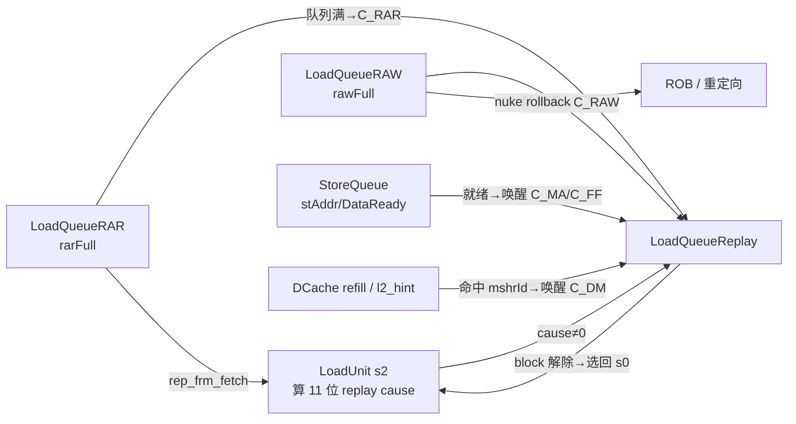
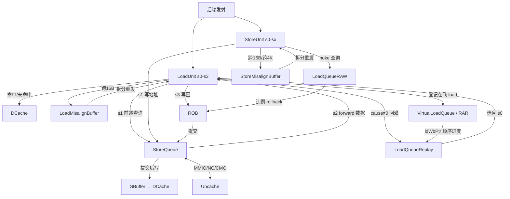

# load/store 流水与队列原理

> 本文是访存(memblock)子系统的**背景/原理文档**：讲清 load/store 执行流水与 LSU 队列
> 族「为什么这么设计、各管什么、如何协同」，帮你在读逐模块设计文档前先建立整体认知。
> 逐模块的端口/实现细节请看对应文档，本文只在需要时点到结构、不重复。
> 上层脉络见访存总览 [`0-MEMBLOCK_OVERVIEW.md`](0-MEMBLOCK_OVERVIEW.md)。

## 1. 为什么访存要「执行流水 + 一堆队列」

香山是**乱序超标量**核：load/store 被乱序发射、并行执行，但体系结构语义要求它们
**看起来像按程序顺序**完成，并满足 RISC-V 内存模型(RVWMO)对多核可见性的约束。访存
比普通 ALU 运算难得多，因为它有三重不确定性：

1. **地址要到执行时才算出来**——发射时只知道基址寄存器和立即数，真实物理地址要经过
   「加法 → DTLB 翻译」才得到。于是「谁和谁地址冲突」在发射阶段无法判断。
2. **访问可能失败并需要重来**——DTLB miss、DCache miss、要前递的 store 数据还没到、
   bank 冲突……一条 load 常常一次走不完。
3. **乱序会破坏内存序**——较新的 load 可能先于较老的、地址刚算出来的 store 执行，读到
   本应被覆盖的旧数据；同地址两条 load 之间别的核改了 cacheline，也会让乱序结果非法。

针对这三点，访存把职责拆成两类硬件：

- **执行流水**（[LoadUnit](../LoadUnit.md) / [StoreUnit](../StoreUnit.md)）：把「算地址 →
  翻译 → 访 cache → 前递/合并 → 写回」串成几级流水，追求吞吐。
- **队列族**（[LsqWrapper](../LsqWrapper.md) 下的 LoadQueue / StoreQueue 及其子队列）：
  维护在飞 load/store 的**顺序视图与状态**，负责违例检测、重放调度、数据前递、异常聚合、
  非缓存事务——追求正确性与顺序性。

执行流水是「快通道」，队列族是「安全网 + 调度器」。二者反复交互：流水把走不完的 load
踢给 replay 队列稍后重发、把违例上报给 rollback、从 store 队列拿前递数据；队列则依 ROB
提交推进指针、把顺序进度反馈给流水。下面分别展开。

## 2. LoadUnit：4 级 load 执行流水（s0~s3）

一条 load 在 [LoadUnit](../LoadUnit.md) 里走 **4 级流水 s0~s3**，把「选源 → 生成虚地址 →
翻译+访 cache → 前递合并 → 扩展写回 → 回灌重放」串起来：

- **s0（源仲裁 + 地址生成）**：load 的输入不止「后端发射」一路，还有 misalign 重发、
  cache-miss 超级重放、快速重放、MMIO/NC 回灌、普通 LSQ 重放、硬件预取等多达十余路，按
  **固定优先级独热仲裁**选一路，算出虚地址 `vaddr = src0 + sext(imm)` 与字节 mask，同拍
  向 DTLB 和 DCache 发请求。为什么这么多源？因为「走不完的 load 要能重新回到 s0 再走一遍」，
  这些重放/回灌通道就是队列族把 load 送回流水的入口。
- **s1（TLB 响应 + forward + nuke 探测）**：拿到物理地址与页属性/异常；向
  [StoreQueue](../StoreQueue.md)、SBuffer、MSHR、tlD 通道发**前递查询**（问「我要读的字节
  是不是有更老的 store 还没落 cache」）；同时做 store→load 的 **nuke 探测**（问「有没有更老
  的 store 改了我读的地址」）。
- **s2（DCache 响应 + 数据合并）**：合并 DCache 返回数据与各路前递数据（逐字节按优先级
  叠加），并算出 **11 位 replay cause** 向量——每一位代表一种「这次没走成、要重放」的原因
  （TLB miss、DCache miss、forward 未就绪、bank 冲突、RAR/RAW 队列满、nuke……）。
- **s3（数据扩展 + 写回）**：按访问偏移选出 64 位、做符号/零扩展（浮点还要 NaN-box），
  写回标量 `ldout` 或向量 `vecldout`；若 s2 算出的 cause 非零，则把这条 load **回灌到
  [LoadQueueReplay](../LoadQueueReplay.md)** 等待重发，并按需发 rollback/feedback。

关键认知：**LoadUnit 自己不「等」**。它是纯流水，一次走不完就把 load 连同 replay cause
交给队列族，腾出流水给别的 load；等 block 条件解除，replay 队列再把它选回 s0。

## 3. StoreUnit：store **地址**流水（s0~sx）

[StoreUnit](../StoreUnit.md) 与 LoadUnit 对称，但有一条根本区别：**它只搬地址，不搬数据**。
store 的数据经 StoreQueue 的数据通路单独写入，StoreUnit 只负责把一条 store 推进到
「地址翻译完成、异常确定、写回」。它走 s0(仲裁+地址生成) → s1(TLB 回填 + 写 StoreQueue 地址
+ st→ld 违例查询) → s2(PMP/PMA + 异常合并 + uncache 判定) → s3 → **sx 写回延迟链**。

为什么 store 要拆成「地址流水 + 数据通路 + 提交后写」三段？因为 store 必须**等 ROB 提交
才能真正改内存**（提交前分支可能误预测、可能有更老异常）。所以 store 的生命周期天然是：
StoreUnit 尽早算地址（让 load 能尽早做违例检查、尽早前递），数据随后到位，二者都齐且
ROB 提交后，才由 StoreQueue 经 SBuffer 合并写进 DCache。StoreUnit 的输出主要是喂给
StoreQueue 的地址/异常信息，以及向 [LoadQueueRAW](../LoadQueueRAW.md) 发的
`stld_nuke_query`（用自己的地址去撞已在飞的更年轻 load）。

## 4. LoadQueue 族：一条 load 被拆成多个「专职视图」

[LoadQueue](../LoadQueue.md) 不是单一队列，而是 **6 个子队列**的拼装体——因为一条在飞的
load 需要被**几个不同维度**同时盯着，每个维度关心的字段/时序都不同，分开更清晰也更省
硬件。LoadQueue 顶层本身只做路由/汇聚/仲裁的 glue，算法都在子队列里。

各子队列「管什么」：

- **[VirtualLoadQueue](../VirtualLoadQueue.md)（顺序视图 / 骨架）**：为每条 load（向量 load
  的每个 flow 各一个）按程序序分配 entry，维护极简生命周期（`allocated` / `committed` /
  `isvec`），用**入队/出队指针**维持严格程序顺序。它不存地址/数据，只回答「这条 load 走到
  哪、能否提交」。它给出的**已写回指针 ldWbPtr**是全队列的「顺序进度基准」，扇出给 RAR、
  Replay 等判断哪些 load 已顺序完成。本配置 `VirtualLoadQueueSize = 72`（**非 2 的幂**，
  故环形指针加减必须显式对 72 取模，是本模块最大的坑）。
- **[LoadQueueRAR](../LoadQueueRAR.md)（load-load / RAR 违例）**：记录所有「已在 DCache 拿到
  数据但未提交」的 load。当 L2 通过 release/probe 使某 cacheline 失效时，若两条同地址 load
  之间发生了失效，较新 load 先跑拿到又被失效的值就违反了内存一致性——RAR 用地址哈希 CAM
  检出这种违例，让当事 load **从取指重新执行**。规模同为 72。
- **[LoadQueueRAW](../LoadQueueRAW.md)（store-load / nuke 违例）**：记录「已发射、未提交、
  且前方仍有地址未就绪的更老 store」的 load。当某 store 在 s1 算出地址回写时，用它的
  paddr/mask 对全表 load 做 CAM 匹配；命中「更年轻的 load 撞上更老 store 的地址」即
  store→load 违例，选**最老**的违例 load 产生 `rollback` 冲刷重取。规模 32（2 的幂）。
- **[LoadQueueReplay](../LoadQueueReplay.md)（重放调度）**：LoadUnit s3 踢回来的、走不完的
  load 在此排队，等 block 条件解除后被选回 s0 重发。它是**带优先级 + 年龄仲裁的调度器**：
  11 种 replay cause 的**编码值即优先级**（不可改序，改了可能死锁）；block 解除是**优先级
  mux**（多 cause entry 只由最高编码 cause 的解除条件决定，不是「任一解除即清」）；发射选择
  分 3 级流水，先按 hint/cause 优先级、再按年龄（程序序 oldest 优先于入队序 oldest）选，还有
  防饿死的冷却计数。规模 72。
- **[LoadQueueUncache](../LoadQueueUncache.md)（MMIO / NC load）**：load 若是 MMIO 或
  non-cacheable，不走 DCache 命中路径，进本队列的 4 个 entry 之一，由 entry 向外部
  [Uncache](../Uncache.md) 单元发请求、等返回后写回；分配不到 entry 时选最老失败请求发
  rollback。
- **[LqExceptionBuffer](../LqExceptionBuffer.md)（异常聚合）**：load 在 s2 检出的访存异常
  （断点/非对齐/访问错误/缺页/GuestPageFault）不能就地处理，必须等到 ROB 提交点按程序序处理。
  本缓冲在所有报上来的异常里**只保留最老一条**（最老异常最先触发 trap，它的 redirect 会冲掉
  更年轻的），持续把其地址信息输出给 CSR。入口 6 路 = 3 标量 load + 2 向量 load + 1 SoC 非数据错误。

## 5. StoreQueue 与提交

[StoreQueue](../StoreQueue.md) 是一条 **56 项环形队列**，跟踪每条 store 从 dispatch 到
提交、最终写回 SBuffer 的全过程，并向 load 提供前递数据。它是 store 侧的「顺序核心」，
对应一套 entry 状态机与多根环形指针：

- **enqPtr**：dispatch 分配 entry（向量 store 按展开流数推进）；
- **cmtPtr**：ROB 提交 store 时推进，标记 `committed`——**此后不再被 redirect 取消**；
- **rdataPtr / deqPtr**：出队前一拍预读 data/addr 子模块，store 真正写完 SBuffer/MMIO/NC
  后 deqPtr 推进、释放 entry。

每 entry 的状态机是 store 生命周期的浓缩：`allocated`（入队）→ `addrvalid` / `datavalid`
（StoreUnit 写地址、StoreData 写数据，两条腿独立到位）→ `committed`（ROB 提交）→
`completed`（写 SBuffer / MMIO / NC 完成）→ deqPtr 推进清除。此外还有 `unaligned`/
`cross16Byte`（需拆两口写）、`mmio`/`nc`/CMO 三套小状态机等。**关键顺序认知**：store
必须「地址+数据都齐 + ROB 提交」后才落盘，这正是 StoreQueue 用状态位 + 指针把「乱序执行、
顺序提交」落到硬件的方式。

## 6. store→load 数据前递（forward）

乱序执行下，一条 load 要读的字节可能属于一条**更老、已算出地址与数据、但还没写进
DCache/SBuffer** 的 store。若 load 直接读 DCache 会拿到旧值——必须把那条 store 的数据
**前递（forward）**给 load。这是 load/store 协同里最精细的一环：

- LoadUnit 在 **s1** 向 StoreQueue、SBuffer、MSHR、tlD 通道并行发前递查询；
- [StoreQueue](../StoreQueue.md) 用 load 的 sqIdx 把队列切成「同圈/异圈」两段圈定候选
  store，与「地址/数据已就绪」相与，再与 paddr/vaddr 地址 CAM 命中相与，**逐字节**给出
  `forwardMask`/`forwardData`；
- LoadUnit 在 **s2** 把各前递源（lsq > ubuffer > sbuffer，叠加 tlD/mshr）按优先级
  **逐字节合并**，未被任何 store 覆盖的字节才用 DCache 数据。

前递还会产生几种「不能前递、要重放」的情形，正是 replay cause 的来源：地址命中但**数据
未就绪**（`dataInvalid` → cause C_FF，等 store 数据到）、vaddr 与 paddr CAM 命中**不一致**
（`matchInvalid`，需 replay）、store-set 依赖上**地址未就绪**（`addrInvalid`）。

## 7. 内存违例检测（RAR / RAW）与 replay 机制

违例检测和 replay 是 load/store 协同的两条主线，务必分清二者关心的对象：

**RAR（read-after-read，load-load）** 见 [LoadQueueRAR](../LoadQueueRAR.md)：管的是
**别的核**在两条同地址 load 之间写了 cacheline（L2 发 release 使失效）。检出后让当事 load
**从取指重执行**（rep_frm_fetch）。它保证本核观察到的写顺序与全局一致。

**RAW（read-after-write，store-load / nuke）** 见 [LoadQueueRAW](../LoadQueueRAW.md)：管的是
**本核**更老的 store 改了更年轻 load 读过的地址。store 在 s1 回写地址时对全表 load 做
CAM，命中即 nuke，选最老违例 load 产生 rollback。它保证单核内 store→load 的正确数据。

**replay（重放）** 见 [LoadQueueReplay](../LoadQueueReplay.md)：这是「没违例、但这次没走成」
的补救。11 种 cause 覆盖 TLB miss、DCache miss、forward 数据未就绪、bank 冲突、RAR/RAW
队列满、确定的 nuke 重执行、misalign buffer 满等。每种 cause 有各自的**唤醒条件**（如
C_DM 等 D-channel refill 命中本 entry 的 mshrId、C_FF 等 store 数据就绪、C_TM 等 TLB
hint），block 解除后 load 被选回 s0 重发。

三者的**协同回路**是理解整个 LSU 的关键：

注意 RAR/RAW **队列本身满**也会成为一种 replay cause（load 无法登记进违例队列，只能稍后
重试），所以 replay 队列接收 RAR/RAW 的 `rarFull`/`rawFull` 做反压。

## 8. 非对齐访存：LoadMisalignBuffer / StoreMisalignBuffer

RISC-V 允许非对齐访存，但 DCache 一次只能服务**不跨 16B 对齐窗口**的访问。当 LoadUnit/
StoreUnit 发现访问区间 `[vaddr, vaddr+size-1]` 跨越 16 字节边界，就把它交给对应的非对齐
缓冲**拆成两次对齐子访问**重走流水，二者对称但有本质差异：

- **[LoadMisalignBuffer](../LoadMisalignBuffer.md)**：拆成 low/high 两次对齐子 load 依次
  重发，收齐后**逐字节拼回**原始数据并做符号/零扩展，再写回 ROB(标量)或 VecMergeBuffer
  (向量)。它**要搬数据**，故有拼接/扩展逻辑。
- **[StoreMisalignBuffer](../StoreMisalignBuffer.md)**：只拆地址、控时序、控出队，**不搬
  数据**（数据仍由 StoreQueue 通路合并落盘）。它多一个关键难点——**跨 4KB 页**：跨页 store
  的两半落在不同物理页，若前半写后、后半发生页错则无法回滚，所以必须等到达 ROB 头才拆分，
  写回后进 `s_block` 态阻塞 StoreQueue 出队，直到整体安全提交才释放。

两者都同一时刻只缓冲**一条**非对齐访问；缓冲满时会成为 load 的 replay cause（C_MF）。

## 9. LsqWrapper：队列层顶层

[LsqWrapper](../LsqWrapper.md) 把 [LoadQueue](../LoadQueue.md) 与
[StoreQueue](../StoreQueue.md) 拼成统一的访存队列接口，自身只承担少量「包装级」逻辑：

- **入队拆分**：dispatch 一拍最多 6 条访存 uop，每条按 `needAlloc` 的 2 bit 拆成「需要
  LoadQueue 表项 / 需要 StoreQueue 表项」，两队列的 canAccept 互为前提；
- **StoreQueue→LoadQueue 就绪互联**：把 StoreQueue 的 `stAddrReadyVec`/`stDataReadyVec`/
  `stIssuePtr`/`sqEmpty` 送给 LoadQueue，供 RAW 违例判定与 forward/replay 唤醒使用；
- **uncache 仲裁**：下游 Uncache 通道一次只能在飞一笔事务，用 3 态 FSM 按 robIdx 年龄在
  Load/Store 两路 MMIO 请求间择老放行，响应按 `is2lq` 分发回对应队列；
- **异常地址延迟选择**：按「异常是否来自 store」在两队列的异常地址间选择，输出 exceptionAddr；
- **性能事件两级打拍**汇聚。

它是 load/store 两条主线在队列层的会合点——LoadUnit/StoreUnit 与 ROB、Backend、SBuffer、
DCache、Uncache 之间的访存队列交互，都经由 LsqWrapper 的这两个大子模块完成。

## 10. 一图串起 load 与 store 的全生命周期

一句话收束：**执行流水（LoadUnit/StoreUnit）负责快、队列族（LSU）负责对**——流水尽力把
访存推进到底，走不通就交给队列去违例检测、重放调度、前递、异常聚合、非对齐拆分与顺序
提交，最终以 ROB 提交点为准把乱序执行「收敛」回程序顺序。

## 相关文档

- 执行流水：[LoadUnit](../LoadUnit.md)、[StoreUnit](../StoreUnit.md)
- LoadQueue 族：[LoadQueue](../LoadQueue.md)、[VirtualLoadQueue](../VirtualLoadQueue.md)、
  [LoadQueueRAR](../LoadQueueRAR.md)、[LoadQueueRAW](../LoadQueueRAW.md)、
  [LoadQueueReplay](../LoadQueueReplay.md)、[LoadQueueUncache](../LoadQueueUncache.md)、
  [LqExceptionBuffer](../LqExceptionBuffer.md)
- StoreQueue 与队列顶层：[StoreQueue](../StoreQueue.md)、[LsqWrapper](../LsqWrapper.md)
- 非对齐：[LoadMisalignBuffer](../LoadMisalignBuffer.md)、[StoreMisalignBuffer](../StoreMisalignBuffer.md)
- 上层脉络：[`0-MEMBLOCK_OVERVIEW.md`](0-MEMBLOCK_OVERVIEW.md)
